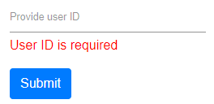

# Customize the UI appearance of the Blazor Input Mask Component

This section demonstrates the Strongly typed extension support in MaskedTextBox. The view that can bind with any model is called as
strongly typed view. You can bind any class as model to view.
You can access model properties on that view. You can use data associated with model to render the component.

In this sample, first click the submit button to post the selected value in the MaskedTextBox. When posting the null value,
validation error message will be shown below the MaskedTextBox.

```cshtml
@using Syncfusion.Blazor.Inputs
@using System.ComponentModel.DataAnnotations

<EditForm Model="@User">
    <DataAnnotationsValidator />
    <div asp-validation-summary="All" class="text-danger"></div>
    <div class="form-group">
        <SfMaskedTextBox Mask="00000" Placeholder='Provide user ID' @bind-Value="@User.ID"></SfMaskedTextBox>
        <ValidationMessage For="@(() => User.ID)" />
    </div>
    <button type="submit" class="btn btn-primary">Submit</button>
</EditForm>

@code {

    public Customer User = new Customer();

    public class Customer
    {
        [Required(ErrorMessage ="User ID is required")]

        public string ID { get; set; }

    }
}
```

The output will be as follows.

