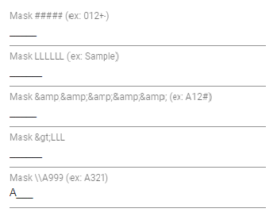

# Mask Configuration in Blazor Input Mask Component

The [Mask](https://help.syncfusion.com/cr/blazor/Syncfusion.Blazor.Inputs.MaskedTextBoxModel.html#Syncfusion_Blazor_Inputs_MaskedTextBoxModel_Mask) is a combination of standard and custom mask elements that validates the user input based on its behavior.

> When the mask value is empty, the MaskedTextBox behaves as an input element with text type.

## Standard mask elements

The following table shows the list of mask elements and its behavior based on [MSDN](https://msdn.microsoft.com/en-us/library/system.windows.forms.maskedtextbox.mask.aspx) standard.

The mask can be formed by combining any one or more of these mask elements.

| Mask Element | Description |
| ------------- | ------------- |
| 0 | Digit required. This element will accept any single digit from **0** to **9**. |
| 9 | Digit or space, optional. |
| # | Digit or space, optional, Plus(**+**) and minus(**-**) signs are allowed. |
| L | Letter required. It will accept letters **a-z** and **A-Z**. |
| ? | Letter or space, optional. |
| & | Requires a character. |
| C | Character or space, optional. |
| A | Alphanumeric **(A-Za-z0-9)** required.|
| a | Alphanumeric **(A-Za-z0-9)** or space, optional. |
| < | Shift down. Converts all characters to lower case. |
| > | Shift up. Converts all characters to upper case. |
| &#124; | Disable a previous shift up or shift down. |
| \\\\ | Escapes a mask character, turning it into a literal. |
| All other characters | Literals. All non-mask elements (literals) will appear as themselves within MaskedTextBox. |

The following example demonstrates the usage of standard mask elements.

```cshtml
@using Syncfusion.Blazor.Inputs

<SfMaskedTextBox Mask="#####" Placeholder="Mask ##### (ex: 012+-)" FloatLabelType="@FloatLabelType.Always"></SfMaskedTextBox>
<SfMaskedTextBox Mask="LLLLLL" Placeholder="Mask LLLLLL (ex: Sample)" FloatLabelType="@FloatLabelType.Always"></SfMaskedTextBox>
<SfMaskedTextBox Mask="&&&&&" Placeholder="Mask &&&&& (ex: A12#)" FloatLabelType="@FloatLabelType.Always"></SfMaskedTextBox>
<SfMaskedTextBox Mask=">LLL<LLL" Placeholder="Mask >LLL<LL (ex: SAMple)" FloatLabelType="@FloatLabelType.Always"></SfMaskedTextBox>
<SfMaskedTextBox Mask="\\A999" Placeholder="Mask \\A999 (ex: A321)" FloatLabelType="@FloatLabelType.Always"></SfMaskedTextBox>
```

The output will be as follows.



## Custom mask elements

Other than the above standard mask elements, the mask can be configured with the custom characters or regular expression to define a custom behavior.

### Custom characters

You can define any of the non-mask element as the mask element and its behavior through the [CustomCharacters](https://help.syncfusion.com/cr/blazor/Syncfusion.Blazor.Inputs.SfMaskedTextBox.html#Syncfusion_Blazor_Inputs_SfMaskedTextBox_CustomCharacters) property.

In the following example, non-mask element `P` accepts the values `P, A, p, a`, and `M` accepts the values `M, m`  as mentioned in the custom characters collection.

```cshtml
@using Syncfusion.Blazor.Inputs

<SfMaskedTextBox Mask="00:00 >PM" Placeholder="Time (ex: 10:00 PM, 10:00 AM)" CustomCharacters="@CustomMask"></SfMaskedTextBox>

@code {
    public Dictionary<string, string> CustomMask = new Dictionary<string, string>()
    {
        {"P" , "P,p,A,a" },
        {"M" , "m,M" }
    };
}
```

The output will be as follows.


### Regular expression

Instead of the mask element, you can define your own regular expression to validate the input of a particular input place. The regular expressions should be wrapped by the square brackets (e.g., [`Regex`]).

In the following example, regular expression has been set for each input places.

```cshtml
@using Syncfusion.Blazor.Inputs

<SfMaskedTextBox Placeholder="Enter value" Mask="[0-2][0-9][0-9].[0-2][0-9][0-9].[0-2][0-9][0-9].[0-2][0-9][0-9]" FloatLabelType="@FloatLabelType.Auto"></SfMaskedTextBox>
```

The output will be as follows.


## Prompt character

The Prompt character is a prompting symbol in the MaskedTextBox for the mask elements. The symbol is used to show the input positions in the MaskedTextBox. You can customize the prompt character of MaskedTextBox by using the [PromptChar](https://help.syncfusion.com/cr/blazor/Syncfusion.Blazor.Inputs.SfMaskedTextBox.html#Syncfusion_Blazor_Inputs_SfMaskedTextBox_PromptChar) property.

The following example demonstrates the MaskedTextBox with customized prompt character as `#`.

```cshtml
@using Syncfusion.Blazor.Inputs

<SfMaskedTextBox Mask="999-999-9999" PromptChar="@PromptCharacter"></SfMaskedTextBox>

@code{
    public char PromptCharacter { get; set; } = '#';
}
```

The output will be as follows,

