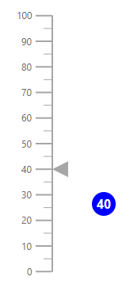
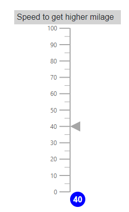

# Annotations in Blazor Linear Gauge Component

Annotations are used to mark the specific area of interest in the Linear Gauge area with text, shapes, or images. You can add any number of annotations to the Linear Gauge.

## Add annotation to linear gauge

By using the [`ContentTemplate`](https://help.syncfusion.com/cr/aspnetcore-blazor/Syncfusion.Blazor~Syncfusion.Blazor.LinearGauge.LinearGaugeAnnotation~ContentTemplate.html) tag of the [`LinearGaugeAnnotation`](https://help.syncfusion.com/cr/aspnetcore-blazor/Syncfusion.Blazor~Syncfusion.Blazor.LinearGauge.LinearGaugeAnnotation_members.html) tag, you can specify the code to create a new element that needs to be displayed in the Linear Gauge area.

```cshtml
@using Syncfusion.Blazor.LinearGauge

<SfLinearGauge>
    <LinearGaugeAnnotations>
        <LinearGaugeAnnotation ZIndex="1">
            <ContentTemplate>
                <div class="custom-annotation">40</div>
            </ContentTemplate>
        </LinearGaugeAnnotation>
    </LinearGaugeAnnotations>
    <LinearGaugeAxes>
        <LinearGaugeAxis>
            <LinearGaugePointers>
                <LinearGaugePointer Value="40"></LinearGaugePointer>
            </LinearGaugePointers>
        </LinearGaugeAxis>
    </LinearGaugeAxes>
</SfLinearGauge>
<style type="text/css">
    .custom-annotation {
        color: white;
        background-color: blue;
        height: 30px;
        width: 30px;
        border-radius: 15px;
        padding: 4px 0 0 6px;
        font-weight: bold;
    }
</style>
```


## Annotation customization

You can customize the annotation using following properties.

* [`ZIndex`](https://help.syncfusion.com/cr/aspnetcore-blazor/Syncfusion.Blazor~Syncfusion.Blazor.LinearGauge.LinearGaugeAnnotation~ZIndex.html) - When annotation overlaps with another element, you can use this property to bring annotation to the front or back.
* [`AxisValue`](https://help.syncfusion.com/cr/aspnetcore-blazor/Syncfusion.Blazor~Syncfusion.Blazor.LinearGauge.LinearGaugeAnnotation~AxisValue.html) - To move the annotation to the specified axis value
* [`AxisIndex`](https://help.syncfusion.com/cr/aspnetcore-blazor/Syncfusion.Blazor~Syncfusion.Blazor.LinearGauge.LinearGaugeAnnotation~AxisIndex.html) - To move the annotation to the specified axis index
* [`HorizontalAlignment`](https://help.syncfusion.com/cr/aspnetcore-blazor/Syncfusion.Blazor~Syncfusion.Blazor.LinearGauge.LinearGaugeAnnotation~HorizontalAlignment.html) - To move annotation horizontally. Possible values are "Placement.Center", "Placement.Far", "Placement.Near", "Placement.None"
* [`VerticalAlignment`](https://help.syncfusion.com/cr/aspnetcore-blazor/Syncfusion.Blazor~Syncfusion.Blazor.LinearGauge.LinearGaugeAnnotation~VerticalAlignment.html) - To move annotation vertically. Possible values are "Placement.Center", "Placement.Far", "Placement.Near", "Placement.None"
* [`X`](https://help.syncfusion.com/cr/aspnetcore-blazor/Syncfusion.Blazor~Syncfusion.Blazor.LinearGauge.LinearGaugeAnnotation~X.html), [`Y`](https://help.syncfusion.com/cr/aspnetcore-blazor/Syncfusion.Blazor~Syncfusion.Blazor.LinearGauge.LinearGaugeAnnotation~Y.html) - To move annotation to the specified location.

<!-- markdownlint-disable MD036 -->
**Changing the z-order**

You can change the z-order of an annotation element using the [`ZIndex`](https://help.syncfusion.com/cr/aspnetcore-blazor/Syncfusion.Blazor~Syncfusion.Blazor.LinearGauge.LinearGaugeAnnotation~_zIndex.html) property.

```cshtml
@using Syncfusion.Blazor.LinearGauge

<SfLinearGauge>
    <LinearGaugeAnnotations>
        <LinearGaugeAnnotation ZIndex="1">
            <ContentTemplate>
                <div class="custom-annotation">40</div>
            </ContentTemplate>
        </LinearGaugeAnnotation>
    </LinearGaugeAnnotations>
    <LinearGaugeAxes>
        <LinearGaugeAxis>
            <LinearGaugePointers>
                <LinearGaugePointer Value="40"></LinearGaugePointer>
            </LinearGaugePointers>
        </LinearGaugeAxis>
    </LinearGaugeAxes>
</SfLinearGauge>
<style type="text/css">
    .custom-annotation {
        color: white;
        background-color: blue;
        height: 30px;
        width: 30px;
        border-radius: 15px;
        padding: 4px 0 0 6px;
        font-weight: bold;
    }
</style>
```


<!-- markdownlint-disable MD036 -->
**Positioning an annotation**

You can place an annotation anywhere in gauge area by specifying pixel values to the [`X`](https://elp.syncfusion.com/cr/aspnetcore-blazor/Syncfusion.Blazor~Syncfusion.Blazor.LinearGauge.LinearGaugeAnnotation~_x.html) and [`Y`](https://help.syncfusion.com/cr/aspnetcore-blazor/Syncfusion.Blazor~Syncfusion.Blazor.LinearGauge.LinearGaugeAnnotation~_y.html) properties.

```cshtml
@using Syncfusion.Blazor.LinearGauge

<SfLinearGauge>
    <LinearGaugeAnnotations>
        <LinearGaugeAnnotation ZIndex="1" X="50" Y="-100">
            <ContentTemplate>
                <div class="custom-annotation">40</div>
            </ContentTemplate>
        </LinearGaugeAnnotation>
    </LinearGaugeAnnotations>
    <LinearGaugeAxes>
        <LinearGaugeAxis>
            <LinearGaugePointers>
                <LinearGaugePointer Value="40"></LinearGaugePointer>
            </LinearGaugePointers>
        </LinearGaugeAxis>
    </LinearGaugeAxes>
</SfLinearGauge>
<style type="text/css">
    .custom-annotation {
        color: white;
        background-color: blue;
        height: 30px;
        width: 30px;
        border-radius: 15px;
        padding: 4px 0 0 6px;
        font-weight: bold;
    }
</style>
```



**Alignment of annotation**

You can align an annotation using the [`HorizontalAlignment`](https://help.syncfusion.com/cr/aspnetcore-blazor/Syncfusion.Blazor~Syncfusion.Blazor.LinearGauge.LinearGaugeAnnotation~_horizontalAlignment.html) and [`VerticalAlignment`](https://help.syncfusion.com/cr/aspnetcore-blazor/Syncfusion.Blazor~Syncfusion.Blazor.LinearGauge.LinearGaugeAnnotation~_verticalAlignment.html) properties.

```cshtml
@using Syncfusion.Blazor.LinearGauge

<SfLinearGauge>
    <LinearGaugeAnnotations>
        <LinearGaugeAnnotation ZIndex="1"
                               HorizontalAlignment="Placement.Center"
                               VerticalAlignment="Placement.Center">
            <ContentTemplate>
                <div class="custom-annotation">40</div>
            </ContentTemplate>
        </LinearGaugeAnnotation>
    </LinearGaugeAnnotations>
    <LinearGaugeAxes>
        <LinearGaugeAxis>
            <LinearGaugePointers>
                <LinearGaugePointer Value="40"></LinearGaugePointer>
            </LinearGaugePointers>
        </LinearGaugeAxis>
    </LinearGaugeAxes>
</SfLinearGauge>
<style type="text/css">
    .custom-annotation {
        color: white;
        background-color: blue;
        height: 30px;
        width: 30px;
        border-radius: 15px;
        padding: 4px 0 0 6px;
        font-weight: bold;
    }
</style>
```


## Multiple annotations

You can add multiple annotations to the Linear Gauge using [`LinearGaugeAnnotation`](https://help.syncfusion.com/cr/aspnetcore-blazor/Syncfusion.Blazor~Syncfusion.Blazor.LinearGauge.LinearGaugeAnnotation_members.html) tag. Each annotation can be customized separately as shown in the following example.

```cshtml
@using Syncfusion.Blazor.LinearGauge

<SfLinearGauge>
    <LinearGaugeAnnotations>
        <LinearGaugeAnnotation ZIndex="1"
                               AxisValue="100"
                               X="-110"
                               Y="-35">
            <ContentTemplate>
                <div class="custom-annotation">Speed to get higher milage</div>
            </ContentTemplate>
        </LinearGaugeAnnotation>
        <LinearGaugeAnnotation ZIndex="1">
            <ContentTemplate>
                <div class="speed">40</div>
            </ContentTemplate>
        </LinearGaugeAnnotation>
    </LinearGaugeAnnotations>
    <LinearGaugeAxes>
        <LinearGaugeAxis>
            <LinearGaugePointers>
                <LinearGaugePointer Value="40"></LinearGaugePointer>
            </LinearGaugePointers>
        </LinearGaugeAxis>
    </LinearGaugeAxes>
</SfLinearGauge>
<style type="text/css">
    .speed {
        color: white;
        background-color: blue;
        height: 30px;
        width: 30px;
        border-radius: 15px;
        padding: 4px 0 0 6px;
        font-weight: bold;
    }

    .custom-annotation {
        background-color: lightgray;
        width: 210px;
        padding: 2px 5px;
    }
</style>
```

