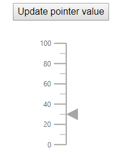

# Events in Blazor Linear Gauge Component (SfLinearGauge)

This section describes the Linear Gauge component's event that gets triggered when corresponding operations are performed. The events should be provided to the Linear Gauge by using the [`LinearGaugeEvents`](https://help.syncfusion.com/cr/blazor/Syncfusion.Blazor.LinearGauge.LinearGaugeEvents.html) class.

## AnnotationRendering

Before the annotation is rendered in the Linear Gauge, the [`AnnotationRendering`](https://help.syncfusion.com/cr/blazor/Syncfusion.Blazor.LinearGauge.LinearGaugeEvents.html#Syncfusion_Blazor_LinearGauge_LinearGaugeEvents_AnnotationRendering) event will be triggered. To know more about the arguments of this event, refer [here](https://help.syncfusion.com/cr/blazor/Syncfusion.Blazor.LinearGauge.AnnotationRenderEventArgs.html#properties).

```csharp
@using Syncfusion.Blazor.LinearGauge

<SfLinearGauge>
    <LinearGaugeEvents AnnotationRendering="AnnotationRender"></LinearGaugeEvents>
    <LinearGaugeAnnotations>
        <LinearGaugeAnnotation AxisValue="0" ZIndex="1" Content="40">
        </LinearGaugeAnnotation>
    </LinearGaugeAnnotations>
    <LinearGaugeAxes>
        <LinearGaugeAxis>
            <LinearGaugePointers>
                <LinearGaugePointer Value="40"></LinearGaugePointer>
            </LinearGaugePointers>
        </LinearGaugeAxis>
    </LinearGaugeAxes>
</SfLinearGauge>

@code {
    public void AnnotationRender(AnnotationRenderEventArgs args)
    {
        // Code here
    }
}
```

## AxisLabelRendering

Before each axis label is rendered in the Linear Gauge, the [`AxisLabelRendering`](https://help.syncfusion.com/cr/blazor/Syncfusion.Blazor.LinearGauge.LinearGaugeEvents.html#Syncfusion_Blazor_LinearGauge_LinearGaugeEvents_AxisLabelRendering) event is fired. To know more about the arguments of this event, refer [here](https://help.syncfusion.com/cr/blazor/Syncfusion.Blazor.LinearGauge.AxisLabelRenderEventArgs.html#properties).

```csharp
@using Syncfusion.Blazor.LinearGauge

<SfLinearGauge>
    <LinearGaugeEvents AxisLabelRendering="LabelRender"></LinearGaugeEvents>
    <LinearGaugeAxes>
        <LinearGaugeAxis>
        </LinearGaugeAxis>
    </LinearGaugeAxes>
</SfLinearGauge>

@code {
    public void LabelRender(AxisLabelRenderEventArgs args)
    {
        // Code here
    }
}
```

## Loaded

After the Linear Gauge has been loaded, the [`Loaded`](https://help.syncfusion.com/cr/blazor/Syncfusion.Blazor.LinearGauge.LinearGaugeEvents.html#Syncfusion_Blazor_LinearGauge_LinearGaugeEvents_Loaded) event will be triggered. To know more about the arguments of this event, refer [here](https://help.syncfusion.com/cr/blazor/Syncfusion.Blazor.LinearGauge.LoadedEventArgs.html).

```csharp
@using Syncfusion.Blazor.LinearGauge

<SfLinearGauge>
    <LinearGaugeEvents Loaded="Loaded"></LinearGaugeEvents>
    <LinearGaugeAxes>
        <LinearGaugeAxis>
        </LinearGaugeAxis>
    </LinearGaugeAxes>
</SfLinearGauge>

@code {
    public void Loaded(LoadedEventArgs args)
    {
        // Code here
    }
}
```

## OnDragEnd

The [`OnDragEnd`](https://help.syncfusion.com/cr/blazor/Syncfusion.Blazor.LinearGauge.LinearGaugeEvents.html#Syncfusion_Blazor_LinearGauge_LinearGaugeEvents_OnDragEnd) event will be fired before the pointer drag is completed. To know more about the argument of this event, refer [here](https://help.syncfusion.com/cr/blazor/Syncfusion.Blazor.LinearGauge.PointerDragEventArgs.html#properties).

```csharp
@using Syncfusion.Blazor.LinearGauge

<SfLinearGauge>
    <LinearGaugeEvents OnDragStart="DragEnd"></LinearGaugeEvents>
    <LinearGaugeAxes>
        <LinearGaugeAxis>
            <LinearGaugePointers>
                <LinearGaugePointer Value="40" EnableDrag="true"></LinearGaugePointer>
            </LinearGaugePointers>
        </LinearGaugeAxis>
    </LinearGaugeAxes>
</SfLinearGauge>

@code {
    public void DragEnd(PointerDragEventArgs args)
    {
        // Code here
    }
}
```

## OnDragStart

When the pointer drag begins, the [`OnDragStart`](https://help.syncfusion.com/cr/blazor/Syncfusion.Blazor.LinearGauge.LinearGaugeEvents.html#Syncfusion_Blazor_LinearGauge_LinearGaugeEvents_OnDragStart) event is triggered. To know more about the arguments of this event, refer [here](https://help.syncfusion.com/cr/blazor/Syncfusion.Blazor.LinearGauge.PointerDragEventArgs.html#properties).

```csharp
@using Syncfusion.Blazor.LinearGauge

<SfLinearGauge>
    <LinearGaugeEvents OnDragStart="DragStart"></LinearGaugeEvents>
    <LinearGaugeAxes>
        <LinearGaugeAxis>
            <LinearGaugePointers>
                <LinearGaugePointer Value="40" EnableDrag="true"></LinearGaugePointer>
            </LinearGaugePointers>
        </LinearGaugeAxis>
    </LinearGaugeAxes>
</SfLinearGauge>

@code {
    public void DragStart(PointerDragEventArgs args)
    {
        // Code here
    }
}
```

## OnGaugeMouseDown

When mouse is pressed down on the gauge, the [`OnGaugeMouseDown`](https://help.syncfusion.com/cr/blazor/Syncfusion.Blazor.LinearGauge.LinearGaugeEvents.html#Syncfusion_Blazor_LinearGauge_LinearGaugeEvents_OnGaugeMouseDown) event is triggered. To know more about the arguments of this event, refer [here](https://help.syncfusion.com/cr/blazor/Syncfusion.Blazor.LinearGauge.MouseEventArgs.html#properties).

```csharp
@using Syncfusion.Blazor.LinearGauge

<SfLinearGauge>
    <LinearGaugeEvents OnGaugeMouseDown="MouseDown"></LinearGaugeEvents>
    <LinearGaugeAxes>
        <LinearGaugeAxis>
        </LinearGaugeAxis>
    </LinearGaugeAxes>
</SfLinearGauge>

@code {
    public void MouseDown(Syncfusion.Blazor.LinearGauge.MouseEventArgs args)
    {
        //Code here
    }
}
```

## OnGaugeMouseLeave

When mouse pointer leaves the gauge, the [`OnGaugeMouseLeave`](https://help.syncfusion.com/cr/blazor/Syncfusion.Blazor.LinearGauge.LinearGaugeEvents.html#Syncfusion_Blazor_LinearGauge_LinearGaugeEvents_OnGaugeMouseLeave) event is triggered. To know more about the arguments of this event, refer [here](https://help.syncfusion.com/cr/blazor/Syncfusion.Blazor.LinearGauge.MouseEventArgs.html#properties).

```csharp
@using Syncfusion.Blazor.LinearGauge

<SfLinearGauge>
    <LinearGaugeEvents OnGaugeMouseLeave="MouseLeave"></LinearGaugeEvents>
    <LinearGaugeAxes>
        <LinearGaugeAxis>
        </LinearGaugeAxis>
    </LinearGaugeAxes>
</SfLinearGauge>

@code {
    public void MouseLeave(Syncfusion.Blazor.LinearGauge.MouseEventArgs args)
    {
        //Code here
    }
}
```

## OnGaugeMouseUp

When the mouse pointer is released over the Linear Gauge, the [`OnGaugeMouseUp`](https://help.syncfusion.com/cr/blazor/Syncfusion.Blazor.LinearGauge.LinearGaugeEvents.html#Syncfusion_Blazor_LinearGauge_LinearGaugeEvents_OnGaugeMouseUp) event is triggered. To know more about the arguments of this event, refer [here](https://help.syncfusion.com/cr/blazor/Syncfusion.Blazor.LinearGauge.MouseEventArgs.html#properties).

```csharp
@using Syncfusion.Blazor.LinearGauge

<SfLinearGauge>
    <LinearGaugeEvents OnGaugeMouseUp="MouseUp"></LinearGaugeEvents>
    <LinearGaugeAxes>
        <LinearGaugeAxis>
        </LinearGaugeAxis>
    </LinearGaugeAxes>
</SfLinearGauge>

@code {
    public void MouseUp(Syncfusion.Blazor.LinearGauge.MouseEventArgs args)
    {
        //Code here
    }
}
```

## OnLoad

Before the Linear Gauge is loaded, the [`OnLoad`](https://help.syncfusion.com/cr/blazor/Syncfusion.Blazor.LinearGauge.LinearGaugeEvents.html#Syncfusion_Blazor_LinearGauge_LinearGaugeEvents_OnLoad) event is fired. To know more about the arguments of this event, refer [here](https://help.syncfusion.com/cr/blazor/Syncfusion.Blazor.LinearGauge.LoadEventArgs.html).

```csharp
@using Syncfusion.Blazor.LinearGauge

<SfLinearGauge>
    <LinearGaugeEvents OnLoad="Load"></LinearGaugeEvents>
    <LinearGaugeAxes>
        <LinearGaugeAxis>
        </LinearGaugeAxis>
    </LinearGaugeAxes>
</SfLinearGauge>

@code {
    public void Load(LoadEventArgs args)
    {
        // Code here
    }
}
```

## OnPrint

The [`OnPrint`](https://help.syncfusion.com/cr/blazor/Syncfusion.Blazor.LinearGauge.LinearGaugeEvents.html#Syncfusion_Blazor_LinearGauge_LinearGaugeEvents_OnPrint) event is fired before the print begins. To know more about the arguments of this event, refer [here](https://help.syncfusion.com/cr/blazor/Syncfusion.Blazor.LinearGauge.PrintEventArgs.html).

```csharp
@using Syncfusion.Blazor.LinearGauge

<button @onclick="PrintGauge">Print</button>

<SfLinearGauge @ref="gauge" AllowPrint="true">
    <LinearGaugeEvents OnPrint="Print"></LinearGaugeEvents>
    <LinearGaugeAxes>
        <LinearGaugeAxis Minimum="0" Maximum="100">
            <LinearGaugeMajorTicks Interval="20"></LinearGaugeMajorTicks>
            <LinearGaugeMinorTicks Interval="10"></LinearGaugeMinorTicks>
        </LinearGaugeAxis>
    </LinearGaugeAxes>
</SfLinearGauge>

@code {
    SfLinearGauge gauge;
    public void PrintGauge()
    {
        this.gauge.Print();
    }

    public void Print(PrintEventArgs args)
    {
        // Code here
    }
}
```

## Resizing

Prior to the window resizing, the [`Resizing`](https://help.syncfusion.com/cr/blazor/Syncfusion.Blazor.LinearGauge.LinearGaugeEvents.html#Syncfusion_Blazor_LinearGauge_LinearGaugeEvents_Resizing) event is triggered. To know more about the arguments of this event, refer [here](https://help.syncfusion.com/cr/blazor/Syncfusion.Blazor.LinearGauge.ResizeEventArgs.html#properties).

```csharp
@using Syncfusion.Blazor.LinearGauge

<SfLinearGauge Width="100%">
    <LinearGaugeEvents Resizing="Resize"></LinearGaugeEvents>
    <LinearGaugeAxes>
        <LinearGaugeAxis>
        </LinearGaugeAxis>
    </LinearGaugeAxes>
</SfLinearGauge>

@code {
    public void Resize(ResizeEventArgs args)
    {
        // Code here
    }
}
```

## TooltipRendering

The [`TooltipRendering`](https://help.syncfusion.com/cr/blazor/Syncfusion.Blazor.LinearGauge.LinearGaugeEvents.html#Syncfusion_Blazor_LinearGauge_LinearGaugeEvents_TooltipRendering) event is fired before the tooltip is rendered. To know more about the arguments of this event, refer [here](https://help.syncfusion.com/cr/blazor/Syncfusion.Blazor.LinearGauge.TooltipRenderEventArgs.html#properties).

```csharp
@using Syncfusion.Blazor.LinearGauge

<SfLinearGauge Width="100%">
    <LinearGaugeEvents TooltipRendering="TooltipRender"></LinearGaugeEvents>
    <LinearGaugeTooltipSettings Enable="true"></LinearGaugeTooltipSettings>
    <LinearGaugeAxes>
        <LinearGaugeAxis>
            <LinearGaugePointers>
                <LinearGaugePointer Value="50"></LinearGaugePointer>
            </LinearGaugePointers>
        </LinearGaugeAxis>
    </LinearGaugeAxes>
</SfLinearGauge>

@code {
    public void TooltipRender(TooltipRenderEventArgs args)
    {
        // Code here
    }
}
```

## ValueChange

The [`ValueChange`](https://help.syncfusion.com/cr/blazor/Syncfusion.Blazor.LinearGauge.LinearGaugeEvents.html#Syncfusion_Blazor_LinearGauge_LinearGaugeEvents_ValueChange) event is triggered when the pointer is dragged from one value to another. To know more about the arguments of this event, refer [here](https://help.syncfusion.com/cr/blazor/Syncfusion.Blazor.LinearGauge.ValueChangeEventArgs.html#properties).

```csharp
@using Syncfusion.Blazor.LinearGauge

<div style="width:250px">
    <SfLinearGauge Height="250px">
        <LinearGaugeEvents ValueChange="@UpdatePointerValue"></LinearGaugeEvents>
        <LinearGaugeAxes>
            <LinearGaugeAxis>
                <LinearGaugePointers>
                    <LinearGaugePointer EnableDrag="true" PointerValue="10"></LinearGaugePointer>
                </LinearGaugePointers>
            </LinearGaugeAxis>
        </LinearGaugeAxes>
    </SfLinearGauge>
</div>

@code {
    private double pointerValue = 10;
    public void UpdatePointerValue(ValueChangeEventArgs args)
    {
        pointerValue = args.Value;
    }
}
```


