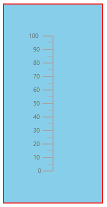
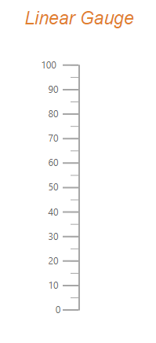
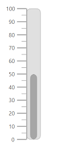

# Appearance in Blazor Linear Gauge Component (SfLinearGauge)

## Customizing the Linear Gauge area

The following property and classes are available in the [`SfLinearGauge`](https://help.syncfusion.com/cr/blazor/Syncfusion.Blazor.LinearGauge.SfLinearGauge.html) class to customize the Linear Gauge area.

* [`Background`](https://help.syncfusion.com/cr/blazor/Syncfusion.Blazor.LinearGauge.SfLinearGauge.html#Syncfusion_Blazor_LinearGauge_SfLinearGauge_Background) - Applies the background color for the Linear gauge.
* [`LinearGaugeBorder`](https://help.syncfusion.com/cr/blazor/Syncfusion.Blazor.LinearGauge.LinearGaugeBorder.html) - To customize the color and width of the border in Linear Gauge.
* [`LinearGaugeMargin`](https://help.syncfusion.com/cr/blazor/Syncfusion.Blazor.LinearGauge.LinearGaugeMargin.html) - To customize the margins of the Linear Gauge.

```csharp
@using Syncfusion.Blazor.LinearGauge

<SfLinearGauge Width="200px" Height="400px" Background="skyblue">
    <LinearGaugeBorder Color="#FF0000" Width="2"></LinearGaugeBorder>
    <LinearGaugeMargin Left="20" Right="20" Top="20" Bottom="20"></LinearGaugeMargin>
    <LinearGaugeAxes>
        <LinearGaugeAxis>
        </LinearGaugeAxis>
    </LinearGaugeAxes>
</SfLinearGauge>
```



## Setting up the Linear Gauge title

The title for the Linear Gauge can be set using [`Title`](https://help.syncfusion.com/cr/blazor/Syncfusion.Blazor~Syncfusion.Blazor.LinearGauge.SfLinearGauge~Title.html) property in [`SfLinearGauge`](https://help.syncfusion.com/cr/blazor/Syncfusion.Blazor.LinearGauge.SfLinearGauge.html). Its appearance can be customized using the [`LinearGaugeTitleStyle`](https://help.syncfusion.com/cr/blazor/Syncfusion.Blazor.LinearGauge.LinearGaugeTitleStyle.html) with the below properties.

* [`Color`](https://help.syncfusion.com/cr/blazor/Syncfusion.Blazor.LinearGauge.LinearGaugeFontSettings.html#Syncfusion_Blazor_LinearGauge_LinearGaugeFontSettings_Color) - Specifies the text color of the title.
* [`FontStyle`](https://help.syncfusion.com/cr/blazor/Syncfusion.Blazor.LinearGauge.LinearGaugeFontSettings.html#Syncfusion_Blazor_LinearGauge_LinearGaugeFontSettings_FontStyle) - Specifies the font style of the title.
* [`FontWeight`](https://help.syncfusion.com/cr/blazor/Syncfusion.Blazor.LinearGauge.LinearGaugeFontSettings.html#Syncfusion_Blazor_LinearGauge_LinearGaugeFontSettings_FontWeight) - Specifies the font weight of the title.
* [`Size`](https://help.syncfusion.com/cr/blazor/Syncfusion.Blazor.LinearGauge.LinearGaugeFontSettings.html#Syncfusion_Blazor_LinearGauge_LinearGaugeFontSettings_Size) - Specifies the font size of the title.
* [`Opacity`](https://help.syncfusion.com/cr/blazor/Syncfusion.Blazor.LinearGauge.LinearGaugeFontSettings.html#Syncfusion_Blazor_LinearGauge_LinearGaugeFontSettings_Opacity) - Specifies the opacity of the title.
* [`FontFamily`](https://help.syncfusion.com/cr/blazor/Syncfusion.Blazor.LinearGauge.LinearGaugeFontSettings.html#Syncfusion_Blazor_LinearGauge_LinearGaugeFontSettings_FontFamily) - Specifies the font family of the title.

```csharp
@using Syncfusion.Blazor.LinearGauge

<SfLinearGauge Title="Linear Gauge">
    <LinearGaugeTitleStyle FontFamily="Arial" FontWeight="regular" FontStyle="italic" Color="#E27F2D" Size="23px">
    </LinearGaugeTitleStyle>
    <LinearGaugeAxes>
        <LinearGaugeAxis>
            <LinearGaugePointers>
                <LinearGaugePointer></LinearGaugePointer>
            </LinearGaugePointers>
        </LinearGaugeAxis>
    </LinearGaugeAxes>
</SfLinearGauge>
```



## Customizing the Linear Gauge container

The area used to render the ranges and pointers at the center position of the gauge is called container. It is of three types namely,

* Normal
* Rounded Rectangle
* Thermometer

The type of the container can be modified by using the [`Type`](https://help.syncfusion.com/cr/blazor/Syncfusion.Blazor.LinearGauge.LinearGaugeContainer.html#Syncfusion_Blazor_LinearGauge_LinearGaugeContainer_Type) property in [`LinearGaugeContainer`](https://help.syncfusion.com/cr/blazor/Syncfusion.Blazor.LinearGauge.LinearGaugeContainer.html) class. The container can be customized by using the following properties and class in [`LinearGaugeContainer`](https://help.syncfusion.com/cr/blazor/Syncfusion.Blazor.LinearGauge.LinearGaugeContainer.html) class,

* [`Offset`](https://help.syncfusion.com/cr/blazor/Syncfusion.Blazor.LinearGauge.LinearGaugeContainer.html#Syncfusion_Blazor_LinearGauge_LinearGaugeContainer_Offset) - To place the container with the specified distance from the axis of the Linear Gauge.
* [`Width`](https://help.syncfusion.com/cr/blazor/Syncfusion.Blazor.LinearGauge.LinearGaugeContainer.html#Syncfusion_Blazor_LinearGauge_LinearGaugeContainer_Width) - To set the thickness of the container.
* [`Height`](https://help.syncfusion.com/cr/blazor/Syncfusion.Blazor.LinearGauge.LinearGaugeContainer.html#Syncfusion_Blazor_LinearGauge_LinearGaugeContainer_Height) - To set the length of the container.
* [`BackgroundColor`](https://help.syncfusion.com/cr/blazor/Syncfusion.Blazor.LinearGauge.LinearGaugeContainer.html#Syncfusion_Blazor_LinearGauge_LinearGaugeContainer_BackgroundColor) - To set the background color of the container.
* [`LinearGaugeContainerBorder`](https://help.syncfusion.com/cr/blazor/Syncfusion.Blazor.LinearGauge.LinearGaugeContainerBorder.html) - To set the color and width for the border of the container.

### Normal

The "[**Normal**](https://help.syncfusion.com/cr/blazor/Syncfusion.Blazor.LinearGauge.ContainerType.html#Syncfusion_Blazor_LinearGauge_ContainerType_Normal)" type will render the container as a rectangle and this is the default container type.

```csharp
@using Syncfusion.Blazor.LinearGauge

<SfLinearGauge>
    <LinearGaugeContainer Width="30">
        <LinearGaugeAxes>
            <LinearGaugeAxis>
                <LinearGaugePointers>
                    <LinearGaugePointer PointerValue="50" Width="15" Type="Point.Bar" Color="#a6a6a6">
                    </LinearGaugePointer>
                </LinearGaugePointers>
            </LinearGaugeAxis>
        </LinearGaugeAxes>
    </LinearGaugeContainer>
</SfLinearGauge>
```


### Rounded Rectangle

The "[**RoundedRectangle**](https://help.syncfusion.com/cr/blazor/Syncfusion.Blazor.LinearGauge.ContainerType.html#Syncfusion_Blazor_LinearGauge_ContainerType_RoundedRectangle)" type will render the container as a rectangle with rounded corner radius. The rounded corner radius of the container can be customized using the  [`RoundedCornerRadius`](https://help.syncfusion.com/cr/blazor/Syncfusion.Blazor.LinearGauge.LinearGaugeContainer.html#Syncfusion_Blazor_LinearGauge_LinearGaugeContainer_RoundedCornerRadius) property in [`LinearGaugeContainer`](https://help.syncfusion.com/cr/blazor/Syncfusion.Blazor.LinearGauge.LinearGaugeContainer.html) class.

```csharp
@using Syncfusion.Blazor.LinearGauge

<SfLinearGauge>
    <LinearGaugeContainer Width="30" Type="ContainerType.RoundedRectangle">
        <LinearGaugeAxes>
            <LinearGaugeAxis>
                <LinearGaugePointers>
                    <LinearGaugePointer PointerValue="50" Width="15" Type="Point.Bar" Color="#a6a6a6">
                    </LinearGaugePointer>
                </LinearGaugePointers>
            </LinearGaugeAxis>
        </LinearGaugeAxes>
    </LinearGaugeContainer>
</SfLinearGauge>
```



### Thermometer

The "[**Thermometer**](https://help.syncfusion.com/cr/blazor/Syncfusion.Blazor.LinearGauge.ContainerType.html#Syncfusion_Blazor_LinearGauge_ContainerType_Thermometer)" type will render the container similar to the appearance of thermometer.

```csharp
@using Syncfusion.Blazor.LinearGauge

<SfLinearGauge>
    <LinearGaugeContainer Width="30" Type="ContainerType.Thermometer">
        <LinearGaugeAxes>
            <LinearGaugeAxis>
                <LinearGaugePointers>
                    <LinearGaugePointer PointerValue="80" Width="15" Type="Point.Bar" Color="#a6a6a6">
                    </LinearGaugePointer>
                </LinearGaugePointers>
            </LinearGaugeAxis>
        </LinearGaugeAxes>
    </LinearGaugeContainer>
</SfLinearGauge>
```


## Fitting the Linear Gauge to the control

The Linear Gauge component is rendered with margin by default. To remove the margin around the Linear Gauge, the [`AllowMargin`](https://help.syncfusion.com/cr/blazor/Syncfusion.Blazor.LinearGauge.SfLinearGauge.html#Syncfusion_Blazor_LinearGauge_SfLinearGauge_AllowMargin) property in [`SfLinearGauge`](https://help.syncfusion.com/cr/blazor/Syncfusion.Blazor.LinearGauge.SfLinearGauge.html) class is set as "**false**".

```csharp
@using Syncfusion.Blazor.LinearGauge

<SfLinearGauge AllowMargin="false" Width="100%" Height="100%" Orientation="Orientation.Horizontal" Background="#04fbfb">
    <LinearGaugeBorder Color="#FF0000" Width="2"></LinearGaugeBorder>
    <LinearGaugeMargin Left="0" Right="0" Top="0" Bottom="0"></LinearGaugeMargin>
    <LinearGaugeAxes>
        <LinearGaugeAxis>
        </LinearGaugeAxis>
    </LinearGaugeAxes>
</SfLinearGauge>
```


>Note: To use this feature, set the [`AllowMargin`](https://help.syncfusion.com/cr/blazor/Syncfusion.Blazor.LinearGauge.SfLinearGauge.html#Syncfusion_Blazor_LinearGauge_SfLinearGauge_AllowMargin) property to "**false**", the [`Width`](https://help.syncfusion.com/cr/blazor/Syncfusion.Blazor.LinearGauge.SfLinearGauge.html#Syncfusion_Blazor_LinearGauge_SfLinearGauge_Width) property to "**100%**" and the properties of [`LinearGaugeMargin`](https://help.syncfusion.com/cr/blazor/Syncfusion.Blazor.LinearGauge.LinearGaugeMargin.html) to "**0**".