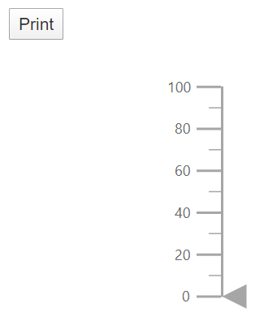

# Print And Export in Blazor Linear Gauge Component

## Print

The rendered Linear Gauge can be printed directly from the browser by calling the [`PrintAsync`](https://help.syncfusion.com/cr/blazor/Syncfusion.Blazor.LinearGauge.SfLinearGauge.html#methods) method. To use the print functionality, set the [`AllowPrint`](https://help.syncfusion.com/cr/blazor/Syncfusion.Blazor.LinearGauge.SfLinearGauge.html#Syncfusion_Blazor_LinearGauge_SfLinearGauge_AllowPrint) property as "**true**".

```cshtml
@using Syncfusion.Blazor.LinearGauge

<button @onclick="PrintGauge">Print</button>

<SfLinearGauge @ref="gauge" AllowPrint="true">
    <LinearGaugeAxes>
        <LinearGaugeAxis Minimum="0" Maximum="100">
            <LinearGaugeMajorTicks Interval="20"></LinearGaugeMajorTicks>
            <LinearGaugeMinorTicks Interval="10"></LinearGaugeMinorTicks>
            <LinearGaugePointers>
                <LinearGaugePointer>
                </LinearGaugePointer>
            </LinearGaugePointers>
        </LinearGaugeAxis>
    </LinearGaugeAxes>
</SfLinearGauge>

@code {
    SfLinearGauge gauge;
    public async Task PrintGauge()
    {
        await this.gauge.PrintAsync();
    }
}
```



## Export

### Image Export

To use the image export functionality, set the [`AllowImageExport`](https://help.syncfusion.com/cr/blazor/Syncfusion.Blazor.LinearGauge.SfLinearGauge.html#Syncfusion_Blazor_LinearGauge_SfLinearGauge_AllowImageExport) property as "**true**". The rendered Linear Gauge can be exported as an image using the [`ExportAsync`](https://help.syncfusion.com/cr/blazor/Syncfusion.Blazor.LinearGauge.SfLinearGauge.html#methods) method. This method requires two parameters: export type and file name. The Linear Gauge can be exported as an image with the following formats.

* JPEG
* PNG
* SVG

```cshtml
@using Syncfusion.Blazor.LinearGauge

<button @onclick="ExportGauge">Export</button>

<SfLinearGauge @ref="gauge" AllowImageExport="true">
    <LinearGaugeAxes>
        <LinearGaugeAxis Minimum="0" Maximum="100">
            <LinearGaugeMajorTicks Interval="20"></LinearGaugeMajorTicks>
            <LinearGaugeMinorTicks Interval="10"></LinearGaugeMinorTicks>
        </LinearGaugeAxis>
    </LinearGaugeAxes>
</SfLinearGauge>

@code {
    SfLinearGauge gauge;

    public async Task ExportGauge()
    {
        await this.gauge.ExportAsync(ExportType.PNG, "LinearGauge");
    }
}
```


### PDF Export

To use the PDF export functionality, set the [`AllowPdfExport`](https://help.syncfusion.com/cr/blazor/Syncfusion.Blazor.LinearGauge.SfLinearGauge.html#Syncfusion_Blazor_LinearGauge_SfLinearGauge_AllowPdfExport) property as "**true**". The rendered Linear Gauge can be exported as PDF using the [`ExportAsync`](https://help.syncfusion.com/cr/blazor/Syncfusion.Blazor.LinearGauge.SfLinearGauge.html#methods) method. The [`ExportAsync`](https://help.syncfusion.com/cr/blazor/Syncfusion.Blazor.LinearGauge.SfLinearGauge.html#methods) method requires three parameters: export type, file name, and orientation of the PDF document. The orientation of the PDF document can be set as "**Portrait**" or "**Landscape**".

```cshtml
@using Syncfusion.Blazor.LinearGauge

<button @onclick="ExportGauge">Export</button>

<SfLinearGauge @ref="gauge" AllowPdfExport="true">
    <LinearGaugeAxes>
        <LinearGaugeAxis Minimum="0" Maximum="100">
            <LinearGaugeMajorTicks Interval="20"></LinearGaugeMajorTicks>
            <LinearGaugeMinorTicks Interval="10"></LinearGaugeMinorTicks>
        </LinearGaugeAxis>
    </LinearGaugeAxes>
</SfLinearGauge>

@code {
    SfLinearGauge gauge;

    public async Task ExportGauge()
    {
        await this.gauge.ExportAsync(ExportType.PDF, "LinearGauge");
    }
}
```


### Exporting Linear Gauge as base64 string of the file

The Linear Gauge can be exported as base64 string for the JPEG, PNG and PDF formats. The rendered Linear Gauge can be exported as base64 string of the exported image or PDF document using the [`ExportAsync`](https://help.syncfusion.com/cr/blazor/Syncfusion.Blazor.LinearGauge.SfLinearGauge.html#methods) method. The arguments that are required for this method is export type, file name, orientation of the exported PDF document and "**allowDownload**" boolean value that is set as "**false**" to return base64 string. The value for the orientation of the exported PDF document is set as "**null**" for image export and "**Portrait**" or "**Landscape**" for the PDF document.

```cshtml
@using Syncfusion.Blazor.LinearGauge

<button @onclick="ExportGauge">Export</button>

<SfLinearGauge @ref="gauge" AllowImageExport="true">
    <LinearGaugeAxes>
        <LinearGaugeAxis Minimum="0" Maximum="100">
            <LinearGaugeMajorTicks Interval="20"></LinearGaugeMajorTicks>
            <LinearGaugeMinorTicks Interval="10"></LinearGaugeMinorTicks>
        </LinearGaugeAxis>
    </LinearGaugeAxes>
</SfLinearGauge>

@code {
    SfLinearGauge gauge;
    public async Task ExportGauge()
    {
       string exportString = await this.gauge.ExportAsync(ExportType.PNG, "LinearGauge", null, false);
       Console.WriteLine(exportString);
    }
}
```

> The exporting of the Linear Gauge as base64 string is not applicable for the SVG format.