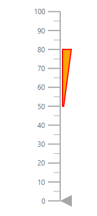

# Ranges in Blazor Linear Gauge Component

Range is the set of values in the axis. The range can be defined using the [`Start`](https://help.syncfusion.com/cr/blazor/Syncfusion.Blazor.LinearGauge.LinearGaugeRange.html#Syncfusion_Blazor_LinearGauge_LinearGaugeRange_Start) and [`End`](https://help.syncfusion.com/cr/blazor/Syncfusion.Blazor.LinearGauge.LinearGaugeRange.html#Syncfusion_Blazor_LinearGauge_LinearGaugeRange_End) properties in the [`LinearGaugeRange`](https://help.syncfusion.com/cr/blazor/Syncfusion.Blazor.LinearGauge.LinearGaugeRange.html) class. Any number of ranges can be added to the Linear Gauge using the [`LinearGaugeRanges`](https://help.syncfusion.com/cr/blazor/Syncfusion.Blazor.LinearGauge.LinearGaugeRanges.html) class.

```cshtml
@using Syncfusion.Blazor.LinearGauge

<SfLinearGauge>
    <LinearGaugeAxes>
        <LinearGaugeAxis Minimum="0" Maximum="100">
            <LinearGaugeRanges>
                <LinearGaugeRange Start="50" End="80" StartWidth="20" EndWidth="20">
                </LinearGaugeRange>
            </LinearGaugeRanges>
            <LinearGaugePointers>
                <LinearGaugePointer></LinearGaugePointer>
            </LinearGaugePointers>
        </LinearGaugeAxis>
    </LinearGaugeAxes>
</SfLinearGauge>
```


## Customizing the range

Ranges can be customized using the following properties in [`LinearGaugeRange`](https://help.syncfusion.com/cr/blazor/Syncfusion.Blazor.LinearGauge.LinearGaugeRange.html) class.

* [`StartWidth`](https://help.syncfusion.com/cr/blazor/Syncfusion.Blazor.LinearGauge.LinearGaugeRange.html#Syncfusion_Blazor_LinearGauge_LinearGaugeRange_StartWidth) - To set the thickness of the range at the start axis value.
* [`EndWidth`](https://help.syncfusion.com/cr/blazor/Syncfusion.Blazor.LinearGauge.LinearGaugeRange.html#Syncfusion_Blazor_LinearGauge_LinearGaugeRange_EndWidth) - To set the thickness of the range at the end axis value.
* [`Color`](https://help.syncfusion.com/cr/blazor/Syncfusion.Blazor.LinearGauge.LinearGaugeRange.html#Syncfusion_Blazor_LinearGauge_LinearGaugeRange_Color) - To set the color of the range.
* [`Position`](https://help.syncfusion.com/cr/blazor/Syncfusion.Blazor.LinearGauge.LinearGaugeRange.html#Syncfusion_Blazor_LinearGauge_LinearGaugeRange_Position) - To place the range. By default, the range is placed outside of the axis. To change the position, this property can be set as "[Inside](https://help.syncfusion.com/cr/blazor/Syncfusion.Blazor.LinearGauge.Position.html#Syncfusion_Blazor_LinearGauge_Position_Inside)", "[**Outside**](https://help.syncfusion.com/cr/blazor/Syncfusion.Blazor.LinearGauge.Position.html#Syncfusion_Blazor_LinearGauge_Position_Outside)", "[Cross](https://help.syncfusion.com/cr/blazor/Syncfusion.Blazor.LinearGauge.Position.html#Syncfusion_Blazor_LinearGauge_Position_Cross)", or "[Auto](https://help.syncfusion.com/cr/blazor/Syncfusion.Blazor.LinearGauge.Position.html#Syncfusion_Blazor_LinearGauge_Position_Auto)".
* [`Offset`](https://help.syncfusion.com/cr/blazor/Syncfusion.Blazor.LinearGauge.LinearGaugeRange.html#Syncfusion_Blazor_LinearGauge_LinearGaugeRange_Offset) - To place the range with the specified distance from the axis.
* [`LinearGaugeRangeBorder`](https://help.syncfusion.com/cr/blazor/Syncfusion.Blazor.LinearGauge.LinearGaugeRangeBorder.html) - To set the color and width for the border of the range.

```cshtml
@using Syncfusion.Blazor.LinearGauge

<SfLinearGauge>
    <LinearGaugeAxes>
        <LinearGaugeAxis Minimum="0" Maximum="100">
            <LinearGaugeRanges>
                <LinearGaugeRange Start="50" End="80" StartWidth="2" EndWidth="15"
                                  Color="orange" Position="Position.Inside"
                                  Offset="4">
                    <LinearGaugeRangeBorder Color="red" Width="2">
                    </LinearGaugeRangeBorder>
                </LinearGaugeRange>
            </LinearGaugeRanges>
            <LinearGaugePointers>
                <LinearGaugePointer></LinearGaugePointer>
            </LinearGaugePointers>
        </LinearGaugeAxis>
    </LinearGaugeAxes>
</SfLinearGauge>
```



## Setting the range color for the labels

To set the color of the labels like the range color, set the [`UseRangeColor`](https://help.syncfusion.com/cr/blazor/Syncfusion.Blazor.LinearGauge.LinearGaugeAxisLabelStyle.html#Syncfusion_Blazor_LinearGauge_LinearGaugeAxisLabelStyle_UseRangeColor) property as "true" in the [`LinearGaugeAxisLabelStyle`](https://help.syncfusion.com/cr/blazor/Syncfusion.Blazor.LinearGauge.LinearGaugeAxisLabelStyle.html) class.

```cshtml
@using Syncfusion.Blazor.LinearGauge

<SfLinearGauge>
    <LinearGaugeAxes>
        <LinearGaugeAxis>
           <LinearGaugeAxisLabelStyle UseRangeColor="true">
           </LinearGaugeAxisLabelStyle>
            <LinearGaugeRanges>
                <LinearGaugeRange Start="20" End="60" Color="red">
                </LinearGaugeRange>
            </LinearGaugeRanges>
        </LinearGaugeAxis>
    </LinearGaugeAxes>
</SfLinearGauge>
```


## Multiple ranges

Multiple ranges can be added to the Linear Gauge by adding multiple [`LinearGaugeRange`](https://help.syncfusion.com/cr/blazor/Syncfusion.Blazor.LinearGauge.LinearGaugeRange.html) classes in the [`LinearGaugeRanges`](https://help.syncfusion.com/cr/blazor/Syncfusion.Blazor.LinearGauge.LinearGaugeRanges.html) class and customization for the ranges can be done with [`LinearGaugeRange`](https://help.syncfusion.com/cr/blazor/Syncfusion.Blazor.LinearGauge.LinearGaugeRange.html) class.

```cshtml
@using Syncfusion.Blazor.LinearGauge

<SfLinearGauge>
    <LinearGaugeAxes>
        <LinearGaugeAxis>
            <LinearGaugeRanges>
                <LinearGaugeRange Start="1" End="30" StartWidth="10" EndWidth="10"
                                  Color="#41f47f">
                </LinearGaugeRange>
                <LinearGaugeRange Start="30" End="50" StartWidth="10" EndWidth="10"
                                  Color="#f49441">
                </LinearGaugeRange>
                <LinearGaugeRange Start="50" End="80" StartWidth="10" EndWidth="10"
                                  Color="#cd41f4">
                </LinearGaugeRange>
            </LinearGaugeRanges>
            <LinearGaugePointers>
                <LinearGaugePointer></LinearGaugePointer>
            </LinearGaugePointers>
        </LinearGaugeAxis>
    </LinearGaugeAxes>
</SfLinearGauge>
```


## Gradient Color

Gradient support allows the addition of multiple colors in the range of the Linear Gauge. The following gradient types are supported in the Linear Gauge.

* Linear Gradient
* Radial Gradient

### Linear Gradient

Using linear-gradient, colors will be applied in a linear progression. The start value of the linear gradient can be set using the [`StartValue`](https://help.syncfusion.com/cr/blazor/Syncfusion.Blazor.LinearGauge.LinearGaugeLinearGradient.html#Syncfusion_Blazor_LinearGauge_LinearGaugeLinearGradient_StartValue) property. The end value of the linear gradient will be set using the [`EndValue`](https://help.syncfusion.com/cr/blazor/Syncfusion.Blazor.LinearGauge.LinearGaugeLinearGradient.html#Syncfusion_Blazor_LinearGauge_LinearGaugeLinearGradient_EndValue) property. The color stop values such as [`Color`](https://help.syncfusion.com/cr/blazor/Syncfusion.Blazor.LinearGauge.ColorStop.html#Syncfusion_Blazor_LinearGauge_ColorStop_Color), [`Opacity`](https://help.syncfusion.com/cr/blazor/Syncfusion.Blazor.LinearGauge.ColorStop.html#Syncfusion_Blazor_LinearGauge_ColorStop_Opacity), and [`Offset`](https://help.syncfusion.com/cr/blazor/Syncfusion.Blazor.LinearGauge.ColorStop.html#Syncfusion_Blazor_LinearGauge_ColorStop_Offset) are set using [`ColorStop`](https://help.syncfusion.com/cr/blazor/Syncfusion.Blazor.LinearGauge.ColorStop.html) class. The linear gradient can be rendered for the range in the Linear Gauge by using the below example.

```cshtml
@using Syncfusion.Blazor.LinearGauge

<SfLinearGauge Orientation="Orientation.Horizontal">
    <LinearGaugeContainer Width="30" Offset="30">
        <LinearGaugeContainerBorder Width="0" />
        <LinearGaugeAxes>
            <LinearGaugeAxis>
                <LinearGaugeAxisLabelStyle Offset="55">
                    <LinearGaugeAxisLabelFont Color="#424242" />
                </LinearGaugeAxisLabelStyle>
                <LinearGaugeLine Width="0" />
                <LinearGaugeMajorTicks Height="0" Interval="25" />
                <LinearGaugeMinorTicks Height="0" />
                <LinearGaugePointers>
                    <LinearGaugePointer PointerValue="80" Height="25" Width="35"
                                Color="#f54ea2" Offset="-40" MarkerType="MarkerType.Triangle"
                                Placement="Syncfusion.Blazor.LinearGauge.Placement.Near">
                    </LinearGaugePointer>
                </LinearGaugePointers>
                <LinearGaugeRanges>
                    <LinearGaugeRange Color="#f54ea2" Start="0" End="80"
                                      StartWidth="30" EndWidth="30" Offset="30">
                        <LinearGradient StartValue="1%" EndValue="99%">
                            <ColorStops>
                                <ColorStop Opacity="1" Offset="0%" Color="#fef3f9">
                                </ColorStop>
                                <ColorStop Opacity="1" Offset="100%" Color="#f54ea2">
                                </ColorStop>
                            </ColorStops>
                        </LinearGradient>
                    </LinearGaugeRange>
                </LinearGaugeRanges>
            </LinearGaugeAxis>
        </LinearGaugeAxes>
    </LinearGaugeContainer>
</SfLinearGauge>
```


### Radial Gradient

Using radial gradient, colors will be applied in circular progression. The inner-circle position of the radial gradient will be set using the [`InnerPosition`](https://help.syncfusion.com/cr/blazor/Syncfusion.Blazor.LinearGauge.InnerPosition.html) class. The outer circle position of the radial gradient can be set using the [`OuterPosition`](https://help.syncfusion.com/cr/blazor/Syncfusion.Blazor.LinearGauge.OuterPosition.html) class. The color stop values such as [`Color`](https://help.syncfusion.com/cr/blazor/Syncfusion.Blazor.LinearGauge.ColorStop.html#Syncfusion_Blazor_LinearGauge_ColorStop_Color), [`Opacity`](https://help.syncfusion.com/cr/blazor/Syncfusion.Blazor.LinearGauge.ColorStop.html#Syncfusion_Blazor_LinearGauge_ColorStop_Opacity), and [`Offset`](https://help.syncfusion.com/cr/blazor/Syncfusion.Blazor.LinearGauge.ColorStop.html#Syncfusion_Blazor_LinearGauge_ColorStop_Offset) are set using [`ColorStop`](https://help.syncfusion.com/cr/blazor/Syncfusion.Blazor.LinearGauge.ColorStop.html) class. The radial gradient can be rendered for the range in the Linear Gauge by using the below example.

```cshtml
@using Syncfusion.Blazor.LinearGauge

<SfLinearGauge Orientation="Orientation.Horizontal">
    <LinearGaugeContainer Width="30" Offset="30">
        <LinearGaugeContainerBorder Width="0" />
        <LinearGaugeAxes>
            <LinearGaugeAxis>
                <LinearGaugeAxisLabelStyle Offset="55">
                    <LinearGaugeAxisLabelFont Color="#424242" />
                </LinearGaugeAxisLabelStyle>
                <LinearGaugeLine Width="0" />
                <LinearGaugeMajorTicks Height="0" Interval="25" />
                <LinearGaugeMinorTicks Height="0" />
                <LinearGaugePointers>
                    <LinearGaugePointer PointerValue="80" Height="25" Width="35"
                                Color="#f54ea2" Offset="-40" MarkerType="MarkerType.Triangle"
                                Placement="Syncfusion.Blazor.LinearGauge.Placement.Near">
                    </LinearGaugePointer>
                </LinearGaugePointers>
                <LinearGaugeRanges>
                    <LinearGaugeRange Color="#f54ea2" Start="0" End="80"
                                      StartWidth="30" EndWidth="30" Offset="30">
                        <RadialGradient Radius="65%">
                             <InnerPosition X="50%" Y="70%"></InnerPosition>
                             <OuterPosition X="60%" Y="60%"></OuterPosition>
                            <ColorStops>
                                <ColorStop Opacity="0.9" Color= "#fff5f5" Offset="5%">
                                </ColorStop>
                                <ColorStop Opacity="1" Color="#f54ea2" Offset="99%">
                                </ColorStop>
                            </ColorStops>
                        </RadialGradient>
                    </LinearGaugeRange>
                </LinearGaugeRanges>
            </LinearGaugeAxis>
        </LinearGaugeAxes>
    </LinearGaugeContainer>
</SfLinearGauge>
```


> If we set both gradients for the range, only the linear gradient gets rendered. If we set the [`StartValue`](https://help.syncfusion.com/cr/blazor/Syncfusion.Blazor.LinearGauge.LinearGaugeLinearGradient.html#Syncfusion_Blazor_LinearGauge_LinearGaugeLinearGradient_StartValue) and [`EndValue`](https://help.syncfusion.com/cr/blazor/Syncfusion.Blazor.LinearGauge.LinearGaugeLinearGradient.html#Syncfusion_Blazor_LinearGauge_LinearGaugeLinearGradient_EndValue) of the [`LinearGradient`](https://help.syncfusion.com/cr/blazor/Syncfusion.Blazor.LinearGauge.LinearGaugeLinearGradient.html) as empty strings, then the radial gradient gets rendered in the range of the Linear Gauge.