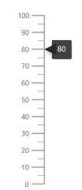

# User Interaction in Blazor Linear Gauge Component

## Tooltip

Linear Gauge displays the details about a pointer value through [`LinearGaugeTooltipSettings`](https://help.syncfusion.com/cr/blazor/Syncfusion.Blazor.LinearGauge.LinearGaugeTooltipSettings.html) class, when the mouse hovers over the pointer. To enable the tooltip, set [`Enable`](https://help.syncfusion.com/cr/blazor/Syncfusion.Blazor.LinearGauge.LinearGaugeTooltipSettings.html#Syncfusion_Blazor_LinearGauge_LinearGaugeTooltipSettings_Enable) property as "**true**".

```cshtml
@using Syncfusion.Blazor.LinearGauge

<SfLinearGauge>
    <LinearGaugeAxes>
        <LinearGaugeAxis>
            <LinearGaugeTooltipSettings Enable="true">
            </LinearGaugeTooltipSettings>
            <LinearGaugePointers>
                <LinearGaugePointer PointerValue="80">
                </LinearGaugePointer>
            </LinearGaugePointers>
        </LinearGaugeAxis>
    </LinearGaugeAxes>
</SfLinearGauge>
```



### Tooltip format

Tooltip in the Linear Gauge control can be formatted using the [`Format`](https://help.syncfusion.com/cr/blazor/Syncfusion.Blazor.LinearGauge.LinearGaugeTooltipSettings.html#Syncfusion_Blazor_LinearGauge_LinearGaugeTooltipSettings_Format) property in [`LinearGaugeTooltipSettings`](https://help.syncfusion.com/cr/blazor/Syncfusion.Blazor.LinearGauge.LinearGaugeTooltipSettings.html) class. It is used to render the tooltip in certain format or to add a user-defined unit in the tooltip. By default, the tooltip shows the pointer value only. In addition to that, more information can be added in the tooltip. For example, the format "**{value}km**" shows pointer value with kilometer unit in the tooltip.

```cshtml
@using Syncfusion.Blazor.LinearGauge

<SfLinearGauge>
    <LinearGaugeAxes>
        <LinearGaugeAxis>
            <LinearGaugeTooltipSettings Enable="true" Format="{value}km">
            </LinearGaugeTooltipSettings>
            <LinearGaugePointers>
                <LinearGaugePointer PointerValue="80">
                </LinearGaugePointer>
            </LinearGaugePointers>
        </LinearGaugeAxis>
    </LinearGaugeAxes>
</SfLinearGauge>
```


### Tooltip Template

The HTML element can be rendered in the tooltip of the Linear Gauge using the [`TooltipTemplate`](https://help.syncfusion.com/cr/blazor/Syncfusion.Blazor.LinearGauge.LinearGaugeTooltipSettings.html#Syncfusion_Blazor_LinearGauge_LinearGaugeTooltipSettings_TooltipTemplate) class in the [`LinearGaugeTooltipSettings`](https://help.syncfusion.com/cr/blazor/Syncfusion.Blazor.LinearGauge.LinearGaugeTooltipSettings.html) class.

```cshtml
@using Syncfusion.Blazor.LinearGauge

<SfLinearGauge>
    <LinearGaugeTooltipSettings Enable="true">
        <TooltipTemplate>
            <div style="height:100px;width:100px;">Pointer: 80</div>
        </TooltipTemplate>
    </LinearGaugeTooltipSettings>
    <LinearGaugeAxes>
        <LinearGaugeAxis>
            <LinearGaugePointers>
                <LinearGaugePointer PointerValue="80">
                </LinearGaugePointer>
            </LinearGaugePointers>
        </LinearGaugeAxis>
    </LinearGaugeAxes>
</SfLinearGauge>
```


### Customize the appearance of the tooltip

The tooltip can be customized using the following properties in [`LinearGaugeTooltipSettings`](https://help.syncfusion.com/cr/blazor/Syncfusion.Blazor.LinearGauge.LinearGaugeTooltipSettings.html) class.

* [`Fill`](https://help.syncfusion.com/cr/blazor/Syncfusion.Blazor.LinearGauge.LinearGaugeTooltipSettings.html#Syncfusion_Blazor_LinearGauge_LinearGaugeTooltipSettings_Fill) - To fill the color for tooltip.
* [`EnableAnimation`](https://help.syncfusion.com/cr/blazor/Syncfusion.Blazor.LinearGauge.LinearGaugeTooltipSettings.html#Syncfusion_Blazor_LinearGauge_LinearGaugeTooltipSettings_EnableAnimation) - To enable or disable the tooltip animation.
* [`LinearGaugeTooltipBorder`](https://help.syncfusion.com/cr/blazor/Syncfusion.Blazor.LinearGauge.LinearGaugeTooltipBorder.html) - To set the color and width for the border of the tooltip.
* [`LinearGaugeTooltipTextStyle`](https://help.syncfusion.com/cr/blazor/Syncfusion.Blazor.LinearGauge.LinearGaugeTooltipTextStyle.html) - To customize the style of the text in tooltip.
* [`ShowAtMousePosition`](https://help.syncfusion.com/cr/blazor/Syncfusion.Blazor.LinearGauge.LinearGaugeRangeTooltipSettings.html#Syncfusion_Blazor_LinearGauge_LinearGaugeRangeTooltipSettings_ShowAtMousePosition) - To show the tooltip at the mouse position.

```cshtml
@using Syncfusion.Blazor.LinearGauge

<SfLinearGauge>
    <LinearGaugeAxes>
        <LinearGaugeAxis>
            <LinearGaugeTooltipSettings Enable="true"
                                        Format="Speed: {value}"
                                        Fill="lightgray"
                                        EnableAnimation="true">
                <LinearGaugeTooltipBorder Color="darkgray"
                                          Width="1">
                </LinearGaugeTooltipBorder>
                <LinearGaugeTooltipTextStyle Color="blue"
                                             FontStyle="italic"
                                             FontWeight="bold">
                </LinearGaugeTooltipTextStyle>
            </LinearGaugeTooltipSettings>
            <LinearGaugePointers>
                <LinearGaugePointer PointerValue="40">
                </LinearGaugePointer>
            </LinearGaugePointers>
        </LinearGaugeAxis>
    </LinearGaugeAxes>
</SfLinearGauge>
```


### Positioning the tooltip

The tooltip is positioned at the "[**End**](https://help.syncfusion.com/cr/blazor/Syncfusion.Blazor.LinearGauge.TooltipPosition.html#Syncfusion_Blazor_LinearGauge_TooltipPosition_End)" of the pointer. To change the position of the tooltip at the start, or center of the pointer, set the [`Position`](https://help.syncfusion.com/cr/blazor/Syncfusion.Blazor.LinearGauge.LinearGaugeRangeTooltipSettings.html#Syncfusion_Blazor_LinearGauge_LinearGaugeRangeTooltipSettings_Position) property to "[**Start**](https://help.syncfusion.com/cr/blazor/Syncfusion.Blazor.LinearGauge.TooltipPosition.html#Syncfusion_Blazor_LinearGauge_TooltipPosition_Start)" or "[**Center**](https://help.syncfusion.com/cr/blazor/Syncfusion.Blazor.LinearGauge.TooltipPosition.html#Syncfusion_Blazor_LinearGauge_TooltipPosition_Center)".

```cshtml
@using Syncfusion.Blazor.LinearGauge

<SfLinearGauge>
    <LinearGaugeTooltipSettings Enable="true" Position="TooltipPosition.Center"></LinearGaugeTooltipSettings>
    <LinearGaugeAxes>
        <LinearGaugeAxis>
            <LinearGaugePointers>
                <LinearGaugePointer PointerValue="50" Type="Point.Bar" Color="blue"></LinearGaugePointer>
            </LinearGaugePointers>
        </LinearGaugeAxis>
    </LinearGaugeAxes>
</SfLinearGauge>
```


## Pointer drag

To drag either marker or bar pointer to the desired axis value, set the [`EnableDrag`](https://help.syncfusion.com/cr/blazor/Syncfusion.Blazor.LinearGauge.LinearGaugePointer.html#Syncfusion_Blazor_LinearGauge_LinearGaugePointer_EnableDrag) property as "**true**" in the [`LinearGaugePointer`](https://help.syncfusion.com/cr/blazor/Syncfusion.Blazor.LinearGauge.LinearGaugePointer.html).

```cshtml
@using Syncfusion.Blazor.LinearGauge

<SfLinearGauge>
    <LinearGaugeAxes>
        <LinearGaugeAxis>
            <LinearGaugePointers>
                <LinearGaugePointer PointerValue="80" EnableDrag="true">
                </LinearGaugePointer>
            </LinearGaugePointers>
        </LinearGaugeAxis>
    </LinearGaugeAxes>
</SfLinearGauge>
```

