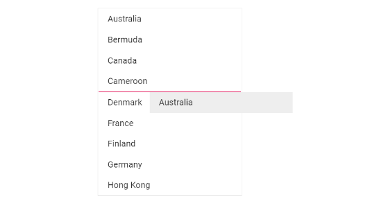
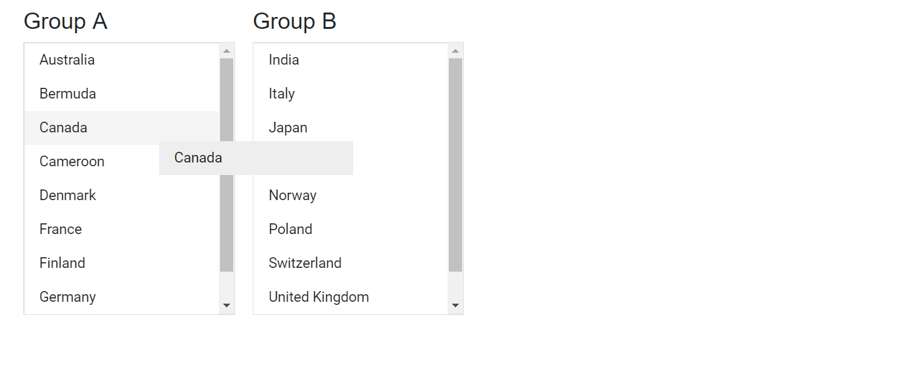

# Drag And Drop in Blazor ListBox Component

The ListBox has support to drag an item or a group of selected items and drop it within the same listbox or into another listbox.

The elements can be customized on drag and drop by using the following events.

| Events | Description |
|------|------|
| [`DragStart`](https://help.syncfusion.com/cr/blazor/Syncfusion.Blazor.DropDowns.ListBoxEvents-1.html#Syncfusion_Blazor_DropDowns_ListBoxEvents_1_DragStart) | Triggers when the selected element's drag starts. |
| [`Dragging`](https://help.syncfusion.com/cr/blazor/Syncfusion.Blazor.DropDowns.ListBoxEvents-1.html#Syncfusion_Blazor_DropDowns_ListBoxEvents_1_Dragging) | Triggers when the selected element is being dragged. |
| [`OnDrop`](https://help.syncfusion.com/cr/blazor/Syncfusion.Blazor.DropDowns.ListBoxEvents-1.html#Syncfusion_Blazor_DropDowns_ListBoxEvents_1_OnDrop) | Triggers before the selected element is dropped. |
| [`Dropped`](https://help.syncfusion.com/cr/blazor/Syncfusion.Blazor.DropDowns.ListBoxEvents-1.html#Syncfusion_Blazor_DropDowns_ListBoxEvents_1_Dropped) | Triggers when the selected element is dropped. |

## Single ListBox

To drag and drop an item or group of item within the listbox can achieved by setting [`AllowDragAndDrop`](https://help.syncfusion.com/cr/blazor/Syncfusion.Blazor.DropDowns.SfListBox-2.html#Syncfusion_Blazor_DropDowns_SfListBox_2_AllowDragAndDrop) property to `true`.

The following sample illustrates how to drag and drop an item within the same listbox.

```cshtml
@using Syncfusion.Blazor.DropDowns

<SfListBox TValue="string[]" DataSource="@GroupA" TItem="CountryCode" AllowDragAndDrop="true">
<ListBoxFieldSettings Text="Name" Value="Code" />
</SfListBox>

@code {
    public List<CountryCode> GroupA = new List<CountryCode>
    {
        new CountryCode{ Name = "Australia", Code = "AU" },
        new CountryCode{ Name = "Bermuda", Code = "BM" },
        new CountryCode{ Name = "Canada", Code = "CA" },
        new CountryCode{ Name = "Cameroon", Code = "CM" },
        new CountryCode{ Name = "Denmark", Code = "DK" },
        new CountryCode{ Name = "France", Code = "FR" },
        new CountryCode{ Name = "Finland", Code = "FI" },
        new CountryCode{ Name = "Germany", Code = "DE" },
        new CountryCode{ Name = "Hong Kong", Code = "HK" }
    };

    public class CountryCode {
        public string Name  { get; set; }
        public string Code  { get; set; }
    }
}

```

Output will be shown as



## Multiple ListBox

To drag and drop an item or group of item between two listbox can achieved by setting [`AllowDragAndDrop`](https://help.syncfusion.com/cr/blazor/Syncfusion.Blazor.DropDowns.SfListBox-2.html#Syncfusion_Blazor_DropDowns_SfListBox_2_AllowDragAndDrop) property to `true` and [`Scope`](https://help.syncfusion.com/cr/blazor/Syncfusion.Blazor.DropDowns.SfListBox-2.html#Syncfusion_Blazor_DropDowns_SfListBox_2_Scope) should be set as `combined-list` in both the listbox.

The following sample illustrates how to drag and drop an item between two listbox.

```cshtml
@using Syncfusion.Blazor.DropDowns

<div id="listbox1">
    <h4>Group A</h4>
    <SfListBox TValue="string[]" DataSource="@GroupA" AllowDragAndDrop="true" Scope="combined-list" Height="290px" TItem="CountryCode">
        <ListBoxFieldSettings Text="Name" Value="Code" />
    </SfListBox>
</div>
<div id="listbox2">
    <h4>Group B</h4>
    <SfListBox TValue="string[]" DataSource="@GroupB" Scope="combined-list" AllowDragAndDrop="true" Height="290px" TItem="CountryCode">
        <ListBoxFieldSettings Text="Name" Value="Code" />
    </SfListBox>
</div>

@code {
    public List<CountryCode> GroupA = new List<CountryCode>
  {
        new CountryCode{ Name = "Australia", Code = "AU" },
        new CountryCode{ Name = "Bermuda", Code = "BM" },
        new CountryCode{ Name = "Canada", Code = "CA" },
        new CountryCode{ Name = "Cameroon", Code = "CM" },
        new CountryCode{ Name = "Denmark", Code = "DK" },
        new CountryCode{ Name = "France", Code = "FR" },
        new CountryCode{ Name = "Finland", Code = "FI" },
        new CountryCode{ Name = "Germany", Code = "DE" },
        new CountryCode{ Name = "Hong Kong", Code = "HK" }
    };

    public List<CountryCode> GroupB = new List<CountryCode>
  {
        new CountryCode{ Name = "India", Code = "IN" },
        new CountryCode{ Name = "Italy", Code = "IT" },
        new CountryCode{ Name = "Japan", Code = "JP" },
        new CountryCode{ Name = "Mexico", Code = "MX" },
        new CountryCode{ Name = "Norway", Code = "NO" },
        new CountryCode{ Name = "Poland", Code = "PL" },
        new CountryCode{ Name = "Switzerland", Code = "CH" },
        new CountryCode{ Name = "United Kingdom", Code = "GB" },
        new CountryCode{ Name = "United States", Code = "US" }
    };

    public class CountryCode
    {
        public string Name { get; set; }
        public string Code { get; set; }
    }
}

<style>
    #listbox1 {
        width: 48%;
        float: left;
    }

    #listbox2 {
        width: 48%;
        float: right;
    }
</style>
```

Output will be shown as

