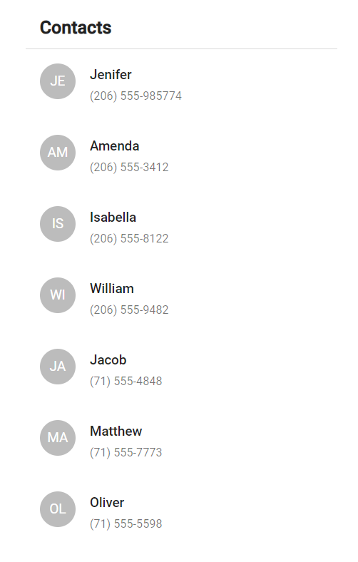

# How to create mobile contact layout from listview

You can customize the ListView using the `Template` property. Refer
to the following steps to customize ListView as mobile contact view with our `avatar`.

* Render the ListView with `DataSource` that has
avatar data. You can set avatar data as either text or class names. Refer to the following codes.

```C#
new ListDataModel {
    Text = "Amenda",
    Contact = "(206) 555-3412",
    Id = "2",
    Avatar = "A",
    Pic = ""
},
```

* Set `avatar` classes in ListView template to customize contact icon. In the following codes, medium size avatar has been
set using the class name `e-avatar e-avatar-circle` from data source.

```C#
ListDataModel item = context as ListDataModel;
<div class="e-list-wrapper e-list-multi-line e-list-avatar">
    @if (item.Avatar != "")
    {
        <span class="e-avatar e-avatar-circle">@item.Avatar</span>
    }
    else
    {
        <span class="@item.Pic e-avatar e-avatar-circle"> </span>
    }
    <span class="e-list-item-header">@item.Text</span>
    <span class="e-list-content">@item.Contact</span>
</div>
```

* Sort the contact names using the `SortOder` property of ListView.

* Enable the `ShowHeader` property, and set the `HeaderTitle` as `Contacts`.

```csharp
@using Syncfusion.Blazor.Lists

<div class="flex flex__center">
    <div class="margin">
        <SfListView DataSource="@DataSource"
                     ShowHeader="true"
                     HeaderTitle="Contacts"
                     CssClass="e-list-template"
                     SortOrder="Syncfusion.Blazor.Lists.SortOrder.Ascending">
            <ListViewFieldSettings TValue="ListDataModel" Id="Id" Text="Text"></ListViewFieldSettings>
            <ListViewTemplates TValue="ListDataModel">
                <Template>
                    @{
                        ListDataModel item = context as ListDataModel;
                        <div class="e-list-wrapper e-list-multi-line e-list-avatar">
                            @if (item.Avatar != "")
                            {
                                <span class="e-avatar e-avatar-circle">@item.Avatar</span>
                            }
                            else
                            {
                                <span class="@item.Pic e-avatar e-avatar-circle"> </span>
                            }
                            <span class="e-list-item-header">@item.Text</span>
                            <span class="e-list-content">@item.Contact</span>
                        </div>
                    }
                </Template>
            </ListViewTemplates>
        </SfListView>
    </div>
</div>

@code
{
    List<ListDataModel> DataSource = new List<ListDataModel>() {
        new ListDataModel {
            Text = "Jenifer",
            Contact = "(206) 555-985774",
            Id = "1",
            Avatar = "JE",
        },
        new ListDataModel {
            Text = "Amenda",
            Contact = "(206) 555-3412",
            Id = "2",
            Avatar = "AM",
        },
        new ListDataModel {
            Text = "Isabella",
            Contact = "(206) 555-8122",
            Id = "4",
            Avatar = "IS",
        },
        new ListDataModel {
            Text = "William ",
            Contact = "(206) 555-9482",
            Id = "5",
            Avatar = "WI",
        },
        new ListDataModel {
            Text = "Jacob",
            Contact = "(71) 555-4848",
            Id = "6",
            Avatar = "JA",
        },
        new ListDataModel {
            Text = "Matthew",
            Contact = "(71) 555-7773",
            Id = "7",
            Avatar = "MA",
        },
        new ListDataModel {
            Text = "Oliver",
            Contact = "(71) 555-5598",
            Id = "8",
            Avatar = "OL",
        },

        new ListDataModel {
            Text = "Charlotte",
            Contact = "(206) 555-1189",
            Id = "9",
            Avatar = "CH",
        }
    };

    public class ListDataModel
    {
        public string Id
        {
            get;
            set;
        }
        public string Text
        {
            get;
            set;
        }
        public string Avatar
        {
            get;
            set;
        }
        public string Pic
        {
            get;
            set;
        }
        public string Contact
        {
            get;
            set;
        }
    }
}

<style>
    .flex {
        display: flex;
    }

    .flex__center {
        justify-content: center;
    }

    .vertical__center {
        align-items: center;
    }

    .vertical {
        flex-direction: column;
    }

    .flex__1 {
        flex: 1;
    }

    .flex__2 {
        flex: 2;
    }

    .flex__3 {
        flex: 3;
    }

    .flex__4 {
        flex: 4;
    }

    .bold {
        font-weight: 500;
    }

    .margin {
        margin: 10px;
        width: 350px;
    }

    .small__font {
        font-size: 13px;
        margin: 2px 0;
    }
</style>

```


