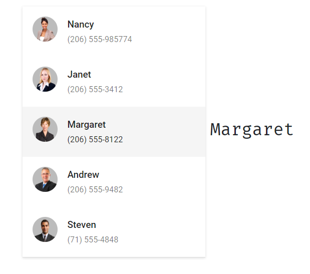

# Get selected items from listview template in Blazor ListView Component

Single or multiple items can be selected by users in the ListView control.

By default, dataSource `Id` and `Text` is mapped in default rendering of listview, since it returns the selected item data properly. But in the custom template, dataSource and the corresponding mapping (text, id, elements rendered inside li element) will vary as per the application requirement.

So, we need to map id attribute to listview items using `ListViewFieldSettings` of `DataSource` to get the selected item data properly while working with custom templates. Refer to the below code snippet for template sample.

```C#
@using Syncfusion.Blazor.Lists

<div id="container">
    <div class="sample flex vertical-center">
        <div class="padding">
            <SfListView DataSource="@DataSource" CssClass="e-list-template">
                <ListViewFieldSettings TValue="ListDataModel" Id="Id" Text="Name"></ListViewFieldSettings>
                <ListViewTemplates TValue="ListDataModel">
                    <Template>
                        @{
                            ListDataModel currentData = (ListDataModel)context;
                            <div class="e-list-wrapper e-list-multi-line e-list-avatar" @onclick="(e => OnSelect(currentData))">
                                
                                <span class="e-list-item-header">@currentData.Name</span>
                                <span class="e-list-content">@currentData.Contact</span>
                            </div>
                        }
                    </Template>
                </ListViewTemplates>
            </SfListView>
        </div>
        <div class="padding">
            <h3>@(Selected?.Name)</h3>
        </div>
    </div>
</div>

@code
{
    ListDataModel Selected;

    List<ListDataModel> DataSource = new List<ListDataModel>() {
        new ListDataModel { Name = "Nancy", Contact = "(206) 555-985774", Id = "1", Image = "https://ej2.syncfusion.com/demos/src/grid/images/1.png", Category = "Experience" },
        new ListDataModel { Name = "Janet", Contact = "(206) 555-3412", Id = "2", Image = "https://ej2.syncfusion.com/demos/src/grid/images/3.png", Category = "Fresher" },
        new ListDataModel { Name = "Margaret", Contact = "(206) 555-8122", Id = "4", Image = "https://ej2.syncfusion.com/demos/src/grid/images/4.png", Category = "Experience" },
        new ListDataModel { Name = "Andrew ", Contact = "(206) 555-9482", Id = "5", Image = "https://ej2.syncfusion.com/demos/src/grid/images/2.png", Category = "Experience" },
        new ListDataModel { Name = "Steven", Contact = "(71) 555-4848", Id = "6", Image = "https://ej2.syncfusion.com/demos/src/grid/images/5.png", Category = "Fresher" },
    };

    void OnSelect(ListDataModel listData)
    {
        Selected = listData;
    }

    public class ListDataModel
    {
        public string Id
        {
            get;
            set;
        }
        public string Name
        {
            get;
            set;
        }
        public string Image
        {
            get;
            set;
        }

        public string Category
        {
            get;
            set;
        }

        public string Contact
        {
            get;
            set;
        }
    }
}
<style>
    #container .e-listview {
        box-shadow: 0 1px 4px #ddd;
        border-bottom: 1px solid #ddd;
    }

    .sample {
        justify-content: center;
        min-height: 280px;
    }

    .vertical-center {
        align-items: center;
    }

    .padding {
        padding: 4px;
    }

    .flex {
        display: flex;
    }

    .flex__center {
        justify-content: center;
    }

    .margin {
        margin: 10px;
    }
</style>
```

istview-template-sample.png)
