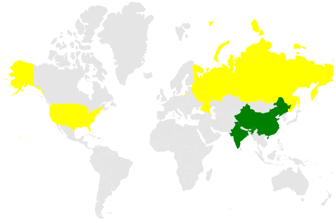

# Color Mapping in Blazor Maps Component

Color mapping is used to customize the shape colors based on given values. It has three types: range color mapping, equal color mapping, and desaturation color mapping.

## Range color mapping

Range color mapping is applied by the mapped value, which is a numeric value. Within the given color mapping, ranges are provided in [`DataSource`](https://help.syncfusion.com/cr/blazor/Syncfusion.Blazor.Maps.MapsLayer.html#Syncfusion_Blazor_Maps_MapsLayer_DataSource). Bind the [`DataSource`](https://help.syncfusion.com/cr/blazor/Syncfusion.Blazor.Maps.MapsLayer.html#Syncfusion_Blazor_Maps_MapsLayer_DataSource) value and specify the [`ColorValuePath`](https://help.syncfusion.com/cr/blazor/Syncfusion.Blazor.Maps.MapsShapeSettings.html#Syncfusion_Blazor_Maps_MapsShapeSettings_ColorValuePath) to 'Density' to map the range value for shapes. Refer to the following code snippets.

```cshtml
@using Syncfusion.Blazor.Maps

<SfMaps>
    <MapsLayers>
        <MapsLayer ShapeData='new {dataOptions ="https://cdn.syncfusion.com/maps/map-data/world-map.json"}' DataSource="populationDetails" ShapeDataPath="Name" ShapePropertyPath='new string[] {"name"}' TValue="PopulationDetail">
            @* To apply color based on density range *@
            <MapsShapeSettings Fill="#E5E5E5" ColorValuePath="Density">
                <MapsShapeColorMappings>
                    <MapsShapeColorMapping StartRange="0.00001" EndRange="100" Color='new string[] {"yellow"}' />
                    <MapsShapeColorMapping StartRange="100" EndRange="400" Color='new string[] {"green"}' />
                </MapsShapeColorMappings>
            </MapsShapeSettings>
        </MapsLayer>
    </MapsLayers>
</SfMaps>

@code{
    public class PopulationDetail
    {
        public string Code { get; set; }
        public double Value { get; set; }
        public string Name { get; set; }
        public double Population { get; set; }
        public double Density { get; set; }
    };
    private List<PopulationDetail> populationDetails = new List<PopulationDetail> {
       new PopulationDetail
       {
           Code = "US",
           Value = 34,
           Name ="United States",
           Population = 325020000,
           Density = 33
       },
       new PopulationDetail
       {
           Code ="RU",
           Value = 9,
           Name = "Russia",
           Population = 142905208,
           Density = 8.3
       },
       new PopulationDetail
        {
           Code = "In",
           Value = 384,
           Name="India",
           Population=1198003000,
           Density=364
        },
       new PopulationDetail
       {
           Code="CN",
           Value=143,
           Name="China",
           Population=1389750000,
           Density=144
       }
    };
}
```



## Equal color mapping

Equal color mapping is used to apply color mapping if the mapped value is string. The following example demonstrates the permanent and non-permanent countries in the United Nations Security Council in 2017.

Bind the `councilMemberdetails` data to the layer [`DataSource`](https://help.syncfusion.com/cr/blazor/Syncfusion.Blazor.Maps.MapsLayer.html#Syncfusion_Blazor_Maps_MapsLayer_DataSource) property, set [`ColorValuePath`](https://help.syncfusion.com/cr/blazor/Syncfusion.Blazor.Maps.MapsShapeSettings.html#Syncfusion_Blazor_Maps_MapsShapeSettings_ColorValuePath) to 'Membership' in the [`MapsShapeSettings`](https://help.syncfusion.com/cr/aspnetcore-blazor/Syncfusion.Blazor.Maps.MapsShapeSettings.html), and set the color mapping values to [`MapsShapeColorMapping`](https://help.syncfusion.com/cr/aspnetcore-blazor/Syncfusion.Blazor.Maps.MapsShapeColorMapping.html).

```cshtml
@using Syncfusion.Blazor.Maps

<SfMaps>
    <MapsLayers>
        <MapsLayer ShapeData='new {dataOptions ="https://cdn.syncfusion.com/maps/map-data/world-map.json"}' DataSource="CouncilMemberdetails" ShapeDataPath="Country" ShapePropertyPath='new string[] {"name"}' TValue="UNCouncil">
            @* To apply color based on membership type *@
            <MapsShapeSettings Fill="#E5E5E5" ColorValuePath="Membership">
                <MapsShapeColorMappings>
                    <MapsShapeColorMapping Value="Permanent" Color='new string[] {"#D84444"}' />
                    <MapsShapeColorMapping Value="Non-Permanent" Color='new string[] {"#316DB5"}' />
                </MapsShapeColorMappings>
            </MapsShapeSettings>
        </MapsLayer>
    </MapsLayers>
</SfMaps>

@code{
    public class UNCouncil
    {
        public string Country { get; set; }
        public string Membership { get; set; }
    };
    private List<UNCouncil> CouncilMemberdetails = new List<UNCouncil>{
         new UNCouncil { Country= "China", Membership= "Permanent"},
         new UNCouncil { Country= "France",Membership= "Permanent" },
         new UNCouncil { Country= "Russia",Membership= "Permanent"},
         new UNCouncil { Country= "Kazakhstan",Membership= "Non-Permanent"},
         new UNCouncil { Country= "Poland",Membership= "Non-Permanent"},
         new UNCouncil { Country= "Sweden",Membership= "Non-Permanent"}
    };
}
```


## Desaturation color mapping

Desaturation color mapping is used to apply colors to shapes with opacity based on given values for the [`MinOpacity`](https://help.syncfusion.com/cr/blazor/Syncfusion.Blazor.Maps.MapsShapeColorMapping.html#Syncfusion_Blazor_Maps_MapsShapeColorMapping_MinOpacity) and [`MaxOpacity`](https://help.syncfusion.com/cr/blazor/Syncfusion.Blazor.Maps.MapsShapeColorMapping.html#Syncfusion_Blazor_Maps_MapsShapeColorMapping_MaxOpacity) properties in the Maps component.

Bind the `populationDetails` value to the [`DataSource`](https://help.syncfusion.com/cr/blazor/Syncfusion.Blazor.Maps.MapsLayer.html#Syncfusion_Blazor_Maps_MapsLayer_DataSource) property, and then specify the [`ColorValuePath`](https://help.syncfusion.com/cr/blazor/Syncfusion.Blazor.Maps.MapsShapeSettings.html#Syncfusion_Blazor_Maps_MapsShapeSettings_ColorValuePath) as 'Density' to map the range value for shapes. Refer to the following code examples to apply desaturation color mapping to shapes.

```cshtml
@using Syncfusion.Blazor.Maps

<SfMaps>
    <MapsLayers>
        <MapsLayer ShapeData='new {dataOptions ="https://cdn.syncfusion.com/maps/map-data/world-map.json"}' DataSource="populationDetails" ShapeDataPath="Name" ShapePropertyPath='new string[] {"name"}' TValue="PopulationDetail">
            <MapsShapeSettings Fill="#E5E5E5" ColorValuePath="Density">
                <MapsShapeColorMappings>
                    <MapsShapeColorMapping StartRange="100" EndRange="400" Color='new string[] {"blue"}' MinOpacity="0.3" MaxOpacity="1" />
                </MapsShapeColorMappings>
            </MapsShapeSettings>
        </MapsLayer>
    </MapsLayers>
</SfMaps>
```

> Refer [code block](#range-color-mapping) to know the property value of `PopulationDetails`.


<b>Desaturation with multiple colors</b>

Multiple colors are used to provide gradient effect to specific shapes based on the ranges in the data source. By using the `Color` property, you can set n number of colors.

Bind the `populationDetails` value to layer [`DataSource`](https://help.syncfusion.com/cr/blazor/Syncfusion.Blazor.Maps.MapsLayer.html#Syncfusion_Blazor_Maps_MapsLayer_DataSource) and specify the [`ColorValuePath`](https://help.syncfusion.com/cr/blazor/Syncfusion.Blazor.Maps.MapsShapeSettings.html#Syncfusion_Blazor_Maps_MapsShapeSettings_ColorValuePath) as 'Density' to map the range value for shapes. Refer to the following the example for more details.

```cshtml
@using Syncfusion.Blazor.Maps

<SfMaps>
    <MapsLayers>
        <MapsLayer ShapeData='new {dataOptions ="https://cdn.syncfusion.com/maps/map-data/world-map.json"}'
                   DataSource="populationDetails"
                   ShapeDataPath="Name"
                   ShapePropertyPath='new string[] {"name"}' TValue="PopulationDetail">
            <MapsShapeSettings Fill="#E5E5E5" ColorValuePath="Density">
                <MapsShapeColorMappings>
                    <MapsShapeColorMapping StartRange="0.00001" EndRange="50" Color='new string[] { "red", "blue"}' />
                    <MapsShapeColorMapping StartRange="50" EndRange="400" Color='new string[] { "green", "yellow"}' />
                </MapsShapeColorMappings>
            </MapsShapeSettings>
        </MapsLayer>
    </MapsLayers>
</SfMaps>
```

> Refer [code block](#range-color-mapping) to know the property value of `PopulationDetails`.


## Color for items excluded from color mapping

You will map the colors to the shapes based on the ranges or values in the data source. Some data source records may have been excluded from the color mapping configuration, in which case you may also add the color for excluded items.

In following code example, You have added color mapping for the ranges from 0.00001 to 300. If we have any records in the data source beyond this range, color mapping will not be applied. To apply the color for these excluded items, set `Color` value in the `MapsShapeColorMapping` with out range or value.

```cshtml
@using Syncfusion.Blazor.Maps

<SfMaps>
    <MapsLayers>
        <MapsLayer ShapeData='new {dataOptions ="https://cdn.syncfusion.com/maps/map-data/world-map.json"}' DataSource="populationDetails" ShapeDataPath="Name" ShapePropertyPath='new string[] {"name"}' TValue="PopulationDetail">
            <MapsShapeSettings Fill="#E5E5E5" ColorValuePath="Density">
                <MapsShapeColorMappings>
                    <MapsShapeColorMapping StartRange="0.00001" EndRange="100" Color='new string[] {"orange"}' />
                    <MapsShapeColorMapping StartRange="100" EndRange="300" Color='new string[] {"blue"}' />
                    @* To apply color for excluded items *@
                    <MapsShapeColorMapping Color='new string[] {"green"}' />
                </MapsShapeColorMappings>
            </MapsShapeSettings>
        </MapsLayer>
    </MapsLayers>
</SfMaps>
```

> Refer [code block](#range-color-mapping) to know the property value of `PopulationDetails`.

