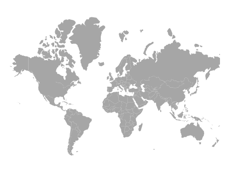
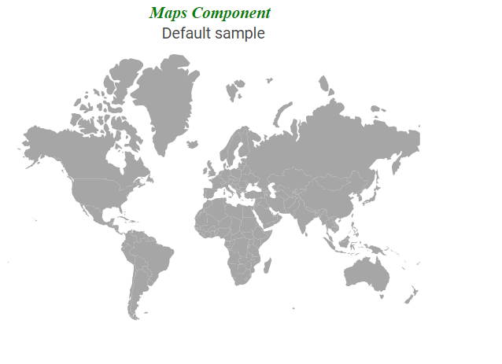
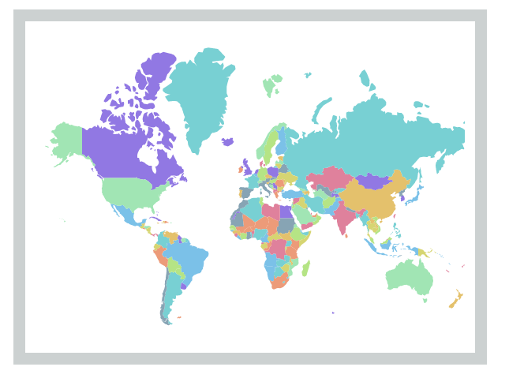
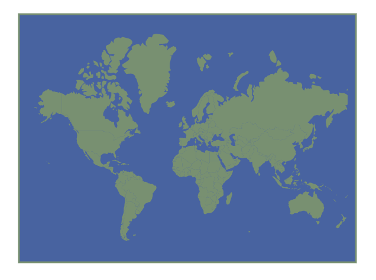
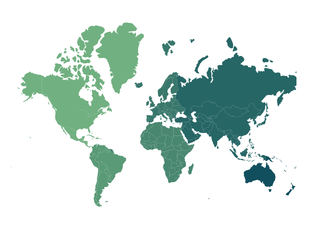

# Customization in Blazor Maps Component

## Setting the size

The width and height of the Maps can be set using the [Width](https://help.syncfusion.com/cr/blazor/Syncfusion.Blazor.Maps.SfMaps.html#Syncfusion_Blazor_Maps_SfMaps_Width) and [Height](https://help.syncfusion.com/cr/blazor/Syncfusion.Blazor.Maps.SfMaps.html#Syncfusion_Blazor_Maps_SfMaps_Height) properties in [SfMaps](https://help.syncfusion.com/cr/blazor/Syncfusion.Blazor.Maps.SfMaps.html). Percentage or pixel values can be used for the height and width values.

```cshtml
@using Syncfusion.Blazor.Maps

<SfMaps Height="600px" Width="300px">
    <MapsLayers>
        <MapsLayer ShapeData='new {dataOptions ="https://cdn.syncfusion.com/maps/map-data/world-map.json"}' TValue="string">
            @* To customize map shape *@
        </MapsLayer>
    </MapsLayers>
</SfMaps>
```



## Setting the title

The title for the Maps can be set using the [MapsTitleSettings](https://help.syncfusion.com/cr/blazor/Syncfusion.Blazor.Maps.MapsTitleSettings.html) class. It can be customized using the following properties and classes.

* [Alignment](https://help.syncfusion.com/cr/blazor/Syncfusion.Blazor.Maps.MapsTitleSettings.html#Syncfusion_Blazor_Maps_MapsTitleSettings_Alignment) - To customize the alignment for the text in the title of the Maps. The possible values can be "[Center](https://help.syncfusion.com/cr/blazor/Syncfusion.Blazor.Maps.Alignment.html#Syncfusion_Blazor_Maps_Alignment_Center)", "[Near](https://help.syncfusion.com/cr/blazor/Syncfusion.Blazor.Maps.Alignment.html#Syncfusion_Blazor_Maps_Alignment_Near)" and "[Far](https://help.syncfusion.com/cr/blazor/Syncfusion.Blazor.Maps.Alignment.html#Syncfusion_Blazor_Maps_Alignment_Far)".
* [Description](https://help.syncfusion.com/cr/blazor/Syncfusion.Blazor.Maps.MapsTitleSettings.html#Syncfusion_Blazor_Maps_MapsTitleSettings_Description) - To set the description of the title in Maps.
* [Text](https://help.syncfusion.com/cr/blazor/Syncfusion.Blazor.Maps.MapsTitleSettings.html#Syncfusion_Blazor_Maps_MapsTitleSettings_Text) - To set the text for the title in Maps.
* [MapsTitleTextStyle](https://help.syncfusion.com/cr/blazor/Syncfusion.Blazor.Maps.MapsTitleTextStyle.html) - To customize the style of the font in Maps.
* [MapsSubtitleSettings](https://help.syncfusion.com/cr/blazor/Syncfusion.Blazor.Maps.MapsSubtitleSettings.html) - To customize the subtitle for the Maps.

```cshtml
@using Syncfusion.Blazor.Maps

<SfMaps Height="300px">
    <MapsTitleSettings Text="Maps Component"
                       Description="Maps"
                       Alignment="Alignment.Center">
        <MapsTitleTextStyle Color="Green"
                            FontFamily="Times New Roman"
                            FontStyle="italic"
                            FontWeight="bold">
        </MapsTitleTextStyle>
        <MapsSubtitleSettings Text="Default sample"></MapsSubtitleSettings>
    </MapsTitleSettings>
    <MapsLayers>
        <MapsLayer ShapeData='new {dataOptions ="https://cdn.syncfusion.com/maps/map-data/world-map.json"}' TValue="string">
        </MapsLayer>
    </MapsLayers>
</SfMaps>
```



## Setting theme

The Maps control supports following themes.

* Material
* Fabric
* Bootstrap
* Highcontrast
* MaterialDark
* FabricDark
* BootstrapDark
* Bootstrap4
* Tailwind

By default, the Maps are rendered by the **"Material"** theme. The theme of the Maps component is changed using the [Theme](https://help.syncfusion.com/cr/blazor/Syncfusion.Blazor.Maps.SfMaps.html#Syncfusion_Blazor_Maps_SfMaps_Theme) property.

```cshtml
@using Syncfusion.Blazor
@using Syncfusion.Blazor.Maps

<SfMaps Theme="Theme.HighContrastLight">
    <MapsLayers>
        <MapsLayer ShapeData='new {dataOptions ="https://cdn.syncfusion.com/maps/map-data/world-map.json"}' TValue="string">
            @* To customize map shape *@
        </MapsLayer>
    </MapsLayers>
</SfMaps>
```


## Customizing the Maps container

The following properties and classes are available to customize the container in the Maps.

* [Background](https://help.syncfusion.com/cr/blazor/Syncfusion.Blazor.Maps.SfMaps.html#Syncfusion_Blazor_Maps_SfMaps_Background) - To apply the background color to the container in the Maps.
* [MapsBorderSettings](https://help.syncfusion.com/cr/blazor/Syncfusion.Blazor.Maps.MapsBorderSettings.html) - To customize the color and width of the border of the Maps.
* [MapsMargin](https://help.syncfusion.com/cr/blazor/Syncfusion.Blazor.Maps.MapsMargin.html) - To customize the margins of the Maps.

```cshtml
@using Syncfusion.Blazor.Maps

<SfMaps Height="300px" Width="400px" Background="#CCD1D1">
    <MapsBorderSettings Color="green" Width="2"></MapsBorderSettings>
    <MapsMargin Bottom="10" Left="10" Right="10" Top="10"></MapsMargin>
    <MapsLayers>
        <MapsLayer ShapeData='new {dataOptions ="https://cdn.syncfusion.com/maps/map-data/world-map.json"}' TValue="string">
            <MapsShapeSettings Autofill="true"></MapsShapeSettings>
        </MapsLayer>
    </MapsLayers>
</SfMaps>
```



## Customizing the Maps area

By default, the background color of the shape maps is set as "**white**". To modify the background color of the Maps area, the [Background](https://help.syncfusion.com/cr/blazor/Syncfusion.Blazor.Maps.MapsAreaSettings.html#Syncfusion_Blazor_Maps_MapsAreaSettings_Background) property in the [MapsAreaSettings](https://help.syncfusion.com/cr/blazor/Syncfusion.Blazor.Maps.MapsAreaSettings.html) class is used. The border of the Maps area can be customized using the [MapsAreaBorder](https://help.syncfusion.com/cr/blazor/Syncfusion.Blazor.Maps.MapsAreaBorder.html) class.

```cshtml
@using Syncfusion.Blazor.Maps

<SfMaps>
   <MapsAreaSettings Background="#e6e2d3">
       <MapsBorder Color="green" Width="2"></MapsBorder>
   </MapsAreaSettings>
    <MapsLayers>
        <MapsLayer ShapeData='new {dataOptions ="https://cdn.syncfusion.com/maps/map-data/world-map.json"}' TValue="string">
            @* To set shape color automatically *@
            <MapsShapeSettings Autofill="true"></MapsShapeSettings>
        </MapsLayer>
    </MapsLayers>
</SfMaps>
```



## Customizing the shapes

The following properties and class are available in [MapsShapeSettings](https://help.syncfusion.com/cr/blazor/Syncfusion.Blazor.Maps.MapsShapeSettings.html) class to customize the shapes of the Maps component.

* [Fill](https://help.syncfusion.com/cr/blazor/Syncfusion.Blazor.Maps.MapsShapeSettings.html#Syncfusion_Blazor_Maps_MapsShapeSettings_Fill) - To apply the color to the shapes.
* [Autofill](https://help.syncfusion.com/cr/blazor/Syncfusion.Blazor.Maps.MapsShapeSettings.html#Syncfusion_Blazor_Maps_MapsShapeSettings_Autofill) - To apply the palette colors to the shapes if it is set as true.
* [Palette](https://help.syncfusion.com/cr/blazor/Syncfusion.Blazor.Maps.MapsShapeSettings.html#Syncfusion_Blazor_Maps_MapsShapeSettings_Palette) - To set the custom palette for the shapes.
* [MapsShapeBorder](https://help.syncfusion.com/cr/blazor/Syncfusion.Blazor.Maps.MapsShapeBorder.html) - To customize the color and width of the border of the shapes.
* [DashArray](https://help.syncfusion.com/cr/blazor/Syncfusion.Blazor.Maps.MapsShapeSettings.html#Syncfusion_Blazor_Maps_MapsShapeSettings_DashArray) - To define the pattern of dashes and gaps that is applied to the outline of the shapes.
* [Opacity](https://help.syncfusion.com/cr/blazor/Syncfusion.Blazor.Maps.MapsShapeSettings.html#Syncfusion_Blazor_Maps_MapsShapeSettings_Opacity) - To customize the transparency for the shapes.

```cshtml
@using Syncfusion.Blazor.Maps

<SfMaps>
    <MapsLayers>
        <MapsLayer ShapeData='new {dataOptions ="https://cdn.syncfusion.com/maps/map-data/world-map.json"}' TValue="string">
            @* To customize map shape *@
            <MapsShapeSettings Autofill="true" Palette='new string[] {"#d6cbd3", "#eca1a6", "#bdcebe", "#ada397", "#d5e1df"}' DashArray="1" Opacity=0.9>
                <MapsShapeBorder Color="#FFFFFF" Width="2"></MapsShapeBorder>
            </MapsShapeSettings>
        </MapsLayer>
    </MapsLayers>
</SfMaps>
```


## Setting color to the shapes from the data source

The color for each shape in the Maps can be set using the [ColorValuePath](https://help.syncfusion.com/cr/blazor/Syncfusion.Blazor.Maps.MapsShapeSettings.html#Syncfusion_Blazor_Maps_MapsShapeSettings_ColorValuePath) property of [MapsShapeSettings](https://help.syncfusion.com/cr/blazor/Syncfusion.Blazor.Maps.MapsShapeSettings.html) class. The value for the [ColorValuePath](https://help.syncfusion.com/cr/blazor/Syncfusion.Blazor.Maps.MapsShapeSettings.html#Syncfusion_Blazor_Maps_MapsShapeSettings_ColorValuePath) property is the field name from the data source of the [MapsLayer](https://help.syncfusion.com/cr/blazor/Syncfusion.Blazor.Maps.MapsLayer-1.html) class which contains the color values.

```cshtml
@using Syncfusion.Blazor.Maps

<SfMaps>
    <MapsLayers>
        <MapsLayer ShapeData='new {dataOptions ="https://cdn.syncfusion.com/maps/map-data/world-map.json"}' ShapeDataPath="Continent" ShapePropertyPath='new string[] {"continent"}' DataSource="ShapeColor" TValue="Data">
            <MapsShapeSettings ColorValuePath="Color"></MapsShapeSettings>
        </MapsLayer>
    </MapsLayers>
</SfMaps>

@code{
    public class Data
    {
        public string Continent { get; set; }
        public string Color { get; set; }
    };
    private List<Data> ShapeColor = new List<Data>{
        new Data { Continent= "North America", Color= "#71B081" },
        new Data { Continent= "South America", Color= "#5A9A77" },
        new Data { Continent= "Africa", Color= "#498770" },
        new Data { Continent= "Europe", Color= "#39776C" },
        new Data { Continent= "Asia", Color= "#266665" },
        new Data { Continent= "Australia", Color= "#124F5E" }
    };
}
```



## Projection type

The Maps control supports the following projection types:

* Mercator
* Equirectangular
* Miller
* Eckert3
* Eckert5
* Eckert6
* Winkel3
* AitOff

By default, the Maps are rendered by the **"Mercator"** projection type in which the Maps are rendered based on the coordinates. So, the Maps is not stretched. To change the type of projection in the Maps, the [ProjectionType](https://help.syncfusion.com/cr/blazor/Syncfusion.Blazor.Maps.SfMaps.html#Syncfusion_Blazor_Maps_SfMaps_ProjectionType) property is used.

```cshtml
@using Syncfusion.Blazor.Maps

@* To change Maps projection *@
<SfMaps ProjectionType="ProjectionType.Miller">
    <MapsLayers>
        <MapsLayer ShapeData='new {dataOptions ="https://cdn.syncfusion.com/maps/map-data/world-map.json"}' TValue="string">
        </MapsLayer>
    </MapsLayers>
</SfMaps>
```

