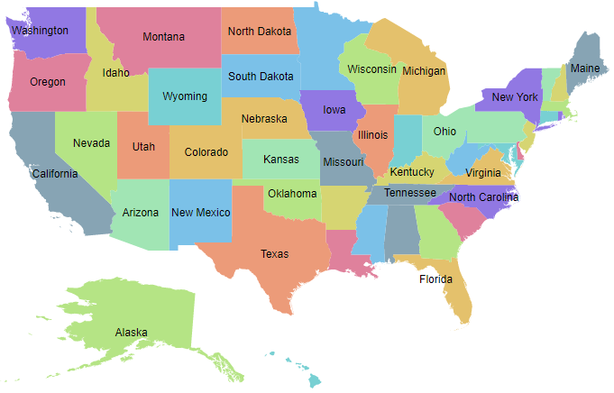

# Data Labels in Blazor Maps Component

Data labels provide information to users about the shapes of the Map component.

## Add data labels

You can add label text to the shapes of the Maps component using `MapsDataLabelSettings`. The following sample demonstrates the names of all the states in the United States in data labels.

```cshtml
@using Syncfusion.Blazor.Maps

<SfMaps>
    <MapsLayers>
        <MapsLayer ShapeData='new {dataOptions= "https://cdn.syncfusion.com/maps/map-data/usa.json"}' TValue="string">
            @* To add data labels *@
            <MapsDataLabelSettings Visible="true" LabelPath="name"></MapsDataLabelSettings>
            <MapsShapeSettings Autofill="true"></MapsShapeSettings>
        </MapsLayer>
    </MapsLayers>
</SfMaps>
```

> The `Autofill` property is used in `MapsShapeSettings` to apply the default palette colors to the shapes.


Some data labels intersect with other labels in this output. The following options are used to avoid intersecting:

## Smart labels

The Maps component provides an option to specify the smart labels when the labels intersect with the corresponding shape borders. In the `SmartLabelMode` property, you can specify any of the following options:

* None
* Hide
* Trim

```cshtml
@using Syncfusion.Blazor.Maps

<SfMaps>
    <MapsLayers>
        <MapsLayer ShapeData='new {dataOptions= "https://cdn.syncfusion.com/maps/map-data/usa.json"}' TValue="string">
            @* To hide intersect labels with shape border *@
            <MapsDataLabelSettings Visible="true"
                                   LabelPath="name"
                                   SmartLabelMode="SmartLabelMode.Hide">
            </MapsDataLabelSettings>
            <MapsShapeSettings Autofill="true"></MapsShapeSettings>
        </MapsLayer>
    </MapsLayers>
</SfMaps>
```



## Intersect action

This specifies the intersect action when a label intersect with another label. In the `IntersectionAction` property, you can specify any of the following options:

* None
* Hide
* Trim

```cshtml
@using Syncfusion.Blazor.Maps

<SfMaps>
    <MapsLayers>
        <MapsLayer ShapeData='new {dataOptions= "https://cdn.syncfusion.com/maps/map-data/usa.json"}' TValue="string">
            @* To trim intersect labels *@
            <MapsDataLabelSettings Visible="true"
                                   LabelPath="name"
                                   IntersectionAction="IntersectAction.Trim">
            </MapsDataLabelSettings>
            <MapsShapeSettings Autofill="true"></MapsShapeSettings>
        </MapsLayer>
    </MapsLayers>
</SfMaps>
```

