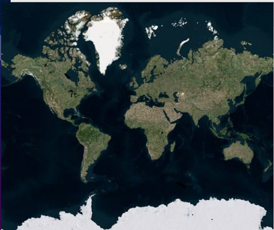

# Display geometry shapes in Bing maps in Blazor Maps Component

Usually, the Bing Maps displays the maps in satellite view, in which you cannot make changes as you need. To overcome this, add maps shape as sub layer over the Bing Maps and customize it.

<b>Step 1</b>

To render Bing Maps in the Maps component, set the `UrlTemplate` property with the Bing Maps URL link passed and generated by the `GetBingUrlTemplate` method.

```cshtml
@using Syncfusion.Blazor.Maps

<SfMaps>
    <MapsLayers>
        <MapsLayer UrlTemplate="@UrlTemplate" TValue="string"></MapsLayer>
    </MapsLayers>
</SfMaps>

@code {
    public string UrlTemplate;
    protected override async Task OnInitializedAsync()
    {
        UrlTemplate = await SfMaps.GetBingUrlTemplate("https://dev.virtualearth.net/REST/V1/Imagery/Metadata/CanvasGray?output=json&uriScheme=https&key=");
    }
}
```

> In the above URL passed to the `GetBingUrlTemplate` method, specify the Bing Maps key.



<b>Step 2</b>

Add geometry shape in the Bing Maps using sublayer concept. To add geometry shape, import shape data, set type as subLayer, and assign your shape data to the ShapeData API.

```cshtml
@using Syncfusion.Blazor.Maps

<SfMaps>
    <MapsLayers>
        <MapsLayer UrlTemplate="@UrlTemplate" TValue="string"></MapsLayer>
        @* To add geometry shape as sublayer *@
        <MapsLayer ShapeData='new {dataOptions = "https://cdn.syncfusion.com/maps/map-data/africa.json"}'
                   Type="Syncfusion.Blazor.Maps.Type.SubLayer" TValue="string">
            <MapsShapeSettings Fill="blue"></MapsShapeSettings>
        </MapsLayer>
    </MapsLayers>
</SfMaps>

@code {
    public string UrlTemplate;
    protected override async Task OnInitializedAsync()
    {
        UrlTemplate = await SfMaps.GetBingUrlTemplate("https://dev.virtualearth.net/REST/V1/Imagery/Metadata/CanvasGray?output=json&uriScheme=https&key=");
    }
}
```

> In the above URL passed to the `GetBingUrlTemplate` method, specify the Bing Maps key.

The above code renders Africa continent as sublayer in the Bing Maps.

