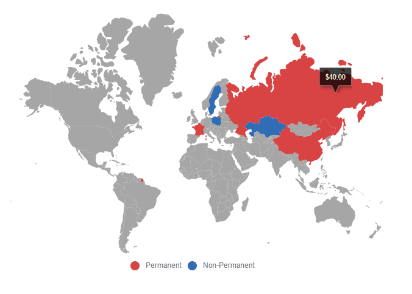

# Internationalization

Maps provides support for internationalization for the below elements.

* Datalabel
* Tooltip

## Globalization

Globalization is the process of designing and developing an component that works in different
cultures/locales. Internationalization library is used to globalize number, date, time values in
Maps component using `LoadCldrData` method.

## Numeric Format

In the below example tooltip is globalized to Deutsch culture.

```csharp
@using Syncfusion.Blazor.Maps

<SfMaps>
    <MapsLayers>
        <MapsLayer ShapeData='new {dataOptions= "https://cdn.syncfusion.com/maps/map-data/world-map.json"}'
                   DataSource="CountryData" Format="c"
                   ShapePropertyPath='new string[] {"name"}'
                   ShapeDataPath="Country" TValue="MapDataSource">
            <MapsShapeSettings Fill="#E5E5E5" colorValuePath="Membership">
                <MapsColorMapping>
                    <MapsColorMapping Value="Permanent" Color='new string[] {"#D84444"}' />
                    <MapsColorMapping Value="Non-Permanent" Color='new string[] {"#316DB5"}' />
                </MapsColorMapping>
            </MapsShapeSettings>
            <MapsLayerTooltipSettings Visible="true" ValuePath="Population"></MapsLayerTooltipSettings>
        </MapsLayer>
    </MapsLayers>
    <MapsLegendSettings Visible="true"></MapsLegendSettings>
</SfMaps>

@code {
    public class MapDataSource
    {
        public string Country { get; set; }
        public string Membership { get; set; }
        public double Population { get; set; }
    };
    public List<MapDataSource> CountryData = new List<MapDataSource>{
         new MapDataSource {  Country= "China", Membership= "Permanent", Population=20},
         new MapDataSource { Country= "France",Membership= "Permanent", Population=30 },
         new MapDataSource { Country= "Russia",Membership= "Permanent", Population=40},
         new MapDataSource { Country= "Kazakhstan",Membership= "Non-Permanent", Population=50},
         new MapDataSource { Country= "Poland",Membership= "Non-Permanent", Population=60},
         new MapDataSource { Country= "Sweden",Membership= "Non-Permanent", Population=70}
    };
    [Inject]
    protected IJSRuntime JsRuntime { get; set; }
    protected override void OnAfterRender()
    {
        this.JsRuntime.Sf().LoadCldrData(new string[]{"ca-gregorian.json",
        "currencies.json","numbers.json","timeZoneNames.json"}).SetCulture("de");
    }
}
```

