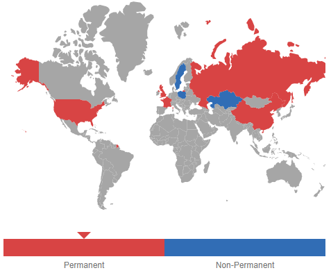
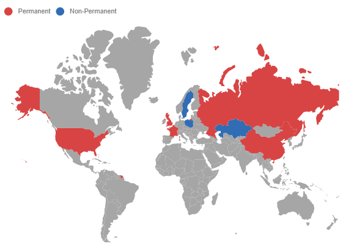
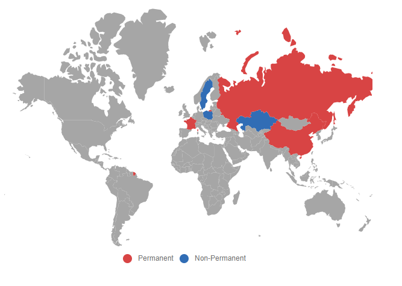
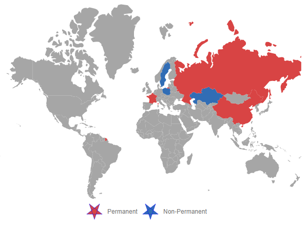
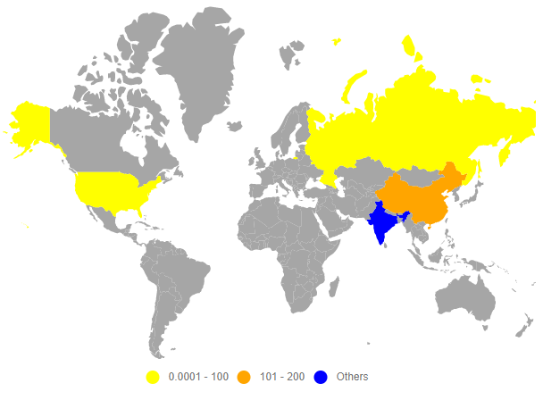
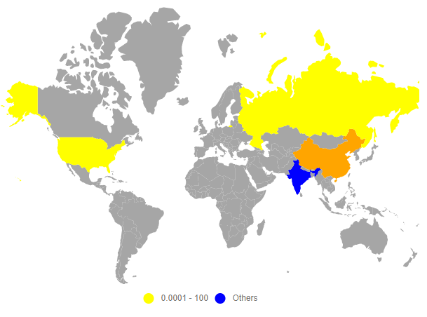
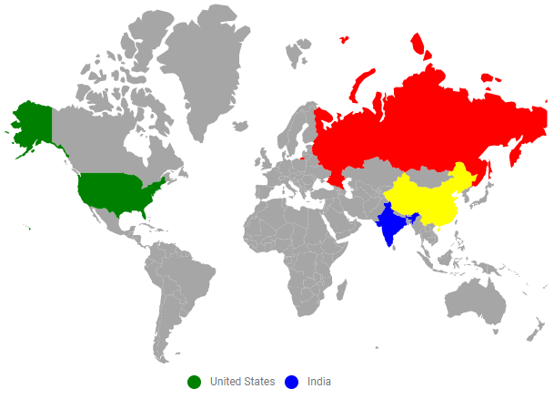
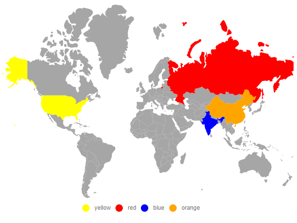
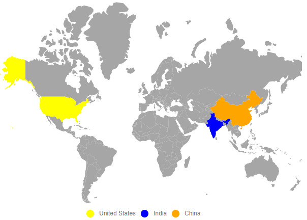
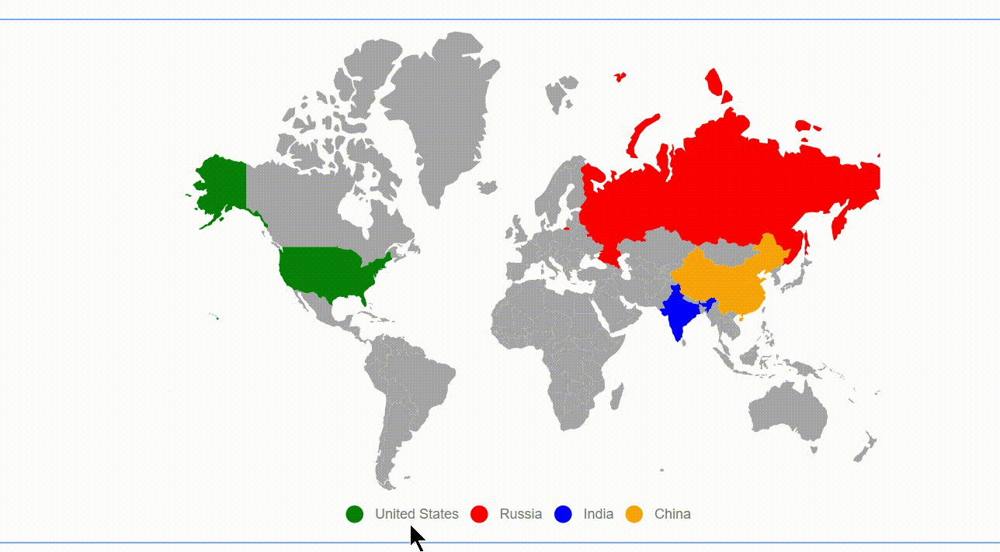

# Legend

A legend is a key used on a map that contains swatches of symbols with descriptions. Legends provide valuable information for interpreting what the map displays, and they can be represented in various colors, shapes, or other identifiers based on the data. It gives a breakdown of what each symbol represents throughout the maps.

<b>Visibility</b>

The legends can be made visible by setting the [`Visible`](https://help.syncfusion.com/cr/blazor/Syncfusion.Blazor.Maps.MapsLegendSettings.html#Syncfusion_Blazor_Maps_MapsLegendSettings_Visible) property of [`MapsLegendSettings`](https://help.syncfusion.com/cr/aspnetcore-blazor/Syncfusion.Blazor.Maps.MapsLegendSettings.html) to true.

## Legend mode

The Maps component contains the following two types of legend modes: The [`Default`](https://help.syncfusion.com/cr/aspnetcore-blazor/Syncfusion.Blazor.Maps.LegendMode.html) mode and the [`Interactive`](https://help.syncfusion.com/cr/aspnetcore-blazor/Syncfusion.Blazor.Maps.LegendMode.html) mode.

<b>Default mode</b>

The default mode legends have symbols with legend labels. They are used to identify the shapes, bubbles, or marker color.

<b>Interactive mode</b>

The legends can be made interactive with an arrow mark that indicates the exact range color in legend when the mouse hovers over a shape. You can enable this option by setting the value of [`Mode`](https://help.syncfusion.com/cr/aspnetcore-blazor/Syncfusion.Blazor.Maps.LegendMode.html) property in [`MapsLegendSettings`](https://help.syncfusion.com/cr/aspnetcore-blazor/Syncfusion.Blazor.Maps.MapsLegendSettings.html) to “Interactive”. The default value of the [`Mode`](https://help.syncfusion.com/cr/aspnetcore-blazor/Syncfusion.Blazor.Maps.LegendMode.html) property is “Default”.

```cshtml
@using Syncfusion.Blazor.Maps

<SfMaps>
    @*  To set legend mode as interactive  *@
    <MapsLegendSettings Visible="true" Mode="LegendMode.Interactive">
    </MapsLegendSettings>
    <MapsLayers>
        <MapsLayer ShapeData='new {dataOptions ="https://cdn.syncfusion.com/maps/map-data/world-map.json"}'
                   DataSource="SecurityCouncilDetails"
                   ShapePropertyPath='new string[] {"name"}'
                   ShapeDataPath="Name" TValue="UNCouncilCountry">
            <MapsShapeSettings ColorValuePath="Membership">
                <MapsShapeColorMappings>
                    <MapsShapeColorMapping Value="Permanent" Color='new string[] {"#D84444"}' />
                    <MapsShapeColorMapping Value="Non-Permanent" Color='new string[] {"#316DB5"}' />
                </MapsShapeColorMappings>
            </MapsShapeSettings>
        </MapsLayer>
    </MapsLayers>
</SfMaps>

@code {
    private List<UNCouncilCountry> SecurityCouncilDetails = new List<UNCouncilCountry>{
         new UNCouncilCountry { Name= "China", Membership= "Permanent"},
         new UNCouncilCountry { Name= "France", Membership= "Permanent" },
         new UNCouncilCountry { Name= "Russia", Membership= "Permanent"},
         new UNCouncilCountry { Name= "Kazakhstan", Membership= "Non-Permanent"},
         new UNCouncilCountry { Name= "Poland", Membership= "Non-Permanent"},
         new UNCouncilCountry { Name= "Sweden", Membership= "Non-Permanent"},
         new UNCouncilCountry { Name= "United Kingdom", Membership= "Permanent"},
         new UNCouncilCountry { Name= "United States", Membership= "Permanent"}
    };

    public class UNCouncilCountry
    {
        public string Name { get; set; }
        public string Membership { get; set; }
    };
}
```



## Positioning the legends

The legends can be positioned in the following two ways:

* Absolute position
* Dock position

<b>Absolute position</b>

Based on the margin values of x and y-axes, the maps legends can be positioned using the [`X`](https://help.syncfusion.com/cr/blazor/Syncfusion.Blazor.Maps.MapsLegendSettings.html#Syncfusion_Blazor_Maps_MapsLegendSettings_Location) and [`Y`](https://help.syncfusion.com/cr/blazor/Syncfusion.Blazor.Maps.MapsLegendSettings.html#Syncfusion_Blazor_Maps_MapsLegendSettings_Location) properties available in the [`Location`](https://help.syncfusion.com/cr/blazor/Syncfusion.Blazor.Maps.MapsLegendSettings.html#Syncfusion_Blazor_Maps_MapsLegendSettings_Location) property of [`MapsLegendSettings`](https://help.syncfusion.com/cr/aspnetcore-blazor/Syncfusion.Blazor.Maps.MapsLegendSettings.html). For positioning the legends based on margins corresponding to map, the value of [`Position`](https://help.syncfusion.com/cr/aspnetcore-blazor/Syncfusion.Blazor.Maps.LegendPosition.html) is set to ‘Float’.

<b>Dock position</b>

You can set the position for legend using the [`Position`](https://help.syncfusion.com/cr/aspnetcore-blazor/Syncfusion.Blazor.Maps.LegendPosition.html) property in [`MapsLegendSettings`](https://help.syncfusion.com/cr/aspnetcore-blazor/Syncfusion.Blazor.Maps.MapsLegendSettings.html).

The map legends can be positioned in following locations within the container:

* Top
* Left
* Bottom
* Right

The above four positions can be aligned with combination of 'Near', 'Center', and 'Far' using [`Alignment`](https://help.syncfusion.com/cr/aspnetcore-blazor/Syncfusion.Blazor.Maps.Alignment.html) in [`MapsLegendSettings`](https://help.syncfusion.com/cr/aspnetcore-blazor/Syncfusion.Blazor.Maps.MapsLegendSettings.html). So, the legends can be aligned to 12 positions.

```cshtml
@using Syncfusion.Blazor.Maps

<SfMaps>
    @*  To position the legend  *@
    <MapsLegendSettings Visible="true" Position="LegendPosition.Top" Alignment="Alignment.Near">
    </MapsLegendSettings>
    <MapsLayers>
        <MapsLayer ShapeData='new {dataOptions ="https://cdn.syncfusion.com/maps/map-data/world-map.json"}'
                   DataSource="SecurityCouncilDetails"
                   ShapePropertyPath='new string[] {"name"}'
                   ShapeDataPath="Name" TValue="UNCouncilCountry">
            <MapsShapeSettings ColorValuePath="Membership">
                <MapsShapeColorMappings>
                    <MapsShapeColorMapping Value="Permanent" Color='new string[] {"#D84444"}' />
                    <MapsShapeColorMapping Value="Non-Permanent" Color='new string[] {"#316DB5"}' />
                </MapsShapeColorMappings>
            </MapsShapeSettings>
        </MapsLayer>
    </MapsLayers>
</SfMaps>
```

> Refer [code block](#legend-mode) to know the property value of `securityCouncilDetails`.



## Customization

### Appearance

<b>Legend size</b>

The legend size can be modified using the [`Height`](https://help.syncfusion.com/cr/blazor/Syncfusion.Blazor.Maps.MapsLegendSettings.html#Syncfusion_Blazor_Maps_MapsLegendSettings_Height) and [`Width`](https://help.syncfusion.com/cr/blazor/Syncfusion.Blazor.Maps.MapsLegendSettings.html#Syncfusion_Blazor_Maps_MapsLegendSettings_Width) properties in [`MapsLegendSettings`](https://help.syncfusion.com/cr/aspnetcore-blazor/Syncfusion.Blazor.Maps.MapsLegendSettings.html).

<b>Legend opacity</b>

To specify the transparency for legend shapes, set the [`Opacity`](https://help.syncfusion.com/cr/blazor/Syncfusion.Blazor.Maps.MapsLegendSettings.html#Syncfusion_Blazor_Maps_MapsLegendSettings_Opacity) property in [`MapsLegendSettings`](https://help.syncfusion.com/cr/aspnetcore-blazor/Syncfusion.Blazor.Maps.MapsLegendSettings.html).

<b>Legend for shapes</b>

The layer shape type legends can be generated for each color mappings in shape settings.

To load United Nations Council related data source, bind the `memberShipDetails` to the [`DataSource`](https://help.syncfusion.com/cr/blazor/Syncfusion.Blazor.Maps.MapsLayer.html#Syncfusion_Blazor_Maps_MapsLayer_DataSource) of [`MapsLayer`](https://help.syncfusion.com/cr/aspnetcore-blazor/Syncfusion.Blazor.Maps.MapsLayer.html), set the value of [`ShapePropertyPath`](https://help.syncfusion.com/cr/blazor/Syncfusion.Blazor.Maps.MapsLayer.html#Syncfusion_Blazor_Maps_MapsLayer_ShapePropertyPath) to 'name', and then set the value of [`shapeDataPath`](https://help.syncfusion.com/cr/blazor/Syncfusion.Blazor.Maps.MapsLayer.html#Syncfusion_Blazor_Maps_MapsLayer_ShapeDataPath) to 'Country'.

To enable equal color mapping, refer to the [`MapsShapeSettings`](https://help.syncfusion.com/cr/aspnetcore-blazor/Syncfusion.Blazor.Maps.MapsShapeSettings.html) code snippet. Set [`Visible`](https://help.syncfusion.com/cr/blazor/Syncfusion.Blazor.Maps.MapsLegendSettings.html#Syncfusion_Blazor_Maps_MapsLegendSettings_Visible) to true in [`MapsLegendSettings`](https://help.syncfusion.com/cr/aspnetcore-blazor/Syncfusion.Blazor.Maps.MapsLegendSettings.html).

```cshtml
@using Syncfusion.Blazor.Maps

<SfMaps>
    <MapsLegendSettings Visible="true">
    </MapsLegendSettings>
    <MapsLayers>
        <MapsLayer ShapeData='new {dataOptions ="https://cdn.syncfusion.com/maps/map-data/world-map.json"}'
                   DataSource="MembershipDetails"
                   ShapeDataPath="Country"
                   ShapePropertyPath='new string[] {"name"}' TValue="UNCouncilCountry">
            <MapsShapeSettings ColorValuePath="Membership" >
                <MapsShapeColorMappings>
                    <MapsShapeColorMapping Value="Permanent" Color='new string[] {"#D84444"}' />
                    <MapsShapeColorMapping Value="Non-Permanent" Color='new string[] {"#316DB5"}' />
                </MapsShapeColorMappings>
            </MapsShapeSettings>
        </MapsLayer>
    </MapsLayers>
</SfMaps>

@code{

    public class UNCouncil
    {
        public string Country { get; set; }
        public string Membership { get; set; }
    }
    private List<UNCouncil> MembershipDetails = new List<UNCouncil> {
        new UNCouncil { Country= "China", Membership= "Permanent" },
        new UNCouncil { Country= "France",Membership= "Permanent" },
        new UNCouncil { Country= "Russia",Membership= "Permanent" },
        new UNCouncil { Country= "Kazakhstan",Membership= "Non-Permanent" },
        new UNCouncil { Country= "Poland",Membership= "Non-Permanent" },
        new UNCouncil { Country= "Sweden",Membership= "Non-Permanent" }
    };
}
```



<b>Custom shape for legend</b>

To get the legend shape value for [`MapsLegendSettings`](https://help.syncfusion.com/cr/aspnetcore-blazor/Syncfusion.Blazor.Maps.MapsLegendSettings.html), use the [`Shape`](https://help.syncfusion.com/cr/aspnetcore-blazor/Syncfusion.Blazor.Maps.LegendShape.html) property. You can customize the shape using the [`ShapeWidth`](https://help.syncfusion.com/cr/blazor/Syncfusion.Blazor.Maps.MapsLegendSettings.html#Syncfusion_Blazor_Maps_MapsLegendSettings_ShapeWidth) and [`ShapeHeight`](https://help.syncfusion.com/cr/blazor/Syncfusion.Blazor.Maps.MapsLegendSettings.html#Syncfusion_Blazor_Maps_MapsLegendSettings_ShapeHeight) properties.

```cshtml
@using Syncfusion.Blazor.Maps

<SfMaps>
    @*  To customize the legend  *@
    <MapsLegendSettings Visible="true"
                        Shape="MarkerType.Star"
                        ShapeHeight="30"
                        ShapeWidth="30"
                        ShapePadding="10">
        <MapsLegendShapeBorder Color="blue"
                               Width="0.5">
        </MapsLegendShapeBorder>
    </MapsLegendSettings>
    <MapsLayers>
        <MapsLayer ShapeData='new {dataOptions ="https://cdn.syncfusion.com/maps/map-data/world-map.json"}'
                   DataSource="MemberShipDetails"
                   ShapeDataPath="Country"
                   ShapePropertyPath='new string[] {"name"}' TValue="UNCouncilCountry">
            <MapsShapeSettings ColorValuePath="Membership">
                <MapsShapeColorMappings>
                    <MapsShapeColorMapping Value="Permanent" Color='new string[] {"#D84444"}' />
                    <MapsShapeColorMapping Value="Non-Permanent" Color='new string[] {"#316DB5"}' />
                </MapsShapeColorMappings>
            </MapsShapeSettings>
        </MapsLayer>
    </MapsLayers>
</SfMaps>

@code{

    public class UNCouncil
    {
        public string Country { get; set; }
        public string Membership { get; set; }
    }
    private List<UNCouncil> MemberShipDetails = new List<UNCouncil> {
        new UNCouncil { Country= "China", Membership= "Permanent" },
        new UNCouncil { Country= "France",Membership= "Permanent" },
        new UNCouncil { Country= "Russia",Membership= "Permanent" },
        new UNCouncil { Country= "Kazakhstan",Membership= "Non-Permanent" },
        new UNCouncil { Country= "Poland",Membership= "Non-Permanent" },
        new UNCouncil { Country= "Sweden",Membership= "Non-Permanent" }
    };
}
```



### Legend for items excluded from color mapping

Based on the ranges in data source, get the excluded ranges from color mapping, and show the legend with excluded range values bound to the specific legend.

The following code example shows legends for the items excluded from color mapping.

Bind the `populationDetails` value to the [`DataSource`](https://help.syncfusion.com/cr/blazor/Syncfusion.Blazor.Maps.MapsLayer.html#Syncfusion_Blazor_Maps_MapsLayer_DataSource) property, and specify the [`ColorValuePath`](https://help.syncfusion.com/cr/blazor/Syncfusion.Blazor.Maps.MapsShapeSettings.html#Syncfusion_Blazor_Maps_MapsShapeSettings_ColorValuePath) as 'Density' to map the range values for shapes. Refer to the following the code example for more details.

```cshtml
@using Syncfusion.Blazor.Maps

<SfMaps>
    <MapsLegendSettings Visible="true"></MapsLegendSettings>
    <MapsLayers>
        <MapsLayer ShapeData='new {dataOptions ="https://cdn.syncfusion.com/maps/map-data/world-map.json"}'
                   DataSource="populationDetails"
                   ShapeDataPath="Name"
                   ShapePropertyPath='new string[] {"name"}' TValue="PopulationDetail">
            <MapsShapeSettings ColorValuePath="Density">
                <MapsShapeColorMappings>
                    <MapsShapeColorMapping StartRange="0.0001" EndRange="100" Color='new string[] {"yellow"}' />
                    <MapsShapeColorMapping StartRange="101" EndRange="200" Color='new string[] {"orange"}' />
                    <MapsShapeColorMapping Color='new string[] {"blue"}' />
                </MapsShapeColorMappings>
            </MapsShapeSettings>
        </MapsLayer>
    </MapsLayers>
</SfMaps>

@code{
    public class PopulationDetail
    {
        public string Name { get; set; }
        public double Population { get; set; }
        public double Density { get; set; }
    };
    private List<PopulationDetail> populationDetails = new List<PopulationDetail> {
       new PopulationDetail
       {
           Name ="United States",
           Population = 325020000,
           Density = 33
       },
       new PopulationDetail
       {
           Name = "Russia",
           Population = 142905208,
           Density = 8.3
       },
       new PopulationDetail
        {
           Name="India",
           Population=1198003000,
           Density=364
        },
       new PopulationDetail
       {
           Name="China",
           Population=1389750000,
           Density=144
       }
    };
}
```



### Hiding desired legend items

To enable or disable the desired legend for each color mapping, set the [`ShowLegend`](https://help.syncfusion.com/cr/blazor/Syncfusion.Blazor.Maps.MapsShapeColorMapping.html#Syncfusion_Blazor_Maps_MapsShapeColorMapping_ShowLegend) property to `true` in [`MapsShapeColorMapping`](https://help.syncfusion.com/cr/aspnetcore-blazor/Syncfusion.Blazor.Maps.MapsShapeColorMapping.html).

```cshtml
@using Syncfusion.Blazor.Maps

<SfMaps>
    <MapsLegendSettings Visible="true"></MapsLegendSettings>
    <MapsLayers>
        <MapsLayer ShapeData='new {dataOptions ="https://cdn.syncfusion.com/maps/map-data/world-map.json"}'
                   DataSource="populationDetails"
                   ShapeDataPath="Name"
                   ShapePropertyPath='new string[] {"name"}' TValue="PopulationDetail">
            <MapsShapeSettings ColorValuePath="Density">
                <MapsShapeColorMappings>
                    <MapsShapeColorMapping StartRange="0.0001"
                                      EndRange="100"
                                      Color='new string[] {"yellow"}'
                                      ShowLegend="true" />
                    @*  hide legend for this range  *@
                    <MapsShapeColorMapping StartRange="101"
                                      EndRange="200"
                                      Color='new string[] {"orange"}'
                                      ShowLegend="false" />
                    <MapsShapeColorMapping Color='new string[] {"blue"}'
                                      ShowLegend="true" />
                </MapsShapeColorMappings>
            </MapsShapeSettings>
        </MapsLayer>
    </MapsLayers>
</SfMaps>
```

> Refer [code block](#legend-for-items-excluded-from-color-mapping) to know the property value of `PopulationDetails`.



### Hiding desired items based on data source value

To enable or disable the legend visibility for each item, bind the field name in data source to the [`LegendPath`](https://help.syncfusion.com/cr/blazor/Syncfusion.Blazor.Maps.MapsLegendSettings.html#Syncfusion_Blazor_Maps_MapsLegendSettings_ShowLegendPath) property in [`MapsLegendSettings`](https://help.syncfusion.com/cr/aspnetcore-blazor/Syncfusion.Blazor.Maps.MapsLegendSettings.html).

The following code example demonstrates how to hide the legend items based data source value.

```cshtml
@using Syncfusion.Blazor.Maps

<SfMaps>
    @*  To hide legend based in data source fields  *@
    <MapsLegendSettings Visible="true" ShowLegendPath="LegendVisibility"/>
    <MapsLayers>
        <MapsLayer ShapeData='new {dataOptions ="https://cdn.syncfusion.com/maps/map-data/world-map.json"}'
                   DataSource="populationDetails"
                   ShapeDataPath="Name"
                   ShapePropertyPath='new string[] {"name"}' TValue="PopulationDetail">
            <MapsShapeSettings ColorValuePath="Color">
            </MapsShapeSettings>
        </MapsLayer>
    </MapsLayers>
</SfMaps>

@code{
    public class PopulationDetail
    {
        public string Name { get; set; }
        public double Population { get; set; }
        public double Density { get; set; }
        public bool LegendVisibility { get; set; }
        public string Color { get; set; }

    };
    private List<PopulationDetail> populationDetails = new List<PopulationDetail> {
       new PopulationDetail
       {
           Name ="United States",
           Population = 325020000,
           Density = 33,
           LegendVisibility = true,
           Color = "green"
       },
       new PopulationDetail
       {
           Name = "Russia",
           Population = 142905208,
           Density = 8.3,
           LegendVisibility = false,
           Color = "red"
       },
       new PopulationDetail
        {
           Name="India",
           Population=1198003000,
           Density=364,
           LegendVisibility = true,
           Color = "blue"
        },
       new PopulationDetail
       {
           Name="China",
           Population=1389750000,
           Density=144,
           LegendVisibility = false,
           Color = "orange"
       }
    };
}
```



### Binding legend item text from data source

To show the legend text based on binding, the field name in the data source should be set to the [`ValuePath`](https://help.syncfusion.com/cr/blazor/Syncfusion.Blazor.Maps.MapsLegendSettings.html#Syncfusion_Blazor_Maps_MapsLegendSettings_ValuePath) property in [`MapsLegendSettings`](https://help.syncfusion.com/cr/aspnetcore-blazor/Syncfusion.Blazor.Maps.MapsLegendSettings.html).

```cshtml
@using Syncfusion.Blazor.Maps

<SfMaps>
    <MapsLegendSettings Visible="true" ValuePath="Color"></MapsLegendSettings>
    <MapsLayers>
        <MapsLayer ShapeData='new {dataOptions ="https://cdn.syncfusion.com/maps/map-data/world-map.json"}'
                   DataSource="PopulationDetails"
                   ShapeDataPath="Name"
                   ShapePropertyPath='new string[] {"name"}' TValue="PopulationDetail">
            <MapsShapeSettings ColorValuePath="Color">
            </MapsShapeSettings>
        </MapsLayer>
    </MapsLayers>
</SfMaps>

@code{
    public class PopulationDetail
    {
        public string Name { get; set; }
        public double Population { get; set; }
        public double Density { get; set; }
        public string Color { get; set; }
    };
    private List<PopulationDetail> PopulationDetails = new List<PopulationDetail> {
       new PopulationDetail
       {
           Name ="United States",
           Population = 325020000,
           Density = 33,
           Color="yellow"
       },
       new PopulationDetail
       {
           Name = "Russia",
           Population = 142905208,
           Density = 8.3,
           Color="red"
       },
       new PopulationDetail
        {
           Name="India",
           Population=1198003000,
           Density=364,
           Color="blue"
        },
       new PopulationDetail
       {
           Name="China",
           Population=1389750000,
           Density=144,
           Color="orange"
       }
    };
}
```



### Hiding duplicate legend items

To enable or disable the duplicate legend items, set the [`RemoveDuplicateLegend`](https://help.syncfusion.com/cr/blazor/Syncfusion.Blazor.Maps.MapsLegendSettings.html#Syncfusion_Blazor_Maps_MapsLegendSettings_RemoveDuplicateLegend) property to `true` in [`MapsLegendSettings`](https://help.syncfusion.com/cr/aspnetcore-blazor/Syncfusion.Blazor.Maps.MapsLegendSettings.html).

```cshtml
@using Syncfusion.Blazor.Maps

<SfMaps>
    <MapsLegendSettings Visible="true" RemoveDuplicateLegend="true"></MapsLegendSettings>
    <MapsLayers>
        <MapsLayer ShapeData='new {dataOptions ="https://cdn.syncfusion.com/maps/map-data/world-map.json"}'
                   DataSource="PopulationDetails"
                   ShapeDataPath="Name" TValue="PopulationDetail"
                   ShapePropertyPath='new string[] {"name"}'>
            <MapsShapeSettings ColorValuePath="Color">
            </MapsShapeSettings>
        </MapsLayer>
    </MapsLayers>
</SfMaps>

@code{
    public class PopulationDetail
    {
        public string Name { get; set; }
        public double Population { get; set; }
        public double Density { get; set; }
        public string Color { get; set; }
    };
    private List<PopulationDetail> populationDetails = new List<PopulationDetail> {
       new PopulationDetail
       {
           Name ="United States",
           Population = 325020000,
           Density = 33,
           Color="yellow"
       },
       new PopulationDetail
       {
           Name ="United States",
           Population = 325020000,
           Density = 33,
           Color="yellow"
       },
       new PopulationDetail
       {
           Name = "Russia",
           Population = 142905208,
           Density = 8.3,
           Color="red"
       },
       new PopulationDetail
        {
           Name="India",
           Population=1198003000,
           Density=364,
           Color="blue"
        },
       new PopulationDetail
       {
           Name="China",
           Population=1389750000,
           Density=144,
           Color="orange"
       }
    };
}
```



### Toggle option in legend

The toggle option has been provided for legend. So, if you toggle a legend, the given color will be changed to the corresponding maps shape item. You can enable the toggle options using the `ToggleLegendSettings` property.

The following options are available to customize the shape of the map:

* `ApplyShapeSettings` – Applies the fill property value in shapeSettings to a shape of the maps if it is true and a legend item is clicked.
* `Fill`- Specifies the color to the shape of the maps.
* `Opacity` – Specifies the transparency of the legend.
* `Border` – Specifies the border color and width.

The following code example demonstrates how to add the toggle option to legend.

```cshtml
@using Syncfusion.Blazor.Maps

<SfMaps>
    @*  To hide legend based in data source fields  *@
    <MapsLegendSettings Visible="true">
    <MapsToggleLegendSettings Enable="true" ApplyShapeSettings="false">
    <MapsLegendBorder Width="2" Color="green"></MapsLegendBorder></MapsToggleLegendSettings>
    </MapsLegendSettings>
    <MapsLayers>
        <MapsLayer ShapeData='new {dataOptions ="https://cdn.syncfusion.com/maps/map-data/world-map.json"}'
                   DataSource="PopulationDetails"
                   ShapeDataPath="Name" TValue="PopulationDetail"
                   ShapePropertyPath='new string[] {"name"}'>
            <MapsShapeSettings ColorValuePath="Color">
            </MapsShapeSettings>
        </MapsLayer>
    </MapsLayers>
</SfMaps>

@code{
    public class PopulationDetail
    {
        public string Name;
        public double Population;
        public double Density;
        public bool LegendVisibility;
        public string Color;

    };
    private List<PopulationDetail> populationDetails = new List<PopulationDetail> {
       new PopulationDetail
       {
           Name ="United States",
           Population = 325020000,
           Density = 33,
           LegendVisibility = true,
           Color = "green"
       },
       new PopulationDetail
       {
           Name = "Russia",
           Population = 142905208,
           Density = 8.3,
           LegendVisibility = false,
           Color = "red"
       },
       new PopulationDetail
        {
           Name="India",
           Population=1198003000,
           Density=364,
           LegendVisibility = true,
           Color = "blue"
        },
       new PopulationDetail
       {
           Name="China",
           Population=1389750000,
           Density=144,
           LegendVisibility = false,
           Color = "orange"
       }
    };
}
```



## See also

* [Enabling legend for markers](markers/#enabling-legend-for-markers)
* [Enabling legend for Bubble](bubble/#enabling-legend-for-bubble)
* [Available color mapping options](color-mapping)