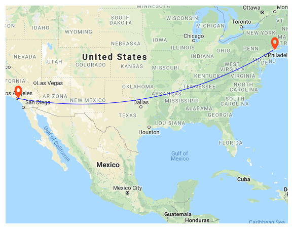

# Other Maps in Blazor Maps Component

Apart from the OpenStreetMap and Bing Maps, you can also render the Maps from other map service providers by specifying the URL generated by map provider in the [UrlTemplate](https://help.syncfusion.com/cr/blazor/Syncfusion.Blazor.Maps.MapsLayer-1.html#Syncfusion_Blazor_Maps_MapsLayer_1_UrlTemplate) property. Here, Google Maps is rendered. This provides customizable Maps with your own content and imagery.

>Refer to [Google Maps Licensing](https://developers.google.com/maps/terms#10-license-restrictions).

```csharp
@using Syncfusion.Blazor.Maps

<SfMaps>
    <MapsLayers>
        <MapsLayer UrlTemplate="http://mt1.google.com/vt/lyrs=m@129&hl=en&x=tileX&y=tileY&z=level" TValue="string">
        </MapsLayer>
    </MapsLayers>
</SfMaps>
```


## Zooming and Panning

Tile Maps layer can be zoomed and panned. Zooming helps to get a closer look at a particular area on a Maps for in-depth analysis. Panning helps to move a Maps around to focus the targeted area.

```csharp
@using Syncfusion.Blazor.Maps

<SfMaps>
    @* To zoom and pan *@
    <MapsZoomSettings Enable="true">
        <MapsZoomToolbarSettings>
            <MapsZoomToolbarButton ToolbarItems="new List<ToolbarItem>() { ToolbarItem.Zoom, ToolbarItem.ZoomIn, ToolbarItem.ZoomOut,
            ToolbarItem.Pan, ToolbarItem.Reset }"></MapsZoomToolbarButton>
        </MapsZoomToolbarSettings>
    </MapsZoomSettings>
    <MapsLayers>
        <MapsLayer UrlTemplate="http://mt1.google.com/vt/lyrs=m@129&hl=en&x=tileX&y=tileY&z=level" TValue="string">
        </MapsLayer>
    </MapsLayers>
</SfMaps>
```


## Adding markers and navigation line

Markers can be added to the layers of tile Maps by setting the corresponding location's coordinates of latitude and longitude using [MapsMarker](https://help.syncfusion.com/cr/blazor/Syncfusion.Blazor.Maps.MapsMarker-1.html) class. Navigation lines can be added on top of the tile Maps layer for highlighting a path among various places by setting the corresponding location's coordinates of latitude and longitude in the [MapsNavigationLine](https://help.syncfusion.com/cr/blazor/Syncfusion.Blazor.Maps.MapsNavigationLine.html).

```csharp
@using Syncfusion.Blazor.Maps

<SfMaps>
    <MapsZoomSettings ZoomFactor="4"></MapsZoomSettings>
    <MapsCenterPosition Latitude="29.394708" Longitude="-94.954653"></MapsCenterPosition>
    <MapsLayers>
        <MapsLayer UrlTemplate="http://mt1.google.com/vt/lyrs=m@129&hl=en&x=tileX&y=tileY&z=level" TValue="string">
            @* Add markers *@
            <MapsMarkerSettings>
                <MapsMarker Visible="true" Height="25" Width="15" DataSource="Cities" TValue="City">
                </MapsMarker>
            </MapsMarkerSettings>
            @* Add navigation line *@
            <MapsNavigationLines>
                <MapsNavigationLine Visible="true" Color="blue" Angle="0.1" Latitude="new double[]{34.060620, 40.724546}"
                                    Longitude="new double[]{-118.330491,-73.850344}">
                </MapsNavigationLine>
            </MapsNavigationLines>
        </MapsLayer>
    </MapsLayers>
</SfMaps>

@code{
    public class City
    {
        public double Latitude { get; set; }
        public double Longitude { get; set; }
        public string Name { get; set; }
    }
    private List<City> Cities = new List<City> {
        new City { Latitude = 34.060620, Longitude = -118.330491,  Name="California" },
        new City{ Latitude = 40.724546, Longitude = -73.850344,  Name="New York"}
    };
}
```



## Sublayer

Any GeoJSON shape can be rendered as a sublayer on top of the tile Maps layer for highlighting a particular continent or country in tile maps by adding another layer and specifying the [Type](https://help.syncfusion.com/cr/blazor/Syncfusion.Blazor.Maps.MapsLayer-1.html#Syncfusion_Blazor_Maps_MapsLayer_1_Type) property of [MapsLayer](https://help.syncfusion.com/cr/blazor/Syncfusion.Blazor.Maps.MapsLayer-1.html) to **SubLayer**.

```csharp
@using Syncfusion.Blazor.Maps

<SfMaps>
    <MapsLayers>
        <MapsLayer UrlTemplate="http://mt1.google.com/vt/lyrs=m@129&hl=en&x=tileX&y=tileY&z=level" TValue="string">
        </MapsLayer>
        @* To add geometry shape as sublayer *@
        <MapsLayer ShapeData='new {dataOptions = "https://cdn.syncfusion.com/maps/map-data/africa.json"}'
                   Type="Syncfusion.Blazor.Maps.Type.SubLayer" TValue="string">
            <MapsShapeSettings Fill="blue"></MapsShapeSettings>
        </MapsLayer>
    </MapsLayers>
</SfMaps>
```

