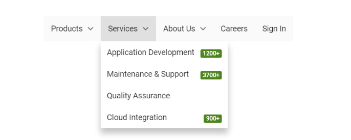

# DataSource Binding and Custom Items in Blazor Menu Bar Component

The [Blazor Menu Bar](https://www.syncfusion.com/blazor-components/blazor-menu-bar) supports data source bindings such as data source that can be structured as `Self-referential` data.

## Self-referential data

Menu Bar can be populated from self-referential data structure that contains data with `ParentId` mapping.

In the following example, the **id**, **pId**, and **text** columns from self-referential data have been mapped to the [ItemId](https://help.syncfusion.com/cr/blazor/Syncfusion.Blazor~Syncfusion.Blazor.Navigations.MenuFieldSettings~ItemId.html), [ParentId](https://help.syncfusion.com/cr/blazor/Syncfusion.Blazor~Syncfusion.Blazor.Navigations.MenuFieldSettings~ParentId.html), and [Text](https://help.syncfusion.com/cr/blazor/Syncfusion.Blazor~Syncfusion.Blazor.Navigations.MenuFieldSettings~Text.html) fields, respectively.

```cshtml

@using Syncfusion.Blazor.Navigations

<SfMenu Items="@MenuItems">
    <MenuEvents  TValue="MenuItemModel" OnOpen="onOpen"></MenuEvents>
    <MenuFieldSettings ItemId="Id" Text="Text" ParentId="ParentId"></MenuFieldSettings>
</SfMenu>

@code {

    private string eventName = "";
    public List<CustomMenuItem> MenuItems = new List<CustomMenuItem>
    {
        new CustomMenuItem{ Id = "parent1", Text = "Events" },
        new CustomMenuItem{ Id = "parent2", Text = "Movies" },
        new CustomMenuItem{ Id = "parent3", Text = "Directory" },
        new CustomMenuItem{ Id = "parent4", Text = "Queries", ParentId = "null"  },
        new CustomMenuItem{ Id = "parent5", Text = "Services", ParentId = "null" },
        new CustomMenuItem{ Id = "parent6", Text = "Conferences", ParentId = "parent1" },
        new CustomMenuItem{ Id = "parent7", Text = "Music", ParentId = "parent1" },
        new CustomMenuItem{ Id = "parent8", Text = "Workshops", ParentId = "parent1" },

        new CustomMenuItem{ Id = "parent9", Text = "Now Showing", ParentId = "parent2" },
        new CustomMenuItem{ Id = "parent10", Text = "Coming Soon", ParentId = "parent2" },

        new CustomMenuItem{ Id = "parent10", Text = "Media Gallery", ParentId = "parent3" },
        new CustomMenuItem{ Id = "parent11", Text = "Newsletters", ParentId = "parent3" },

        new CustomMenuItem{ Id = "parent12", Text = "Our Policy", ParentId = "parent4" },
        new CustomMenuItem{ Id = "parent13", Text = "Site Map", ParentId = "parent4" },
        new CustomMenuItem{ Id = "parent14", Text = "Pop", ParentId = "parent7" },
        new CustomMenuItem{ Id = "parent15", Text = "Folk", ParentId = "parent7" },
        new CustomMenuItem{ Id = "parent16", Text = "Classical", ParentId = "parent7" }

        };

    public class CustomMenuItem
    {
        public string Id { get; set; }
        public string Text { get; set; }
        public string ParentId { get; set; }
    }

    private void onOpen()
    {
        this.eventName = "OnOpen";
    }
}


```


N> In the above example, `TValue` is specified as `MenuItemModel` because the menu is rendered using the `Items` property.

## Custom Menu Bar Items

To customize Menu Bar items in your application, set your customized template using [MenuTemplates](https://help.syncfusion.com/cr/blazor/Syncfusion.Blazor~Syncfusion.Blazor.Navigations.MenuTemplates.html). In the following example, the Menu Bar has been rendered with customized Menu Bar items.

```cshtml

@using Syncfusion.Blazor.Navigations
@inject Microsoft.AspNetCore.Components.NavigationManager UriHelper;

<div class="menu-control">
    <SfMenu Items="@data">
        <MenuFieldSettings Text="Value" Children="Options"></MenuFieldSettings>
        <MenuTemplates TValue="CategoryModel">
            <Template>
                @{
                    var MenuItems = context;
                    if (MenuItems.Value != null && MenuItems.Count == null && MenuItems.Url == null)
                    {
                        <div>@MenuItems.Value</div>
                    }
                    else if (MenuItems.Value != null)
                    {
                        <div style="width: 100%;display: flex;justify-content: space-between;">
                            @{
                                if (MenuItems.Url != null)
                                {
                                    
                                }
                                <span style="width:100%;">@MenuItems.Value</span>
                                if (MenuItems.Count != null)
                                {
                                    <span class="e-badge e-badge-success">@MenuItems.Count</span>
                                }
                            }
                        </div>
                    }
                    else
                    {
                        <div tabindex="0" class="e-card">
                            <div class="e-card-header">
                                <div class="e-card-header-caption">
                                    <div class="e-card-header-title">About Us</div>
                                </div>
                            </div>
                            <div class="e-card-content">
                                @MenuItems.About
                            </div>
                            <div class="e-card-actions">
                                <input type="button" class="e-btn e-outline" style="pointer-events: auto;" value="Read More" />
                            </div>
                        </div>
                    }
                }
            </Template>
        </MenuTemplates>
    </SfMenu>
</div>
@code{
    private List<CategoryModel> data = new List<CategoryModel>
{
        new CategoryModel {
            Value = "Products",
            Options = new List<CategoryModel>
        {
                new CategoryModel { Value= "JavaScript", Url= "javascript" },
                new CategoryModel { Value= "Angular", Url= "angular" },
                new CategoryModel { Value= "ASP.NET Core", Url= "core" },
                new CategoryModel { Value= "ASP.NET MVC", Url= "mvc" }
            }
        },
        new CategoryModel {
            Value = "Services",
            Options = new List<CategoryModel>
        {
                new CategoryModel { Value= "Application Development", Count= "1200+" },
                new CategoryModel { Value= "Maintenance & Support", Count= "3700+" },
                new CategoryModel { Value= "Quality Assurance" },
                new CategoryModel { Value= "Cloud Integration", Count= "900+" }
            }
        },
        new CategoryModel {
            Value = "About Us",
            Options =  new List<CategoryModel>
    {
                new CategoryModel {
                    Id = "about",
                    About = "We are on a mission to provide world-class best software solutions for web, mobile and desktop platforms. Around 900+ applications are desgined and delivered to our customers to make digital & strengthen their businesses."
                }
            }
        },
        new CategoryModel { Value = "Careers" },
        new CategoryModel { Value = "Sign In" }
    };
    private class CategoryModel
    {
        public List<CategoryModel> Options { get; set; }
        public string Value { get; set; }
        public string Url { get; set; }
        public string Count { get; set; }
        public string About { get; set; }
        public string Id { get; set; }
    }
}
<style>
    .menu-control {
        margin-top: 45px;
        text-align: center;
    }
    /* Common ul & li styles */
    .mobile .e-menu-container ul.e-ul,
    .e-menu-container ul.e-ul {
        padding: 0;
    }

        .mobile .e-menu-container ul.e-ul .e-menu-item,
        .e-menu-container ul.e-ul .e-menu-item {
            display: flex;
            padding: 0 10px;
            outline-color: transparent;
        }
    /** Avatar customization */
    .e-menu-container ul .e-menu-item .e-avatar {
        background-color: inherit;
        font-size: 8px;
        margin-right: 8px;
        align-self: center;
        width: auto;
        overflow: visible;
    }

    .mobile .e-menu-container ul .e-menu-item .e-avatar {
        font-size: 10px;
    }
    /** Badge customization */
    .e-menu-container ul .e-menu-item .e-badge {
        margin-left: 10px;
        align-self: center;
        overflow: visible;
    }
    /** Card customization */
    .e-menu-container ul.e-ul .e-menu-item .e-card {
        width: 290px;
        font-size: inherit;
        background-color: inherit;
        border-color: transparent;
    }

    .mobile .e-menu-container ul.e-ul .e-menu-item .e-card {
        width: 320px;
    }

    .e-menu-container ul.e-ul .e-menu-item .e-card .e-card-content {
        white-space: normal;
        color: inherit;
        padding-top: 0;
        text-align: justify;
        font-size: inherit;
    }

    .e-menu-container ul.e-ul .e-menu-item#about {
        height: auto;
        padding: 0;
    }

        .e-menu-container ul.e-ul .e-menu-item#about.e-focused {
            background-color: transparent;
            outline-color: transparent;
            pointer-events: none;
        }

    .e-menu-container .e-ul .e-menu-item {
        height: 36px;
        line-height: 36px;
    }
</style>

```

