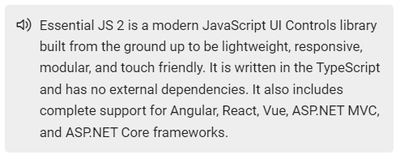

# Icons in Blazor Message

This section explains how to show or hide the close icon and add the custom severity icon to the message.

## Close Icon

The message can be rendered with or without the close icon. The close icon is used to hide the message, either by manually clicking the close icon or through keyboard interaction.

By default, the close icon is not rendered in the message. To show the close icon, set the `ShowCloseIcon` property to `true`.

In the following example, the messages are rendered with the close icon.




@using Syncfusion.Blazor.Notifications
@using Syncfusion.Blazor.Buttons

  

    <SfButton Content="Show Default Message" CssClass="@defaultBtnClass" OnClick="@defaultClick"></SfButton>
    <SfMessage ShowIcon="@defaultIcon" Closed="@defaultClosed" ShowCloseIcon="@defaultCloseIcon" @bind-Visible="@defaultVisible">Editing is restricted</SfMessage>
    <SfButton Content="Show Info Message" CssClass="@infoBtnClass" OnClick="@infoClick"></SfButton>
    <SfMessage Severity="MessageSeverity.Info" ShowIcon="@infoIcon" ShowCloseIcon="@infoCloseIcon" Closed="@infoClosed" @bind-Visible="@infoVisible">Please read the comments carefully</SfMessage>
    <SfButton Content="Show Success Message" CssClass="@successBtnClass" OnClick="@successClick"></SfButton>
    <SfMessage Severity="MessageSeverity.Success" ShowIcon="@successIcon" ShowCloseIcon="@successCloseIcon" Closed="@successClosed" @bind-Visible="@successVisible">Your message has been sent successfully</SfMessage>
    <SfButton Content="Show Warning Message" CssClass="@warningBtnClass" OnClick="@warningClick"></SfButton>
    <SfMessage Severity="MessageSeverity.Warning" ShowIcon="@warningIcon" ShowCloseIcon="@warningCloseIcon" Closed="warningClosed" @bind-Visible="@warningVisible">There was a problem with your network connection</SfMessage>
    <SfButton Content="Show Error Message" CssClass="@errorBtnClass" OnClick="@errorClick"></SfButton>
    <SfMessage Severity="MessageSeverity.Error" ShowIcon="@errorIcon" ShowCloseIcon="@errorCloseIcon" Closed="@errorClosed" @bind-Visible="@errorVisible">A problem has been occurred while submitting your data</SfMessage>
  

@code {
  private bool defaultIcon = true;
  private bool successIcon = true;
  private bool warningIcon = true;
  private bool infoIcon = true;
  private bool errorIcon = true;
  private bool defaultVisible = true;
  private bool successVisible = true;
  private bool warningVisible = true;
  private bool errorVisible = true;
  private bool infoVisible = true;
  private bool defaultCloseIcon = true;
  private bool successCloseIcon = true;
  private bool warningCloseIcon = true;
  private bool infoCloseIcon = true;
  private bool errorCloseIcon = true;
  private bool severityChecked = true;
  private bool closeIconChecked = true;
  private string defaultBtnClass = "e-outline e-primary msg-hidden";
  private string infoBtnClass = "e-outline e-primary e-info msg-hidden";
  private string successBtnClass = "e-outline e-primary e-success msg-hidden";
  private string warningBtnClass = "e-outline e-primary e-warning msg-hidden";
  private string errorBtnClass = "e-outline e-primary e-error msg-hidden";

  private void defaultClick()
  {
    this.defaultVisible = true;
    this.defaultBtnClass = "e-outline e-primary msg-hidden";
  }
  private void defaultClosed()
  {
    this.defaultBtnClass = "e-outline e-primary";
  }
  private void infoClick()
  {
    this.infoVisible = true;
    this.infoBtnClass = "e-outline e-primary e-info msg-hidden";
  }
  private void infoClosed()
  {
    this.infoBtnClass = "e-outline e-primary e-info";
  }
  private void successClick()
  {
    this.successVisible = true;
    this.successBtnClass = "e-outline e-primary e-success msg-hidden";
  }
  private void successClosed()
  {
    this.successBtnClass = "e-outline e-primary e-success";
  }
  private void warningClick()
  {
    this.warningVisible = true;
    this.warningBtnClass = "e-outline e-primary e-warning msg-hidden";
  }
  private void warningClosed()
  {
    this.warningBtnClass = "e-outline e-primary e-warning";
  }
  private void errorClick()
  {
    this.errorVisible = true;
    this.errorBtnClass = "e-outline e-primary e-error msg-hidden";
  }
  private void errorClosed()
  {
    this.errorBtnClass = "e-outline e-primary e-error";
  }
}

    



## Custom Icon

By default, the severity icons can be displayed according to the severity type to make the user more understandable by visual information rather than text. If the user wants to customize these icons, then it can be achieved through `CssClass` property.

The following example demonstrates how the default message is rendered with a custom severity icon and custom appearance.



@using Syncfusion.Blazor.Notifications

  

    <h4>Custom Message with Icon</h4>
    <SfMessage  CssClass="custom">Essential JS 2 is a modern JavaScript UI Controls library that has
      been built from the ground up to be lightweight, responsive, modular and touch friendly. It is written in TypeScript and has no external dependencies. It also includes complete support for Angular, React, Vue, ASP.NET MVC and ASP.NET Core frameworks.</SfMessage>
  

    



