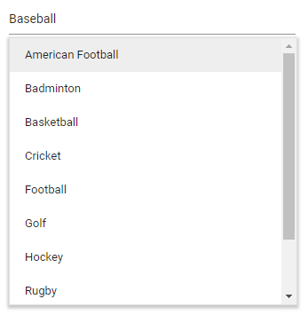

# Custom Value in Blazor MultiSelect Dropdown Component

The MultiSelect allows the user to select and tag the typed custom value that is not present in the data source when you set the [AllowCustomValue](https://help.syncfusion.com/cr/blazor/Syncfusion.Blazor.DropDowns.SfMultiSelect-1.html#Syncfusion_Blazor_DropDowns_SfMultiSelect_1_AllowCustomValue) as true. The selected custom value is added to the suggestion list alone. It will not affect the original data source. The `CustomValueSpecifier` event will trigger when you select or tag the typed custom value.

> The `Value` field, `Text` field, and `Value` property must be of `string` type when you enable the custom value. For other types, you must provide the custom data for the typed custom value in the `CustomValueSpecifier` event. Find the details on [Value as non-string type](https://blazor.syncfusion.com/documentation/multiselect-dropdown/custom-value#value-as-non-string-type) section.

```cshtml
@using Syncfusion.Blazor.DropDowns

<SfMultiSelect TValue="Games[]" TItem="Games" Placeholder="Favorite Sports" AllowCustomValue=true DataSource="@LocalData">
    <MultiSelectFieldSettings Text="Text" Value="ID"></MultiSelectFieldSettings>
</SfMultiSelect>

@code {
    public class Games
    {
        public string ID { get; set; }
        public string Text { get; set; }
    }
    List<Games> LocalData = new List<Games> {
    new Games() { ID= "Game1", Text= "American Football" },
    new Games() { ID= "Game2", Text= "Badminton" },
    new Games() { ID= "Game3", Text= "Basketball" },
    new Games() { ID= "Game4", Text= "Cricket" },
    new Games() { ID= "Game5", Text= "Football" },
    new Games() { ID= "Game6", Text= "Golf" },
    new Games() { ID= "Game7", Text= "Hockey" },
    new Games() { ID= "Game8", Text= "Rugby"},
    new Games() { ID= "Game9", Text= "Snooker" },
    new Games() { ID= "Game10", Text= "Tennis"},
    };
}
```



## Value as non-string type

By default, the typed custom value is updated to both the Value and Text field of the custom data. If the TValue type is a non-`string` type, then you have to provide the custom data for the typed custom value in the `CustomValueSpecifier` event.

In the `CustomValueSpecifier` event, you will get the typed custom value in the `Text` argument of the event. Based on that text value, you should form the data for the custom value and set it to the `NewData` argument of the event.

The following sample demonstrates configuration of custom value in `CustomValueSpecifier` event.

```cshtml
@using Syncfusion.Blazor.DropDowns
<SfMultiSelect TValue="int[]" TItem="Games" Placeholder="Favorite Sports" AllowCustomValue=true DataSource="@LocalData">
    <MultiSelectFieldSettings Text="Text" Value="ID"></MultiSelectFieldSettings>
    <MultiSelectEvents TValue="int[]" TItem="Games" CustomValueSpecifier="@CustomValueHandler"></MultiSelectEvents>
</SfMultiSelect>

@code {
    public class Games
    {
        public int ID { get; set; }
        public string Text { get; set; }
    }
    List<Games> LocalData = new List<Games> {
        new Games() { ID= 1, Text= "American Football" },
        new Games() { ID= 2, Text= "Badminton" },
        new Games() { ID= 3, Text= "Basketball" },
        new Games() { ID= 4, Text= "Cricket" },
        new Games() { ID= 5, Text= "Football" },
        new Games() { ID= 6, Text= "Golf" },
        new Games() { ID= 7, Text= "Hockey" },
        new Games() { ID= 8, Text= "Rugby"},
        new Games() { ID= 9, Text= "Snooker" },
        new Games() { ID= 10, Text= "Tennis"},
    };
    private void CustomValueHandler(CustomValueEventArgs<Games> args)
    {
        System.Random random = new System.Random();
        args.NewData = new Games() { ID = random.Next(100), Text = args.Text };
    }
}
```