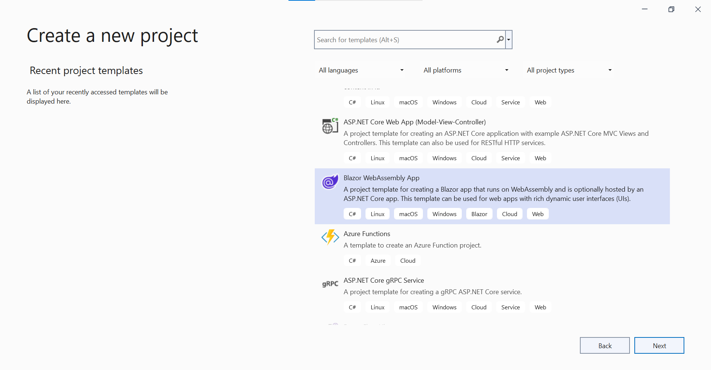
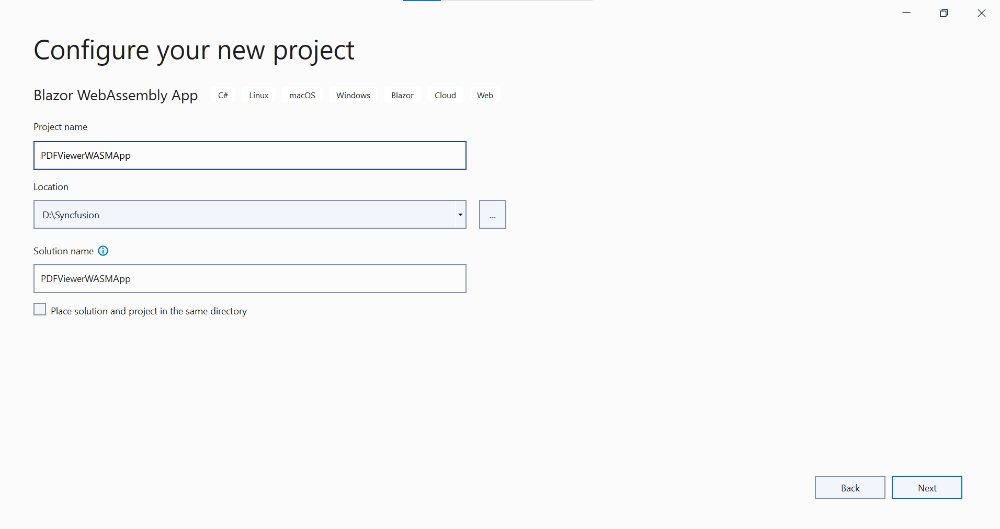

N> Syncfusion recommends using [Blazor PDF Viewer (NextGen)](https://blazor.syncfusion.com/documentation/pdfviewer-2/getting-started/server-side-application) Component which provides fast rendering of pages and improved performance. Also, there is no need of external Web service for processing the files and ease out the deployment complexity. It can be used in Blazor Server, WASM and MAUI applications without any changes.

# Getting Started with Blazor PDF Viewer Component in Blazor WASM App

This section briefly explains about how to include [Blazor PDF Viewer](https://www.syncfusion.com/blazor-components/blazor-pdf-viewer) component in your Blazor WebAssembly (WASM) App using Visual Studio.

## Prerequisites

* [System requirements for Blazor components](https://blazor.syncfusion.com/documentation/system-requirements)

## Integrate PDF Viewer into Blazor WebAssembly App

1. Start Visual Studio and select **Create a new project**.
2. For a Blazor WebAssembly experience, choose the **Blazor WebAssembly App** template and select **Next**.

3. Provide a **Project name** and confirm that the *Location* is correct. Select **Next**.

4. In **Additional information dialog**, set target framework.


## Install Blazor PDFViewer NuGet and Themes package in WASM App

To add Blazor PDF Viewer component in Blazor WebAssembly App, use `SfPdfViewer` component in [Syncfusion.Blazor.PdfViewer](https://www.nuget.org/packages/Syncfusion.Blazor.PdfViewer) and  [Syncfusion.Blazor.Themes](https://www.nuget.org/packages/Syncfusion.Blazor.Themes/). Alternatively, you can utilize the following package manager command to achieve the same.




Install-Package Syncfusion.Blazor.PdfViewer -Version {{ site.releaseversion }}

Install-Package Syncfusion.Blazor.Themes -Version {{ site.releaseversion }}




N> This component requires server-side processing to render the PDF files through web service

## Register Syncfusion Blazor Service

Open **~/_Imports.razor** file and import the **Syncfusion.Blazor** and **Syncfusion.Blazor.PdfViewerServer** namespaces.




@using Syncfusion.Blazor
@using Syncfusion.Blazor.PdfViewerServer




Now, register the Syncfusion Blazor Service in the **~/Program.cs** file of your Blazor WebAssembly App.




using Microsoft.AspNetCore.Components.Web;
using Microsoft.AspNetCore.Components.WebAssembly.Hosting;
using Syncfusion.Blazor;

var builder = WebAssemblyHostBuilder.CreateDefault(args);
builder.RootComponents.Add<App>("#app");
builder.RootComponents.Add<HeadOutlet>("head::after");

builder.Services.AddScoped(sp => new HttpClient { BaseAddress = new Uri(builder.HostEnvironment.BaseAddress) });

builder.Services.AddSyncfusionBlazor();
await builder.Build().RunAsync();
....




## Add stylesheet and script resources

The theme stylesheet and script can be accessed from NuGet through [Static Web Assets](https://blazor.syncfusion.com/documentation/appearance/themes#static-web-assets). Reference the stylesheet and script in the `<head>` of the main page as follows:

* For Blazor WebAssembly app, include it in the **~/index.html** file.

```html
<head>
    ....
    <link href="_content/Syncfusion.Blazor.Themes/bootstrap5.css" rel="stylesheet" />
    <script src="_content/Syncfusion.Blazor.PdfViewer/scripts/syncfusion-blazor-pdfviewer.min.js" type="text/javascript"></script>
</head>
```

N> Check out the [Blazor Themes](https://blazor.syncfusion.com/documentation/appearance/themes) topic to discover various methods ([Static Web Assets](https://blazor.syncfusion.com/documentation/appearance/themes#static-web-assets), [CDN](https://blazor.syncfusion.com/documentation/appearance/themes#cdn-reference), and [CRG](https://blazor.syncfusion.com/documentation/common/custom-resource-generator)) for referencing themes in your Blazor application. Also, check out the [Adding Script Reference](https://blazor.syncfusion.com/documentation/common/adding-script-references) topic to learn different approaches for adding script references in your Blazor application.

## Add Blazor PDF Viewer Component

Add the Syncfusion PDF Viewer component in the **~/Pages/Index.razor** file.




<SfPdfViewer DocumentPath="PDF_Succinctly.pdf" ServiceUrl="https://ej2services.syncfusion.com/production/web-services/api/pdfviewer" Height="500px" Width="1060px"></SfPdfViewer>




N> [View Sample in GitHub](https://github.com/SyncfusionExamples/blazor-pdf-viewer-examples/tree/master/Getting%20Started/Client-side%20application).

## Server side processing

Since Syncfusion PDF Viewer (Blazor WebAssembly) component depends on server-side processing to render the PDF files, it is mandatory to create a web service as mentioned [here](https://support.syncfusion.com/kb/article/8997/how-to-create-pdf-viewer-web-service-application-in-aspnet-core).

N> [View web service sample in GitHub](https://github.com/SyncfusionExamples/EJ2-PDFViewer-WebServices)

* Press <kbd>Ctrl</kbd>+<kbd>F5</kbd> (Windows) or <kbd>⌘</kbd>+<kbd>F5</kbd> (macOS) to launch the application. This will render the Syncfusion Blazor PDF Viewer component in your default web browser.


N> [View Sample in GitHub](https://github.com/SyncfusionExamples/Blazor-Getting-Started-Examples/tree/main/PDFViewer).

## Load the desired PDF at initial loading and change the document path at runtime

You can load your PDF document for initial loading as well as change the document at run-time in PDF Viewer WebAssembly projects. To achieve that, you need to create the web services and add your documents to that web service project. Then mention that web service localhost path as the service URL in your web assembly project.

Refer,[How to create PDF Viewer Web Service](https://support.syncfusion.com/kb/article/9766/how-to-create-pdf-viewer-web-service-in-net-core-31-and-above).

```cshtml
@using Syncfusion.Blazor.Buttons
@using Syncfusion.Blazor.PdfViewer
@using System.Web
@inject HttpClient Http

<SfButton OnClick="LoadAnotherDocument">Load Another Document</SfButton>

<!--ServiceUrl must be the webservice output path and you have to run the webservice first to get the serviceurl. Also it should be in runnable state-->
<SfPdfViewer DocumentPath="@DocumentPath"
             ServiceUrl="https://localhost:5001/pdfviewer"
             Height="500px" Width="1060px"></SfPdfViewer>

@code
{
    SfPdfViewer PdfViewer;

    //Sets the PDF document path for initial loading.
    private string DocumentPath { get; set; } = "PDF Succinctly.pdf";

    private async Task LoadAnotherDocument()
    {
        //Sends a GET request to a specified Uri and return the response body as a byte array.
        byte[] byteArray = await Http.GetByteArrayAsync("Data/FormFillingDocument.pdf");
        //Converts the byte array into base64 string.
        string base64String = Convert.ToBase64String(byteArray);
        //Sets the base64 string as document path for the PDF Viewer.
        DocumentPath = "data:application/pdf;base64," + base64String;
    }
}
```

N> [View sample in GitHub](https://github.com/SyncfusionExamples/blazor-pdf-viewer-examples/tree/master/Load%20and%20Save/Load%20a%20PDF%20file%20using%20local%20service).
