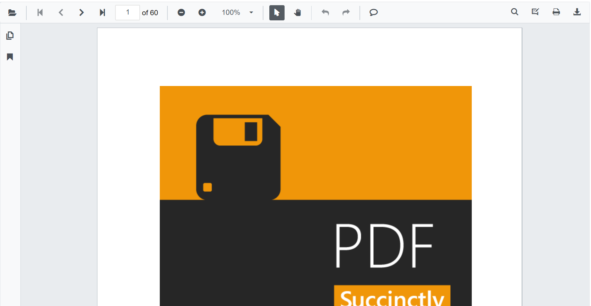

# Getting Started with Blazor PDF Viewer Component in Blazor WASM App

Syncfusion provides separate PDF Viewer component for Blazor Server and Blazor WebAssembly applications.

> For Blazor WebAssembly App, use [SfPdfViewer](https://help.syncfusion.com/cr/blazor/Syncfusion.Blazor.PdfViewer.SfPdfViewer.html) component in Syncfusion.Blazor.PdfViewer NuGet package. This component requires server-side processing to render the PDF files through web service.

> For Blazor Server App, use the [SfPdfViewerServer](https://help.syncfusion.com/cr/blazor/Syncfusion.Blazor.PdfViewerServer.SfPdfViewerServer.html) component in corresponding NuGet based on the operating system of the server you intend to host, as shown below.,
> *	For Windows, use Syncfusion.Blazor.PdfViewerServer.Windows
> * For Linux, use [Syncfusion.Blazor.PdfViewerServer.Linux](https://www.nuget.org/packages/Syncfusion.Blazor.PdfViewerServer.Linux)
> * For Mac (OSX), use [Syncfusion.Blazor.PdfViewerServer.OSX](https://www.nuget.org/packages/Syncfusion.Blazor.PdfViewerServer.OSX)

This section briefly explains about how to include [Blazor PDF Viewer](https://www.syncfusion.com/blazor-components/blazor-pdf-viewer) component in your Blazor WebAssembly (WASM) App using Visual Studio.

## Prerequisites

* [System requirements for Blazor components](https://blazor.syncfusion.com/documentation/system-requirements)

## Create a new Blazor App in Visual Studio

You can create **Blazor WebAssembly App** using Visual Studio in one of the following ways,

* [Create a Project using Microsoft Templates](https://docs.microsoft.com/en-us/aspnet/core/blazor/tooling?pivots=windows)

* [Create a Project using Syncfusion Blazor Extension](https://blazor.syncfusion.com/documentation/visual-studio-integration/vs2019-extensions/create-project)

## Install Syncfusion Blazor PDFViewer NuGet in the App

Syncfusion Blazor components are available in [nuget.org](https://www.nuget.org/packages?q=syncfusion.blazor). To use Syncfusion Blazor components in the application, add reference to the corresponding NuGet. Refer to [NuGet packages topic](https://blazor.syncfusion.com/documentation/nuget-packages) for available NuGet packages list with component details.

To add Blazor PDF Viewer component in the app, open the NuGet package manager in Visual Studio (*Tools → NuGet Package Manager → Manage NuGet Packages for Solution*), search for [Syncfusion.Blazor.PDFViewer](https://www.nuget.org/packages/Syncfusion.Blazor.PDFViewer) and then install it.

## Register Syncfusion Blazor Service

Open **~/_Imports.razor** file and import the Syncfusion.Blazor namespace.




@using Syncfusion.Blazor




Now, register the Syncfusion Blazor Service in the Blazor WebAssembly App. Here, Syncfusion Blazor Service is registered by setting [IgnoreScriptIsolation](https://help.syncfusion.com/cr/blazor/Syncfusion.Blazor.GlobalOptions.html#Syncfusion_Blazor_GlobalOptions_IgnoreScriptIsolation) property as true to load the scripts externally in the [next steps](#add-script-reference).

* Open **~/Program.cs** file and register the Syncfusion Blazor Service in the client web app.




using Microsoft.AspNetCore.Components.Web;
using Microsoft.AspNetCore.Components.WebAssembly.Hosting;
using Syncfusion.Blazor;

var builder = WebAssemblyHostBuilder.CreateDefault(args);
builder.RootComponents.Add<App>("#app");
builder.RootComponents.Add<HeadOutlet>("head::after");

builder.Services.AddScoped(sp => new HttpClient { BaseAddress = new Uri(builder.HostEnvironment.BaseAddress) });

builder.Services.AddSyncfusionBlazor(options => { options.IgnoreScriptIsolation = true; });
await builder.Build().RunAsync();
....





using Syncfusion.Blazor;

namespace WebApplication1
{
    public class Program
    {
        public static async Task Main(string[] args)
        {
            ....
            builder.Services.AddSyncfusionBlazor(options => { options.IgnoreScriptIsolation = true; });
            await builder.Build().RunAsync();
        }
    }
}




## Add Style Sheet

Checkout the [Blazor Themes topic](https://blazor.syncfusion.com/documentation/appearance/themes) to learn different ways ([Static Web Assets](https://blazor.syncfusion.com/documentation/appearance/themes#static-web-assets), [CDN](https://blazor.syncfusion.com/documentation/appearance/themes#cdn-reference) and [CRG](https://blazor.syncfusion.com/documentation/common/custom-resource-generator)) to refer themes in Blazor application, and to have the expected appearance for Syncfusion Blazor components. Here, the theme is referred using [Static Web Assets](https://blazor.syncfusion.com/documentation/appearance/themes#static-web-assets).

To add theme to the app, open the NuGet package manager in Visual Studio (*Tools → NuGet Package Manager → Manage NuGet Packages for Solution*), search for [Syncfusion.Blazor.Themes](https://www.nuget.org/packages/Syncfusion.Blazor.Themes/) and then install it. Then, the theme style sheet from NuGet can be referred as follows,

Refer the theme style sheet from NuGet in the `<head>` of **wwwroot/index.html** file in the client web app.




<head>
    <link href="_content/Syncfusion.Blazor.Themes/bootstrap5.css" rel="stylesheet" />
</head>




## Add Script Reference

Checkout [Adding Script Reference topic](https://blazor.syncfusion.com/documentation/common/adding-script-references) to learn different ways to add script reference in Blazor Application. In this getting started walk-through, the required scripts are referred using [Static Web Assets](https://blazor.syncfusion.com/documentation/common/adding-script-references#static-web-assets) externally inside the `<head>` as follows,

Refer script in the `<head>` of the **~/index.html** file.




<head>
    ....
    <link href="_content/Syncfusion.Blazor.Themes/bootstrap5.css" rel="stylesheet" />
    
    
</head>




> Syncfusion recommends to reference scripts using [Static Web Assets](https://blazor.syncfusion.com/documentation/common/adding-script-references#static-web-assets), [CDN](https://blazor.syncfusion.com/documentation/common/adding-script-references#cdn-reference) and [CRG](https://blazor.syncfusion.com/documentation/common/custom-resource-generator) by [disabling JavaScript isolation](https://blazor.syncfusion.com/documentation/common/adding-script-references#disable-javascript-isolation) for better loading performance of the Blazor application.

## Add Blazor PDF Viewer Component

* Open **~/_Imports.razor** file or any other page under the `~/Pages` folder where the component is to be added and import the **Syncfusion.Blazor.PdfViewer** namespace.




@using Syncfusion.Blazor
@using Syncfusion.Blazor.PdfViewer




* Now, add the Syncfusion PDF Viewer component in razor file. Here, the PDF Viewer component is added in the **~/Pages/Index.razor** file under the **~/Pages** folder.




<SfPdfViewer DocumentPath="PDF_Succinctly.pdf" ServiceUrl="https://ej2services.syncfusion.com/production/web-services/api/pdfviewer" Height="500px" Width="1060px"></SfPdfViewer>




> Since Syncfusion PDF Viewer (Blazor WebAssembly) component depends on server-side processing to render the PDF files, it is mandatory to create a web service as mentioned [here](https://www.syncfusion.com/kb/10346/how-to-create-pdf-viewer-web-service-application-in-asp-net-core)

* Press <kbd>Ctrl</kbd>+<kbd>F5</kbd> (Windows) or <kbd>⌘</kbd>+<kbd>F5</kbd> (macOS) to run the application. Then, the Syncfusion `Blazor PDF Viewer` component will be rendered in the default web browser.

Download the WebAssembly application from [here](https://www.syncfusion.com/downloads/support/directtrac/general/ze/BlazorWebAssembly-2083554717.zip).

> You can refer to the [Blazor PDF Viewer](https://www.syncfusion.com/blazor-components/blazor-pdf-viewer) feature tour page for its groundbreaking feature representations. You can also explore the [Blazor PDF Viewer example](https://blazor.syncfusion.com/demos/pdf-viewer/default-functionalities?theme=bootstrap4) to understand how to explain core features of PDF Viewer.