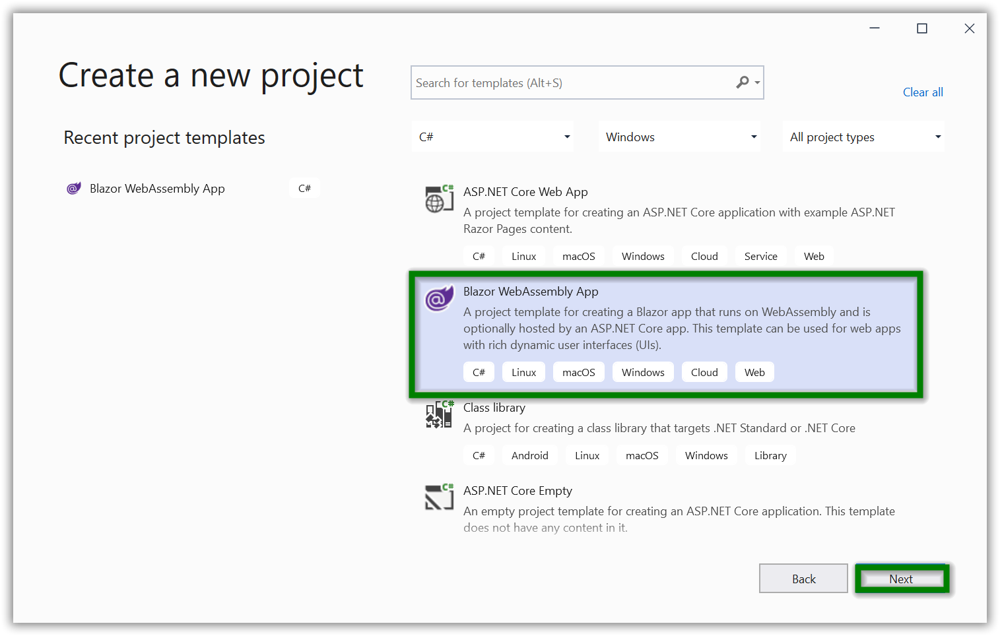
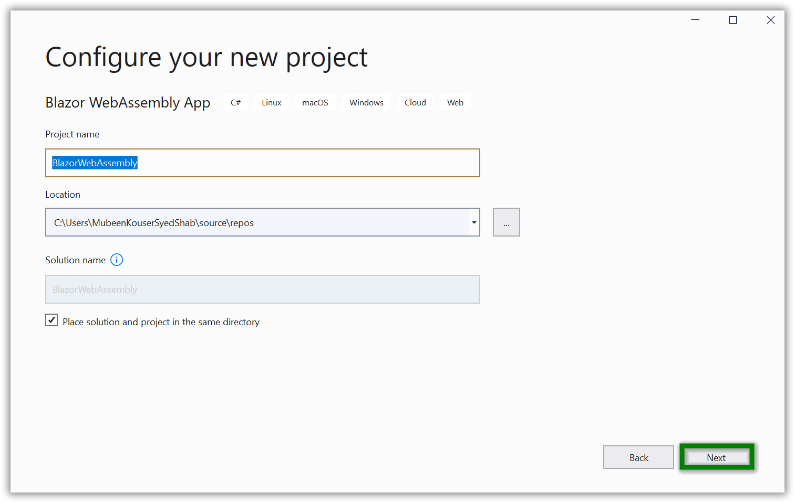
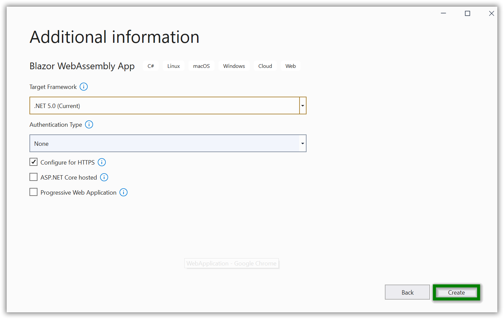

# WebAssembly application in Blazor PDF Viewer Component

>Note: There is a separate PDF Viewer component for Blazor server-side and Blazor WebAssembly applications.
>* The `SfPdfViewerServer` control is for Blazor server-side application. This control resides with Syncfusion.Blazor.PdfViewerServer.Windows NuGet package. This server-side control is highly recommended.
>* The `SfPdfViewer` control is for Blazor WebAssembly application. This control requires server-side processing to render the PDF files through web service. It resides with Syncfusion.Blazor.PdfViewer NuGet package.

**Step 1:** Choose **Create a new project** from the Visual Studio dashboard. Click Next.


**Step 2:** Select **Blazor WebAssembly App** from the template, and then click **Next** button..



**Step 3:** Now, the project configuration window will popup. Click **Next** button to modify the additional information.

 

 **Step 4:** Select the target Framework **.NET 5.0** at the top of the Application based on your required target and then click **Create** button to create a new Blazor WebAssembly application.

  

**Step 5:** Installing Syncfusion Blazor packages in the application

You can use any one of the below standard to install the Syncfusion Blazor library in your application.

* **Using Syncfusion Blazor individual NuGet Packages [New standard]**

> Starting with Volume 4, 2020 (v18.4.0.30) release, Syncfusion provides [individual NuGet packages](https://blazor.syncfusion.com/documentation/nuget-packages/) for our Syncfusion Blazor components. We highly recommend this new standard for your Blazor production applications. Refer to [this section](https://blazor.syncfusion.com/documentation/nuget-packages/#benefits-of-using-individual-nuget-packages) to know the benefits of the individual NuGet packages.

1. Install **Syncfusion.Blazor.PdfViewer** NuGet package to the new application using the `NuGet Package Manager`. For more details about available NuGet packages, refer to the [Individual NuGet Packages](https://blazor.syncfusion.com/documentation/nuget-packages/) documentation.

2. Right-click the project,and then select `Manage NuGet Packages`.

    

3. Search **Syncfusion.Blazor.PdfViewer** keyword in the Browse tab and install **Syncfusion.Blazor.PdfViewer** NuGet package in the application.

    

4. The Syncfusion Blazor PdfViewer package will be included in the newly created project once the installation process is completed.

* **Using Syncfusion.Blazor NuGet Package [Old standard]**

W> If you prefer the above new standard (individual NuGet packages), then skip this section. Using both old and new standards in the same application will throw ambiguous compilation errors.

1. Now, install **Syncfusion.Blazor** NuGet package to the newly created application by using the `NuGet Package Manager`. Right-click the project and then select Manage NuGet Packages.

    

2. Search **Syncfusion.Blazor** keyword in the Browse tab and install **Syncfusion.Blazor** NuGet package in the application.

    

3. The Syncfusion Blazor package will be installed in the project once the installation process is completed.

**Step 6:** Open **~/_Imports.razor** file and import the `Syncfusion.Blazor.PdfViewer` when new standard is followed or import the `Syncfusion.Blazor` namespace when old standard is followed.

```csharp
@using Syncfusion.Blazor.PdfViewer
```

(or)

```csharp
@using Syncfusion.Blazor
```

**Step 7:** Add the Syncfusion bootstrap4 theme in the `<head>` element of the **~/wwwroot/index.html** page.

When `Syncfusion.Blazor.PdfViewer` is used, use the following code.

```html
<head>
    ....
    ....
        <link href="_content/Syncfusion.Blazor.Themes/bootstrap4.css" rel="stylesheet" />
</head>
```

When `Syncfusion.Blazor` is used, use the following code.

```html
<head>
    ....
    ....
        <link href="_content/Syncfusion.Blazor/styles/bootstrap4.css" rel="stylesheet" />
</head>
```

> **Note:** The same theme file can be referred through the CDN version by using [https://cdn.syncfusion.com/blazor/{{ site.blazorversion }}/styles/bootstrap4.css](https://cdn.syncfusion.com/blazor/{{ site.blazorversion }}/styles/bootstrap4.css).

For **Internet Explorer 11** kindly refer the polyfills. Refer the [documentation](https://blazor.syncfusion.com/documentation/common/how-to/render-blazor-server-app-in-ie/) for more information.

```html
<head>
    <link href="https://cdn.syncfusion.com/blazor/{{ site.blazorversion }}/styles/bootstrap4.css" rel="stylesheet" />
    <script src="https://github.com/Daddoon/Blazor.Polyfill/releases/download/3.0.1/blazor.polyfill.min.js"></script>
</head>
```

**Step 8:** Open the **~/Program.cs** file and register the Syncfusion Blazor Service.

```csharp
using Syncfusion.Blazor;

namespace BlazorWebAssembly
{
    public class Program
    {
        public static async Task Main(string[] args)
        {
            ....
            ....
            builder.Services.AddSyncfusionBlazor();
            await builder.Build().RunAsync();
        }
    }
}
```

We can disable the dynamic script loading and refer to the scripts from the application end by using the `IgnoreScriptIsolation` parameter in `AddSyncfusionBlazor()` at the `program.cs`. For more details, please refer here for [how to refer custom/CDN resources](../common/custom-resource-generator/#how-to-use-custom-resources-in-the-blazor-application).

**Step 9:** Now, add the PDF Viewer (WebAssembly) component to the **~/Pages/Index.razor** page.

```csharp
@using Syncfusion.Blazor.PdfViewer

<SfPdfViewer DocumentPath="PDF_Succinctly.pdf" ServiceUrl="https://ej2services.syncfusion.com/production/web-services/api/pdfviewer" Height="500px" Width="1060px"></SfPdfViewer>
```

> Since Syncfusion PDF Viewer (Blazor WebAssembly) control depends on server-side processing to render the PDF files, it is mandatory to create a web service as mentioned [here](https://www.syncfusion.com/kb/10346/how-to-create-pdf-viewer-web-service-application-in-asp-net-core)

**Step 10:** Run the application, the PDF Viewer component will be rendered in the web browser as shown in the following screenshot.


Download the WebAssembly application from [here](https://www.syncfusion.com/downloads/support/directtrac/general/ze/BlazorWebAssembly-2083554717.zip)

> You can refer to our [Blazor PDF Viewer](https://www.syncfusion.com/blazor-components/blazor-pdf-viewer) feature tour page for its groundbreaking feature representations. You can also explore our [Blazor PDF Viewer example](https://blazor.syncfusion.com/demos/pdf-viewer/default-functionalities?theme=bootstrap4) to understand how to explains core features of PDF Viewer.