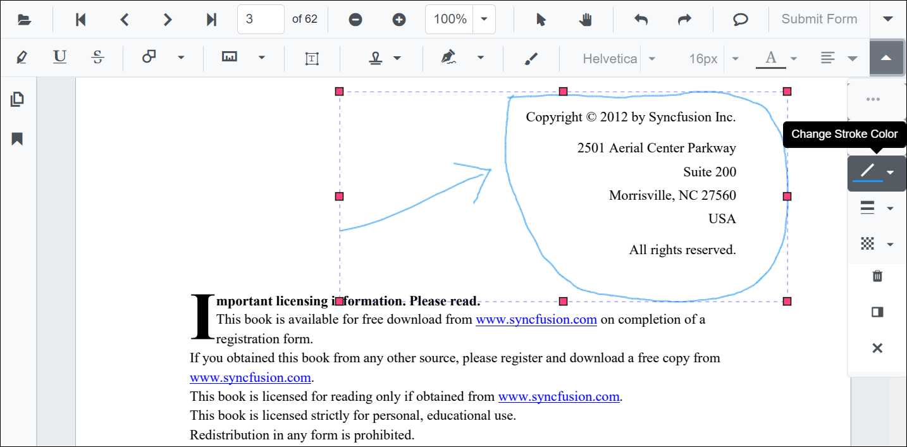

# Ink Annotation in the Blazor SfPdfViewer2 component

The SfPdfViewer2 control provides the options to add, edit, and delete the ink annotations.


## Adding an ink annotation to the PDF document

The ink annotations can be added to the PDF document using the annotation toolbar.

* Click the **Edit Annotation** button in the SfPdfViewer2 toolbar. A toolbar appears below it.
* Select the **Draw Ink** button in the annotation toolbar. It enables the ink annotation mode.
* You can draw anything over the pages of the PDF document.


```csharp
@using Syncfusion.Blazor.Buttons
@using Syncfusion.Blazor.SfPdfViewer

<SfButton OnClick="OnClick">Ink Annotation</SfButton>
<SfPdfViewer2 @ref="viewer" DocumentPath=@DocumentPath Height="100%" Width="100%" ></SfPdfViewer2>

@code {
    SfPdfViewer2 viewer;
    private string DocumentPath { get; set; } = "wwwroot/Data/PDF_Succinctly.pdf";

    public void OnClick(MouseEventArgs args)
    {
        viewer.SetAnnotationMode(AnnotationType.Ink);
    }
}
```

## Editing the properties of the ink annotation

The stroke color, thickness, and opacity of the ink annotation can be edited using the Edit stroke color tool, Edit thickness tool, and Edit opacity tool in the annotation toolbar.

### Editing stroke color

The stroke color of the annotation can be edited using the color palette provided in the Edit Stroke Color tool.



### Editing thickness

The thickness of the border of the annotation can be edited using the range slider provided in the Edit Thickness tool.


### Editing opacity

The opacity of the annotation can be edited using the range slider provided in the Edit Opacity tool.


## Setting default properties during the control initialization

The properties of the ink annotation can be set before creating the control using the InkAnnotationSettings.

After editing the default values, they will be changed to the selected values.

```csharp

@using Syncfusion.Blazor.SfPdfViewer

<SfPdfViewer2 @ref="viewer" DocumentPath=@DocumentPath Height="100%" Width="100%" InkAnnotationSettings="@InkAnnotationSettings">
</SfPdfViewer2>

@code {
    SfPdfViewer2 viewer;
    private string DocumentPath { get; set; } = "wwwroot/Data/PDF_Succinctly.pdf";

    PdfViewerInkAnnotationSettings InkAnnotationSettings = new PdfViewerInkAnnotationSettings 
    { 
        Author = "Syncfusion", 
        StrokeColor = "green", 
        Thickness = 3, 
        Opacity = 0.6 
    };
}
```