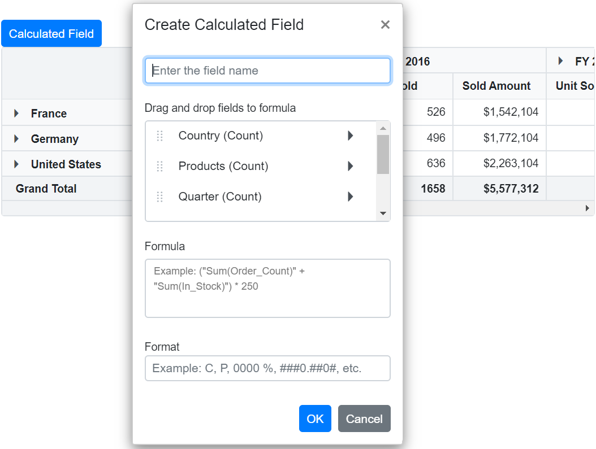
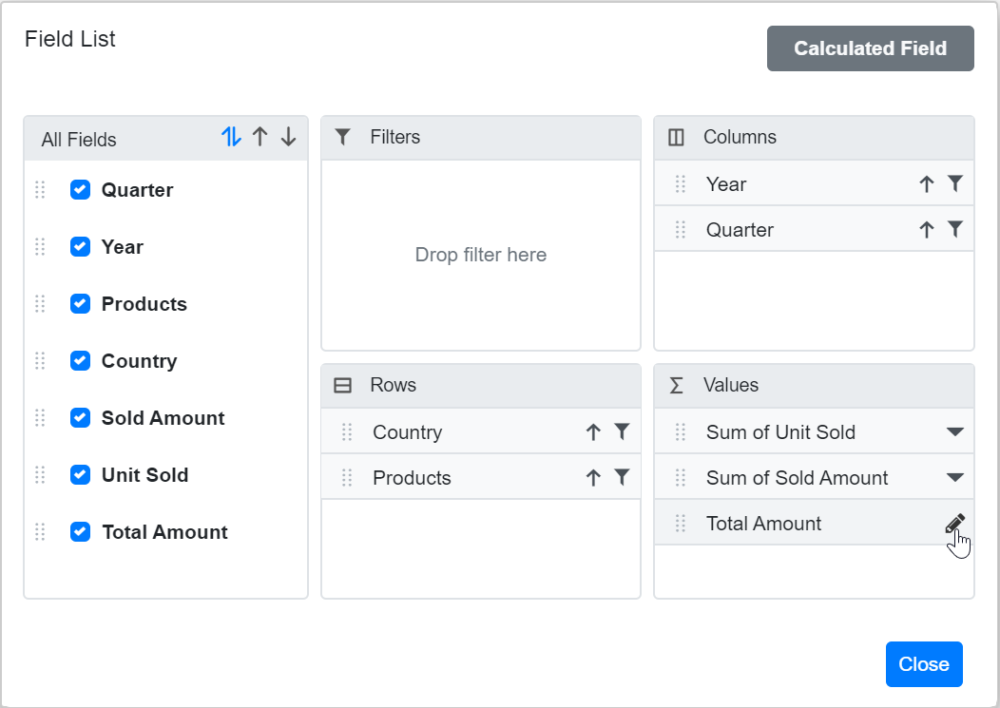
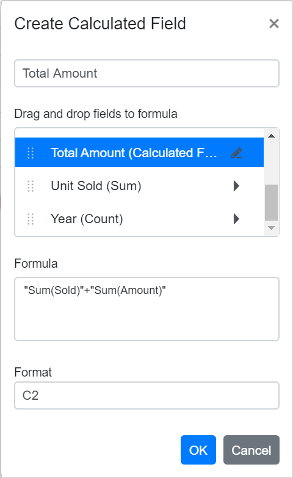
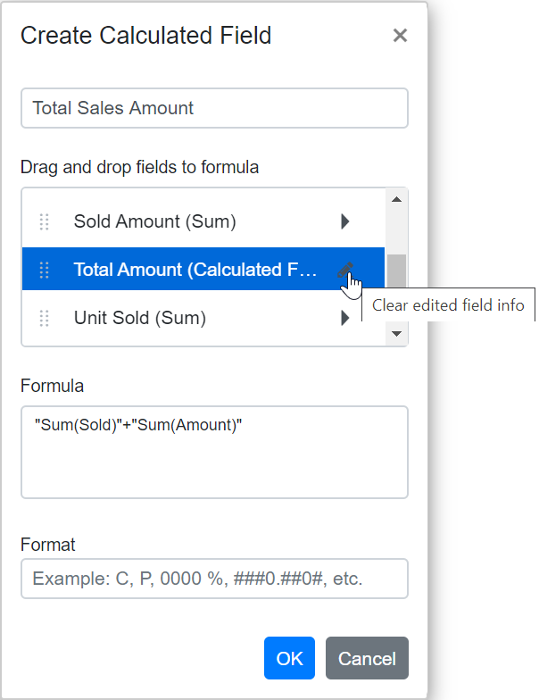
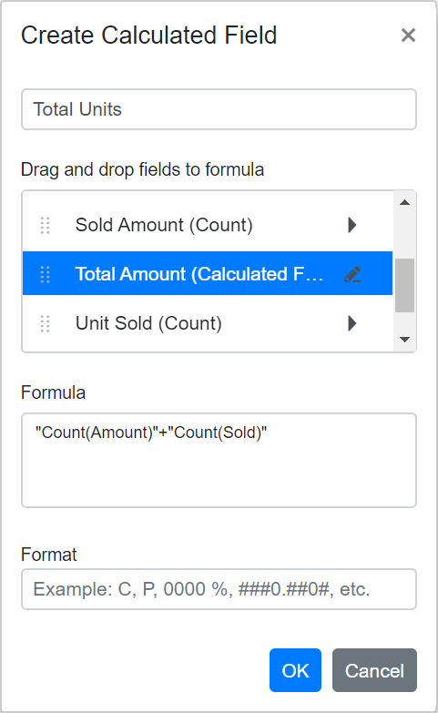
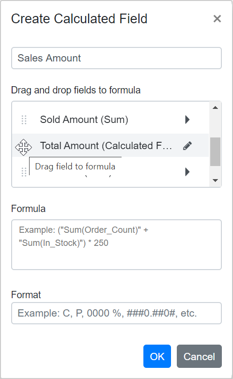
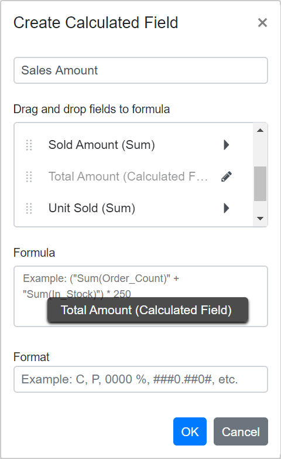
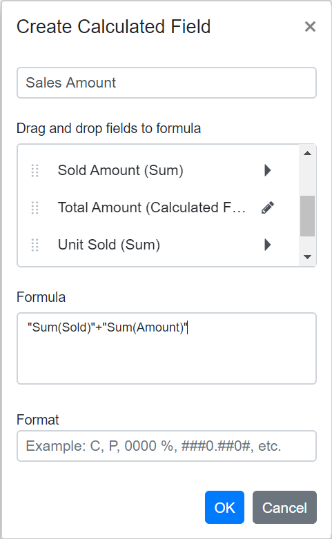
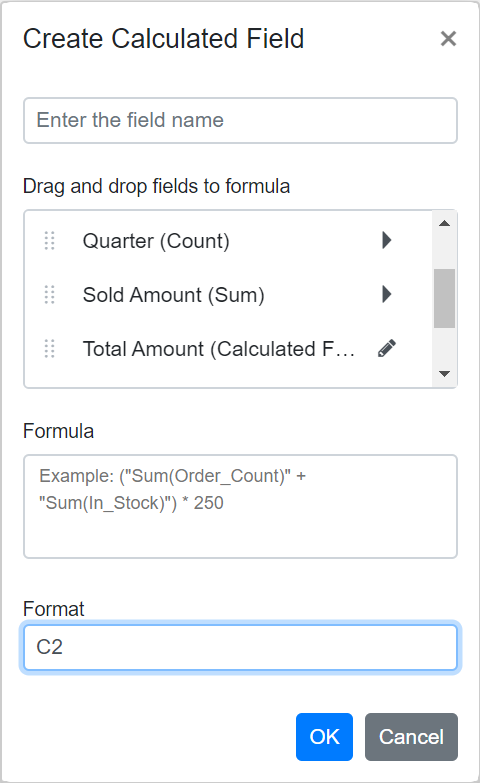

# Calculated Field in Blazor Pivot Table Component

Allows end user to create a new calculated field in the pivot table, based on available fields from the bound data source or using simple formula with basic arithmetic operators. It can be added at runtime through the built-in dialog, invoked from Field List UI. To do so, set the [`AllowCalculatedField`](https://help.syncfusion.com/cr/blazor/Syncfusion.Blazor.PivotView.SfPivotView-1.html#Syncfusion_Blazor_PivotView_SfPivotView_1_AllowCalculatedField) property in [`SfPivotView`](https://help.syncfusion.com/cr/blazor/Syncfusion.Blazor.PivotView.SfPivotView-1.html) class to **true** in the pivot table. End user can now see a "CALCULATED FIELD" button enabled in Field List UI automatically, which on clicking will invoke the calculated field dialog and perform necessary operation.

Calculated field can also be included in the pivot table through code behind using the [`PivotViewCalculatedFieldsSettings`](https://help.syncfusion.com/cr/blazor/Syncfusion.Blazor.PivotView.PivotViewCalculatedFieldSetting.html) class. The required properties to create a new calculate field are:
* [`Name`](https://help.syncfusion.com/cr/blazor/Syncfusion.Blazor.PivotView.PivotViewCalculatedFieldSetting.html#Syncfusion_Blazor_PivotView_PivotViewCalculatedFieldSetting_Name): It allows to indicate the calculated field with a unique name.
* [`Formula`](https://help.syncfusion.com/cr/blazor/Syncfusion.Blazor.PivotView.PivotViewCalculatedFieldSetting.html#Syncfusion_Blazor_PivotView_PivotViewCalculatedFieldSetting_Formula): It allows to set the formula.
* [`Format`](https://help.syncfusion.com/cr/blazor/Syncfusion.Blazor.PivotView.FormatSettingsModel.html#Syncfusion_Blazor_PivotView_FormatSettingsModel_Format):  It helps to set the number format for the resultant value.

> The calculated field is applicable only for value fields. Also, calculated field created through code behind will be automatically listed in the UI dialog as well.

```cshtml
@using Syncfusion.Blazor.PivotView

<SfPivotView TValue="ProductDetails" ShowFieldList="true" AllowCalculatedField="true">
     <PivotViewDataSourceSettings DataSource="@data">
        <PivotViewColumns>
            <PivotViewColumn Name="Year"></PivotViewColumn>
            <PivotViewColumn Name="Quarter"></PivotViewColumn>
        </PivotViewColumns>
        <PivotViewRows>
            <PivotViewRow Name="Country"></PivotViewRow>
            <PivotViewRow Name="Products"></PivotViewRow>
        </PivotViewRows>
        <PivotViewValues>
            <PivotViewValue Name="Sold" Caption="Unit Sold"></PivotViewValue>
            <PivotViewValue Name="Amount" Caption="Sold Amount"></PivotViewValue>
            <PivotViewValue Name="Total" Caption="Total Amount" Type=SummaryTypes.CalculatedField></PivotViewValue>
        </PivotViewValues>
        <PivotViewFormatSettings>
            <PivotViewFormatSetting Name="Amount" Format="C"></PivotViewFormatSetting>
            <PivotViewFormatSetting Name="Total" Format="C"></PivotViewFormatSetting>
        </PivotViewFormatSettings>
         <PivotViewCalculatedFieldSettings>
            <PivotViewCalculatedFieldSetting Name="Total" Formula="@totalPrice"></PivotViewCalculatedFieldSetting>
        </PivotViewCalculatedFieldSettings>
    </PivotViewDataSourceSettings>
</SfPivotView>

@code{
    public string totalPrice = "\"" + "Sum(Amount)" + "\"" + "+" + "\"" + "Sum(Sold)" + "\"";
    public List<ProductDetails> data { get; set; }
    protected override void OnInitialized()
    {
        this.data = ProductDetails.GetProductData().ToList();
        //Bind the data source collection here. Refer "Assigning sample data to the pivot table" section in getting started for more details.
    }
}

```


Meanwhile, user can also view calculated field dialog in UI by invoking [`CreateCalculatedFieldDialogAsync`](https://help.syncfusion.com/cr/blazor/Syncfusion.Blazor.PivotView.SfPivotView-1.html#Syncfusion_Blazor_PivotView_SfPivotView_1_CreateCalculatedFieldDialog) method on an external button click which is shown in the below code sample.

```cshtml
@using Syncfusion.Blazor.PivotView
@using Syncfusion.Blazor.Buttons

<SfButton OnClick="@calc" IsPrimary="true">Calculated Field</SfButton>

<SfPivotView TValue="ProductDetails" @ref="pivot" AllowCalculatedField="true">
     <PivotViewDataSourceSettings DataSource="@data">
        <PivotViewColumns>
            <PivotViewColumn Name="Year"></PivotViewColumn>
            <PivotViewColumn Name="Quarter"></PivotViewColumn>
        </PivotViewColumns>
        <PivotViewRows>
            <PivotViewRow Name="Country"></PivotViewRow>
            <PivotViewRow Name="Products"></PivotViewRow>
        </PivotViewRows>
        <PivotViewValues>
            <PivotViewValue Name="Sold" Caption="Unit Sold"></PivotViewValue>
            <PivotViewValue Name="Amount" Caption="Sold Amount"></PivotViewValue>
        </PivotViewValues>
        <PivotViewFormatSettings>
            <PivotViewFormatSetting Name="Amount" Format="C"></PivotViewFormatSetting>
            <PivotViewFormatSetting Name="Total" Format="C"></PivotViewFormatSetting>
        </PivotViewFormatSettings>
    </PivotViewDataSourceSettings>
</SfPivotView>

@code{
    public SfPivotView<ProductDetails> pivot;
    public List<ProductDetails> data { get; set; }
    protected override void OnInitialized()
    {
        this.data = ProductDetails.GetProductData().ToList();
        //Bind the data source collection here. Refer "Assigning sample data to the pivot table" section in getting started for more details.
    }
    public void calc(Microsoft.AspNetCore.Components.Web.MouseEventArgs args)
    {
        this.pivot.CreateCalculatedFieldDialogAsync();
    }
}

```




## Editing through the field list and the grouping bar

User can also modify the existing calculated field using the built-in edit option available directly in the field list (or) grouping bar. To do so, click the "Edit" icon available in the calculated field button. Now the calculated field dialog is opened and the current calculated field name, formula and format can be changed at runtime.


<br/>
<br/>


## Renaming the existing calculated field

Existing calculated field can be renamed only through the UI at runtime. To do so, open the calculated field dialog, select the target field and click "Edit" icon. User can now see the existing name getting displayed in the text box at the top of the dialog. Now, change the name based on user requirement and click "OK".

<!-- markdownlint-disable MD012 -->

<br/>
<br/>


## Editing the existing calculated field formula

Existing calculated field formula can be edited only through the UI at runtime. To do so, open the calculated field dialog, select the target field and click "Edit" icon. User can now see the existing formula getting displayed in a multiline text box at the bottom of the dialog. Now, change the formula based on user requirement and click "OK".


<br/>
<br/>


## Reusing the existing formula in a new calculate field

While creating a new calculated field, if user wants to the add the formula of an existing calculated field, it can be done easily. To do so, simply drag-and-drop the existing calculated field to the "Formula" section.


<br/>
<br/>

<br/>
<br/>


## Apply the format to the calculated field values

The values in the new or existing calculated field can be formatted through its UI and also through code behind. To format the calculated field values at runtime, the built-in textbox is available under the "Format" label where the user can set the desired format. Likewise, in code-behind, you can set the desired format using the [`PivotViewFormatSettings`](https://help.syncfusion.com/cr/blazor/Syncfusion.Blazor.PivotView.FormatSettingsModel.html) property as illustrated in the introduction section. For more information about the supported formats [`refer here`](https://blazor.syncfusion.com/documentation/pivot-table/number-formatting/).



## Supported operators and functions for the calculated field formula

Below is a list of operators and functions that can be used in the formula to create the calculated fields.

* `+` – addition operator.

```typescript
 Syntax: X + Y
```

* `-` – subtraction operator.

```typescript
Syntax: X - Y
```

* `*` – multiplication operator.

```typescript
Syntax: X * Y
```

* `/` – division operator.

```typescript
Syntax: X / Y
```

* `^` – power operator.

```typescript
Syntax: X^2
```

* `<` - less than operator.

```typescript
Syntax: X < Y
```

* `<=` – less than or equal operator.

```typescript
Syntax: X <= Y
```

* `>` – greater than operator.

```typescript
Syntax: X > Y
```

* `>=` – greater than or equal operator.

```typescript
Syntax: X >= Y
```

* `==` – equal operator.

```typescript
Syntax: X == Y
```

* `!=` – not equal operator.

```typescript
Syntax: X != Y
```

* `|` – OR operator.

```typescript
Syntax: X | Y
```

* `&` – AND operator.

```typescript
Syntax: X & Y
```

* `?` – conditional operator.

```typescript
Syntax: condition ? then : else
```

* `Min` – function that returns the minimum value.

```typescript
Syntax: Min(number1, number2)
```

* `Max` – function that returns the maximum value.

```typescript
Syntax: Max(number1, number2)
```

```cshtml
@using Syncfusion.Blazor.PivotView

<SfPivotView TValue="ProductDetails" ShowFieldList="true" AllowCalculatedField="true">
     <PivotViewDataSourceSettings DataSource="@data">
        <PivotViewColumns>
            <PivotViewColumn Name="Year"></PivotViewColumn>
            <PivotViewColumn Name="Quarter"></PivotViewColumn>
        </PivotViewColumns>
        <PivotViewRows>
            <PivotViewRow Name="Country"></PivotViewRow>
            <PivotViewRow Name="Products"></PivotViewRow>
        </PivotViewRows>
        <PivotViewValues>
            <PivotViewValue Name="Sold" Caption="Unit Sold"></PivotViewValue>
            <PivotViewValue Name="Amount" Caption="Sold Amount"></PivotViewValue>
            <PivotViewValue Name="Total" Caption="Total Amount"></PivotViewValue>
        </PivotViewValues>
        <PivotViewFormatSettings>
            <PivotViewFormatSetting Name="Amount" Format="C"></PivotViewFormatSetting>
            <PivotViewFormatSetting Name="Total" Format="C"></PivotViewFormatSetting>
        </PivotViewFormatSettings>
         <PivotViewCalculatedFieldSettings>
            <PivotViewCalculatedFieldSetting Name="Total" Formula="@totalPrice"></PivotViewCalculatedFieldSetting>
        </PivotViewCalculatedFieldSettings>
    </PivotViewDataSourceSettings>
</SfPivotView>

@code{
    public string totalPrice = "\"" + "Round(" + "\"" + "Sum(Amount)" + "\"" + ") > Abs(" + "\"" + "Sum(Sold)" + "\"" + ") ? Min(" + "\"" + "Sum(Amount)" + "\"" + "," + "\"" + "Sum(Sold)" + "\"" + ") : Sqrt(" + "\"" + "Sum(Sold)" + "\"" + ")";
    public List<ProductDetails> data { get; set; }
    protected override void OnInitialized()
    {
        this.data = ProductDetails.GetProductData().ToList();
        //Bind the data source collection here. Refer "Assigning sample data to the pivot table" section in getting started for more details.
    }
}

```


## Event

### CalculatedFieldCreate

The event [`CalculatedFieldCreate`](https://help.syncfusion.com/cr/blazor/Syncfusion.Blazor.PivotView.PivotViewEvents-1.html#Syncfusion_Blazor_PivotView_PivotViewEvents_1_CalculatedFieldCreate) fires while closing the dialog on "OK" button click. It allows to customize the new or existing calculated field information obtained from the dialog. It has the following parameters  

* [`CalculatedField`](https://help.syncfusion.com/cr/blazor/Syncfusion.Blazor.PivotView.CalculatedFieldCreateEventArgs.html#Syncfusion_Blazor_PivotView_CalculatedFieldCreateEventArgs_CalculatedField): It holds the new or existing calculated field information obtained from dialog.

* [`CalculatedFieldSettings`](https://help.syncfusion.com/cr/blazor/Syncfusion.Blazor.PivotView.CalculatedFieldCreateEventArgs.html#Syncfusion_Blazor_PivotView_CalculatedFieldCreateEventArgs_CalculatedFieldSettings): It holds the [`CalculatedFieldSettings`](https://help.syncfusion.com/cr/blazor/Syncfusion.Blazor.PivotView.PivotViewCalculatedFieldSetting.html) property of the pivot report.

* [`Cancel`](https://help.syncfusion.com/cr/blazor/Syncfusion.Blazor.PivotView.CalculatedFieldCreateEventArgs.html#Syncfusion_Blazor_PivotView_CalculatedFieldCreateEventArgs_Cancel): It is a boolean property and by setting this to true , the customization done in calculated field dialog won’t be applied to calculated field.

In the below sample, creating a calculated field without setting the format is restricted.

```cshtml
 @using Syncfusion.Blazor.PivotView

<SfPivotView TValue="ProductDetails" ShowFieldList="true" AllowCalculatedField="true">
     <PivotViewDataSourceSettings DataSource="@data">
        <PivotViewColumns>
            <PivotViewColumn Name="Year"></PivotViewColumn>
            <PivotViewColumn Name="Quarter"></PivotViewColumn>
        </PivotViewColumns>
        <PivotViewRows>
            <PivotViewRow Name="Country"></PivotViewRow>
            <PivotViewRow Name="Products"></PivotViewRow>
        </PivotViewRows>
        <PivotViewValues>
            <PivotViewValue Name="Sold" Caption="Unit Sold"></PivotViewValue>
            <PivotViewValue Name="Amount" Caption="Sold Amount"></PivotViewValue>
            <PivotViewValue Name="Total" Caption="Total Amount"></PivotViewValue>
        </PivotViewValues>
        <PivotViewFormatSettings>
            <PivotViewFormatSetting Name="Amount" Format="C"></PivotViewFormatSetting>
            <PivotViewFormatSetting Name="Total" Format="C"></PivotViewFormatSetting>
        </PivotViewFormatSettings>
         <PivotViewCalculatedFieldSettings>
            <PivotViewCalculatedFieldSetting Name="Total" Formula="@totalPrice"></PivotViewCalculatedFieldSetting>
        </PivotViewCalculatedFieldSettings>
    </PivotViewDataSourceSettings>
    <PivotViewEvents TValue="ProductDetails" CalculatedFieldCreate="calculatedFieldCreate"></PivotViewEvents>
</SfPivotView>

@code{
    public string totalPrice = "\"" + "Round(" + "\"" + "Sum(Amount)" + "\"" + ") > Abs(" + "\"" + "Sum(Sold)" + "\"" + ") ? Min(" + "\"" + "Sum(Amount)" + "\"" + "," + "\"" + "Sum(Sold)" + "\"" + ") : Sqrt(" + "\"" + "Sum(Sold)" + "\"" + ")";
    public List<ProductDetails> data { get; set; }
    protected override void OnInitialized()
    {
        this.data = ProductDetails.GetProductData().ToList();
        //Bind the data source collection here. Refer "Assigning sample data to the pivot table" section in getting started for more details.
    }
    public void calculatedFieldCreate(CalculatedFieldCreateEventArgs args) {
        if(args.CalculatedField.FormatString == "") {
            args.Cancel = true;
        }
    }
}

```

> You can refer to our [Blazor Pivot Table](https://www.syncfusion.com/blazor-components/blazor-pivot-table) feature tour page for its groundbreaking feature representations. You can also explore our [Blazor Pivot Table example](https://blazor.syncfusion.com/demos/pivot-table/default-functionalities?theme=bootstrap4) to knows how to render and configure the pivot table.