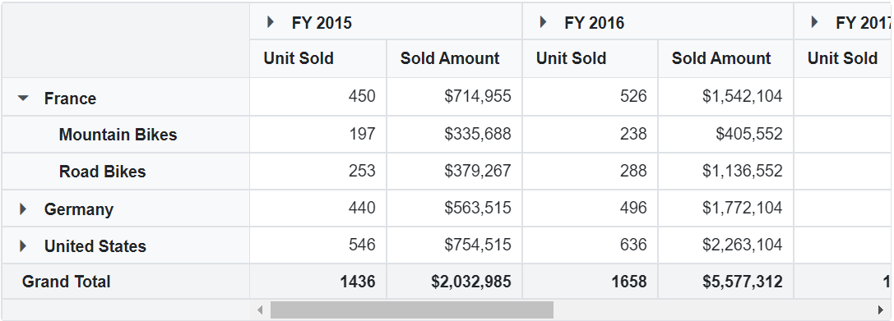
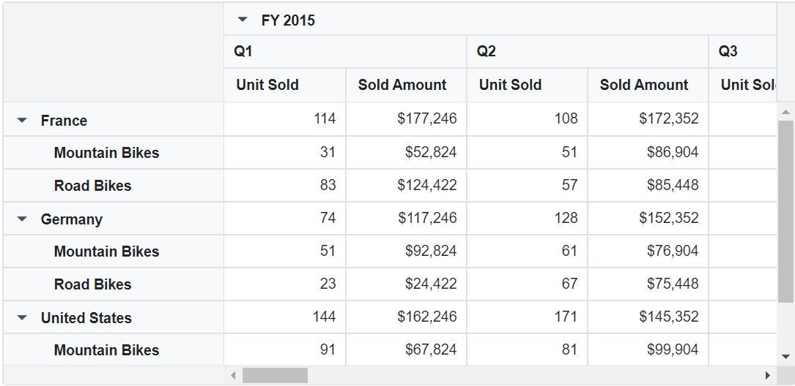
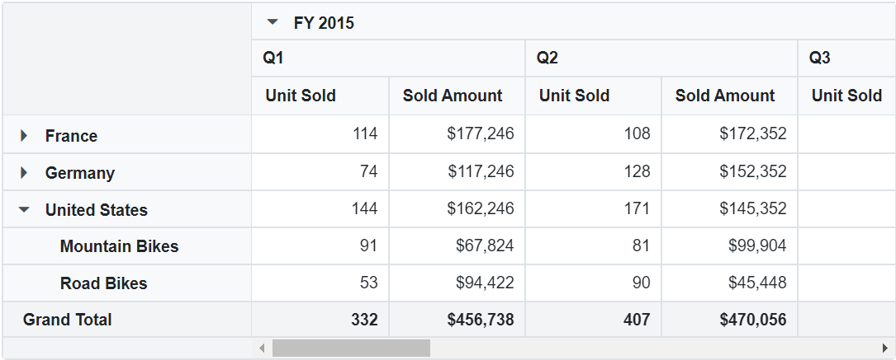

<!-- markdownlint-disable MD034 -->

# Drill Down in Blazor Pivot Table Component

## Drill down and drill up

The drill down and drill up action helps to view the bound data in detailed and abstract view respectively. By default, if member(s) has children, then expand and collapse icon will be displayed in the respective row/column header. On clicking the icon, expand or collapse action will be performed automatically through built-in source code. Meanwhile, leaf member(s) does not contain expand and collapse icon.



## Drill position

Allows to drill only the current position of the selected member and exclude the drilled data of selected member in other positions. For example, if "FY 2015" and "FY 2016" have "Q1" member as child in next level, and when end user attempts to drill "Q1" under "FY 2016", only it will be expanded and not "Q1" under "FY 2015".

> This feature is built-in and occurs every time when expand or collapse action is done for better performance.


## Expand all

> This property is applicable only for the relational data source.

Allows to either expand or collapse all headers that are displayed in row and column axes. To display all headers in expanded state, set the property [`ExpandAll`](https://help.syncfusion.com/cr/blazor/Syncfusion.Blazor.PivotView.DataSourceSettingsModel-1.html#Syncfusion_Blazor_PivotView_DataSourceSettingsModel_1_ExpandAll) to **true** and to collapse all
headers, set the property [`ExpandAll`](https://help.syncfusion.com/cr/blazor/Syncfusion.Blazor.PivotView.DataSourceSettingsModel-1.html#Syncfusion_Blazor_PivotView_DataSourceSettingsModel_1_ExpandAll) to **false**. By default, [`ExpandAll`](https://help.syncfusion.com/cr/blazor/Syncfusion.Blazor.PivotView.DataSourceSettingsModel-1.html#Syncfusion_Blazor_PivotView_DataSourceSettingsModel_1_ExpandAll) property is set to **false**.

```csharp
    @using Syncfusion.Blazor.PivotView

    <SfPivotView TValue="ProductDetails">
         <PivotViewDataSourceSettings DataSource="@data" ExpandAll="true">
            <PivotViewColumns>
                <PivotViewColumn Name="Year"></PivotViewColumn>
                <PivotViewColumn Name="Quarter"></PivotViewColumn>
            </PivotViewColumns>
            <PivotViewRows>
                <PivotViewRow Name="Country"></PivotViewRow>
                <PivotViewRow Name="Products"></PivotViewRow>
            </PivotViewRows>
            <PivotViewValues>
                <PivotViewValue Name="Sold" Caption="Unit Sold"></PivotViewValue>
                <PivotViewValue Name="Amount" Caption="Sold Amount"></PivotViewValue>
            </PivotViewValues>
            <PivotViewFormatSettings>
                <PivotViewFormatSetting Name="Amount" Format="C"></PivotViewFormatSetting>
            </PivotViewFormatSettings>
        </PivotViewDataSourceSettings>
    </SfPivotView>

    @code{
        public List<ProductDetails> data { get; set; }
        protected override void OnInitialized()
        {
            this.data = ProductDetails.GetProductData().ToList();
           //Bind the data source collection here. Refer "Assigning sample data to the pivot table" section in getting started for more details.
        }
    }
```



## Expand all except specific member(s)

> This option is applicable only for the relational data source.

In addition to the previous topic, there is an enhancement to expand all headers expect specific header(s) and similarly to collapse all headers except specific header(s). To achieve this, [`PivotViewDrilledMember`](https://help.syncfusion.com/cr/blazor/Syncfusion.Blazor.PivotView.PivotViewDrilledMember.html) class is used. The required properties of the [`PivotViewDrilledMember`](https://help.syncfusion.com/cr/blazor/Syncfusion.Blazor.PivotView.PivotViewDrilledMember.html) class are explained below:

* [`Name`](https://help.syncfusion.com/cr/blazor/Syncfusion.Blazor.PivotView.PivotViewDrilledMember.html#Syncfusion_Blazor_PivotView_PivotViewDrilledMember_Name): It allows to set the field name whose member(s) needs to be specifically drilled.
* [`Items`](https://help.syncfusion.com/cr/blazor/Syncfusion.Blazor.PivotView.PivotViewDrilledMember.html#Syncfusion_Blazor_PivotView_PivotViewDrilledMember_Items): It allows to set the exact member(s) which needs to be drilled.

> The [`PivotViewDrilledMember`](https://help.syncfusion.com/cr/blazor/Syncfusion.Blazor.PivotView.PivotViewDrilledMember.html) option always works in vice-versa with respect to the property [`ExpandAll`](https://help.syncfusion.com/cr/blazor/Syncfusion.Blazor.PivotView.DataSourceSettingsModel-1.html#Syncfusion_Blazor_PivotView_DataSourceSettingsModel_1_ExpandAll) in pivot table. For example, if [`ExpandAll`](https://help.syncfusion.com/cr/blazor/Syncfusion.Blazor.PivotView.DataSourceSettingsModel-1.html#Syncfusion_Blazor_PivotView_DataSourceSettingsModel_1_ExpandAll) is set to **true**, then the member(s) added in [`Items`](https://help.syncfusion.com/cr/blazor/Syncfusion.Blazor.PivotView.PivotViewDrilledMember.html#Syncfusion_Blazor_PivotView_PivotViewDrilledMember_Items) collection alone will be in collapsed state.

```csharp
    @using Syncfusion.Blazor.PivotView

    <SfPivotView TValue="ProductDetails">
         <PivotViewDataSourceSettings DataSource="@data" ExpandAll="true">
            <PivotViewColumns>
                <PivotViewColumn Name="Year"></PivotViewColumn>
                <PivotViewColumn Name="Quarter"></PivotViewColumn>
            </PivotViewColumns>
            <PivotViewRows>
                <PivotViewRow Name="Country"></PivotViewRow>
                <PivotViewRow Name="Products"></PivotViewRow>
            </PivotViewRows>
            <PivotViewValues>
                <PivotViewValue Name="Sold" Caption="Unit Sold"></PivotViewValue>
                <PivotViewValue Name="Amount" Caption="Sold Amount"></PivotViewValue>
            </PivotViewValues>
            <PivotViewFormatSettings>
                <PivotViewFormatSetting Name="Amount" Format="C"></PivotViewFormatSetting>
            </PivotViewFormatSettings>
            <PivotViewDrilledMembers>
            <PivotViewDrilledMember Name="Country" Items="@(new string[] { "France", "Germany" })"></PivotViewDrilledMember>
            </PivotViewDrilledMembers>
        </PivotViewDataSourceSettings>
    </SfPivotView>

    @code{
        public List<ProductDetails> data { get; set; }
        protected override void OnInitialized()
        {
            this.data = ProductDetails.GetProductData().ToList();
           //Bind the data source collection here. Refer "Assigning sample data to the pivot table" section in getting started for more details.
        }
    }

```



## Expand specific member(s)

End user can also manually expand or collapse specific member(s) in each fields under row and column axes using the [`PivotViewDrilledMember`](https://help.syncfusion.com/cr/blazor/Syncfusion.Blazor.PivotView.PivotViewDrilledMember.html) class from code behind. The required properties of the [`PivotViewDrilledMember`](https://help.syncfusion.com/cr/blazor/Syncfusion.Blazor.PivotView.PivotViewDrilledMember.html) class are explained below:

* [`Name`](https://help.syncfusion.com/cr/blazor/Syncfusion.Blazor.PivotView.PivotViewDrilledMember.html#Syncfusion_Blazor_PivotView_PivotViewDrilledMember_Name): It allows to set the field name whose member(s) needs to be specifically drilled.
* [`Items`](https://help.syncfusion.com/cr/blazor/Syncfusion.Blazor.PivotView.PivotViewDrilledMember.html#Syncfusion_Blazor_PivotView_PivotViewDrilledMember_Items): It allows to set the exact member(s) which needs to be drilled.
* [`Delimiter`](https://help.syncfusion.com/cr/blazor/Syncfusion.Blazor.PivotView.PivotViewDrilledMember.html#Syncfusion_Blazor_PivotView_PivotViewDrilledMember_Delimiter): It allows to separate next level of member from its parent member.

```csharp
    @using Syncfusion.Blazor.PivotView

    <SfPivotView TValue="ProductDetails">
        <PivotViewDataSourceSettings DataSource="@data">
            <PivotViewRows>
                <PivotViewRow Name="Year"></PivotViewRow>
                <PivotViewRow Name="Quarter"></PivotViewRow>
                <PivotViewRow Name="Products"></PivotViewRow>
            </PivotViewRows>
            <PivotViewColumns>
                <PivotViewColumn Name="Country"></PivotViewColumn>
            </PivotViewColumns>
            <PivotViewValues>
                <PivotViewValue Name="Sold" Caption="Unit Sold"></PivotViewValue>
                <PivotViewValue Name="Amount" Caption="Sold Amount"></PivotViewValue>
            </PivotViewValues>
            <PivotViewFormatSettings>
                <PivotViewFormatSetting Name="Amount" Format="C"></PivotViewFormatSetting>
            </PivotViewFormatSettings>
            <PivotViewDrilledMembers>
                <PivotViewDrilledMember Name="Quarter" Delimiter="~~" Items="@(new string[] { "FY 2015~~Q1" })"></PivotViewDrilledMember>
                <PivotViewDrilledMember Name="Year" Items="@(new string[] { "FY 2015","FY 2016" })"></PivotViewDrilledMember>
            </PivotViewDrilledMembers>
        </PivotViewDataSourceSettings>
    </SfPivotView>

    @code{
        public List<ProductDetails> data { get; set; }
        protected override void OnInitialized()
        {
            this.data = ProductDetails.GetProductData().ToList();
           //Bind the data source collection here. Refer "Assigning sample data to the pivot table" section in getting started for more details.
        }
    }
```


> You can refer to our [Blazor Pivot Table](https://www.syncfusion.com/blazor-components/blazor-pivot-table) feature tour page for its groundbreaking feature representations. You can also explore our [Blazor Pivot Table example](https://blazor.syncfusion.com/demos/pivot-table/default-functionalities?theme=bootstrap4) to knows how to render and configure the pivot table.