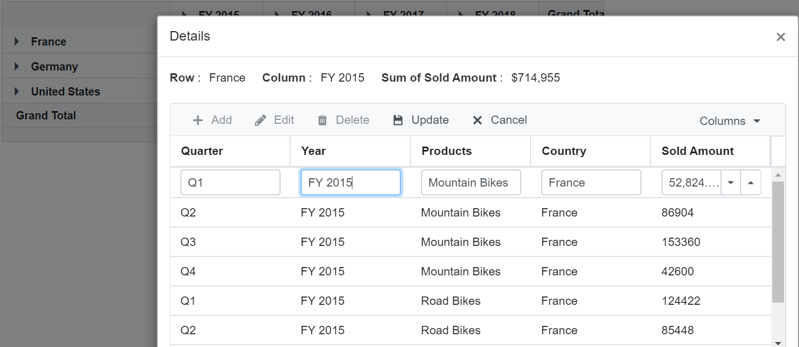
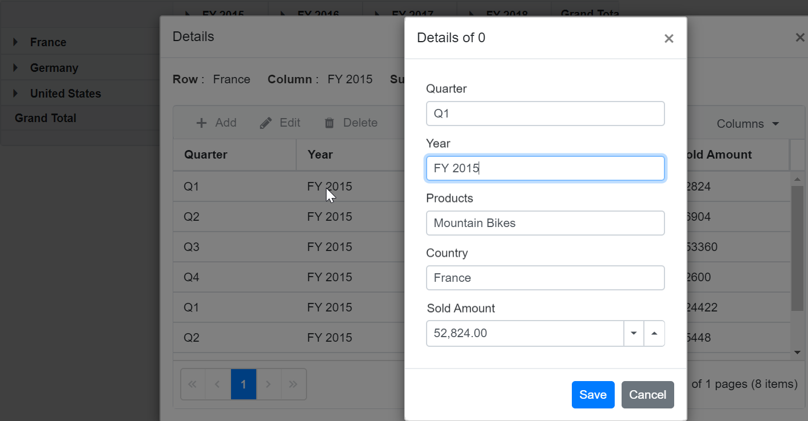
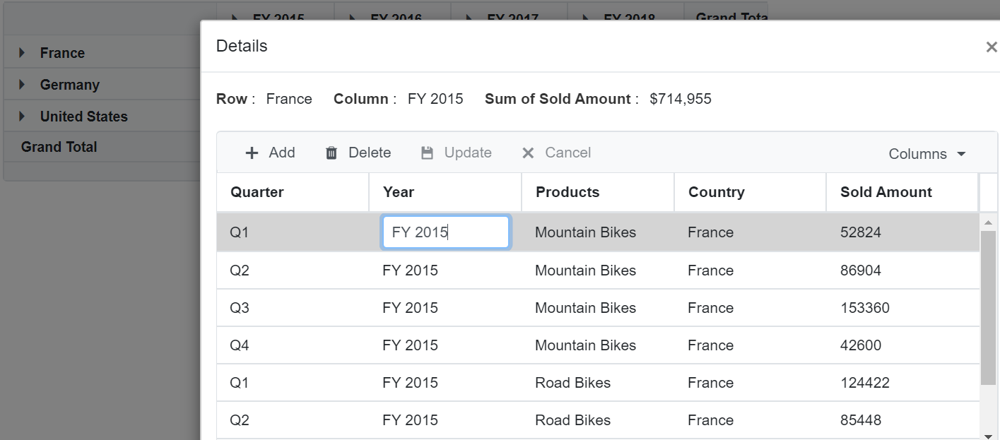
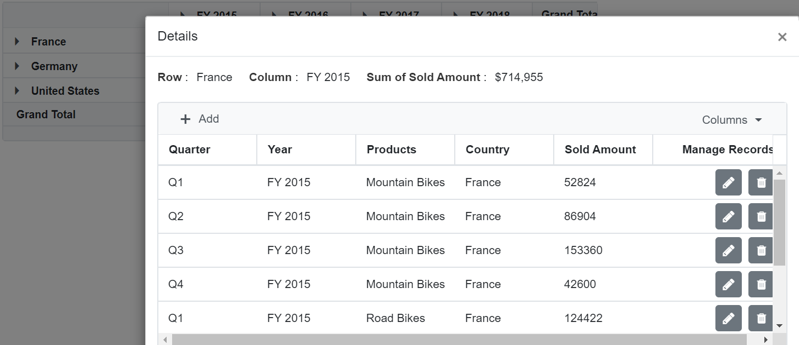
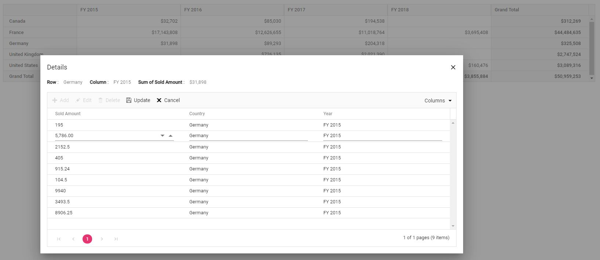

# Editing in Blazor Pivot Table Component

> This feature is applicable only for relational data source.

Cell edit allows to add, delete, or update the raw items of any value cell from the pivot table. The raw items can be viewed in a data grid inside a new window on double-clicking the appropriate value cell. In the data grid, CRUD operations can be performed by double-clicking the cells or using toolbar options. Once user finishes editing raw items, aggregation will be performed for the updated values in pivot table component immediately. This support can be enabled by setting the [`AllowEditing`](https://help.syncfusion.com/cr/blazor/Syncfusion.Blazor.PivotView.PivotViewCellEditSettings.html#Syncfusion_Blazor_PivotView_PivotViewCellEditSettings_AllowEditing) property in [`PivotViewCellEditSettings`](https://help.syncfusion.com/cr/blazor/Syncfusion.Blazor.PivotView.PivotViewCellEditSettings.html) class to **true**.

The CRUD operations available in the data grid toolbar and command column are:

| Toolbar Button | Actions |
|----------------|---------|
| Add | Add a new row.|
| Edit | Edit the current row or cell.|
| Delete | Delete the current row.|
| Update | Update the edited row or cell.|
| Cancel | Cancel the edited state. |

The following are the supported edit types in the data grid:

* Normal
* Dialog
* Batch
* Command Columns

## Normal

In normal edit mode, when user starts editing, the state of the currently selected row alone will be completely changed to edit state. User can change the cell values and save it to the data source by clicking "Update" toolbar button. To enable the normal edit, set the [`Mode`](https://help.syncfusion.com/cr/blazor/Syncfusion.Blazor.PivotView.PivotViewCellEditSettings.html#Syncfusion_Blazor_PivotView_PivotViewCellEditSettings_Mode) property in [`PivotViewCellEditSettings`](https://help.syncfusion.com/cr/blazor/Syncfusion.Blazor.PivotView.PivotViewCellEditSettings.html) class to [**EditMode.Normal**](https://help.syncfusion.com/cr/blazor/Syncfusion.Blazor.PivotView.EditMode.html).

> The normal edit mode [**EditMode.Normal**](https://help.syncfusion.com/cr/blazor/Syncfusion.Blazor.PivotView.EditMode.html) is set as the default mode for editing.

```csharp
    @using Syncfusion.Blazor.PivotView

    <SfPivotView TValue="ProductDetails">
    <PivotViewDataSourceSettings DataSource="@data">
            <PivotViewColumns>
                <PivotViewColumn Name="Year"></PivotViewColumn>
                <PivotViewColumn Name="Quarter"></PivotViewColumn>
            </PivotViewColumns>
            <PivotViewRows>
                <PivotViewRow Name="Country"></PivotViewRow>
                <PivotViewRow Name="Products"></PivotViewRow>
            </PivotViewRows>
            <PivotViewValues>
                <PivotViewValue Name="Amount" Caption="Sold Amount"></PivotViewValue>
            </PivotViewValues>
            <PivotViewFormatSettings>
                <PivotViewFormatSetting Name="Amount" Format="C"></PivotViewFormatSetting>
            </PivotViewFormatSettings>
        </PivotViewDataSourceSettings>
        <PivotViewCellEditSettings AllowAdding="true" AllowDeleting="true" AllowEditing="true" Mode=EditMode.Normal></PivotViewCellEditSettings>
    </SfPivotView>

    @code{
        public List<ProductDetails> data { get; set; }
        protected override void OnInitialized()
        {
            this.data = ProductDetails.GetProductData().ToList();
           //Bind the data source collection here. Refer "Assigning sample data to the pivot table" section in getting started for more details.
        }
    }

```



## Dialog

In dialog edit mode, when user starts editing, the currently selected row data will be shown in an exclusive dialog. User can change cell values and save it to the data source by clicking "Save" button in the dialog. To enable the dialog edit, set the [`Mode`](https://help.syncfusion.com/cr/blazor/Syncfusion.Blazor.PivotView.PivotViewCellEditSettings.html#Syncfusion_Blazor_PivotView_PivotViewCellEditSettings_Mode) property in [`PivotViewCellEditSettings`](https://help.syncfusion.com/cr/blazor/Syncfusion.Blazor.PivotView.PivotViewCellEditSettings.html) class to [**EditMode.Dialog**](https://help.syncfusion.com/cr/blazor/Syncfusion.Blazor.PivotView.EditMode.html).

```csharp
    @using Syncfusion.Blazor.PivotView

     <SfPivotView TValue="ProductDetails">
     <PivotViewDataSourceSettings DataSource="@data">
            <PivotViewColumns>
                <PivotViewColumn Name="Year"></PivotViewColumn>
                <PivotViewColumn Name="Quarter"></PivotViewColumn>
            </PivotViewColumns>
            <PivotViewRows>
                <PivotViewRow Name="Country"></PivotViewRow>
                <PivotViewRow Name="Products"></PivotViewRow>
            </PivotViewRows>
            <PivotViewValues>
                <PivotViewValue Name="Amount" Caption="Sold Amount"></PivotViewValue>
            </PivotViewValues>
            <PivotViewFormatSettings>
                <PivotViewFormatSetting Name="Amount" Format="C"></PivotViewFormatSetting>
            </PivotViewFormatSettings>
        </PivotViewDataSourceSettings>
        <PivotViewCellEditSettings AllowAdding="true" AllowDeleting="true" AllowEditing="true" Mode=EditMode.Dialog></PivotViewCellEditSettings>
    </SfPivotView>

    @code{
        public List<ProductDetails> data { get; set; }
        protected override void OnInitialized()
        {
            this.data = ProductDetails.GetProductData().ToList();
           //Bind the data source collection here. Refer "Assigning sample data to the pivot table" section in getting started for more details.
        }
    }

```



## Batch

In batch edit mode, when user double-clicks any data grid cell, the state of target cell is changed to edit state. User can perform bulk changes and finally save (added, changed, and deleted data in the single request) to the data source by clicking "Update" toolbar button. To enable the batch edit, set the [`Mode`](https://help.syncfusion.com/cr/blazor/Syncfusion.Blazor.PivotView.PivotViewCellEditSettings.html#Syncfusion_Blazor_PivotView_PivotViewCellEditSettings_Mode) property in [`PivotViewCellEditSettings`](https://help.syncfusion.com/cr/blazor/Syncfusion.Blazor.PivotView.PivotViewCellEditSettings.html) class to [**EditMode.Batch**](https://help.syncfusion.com/cr/blazor/Syncfusion.Blazor.PivotView.EditMode.html).

```csharp
    @using Syncfusion.Blazor.PivotView

    <SfPivotView TValue="ProductDetails">
     <PivotViewDataSourceSettings DataSource="@data">
            <PivotViewColumns>
                <PivotViewColumn Name="Year"></PivotViewColumn>
                <PivotViewColumn Name="Quarter"></PivotViewColumn>
            </PivotViewColumns>
            <PivotViewRows>
                <PivotViewRow Name="Country"></PivotViewRow>
                <PivotViewRow Name="Products"></PivotViewRow>
            </PivotViewRows>
            <PivotViewValues>
                <PivotViewValue Name="Amount" Caption="Sold Amount"></PivotViewValue>
            </PivotViewValues>
            <PivotViewFormatSettings>
                <PivotViewFormatSetting Name="Amount" Format="C"></PivotViewFormatSetting>
            </PivotViewFormatSettings>
        </PivotViewDataSourceSettings>
        <PivotViewCellEditSettings AllowAdding="true" AllowDeleting="true" AllowEditing="true" Mode=EditMode.Batch></PivotViewCellEditSettings>
    </SfPivotView>

    @code{
        public List<ProductDetails> data { get; set; }
        protected override void OnInitialized()
        {
            this.data = ProductDetails.GetProductData().ToList();
           //Bind the data source collection here. Refer "Assigning sample data to the pivot table" section in getting started for more details.
        }
    }

```



## Command column

An additional column appended in the data grid layout holds the command buttons to perform the CRUD operation. To enable the command columns, set the [`AllowCommandColumns`](https://help.syncfusion.com/cr/blazor/Syncfusion.Blazor.PivotView.PivotViewCellEditSettings.html#Syncfusion_Blazor_PivotView_PivotViewCellEditSettings_AllowCommandColumns) property in [`PivotViewCellEditSettings`](https://help.syncfusion.com/cr/blazor/Syncfusion.Blazor.PivotView.PivotViewCellEditSettings.html) class to **true**.

```csharp
    @using Syncfusion.Blazor.PivotView

    <SfPivotView TValue="ProductDetails">
        <PivotViewDataSourceSettings DataSource="@data">
            <PivotViewColumns>
                <PivotViewColumn Name="Year"></PivotViewColumn>
                <PivotViewColumn Name="Quarter"></PivotViewColumn>
            </PivotViewColumns>
            <PivotViewRows>
                <PivotViewRow Name="Country"></PivotViewRow>
                <PivotViewRow Name="Products"></PivotViewRow>
            </PivotViewRows>
            <PivotViewValues>
                <PivotViewValue Name="Amount" Caption="Sold Amount"></PivotViewValue>
            </PivotViewValues>
            <PivotViewFormatSettings>
                <PivotViewFormatSetting Name="Amount" Format="C"></PivotViewFormatSetting>
            </PivotViewFormatSettings>
        </PivotViewDataSourceSettings>
        <PivotViewCellEditSettings AllowAdding="true" AllowDeleting="true" AllowEditing="true" AllowCommandColumns="true" ></PivotViewCellEditSettings>
    </SfPivotView>

    @code{
        public List<ProductDetails> data { get; set; }
        protected override void OnInitialized()
        {
            this.data = ProductDetails.GetProductData().ToList();
           //Bind the data source collection here. Refer "Assigning sample data to the pivot table" section in getting started for more details.
        }
    }

```



## Inline Editing

Allows editing of a value cell directly without the use of an external edit dialog. It is applicable if and only if a single raw data is used for the value of the cell. It is applicable to all editing modes, such as normal, batch, dialog and column commands. It can be enabled by setting the [`AllowInlineEditing`] property in [`PivotViewCellEditSettings`] to `true`.

```csharp
    @using Syncfusion.Blazor.PivotView

    <SfPivotView TValue="ProductDetails">
        <PivotViewDataSourceSettings DataSource="@data">
            <PivotViewColumns>
                <PivotViewColumn Name="Year"></PivotViewColumn>
                <PivotViewColumn Name="Quarter"></PivotViewColumn>
            </PivotViewColumns>
            <PivotViewRows>
                <PivotViewRow Name="Country"></PivotViewRow>
                <PivotViewRow Name="Products"></PivotViewRow>
            </PivotViewRows>
            <PivotViewValues>
                <PivotViewValue Name="Amount" Caption="Sold Amount"></PivotViewValue>
            </PivotViewValues>
            <PivotViewFormatSettings>
                <PivotViewFormatSetting Name="Amount" Format="C"></PivotViewFormatSetting>
            </PivotViewFormatSettings>
        </PivotViewDataSourceSettings>
        <PivotViewCellEditSettings AllowAdding="true" AllowDeleting="true" AllowEditing="true" AllowInlineEditing="true" ></PivotViewCellEditSettings>
    </SfPivotView>

    @code{
        public List<ProductDetails> data { get; set; }
        protected override void OnInitialized()
        {
            this.data = ProductDetails.GetProductData().ToList();
           //Bind the data source collection here. Refer "Assigning sample data to the pivot table" section in getting started for more details.
        }
    }

```



## Editing using the pivot chart

Users can also add, delete, or update the underlying raw items of any data point via pivot chart. The raw items will be shown in the data grid in the new window by clicking the appropriate data point. Then you can edit the raw items as mentioned above by any of the edit types (normal, dialog, batch and command column).

```csharp
    @using Syncfusion.Blazor.PivotView

    <SfPivotView TValue="ProductDetails" Width="800" Height="500">
         <PivotViewDataSourceSettings DataSource="@data">
            <PivotViewColumns>
                <PivotViewColumn Name="Country"></PivotViewColumn>
                <PivotViewColumn Name="Products"></PivotViewColumn>
            </PivotViewColumns>
            <PivotViewRows>
                <PivotViewRow Name="Year"></PivotViewRow>
                <PivotViewRow Name="Quarter"></PivotViewRow>
            </PivotViewRows>
            <PivotViewValues>
                <PivotViewValue Name="Sold" Caption="Unit Sold"></PivotViewValue>
                <PivotViewValue Name="Amount" Caption="Sold Amount"></PivotViewValue>
            </PivotViewValues>
            <PivotViewFormatSettings>
                <PivotViewFormatSetting Name="Amount" Format="C"></PivotViewFormatSetting>
            </PivotViewFormatSettings>
        </PivotViewDataSourceSettings>
        <PivotViewDisplayOption View=View.Chart></PivotViewDisplayOption>
        <PivotChartSettings Title="Sales Analysis">
            <PivotChartSeries Type=ChartSeriesType.Column></PivotChartSeries>
        </PivotChartSettings>
        <PivotViewCellEditSettings AllowAdding="true" AllowDeleting="true" AllowEditing="true" Mode=EditMode.Normal></PivotViewCellEditSettings>
    </SfPivotView>

    @code{
        public List<ProductDetails> data { get; set; }
        protected override void OnInitialized()
        {
            this.data = ProductDetails.GetProductData().ToList();
           //Bind the data source collection here. Refer "Assigning sample data to the pivot table" section in getting started for more details.
        }
    }

```


<br/>
<br/>


> You can refer to our [Blazor Pivot Table](https://www.syncfusion.com/blazor-components/blazor-pivot-table) feature tour page for its groundbreaking feature representations. You can also explore our [Blazor Pivot Table example](https://blazor.syncfusion.com/demos/pivot-table/default-functionalities?theme=bootstrap4) to knows how to render and configure the pivot table.