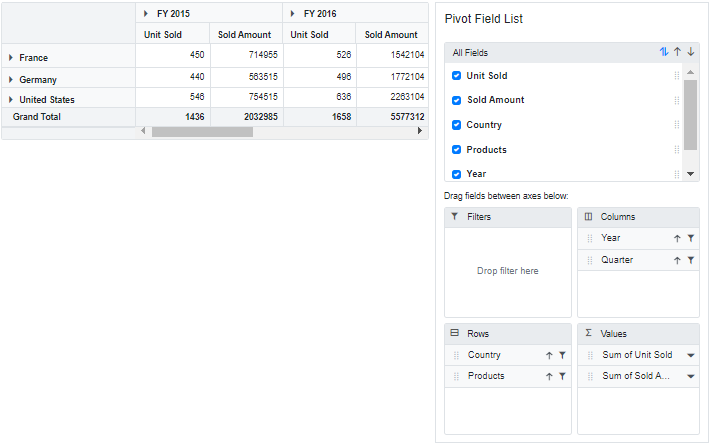
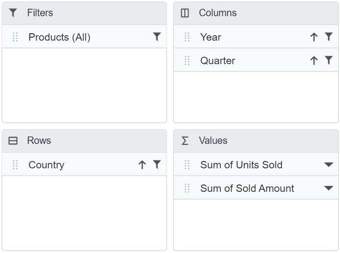
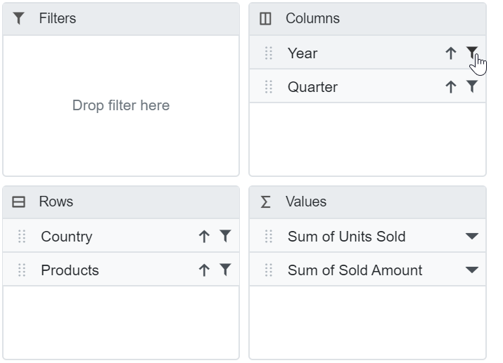
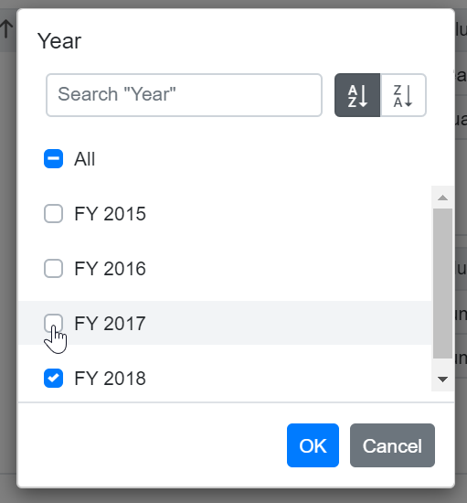
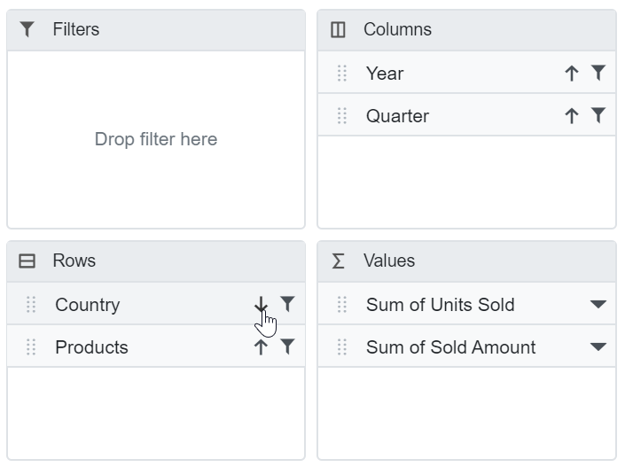
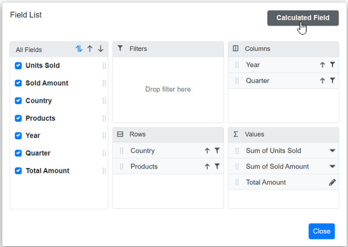
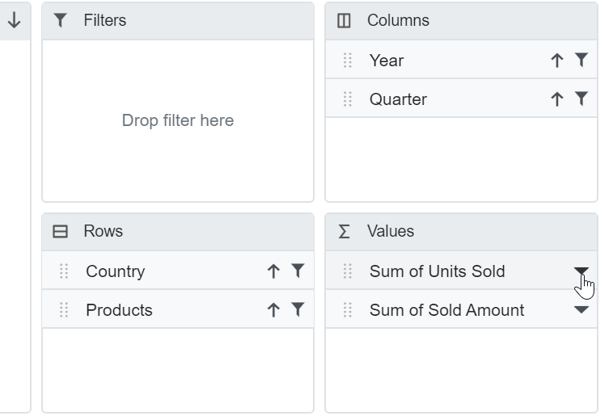
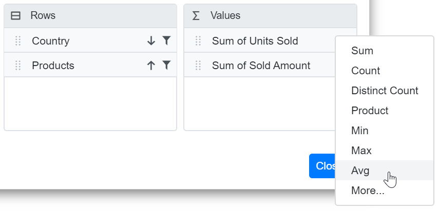
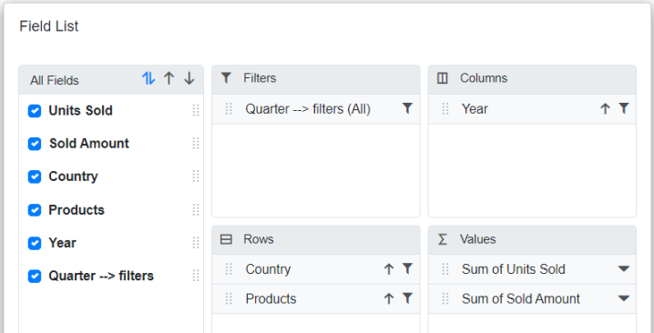

# Field List in Blazor Pivot Table Component

The [Blazor Pivot Table](https://www.syncfusion.com/blazor-components/blazor-pivot-table) provides a built-in Field List similar to Microsoft Excel. It allows to add or remove fields and also rearrange them between different axes, including column, row, value, and filter along with sort and filter options dynamically at runtime.

The field list can be displayed in two different formats to interact with pivot table. They are:

* **In-built Field List (Popup)**: To display the field list icon in pivot table UI to invoke the built-in dialog.
* **Stand-alone Field List (Fixed)**: To display the field list in a static position within a web page.

## In-built Field List (Popup)

To enable the field list in pivot table UI, set the [ShowFieldList](https://help.syncfusion.com/cr/blazor/Syncfusion.Blazor.PivotView.SfPivotView-1.html#Syncfusion_Blazor_PivotView_SfPivotView_1_ShowFieldList) property in [SfPivotView](https://help.syncfusion.com/cr/blazor/Syncfusion.Blazor.PivotView.SfPivotView-1.html) class to **true**. A small icon will appear on the top left corner of the pivot table and clicking on this icon, field list dialog will appear.

N> The field list icon will be displayed at the top right corner of the pivot table, when grouping bar is enabled.

 ```cshtml
@using Syncfusion.Blazor.PivotView

<SfPivotView TValue="ProductDetails" ShowFieldList="true">
     <PivotViewDataSourceSettings DataSource="@dataSource">
        <PivotViewColumns>
            <PivotViewColumn Name="Year"></PivotViewColumn>
            <PivotViewColumn Name="Quarter"></PivotViewColumn>
        </PivotViewColumns>
        <PivotViewRows>
            <PivotViewRow Name="Country"></PivotViewRow>
            <PivotViewRow Name="Products"></PivotViewRow>
        </PivotViewRows>
        <PivotViewValues>
            <PivotViewValue Name="Sold" Caption="Units Sold"></PivotViewValue>
            <PivotViewValue Name="Amount" Caption="Sold Amount"></PivotViewValue>
        </PivotViewValues>
        <PivotViewFormatSettings>
            <PivotViewFormatSetting Name="Amount" Format="C"></PivotViewFormatSetting>
        </PivotViewFormatSettings>
    </PivotViewDataSourceSettings>
</SfPivotView>

@code{
    public List<ProductDetails> dataSource { get; set; }
    protected override void OnInitialized()
    {
        this.dataSource = ProductDetails.GetProductData().ToList();
        //Bind the data source collection here. Refer "Assigning sample data to the pivot table" section in getting started for more details.
    }
}

```

<!-- markdownlint-disable MD012 -->


## Stand-alone Field List (Fixed)

The field list can be rendered in a static position, anywhere in web page layout, like a separate component. To do so, you need to set the [RenderMode](https://help.syncfusion.com/cr/blazor/Syncfusion.Blazor.PivotView.SfPivotFieldList-1.html#Syncfusion_Blazor_PivotView_SfPivotFieldList_1_RenderMode) property to [Mode.Fixed](https://help.syncfusion.com/cr/blazor/Syncfusion.Blazor.PivotView.Mode.html) in [SfPivotFieldList](https://help.syncfusion.com/cr/blazor/Syncfusion.Blazor.PivotView.SfPivotFieldList-1.html).

N> To make a field list interact with pivot table, you need to use the [UpdateViewAsync](https://help.syncfusion.com/cr/blazor/Syncfusion.Blazor.PivotView.SfPivotFieldList-1.html#Syncfusion_Blazor_PivotView_SfPivotFieldList_1_UpdateView_System_Object_) and [Update](https://help.syncfusion.com/cr/blazor/Syncfusion.Blazor.PivotView.SfPivotFieldList-1.html#Syncfusion_Blazor_PivotView_SfPivotFieldList_1_Update_System_Object_) methods for data source update in both field list and pivot table simultaneously.

```cshtml
<SfPivotView TValue="ProductDetails" ID="pivotview"  @ref="pivotView" Height="530">
    <PivotViewEvents TValue="ProductDetails" EnginePopulated="pivotenginepopulated"></PivotViewEvents>
</SfPivotView>
<SfPivotFieldList TValue="ProductDetails" ID="fieldlist" @ref="fieldList" RenderMode="Mode.Fixed" >
    <PivotFieldListDataSourceSettings DataSource="@data" EnableSorting=true>
        <PivotFieldListColumns>
            <PivotFieldListColumn Name="Year"></PivotFieldListColumn>
            <PivotFieldListColumn Name="Quarter"></PivotFieldListColumn>
        </PivotFieldListColumns>
        <PivotFieldListRows>
            <PivotFieldListRow Name="Country"></PivotFieldListRow>
            <PivotFieldListRow Name="Products"></PivotFieldListRow>
        </PivotFieldListRows>
        <PivotFieldListValues>
            <PivotFieldListValue Name="Sold" Caption="Unit Sold"></PivotFieldListValue>
            <PivotFieldListValue Name="Amount" Caption="Sold Amount"></PivotFieldListValue>
        </PivotFieldListValues>
    </PivotFieldListDataSourceSettings>
    <PivotFieldListEvents TValue="ProductDetails" EnginePopulated="enginepopulated"></PivotFieldListEvents>
</SfPivotFieldList>
<style>
    #fieldlist {
        width: 42%;
        height: 100%;
        float: right;
    }

    #pivotview {
        width: 57%;
        height: 530px;
        float: left;
    }
</style>
@code{
    SfPivotFieldList<ProductDetails> fieldList;
    SfPivotView<ProductDetails> pivotView;
    public List<ProductDetails> data { get; set; }
    protected override void OnInitialized()
    {
        this.data = ProductDetails.GetProductData();
    }

    public void pivotenginepopulated(EnginePopulatedEventArgs args)
    {
        this.fieldList.UpdateAsync(this.pivotView);
    }
    public void enginepopulated(EnginePopulatedEventArgs args)
    {
        this.fieldList.UpdateViewAsync(this.pivotView);
    }
}

```



## Search desired field

End user can search for desired field in the field list UI by typing the field name into the search box at runtime. It can be enabled by setting the [ShowFieldSearch](https://help.syncfusion.com/cr/blazor/Syncfusion.Blazor.PivotView.SfPivotFieldList-1.html#Syncfusion_Blazor_PivotView_SfPivotFieldList_1_ShowFieldSearch) property to **true** via code-behind.

N> By default, field search option is disabled in the field list UI. Furthermore, this option is only available for relational data sources.

To enable search box in the static field list UI, set the [ShowFieldSearch](https://help.syncfusion.com/cr/blazor/Syncfusion.Blazor.PivotView.SfPivotFieldList-1.html#Syncfusion_Blazor_PivotView_SfPivotFieldList_1_ShowFieldSearch) property  to **true** in [SfPivotFieldList](https://help.syncfusion.com/cr/blazor/Syncfusion.Blazor.PivotView.SfPivotFieldList-1.html).

```cshtml
<SfPivotFieldList TValue="ProductDetails" ID="fieldlist" @ref="fieldList" ShowFieldSearch="true" RenderMode="Mode.Fixed" >
    <PivotFieldListDataSourceSettings DataSource="@data" EnableSorting=true>
        <PivotFieldListColumns>
            <PivotFieldListColumn Name="Year"></PivotFieldListColumn>
            <PivotFieldListColumn Name="Quarter"></PivotFieldListColumn>
        </PivotFieldListColumns>
        <PivotFieldListRows>
            <PivotFieldListRow Name="Country"></PivotFieldListRow>
            <PivotFieldListRow Name="Products"></PivotFieldListRow>
        </PivotFieldListRows>
        <PivotFieldListValues>
            <PivotFieldListValue Name="Sold" Caption="Unit Sold"></PivotFieldListValue>
            <PivotFieldListValue Name="Amount" Caption="Sold Amount"></PivotFieldListValue>
        </PivotFieldListValues>
    </PivotFieldListDataSourceSettings>
</SfPivotFieldList>
<style>
    #fieldlist {
        width: 42%;
        height: 100%;
        float: right;
    }
</style>
@code{
    private SfPivotFieldList<ProductDetails> fieldList;
    private List<ProductDetails> data { get; set; }
    protected override void OnInitialized()
    {
        this.dataSource = ProductDetails.GetProductData();
        //Bind the data source collection here. Refer "Assigning sample data to the pivot table" section in getting started for more details.
    }   
}

```


To enable search box in the pivot table's built-in popup field list UI, set the [ShowFieldSearch](https://help.syncfusion.com/cr/blazor/Syncfusion.Blazor.PivotView.SfPivotView-1.html#Syncfusion_Blazor_PivotView_SfPivotView_1_ShowFieldSearch) property to **true** in [SfPivotView](https://help.syncfusion.com/cr/blazor/Syncfusion.Blazor.PivotView.SfPivotView-1.html).

```cshtml
@using Syncfusion.Blazor.PivotView

<SfPivotView TValue="ProductDetails" ShowFieldList="true" ShowFieldSearch="true">
     <PivotViewDataSourceSettings DataSource="@dataSource">
        <PivotViewColumns>
            <PivotViewColumn Name="Year"></PivotViewColumn>
            <PivotViewColumn Name="Quarter"></PivotViewColumn>
        </PivotViewColumns>
        <PivotViewRows>
            <PivotViewRow Name="Country"></PivotViewRow>
            <PivotViewRow Name="Products"></PivotViewRow>
        </PivotViewRows>
        <PivotViewValues>
            <PivotViewValue Name="Sold" Caption="Units Sold"></PivotViewValue>
            <PivotViewValue Name="Amount" Caption="Sold Amount"></PivotViewValue>
        </PivotViewValues>
        <PivotViewFormatSettings>
            <PivotViewFormatSetting Name="Amount" Format="C"></PivotViewFormatSetting>
        </PivotViewFormatSettings>
    </PivotViewDataSourceSettings>
</SfPivotView>

@code{
    private List<ProductDetails> dataSource { get; set; }
    protected override void OnInitialized()
    {
        this.dataSource = ProductDetails.GetProductData();
        //Bind the data source collection here. Refer "Assigning sample data to the pivot table" section in getting started for more details.
    }
}

```


## Add or remove fields

Using check box besides each field, end user can select or unselect to add or remove fields respectively from the report at runtime.


## Remove specific field(s) from displaying

When a data source is bound to the component, fields will be automatically populated inside the Field List. In such case, user can also restrict specific field(s) from displaying. To do so, set the appropriate field name(s) in [ExcludeFields](https://help.syncfusion.com/cr/blazor/Syncfusion.Blazor.PivotView.DataSourceSettingsModel-1.html#Syncfusion_Blazor_PivotView_DataSourceSettingsModel_1_ExcludeFields) property belonging to [PivotViewDataSourceSettings](https://help.syncfusion.com/cr/blazor/Syncfusion.Blazor.PivotView.PivotViewDataSourceSettings-1.html) class.

 ```cshtml
@using Syncfusion.Blazor.PivotView

<SfPivotView TValue="ProductDetails" ShowFieldList="true">
     <PivotViewDataSourceSettings DataSource="@dataSource" ExcludeFields="@(new string[] { "Products", "Amount" })">
        <PivotViewColumns>
            <PivotViewColumn Name="Year"></PivotViewColumn>
            <PivotViewColumn Name="Quarter"></PivotViewColumn>
        </PivotViewColumns>
        <PivotViewRows>
            <PivotViewRow Name="Country"></PivotViewRow>
            <PivotViewRow Name="Products"></PivotViewRow>
        </PivotViewRows>
        <PivotViewValues>
            <PivotViewValue Name="Sold" Caption="Units Sold"></PivotViewValue>
            <PivotViewValue Name="Amount" Caption="Sold Amount"></PivotViewValue>
        </PivotViewValues>
        <PivotViewFormatSettings>
            <PivotViewFormatSetting Name="Amount" Format="C"></PivotViewFormatSetting>
        </PivotViewFormatSettings>
    </PivotViewDataSourceSettings>
</SfPivotView>

@code{
    public List<ProductDetails> dataSource { get; set; }
    protected override void OnInitialized()
    {
        this.dataSource = ProductDetails.GetProductData().ToList();
        //Bind the data source collection here. Refer "Assigning sample data to the pivot table" section in getting started for more details.
    }
}

```


## Re-arranging fields

In-order to re-arrange, drag any field from the field list and drop it into the column, row, value, or filter axis using the drag-and-drop holder. It helps end user to alter the report at runtime.



## Filtering members

Using the filter icon besides each field in row, column and filter axes, members can be either included or excluded at runtime. To know more about member filtering, [refer](./filtering) here.


<br/>

<br/>


## Sorting members

Using the sort icon besides each field in row and column axes, members can be arranged either in ascending or descending order at runtime. To know more about member sorting, [refer](./sorting) here.


<br/>


## Calculated fields

The calculated field support allows end user to add a new calculated field based on the available fields from the bound data source using basic arithmetic operators. To enable this support in Field List UI, set the [AllowCalculatedField](https://help.syncfusion.com/cr/blazor/Syncfusion.Blazor.PivotView.SfPivotView-1.html#Syncfusion_Blazor_PivotView_SfPivotView_1_AllowCalculatedField) property in [SfPivotView](https://help.syncfusion.com/cr/blazor/Syncfusion.Blazor.PivotView.SfPivotView-1.html) class to **true** in pivot table. Now a button will be seen automatically inside the field list UI which will invoke the calculated field dialog on click. To know more about calculated field, [refer](./calculated-field) here.


<br/>

<br/>


## Changing aggregation type of value fields at runtime

End user can perform calculations over a group of values using the aggregation option. The value fields bound to the field list, appears with a dropdown icon, helps to select an appropriate aggregation type at runtime. On selection, the values in the Pivot Table will be changed dynamically. To know more about aggregation, [refer](./aggregation) here.


<br/>
<br/>

<br/>


## Defer layout update

Defer layout update support to update the pivot table only on demand and not during every user action. To enable this support in Field List UI, set the [AllowDeferLayoutUpdate](https://help.syncfusion.com/cr/blazor/Syncfusion.Blazor.PivotView.SfPivotView-1.html#Syncfusion_Blazor_PivotView_SfPivotView_1_AllowDeferLayoutUpdate) property in [SfPivotView](https://help.syncfusion.com/cr/blazor/Syncfusion.Blazor.PivotView.SfPivotView-1.html) class to **true** in pivot table. Now a check box inside Field List UI will be seen in checked state, allowing pivot table to update only on demand. To know more about defer layout, [refer](./defer-layout-update) here.


## Show field list using toolbar

It can also be viewed in toolbar by setting [ShowFieldList](https://help.syncfusion.com/cr/blazor/Syncfusion.Blazor.PivotView.SfPivotView-1.html#Syncfusion_Blazor_PivotView_SfPivotView_1_ShowFieldList) and [ShowToolbar](https://help.syncfusion.com/cr/blazor/Syncfusion.Blazor.PivotView.SfPivotView-1.html#Syncfusion_Blazor_PivotView_SfPivotView_1_ShowToolbar) properties in [SfPivotView](https://help.syncfusion.com/cr/blazor/Syncfusion.Blazor.PivotView.SfPivotView-1.html) class to **true**. Also, include the item [ToolbarItems.FieldList](https://help.syncfusion.com/cr/blazor/Syncfusion.Blazor.PivotView.ToolbarItems.html) within the [Toolbar](https://help.syncfusion.com/cr/blazor/Syncfusion.Blazor.PivotView.SfPivotView-1.html#Syncfusion_Blazor_PivotView_SfPivotView_1_Toolbar) property in [SfPivotView](https://help.syncfusion.com/cr/blazor/Syncfusion.Blazor.PivotView.SfPivotView-1.html) class. When toolbar is enabled, field list icon will be automatically added into the toolbar and the icon won't appear on top left corner in the pivot table component.

```cshtml
@using Syncfusion.Blazor.PivotView

<SfPivotView TValue="ProductDetails" ShowFieldList="true" ShowToolbar="true" Toolbar="@toolbar">
        <PivotViewDataSourceSettings DataSource="@data">
            <PivotViewColumns>
                <PivotViewColumn Name="Year"></PivotViewColumn>
                <PivotViewColumn Name="Quarter"></PivotViewColumn>
            </PivotViewColumns>
            <PivotViewRows>
                <PivotViewRow Name="Country"></PivotViewRow>
                <PivotViewRow Name="Products"></PivotViewRow>
            </PivotViewRows>
            <PivotViewValues>
                <PivotViewValue Name="Sold" Caption="Units Sold"></PivotViewValue>
                <PivotViewValue Name="Amount" Caption="Sold Amount"></PivotViewValue>
            </PivotViewValues>
            <PivotViewFormatSettings>
                <PivotViewFormatSetting Name="Amount" Format="C"></PivotViewFormatSetting>
            </PivotViewFormatSettings>
        </PivotViewDataSourceSettings>
</SfPivotView>

@code{
    public List<ToolbarItems> toolbar = new List<ToolbarItems> {
        ToolbarItems.FieldList
    };
    public List<ProductDetails> data { get; set; }
    protected override void OnInitialized()
    {
        this.data = ProductDetails.GetProductData().ToList();
        //Bind the data source collection here. Refer "Assigning sample data to the pivot table" section in getting started for more details.
    }
}

```


## Events

### EnginePopulated

The [EnginePopulated](https://help.syncfusion.com/cr/blazor/Syncfusion.Blazor.PivotView.PivotFieldListEvents-1.html#Syncfusion_Blazor_PivotView_PivotFieldListEvents_1_EnginePopulated) event is available in both Pivot Table and Field List.

* The event [EnginePopulated](https://help.syncfusion.com/cr/blazor/Syncfusion.Blazor.PivotView.PivotFieldListEvents-1.html#Syncfusion_Blazor_PivotView_PivotFieldListEvents_1_EnginePopulated) is triggered in field list whenever the report gets modified. The updated report is passed to the pivot table via [UpdateViewAsync](https://help.syncfusion.com/cr/blazor/Syncfusion.Blazor.PivotView.SfPivotFieldList-1.html#Syncfusion_Blazor_PivotView_SfPivotFieldList_1_UpdateView_System_Object_) method written within this event to refresh the same.

* Likewise, [EnginePopulated](https://help.syncfusion.com/cr/blazor/Syncfusion.Blazor.PivotView.PivotViewEvents-1.html#Syncfusion_Blazor_PivotView_PivotViewEvents_1_EnginePopulated) event is triggered in pivot table whenever the report gets modified. The updated report is passed to the field list via [UpdateAsync](https://help.syncfusion.com/cr/blazor/Syncfusion.Blazor.PivotView.SfPivotFieldList-1.html#Syncfusion_Blazor_PivotView_SfPivotFieldList_1_Update_System_Object_) method written within this event to refresh the same.

The event [EnginePopulated](https://help.syncfusion.com/cr/blazor/Syncfusion.Blazor.PivotView.PivotFieldListEvents-1.html#Syncfusion_Blazor_PivotView_PivotFieldListEvents_1_EnginePopulated) is triggered after engine is populated. It has following parameters - [DataSourceSettings](https://help.syncfusion.com/cr/blazor/Syncfusion.Blazor.PivotView.EnginePopulatedEventArgs.html#Syncfusion_Blazor_PivotView_EnginePopulatedEventArgs_DataSourceSettings), [PivotFieldList](https://help.syncfusion.com/cr/blazor/Syncfusion.Blazor.PivotView.EnginePopulatedEventArgs.html#Syncfusion_Blazor_PivotView_EnginePopulatedEventArgs_PivotFieldList) and [PivotValues](https://help.syncfusion.com/cr/blazor/Syncfusion.Blazor.PivotView.EnginePopulatedEventArgs.html#Syncfusion_Blazor_PivotView_EnginePopulatedEventArgs_PivotValues).

N> This event is not required for Popup field list since it is a in-built one.

```cshtml

<SfPivotView TValue="ProductDetails" ID="pivotview"  @ref="pivotView" Height="530">
    <PivotViewEvents TValue="ProductDetails" EnginePopulated="pivotenginepopulated"></PivotViewEvents>
</SfPivotView>
<SfPivotFieldList TValue="ProductDetails" ID="fieldlist" @ref="fieldList" RenderMode="Mode.Fixed" >
    <PivotFieldListDataSourceSettings DataSource="@data" EnableSorting=true>
        <PivotFieldListColumns>
            <PivotFieldListColumn Name="Year"></PivotFieldListColumn>
            <PivotFieldListColumn Name="Quarter"></PivotFieldListColumn>
        </PivotFieldListColumns>
        <PivotFieldListRows>
            <PivotFieldListRow Name="Country"></PivotFieldListRow>
            <PivotFieldListRow Name="Products"></PivotFieldListRow>
        </PivotFieldListRows>
        <PivotFieldListValues>
            <PivotFieldListValue Name="Sold" Caption="Unit Sold"></PivotFieldListValue>
            <PivotFieldListValue Name="Amount" Caption="Sold Amount"></PivotFieldListValue>
        </PivotFieldListValues>
    </PivotFieldListDataSourceSettings>
    <PivotFieldListEvents TValue="ProductDetails" EnginePopulated="enginepopulated"></PivotFieldListEvents>
</SfPivotFieldList>
<style>
    #fieldlist {
        width: 42%;
        height: 100%;
        float: right;
    }

    #pivotview {
        width: 57%;
        height: 530px;
        float: left;
    }
</style>
@code{
    SfPivotFieldList<ProductDetails> fieldList;
    SfPivotView<ProductDetails> pivotView;
    public List<ProductDetails> data { get; set; }
    protected override void OnInitialized()
    {
        this.data = ProductDetails.GetProductData();
    }

    public void pivotenginepopulated(EnginePopulatedEventArgs args)
    {
        this.fieldList.UpdateAsync(this.pivotView);
    }
    public void enginepopulated(EnginePopulatedEventArgs args)
    {
        this.fieldList.UpdateViewAsync(this.pivotView);
    }
}

```

### FieldListRefreshed

The event [FieldListRefreshed](https://help.syncfusion.com/cr/blazor/Syncfusion.Blazor.PivotView.PivotViewEvents-1.html#Syncfusion_Blazor_PivotView_PivotViewEvents_1_FieldListRefreshed) is triggered whenever there is any change done in the field list UI. It has following parameter - [DataSourceSettings](https://help.syncfusion.com/cr/blazor/Syncfusion.Blazor.PivotView.FieldListRefreshedEventArgs.html#Syncfusion_Blazor_PivotView_FieldListRefreshedEventArgs_DataSourceSettings) and [PivotValues](https://help.syncfusion.com/cr/blazor/Syncfusion.Blazor.PivotView.FieldListRefreshedEventArgs.html#Syncfusion_Blazor_PivotView_FieldListRefreshedEventArgs_PivotValues). It allows the user to identify each field list update. This event is applicable only for static field list.

```cshtml

<SfPivotView TValue="ProductDetails" ID="pivotview"  @ref="pivotView" Height="530">
    <PivotViewEvents TValue="ProductDetails" FieldListRefreshed="fieldlistrefresh" EnginePopulated="pivotenginepopulated"></PivotViewEvents>
</SfPivotView>
<SfPivotFieldList TValue="ProductDetails" ID="fieldlist" @ref="fieldList" RenderMode="Mode.Fixed" >
    <PivotFieldListDataSourceSettings DataSource="@data" EnableSorting=true>
        <PivotFieldListColumns>
            <PivotFieldListColumn Name="Year"></PivotFieldListColumn>
            <PivotFieldListColumn Name="Quarter"></PivotFieldListColumn>
        </PivotFieldListColumns>
        <PivotFieldListRows>
            <PivotFieldListRow Name="Country"></PivotFieldListRow>
            <PivotFieldListRow Name="Products"></PivotFieldListRow>
        </PivotFieldListRows>
        <PivotFieldListValues>
            <PivotFieldListValue Name="Sold" Caption="Unit Sold"></PivotFieldListValue>
            <PivotFieldListValue Name="Amount" Caption="Sold Amount"></PivotFieldListValue>
        </PivotFieldListValues>
    </PivotFieldListDataSourceSettings>
    <PivotFieldListEvents TValue="ProductDetails" EnginePopulated="enginepopulated"></PivotFieldListEvents>
</SfPivotFieldList>
<style>
    #fieldlist {
        width: 42%;
        height: 100%;
        float: right;
    }

    #pivotview {
        width: 57%;
        height: 530px;
        float: left;
    }
</style>
@code{
    SfPivotFieldList<ProductDetails> fieldList;
    SfPivotView<ProductDetails> pivotView;
    public List<ProductDetails> data { get; set; }
    protected override void OnInitialized()
    {
        this.data = ProductDetails.GetProductData();
    }

    public void pivotenginepopulated(EnginePopulatedEventArgs args)
    {
        this.fieldList.UpdateAsync(this.pivotView);
    }
    public void enginepopulated(EnginePopulatedEventArgs args)
    {
        this.fieldList.UpdateViewAsync(this.pivotView);
    }
    private void fieldlistrefresh(FieldListRefreshedEventArgs args)
    {
        //args -> Can get the report and engine.
    }
}

```

### FieldDropped

The event [FieldDropped](https://help.syncfusion.com/cr/blazor/Syncfusion.Blazor.PivotView.PivotFieldListEvents-1.html#Syncfusion_Blazor_PivotView_PivotFieldListEvents_1_FieldDropped) fires whenever a field is dropped in an axis. It has following parameters - [DroppedAxis](https://help.syncfusion.com/cr/blazor/Syncfusion.Blazor.PivotView.FieldDroppedEventArgs.html#Syncfusion_Blazor_PivotView_FieldDroppedEventArgs_DroppedAxis), [DroppedField](https://help.syncfusion.com/cr/blazor/Syncfusion.Blazor.PivotView.FieldDroppedEventArgs.html#Syncfusion_Blazor_PivotView_FieldDroppedEventArgs_DroppedField) and [DataSourceSettings](https://help.syncfusion.com/cr/blazor/Syncfusion.Blazor.PivotView.FieldDroppedEventArgs.html#Syncfusion_Blazor_PivotView_FieldDroppedEventArgs_DataSourceSettings). In this illustration, the [DroppedField](https://help.syncfusion.com/cr/blazor/Syncfusion.Blazor.PivotView.FieldDroppedEventArgs.html#Syncfusion_Blazor_PivotView_FieldDroppedEventArgs_DroppedField) caption is modified through this event at runtime.

```cshtml

@using Syncfusion.Blazor.PivotView

<SfPivotView TValue="ProductDetails" ShowFieldList="true">
        <PivotViewDataSourceSettings DataSource="@data">
            <PivotViewColumns>
                <PivotViewColumn Name="Year"></PivotViewColumn>
                <PivotViewColumn Name="Quarter"></PivotViewColumn>
            </PivotViewColumns>
            <PivotViewRows>
                <PivotViewRow Name="Country"></PivotViewRow>
                <PivotViewRow Name="Products"></PivotViewRow>
            </PivotViewRows>
            <PivotViewValues>
                <PivotViewValue Name="Sold" Caption="Units Sold"></PivotViewValue>
                <PivotViewValue Name="Amount" Caption="Sold Amount"></PivotViewValue>
            </PivotViewValues>
            <PivotViewFormatSettings>
                <PivotViewFormatSetting Name="Amount" Format="C"></PivotViewFormatSetting>
            </PivotViewFormatSettings>
        </PivotViewDataSourceSettings>
        <PivotViewEvents TValue="ProductDetails" FieldDropped="fielddropped"></PivotViewEvents>
</SfPivotView>

@code{
    public List<ProductDetails> data { get; set; }
    protected override void OnInitialized()
    {
        this.data = ProductDetails.GetProductData().ToList();
        //Bind the data source collection here. Refer "Assigning sample data to the pivot table" section in getting started for more details.
    }
    public void fielddropped(FieldDroppedEventArgs args)
    {
        args.DroppedField.Caption = args.DroppedField.Name + " --> " + args.DroppedAxis;
    }
}

```



### OnActionBegin

The event [OnActionBegin](https://help.syncfusion.com/cr/blazor/Syncfusion.Blazor.PivotView.PivotViewEvents-1.html#Syncfusion_Blazor_PivotView_PivotViewEvents_1_OnActionBegin) triggers when the UI actions such as sorting, filtering, aggregation or edit calculated field, that are present in the field list UI begin. This allows user to identify the current action being performed at runtime. It has the following parameters:

* [DataSourceSettings](https://help.syncfusion.com/cr/blazor/Syncfusion.Blazor.PivotView.PivotActionBeginEventArgs.html#Syncfusion_Blazor_PivotView_PivotActionBeginEventArgs_DataSourceSettings) : It holds the current data source settings such as input data source, rows, columns, values, filters, format settings and so on.

* [ActionName](https://help.syncfusion.com/cr/blazor/Syncfusion.Blazor.PivotView.PivotActionBeginEventArgs.html#Syncfusion_Blazor_PivotView_PivotActionBeginEventArgs_ActionName): It holds the name of the current action began. The following are the UI actions and their names:

| Action | Action Name|
|----------------|-------------|
| [Sort icon](./field-list/#sorting-members)| Sort field|
| [Filter icon](./field-list/#filtering-members)| Filter field|
| [Aggregation](./field-list/#changing-aggregation-type-of-value-fields-at-runtime) (Value type drop down and menu)| Aggregate field|
| [Edit icon](./calculated-field/#editing-the-existing-calculated-field-formula) | Edit calculated field|
| [Calculated field button](./field-list/#calculated-fields)| Open calculated field dialog|
| [Field list](./field-list/#in-built-field-list-popup)| Open field list|
| [Field list tree – Sort icon](./field-list/#in-built-field-list-popup)| Sort field tree|

* [FieldInfo](https://help.syncfusion.com/cr/blazor/Syncfusion.Blazor.PivotView.PivotActionBeginEventArgs.html#Syncfusion_Blazor_PivotView_PivotActionBeginEventArgs_FieldInfo): It holds the selected field information.

N> This option is applicable only when the field based UI actions are performed such as filtering, sorting, removing field from grouping bar, editing and aggregation type change.

* [Cancel](https://help.syncfusion.com/cr/blazor/Syncfusion.Blazor.PivotView.PivotActionBeginEventArgs.html#Syncfusion_Blazor_PivotView_PivotActionBeginEventArgs_Cancel): It allows user to restrict the current action.

In the following example, opening pop-up field list can be restricted by setting the **args.Cancel** option to **true** in the `OnActionBegin` event.

```cshtml
@using Syncfusion.Blazor.PivotView

<SfPivotView TValue="ProductDetails" ShowFieldList="true">
     <PivotViewDataSourceSettings DataSource="@data">
        <PivotViewColumns>
            <PivotViewColumn Name="Year"></PivotViewColumn>
            <PivotViewColumn Name="Quarter"></PivotViewColumn>
        </PivotViewColumns>
        <PivotViewRows>
            <PivotViewRow Name="Country"></PivotViewRow>
            <PivotViewRow Name="Products"></PivotViewRow>
        </PivotViewRows>
        <PivotViewValues>
            <PivotViewValue Name="Sold" Caption="Unit Sold"></PivotViewValue>
            <PivotViewValue Name="Amount" Caption="Sold Amount"></PivotViewValue>
        </PivotViewValues>
        <PivotViewFormatSettings>
            <PivotViewFormatSetting Name="Amount" Format="C"></PivotViewFormatSetting>
        </PivotViewFormatSettings>
    </PivotViewDataSourceSettings>    
   <PivotViewEvents TValue="ProductDetails" OnActionBegin="ActionBegin"></PivotViewEvents>
</SfPivotView>

@code{
    private List<ProductDetails> data { get; set; }
    protected override void OnInitialized()
    {
        data = ProductDetails.GetProductData().ToList();
        //Bind the data source collection here. Refer "Assigning sample data to the pivot table" section in getting started for more details.
    }

    // Triggers when the UI action begins.
    public void ActionBegin(PivotActionBeginEventArgs args)
    {
        if(args.ActionName == "Open field list")
        {
          args.Cancel = true;
        }       
    }

}
```
### OnActionComplete

The event [OnActionComplete](https://help.syncfusion.com/cr/blazor/Syncfusion.Blazor.PivotView.PivotViewEvents-1.html#Syncfusion_Blazor_PivotView_PivotViewEvents_1_OnActionComplete) triggers when a UI action such as sorting, filtering, aggregation or edit calculated field, that are present in the field list UI, is completed. This allows user to identify the current UI action being completed at runtime. It has the following parameters:

* [DataSourceSettings](https://help.syncfusion.com/cr/blazor/Syncfusion.Blazor.PivotView.PivotActionCompleteEventArgs-1.html#Syncfusion_Blazor_PivotView_PivotActionCompleteEventArgs_1_DataSourceSettings): It holds the current data source settings such as input data source, rows, columns, values, filters, format settings and so on.

* [ActionName](https://help.syncfusion.com/cr/blazor/Syncfusion.Blazor.PivotView.PivotActionCompleteEventArgs-1.html#Syncfusion_Blazor_PivotView_PivotActionCompleteEventArgs_1_ActionName): It holds the name of the current action completed. The following are the UI actions and their names:

| Action | Action Name|
|----------------|-------------|
| [Sort icon](./field-list/#sorting-members)| Field sorted|
| [Filter icon](./field-list/#filtering-members)| Field filtered|
| [Aggregation](./field-list/#changing-aggregation-type-of-value-fields-at-runtime)(Value type drop down and menu)| Field aggregated|
| [Edit icon](./calculated-field/#editing-the-existing-calculated-field-formula)| Calculated field edited|
| [Calculated field button](./field-list/#calculated-fields)| Calculated field applied|
| [Field list](./field-list/#in-built-field-list-popup)| Field list closed|
| [Field list tree – Sort icon](./field-list/#in-built-field-list-popup)| Field tree sorted|

* [FieldInfo](https://help.syncfusion.com/cr/blazor/Syncfusion.Blazor.PivotView.PivotActionCompleteEventArgs-1.html#Syncfusion_Blazor_PivotView_PivotActionCompleteEventArgs_1_FieldInfo): It holds the selected field information.

N> This option is applicable only when the field based UI actions are performed such as filtering, sorting, removing field from grouping bar, editing and aggregation type change.

* [ActionInfo](https://help.syncfusion.com/cr/blazor/Syncfusion.Blazor.PivotView.PivotActionCompleteEventArgs-1.html#Syncfusion_Blazor_PivotView_PivotActionCompleteEventArgs_1_ActionInfo):  It holds the unique information about the current UI action. For example, if sorting is completed, the event argument contains information such as sort order and the field name.

```cshtml
@using Syncfusion.Blazor.PivotView

<SfPivotView TValue="ProductDetails" ShowFieldList="true">
     <PivotViewDataSourceSettings DataSource="@data">
        <PivotViewColumns>
            <PivotViewColumn Name="Year"></PivotViewColumn>
            <PivotViewColumn Name="Quarter"></PivotViewColumn>
        </PivotViewColumns>
        <PivotViewRows>
            <PivotViewRow Name="Country"></PivotViewRow>
            <PivotViewRow Name="Products"></PivotViewRow>
        </PivotViewRows>
        <PivotViewValues>
            <PivotViewValue Name="Sold" Caption="Unit Sold"></PivotViewValue>
            <PivotViewValue Name="Amount" Caption="Sold Amount"></PivotViewValue>
        </PivotViewValues>
        <PivotViewFormatSettings>
            <PivotViewFormatSetting Name="Amount" Format="C"></PivotViewFormatSetting>
        </PivotViewFormatSettings>
    </PivotViewDataSourceSettings>    
   <PivotViewEvents TValue="ProductDetails" OnActionComplete="ActionComplete"></PivotViewEvents>
</SfPivotView>

@code{
    private List<ProductDetails> data { get; set; }
    protected override void OnInitialized()
    {
        data = ProductDetails.GetProductData().ToList();
        //Bind the data source collection here. Refer "Assigning sample data to the pivot table" section in getting started for more details.
    }

    // Triggers when the UI action is completed.
    public void ActionComplete(PivotActionCompleteEventArgs<ProductDetails> args)
    {
        if(args.ActionName == "Field list closed")
        {
          // Triggers when the field list dialog is closed.
        }       
    }

}
```
### OnActionFailure

The event [OnActionFailure](https://help.syncfusion.com/cr/blazor/Syncfusion.Blazor.PivotView.PivotViewEvents-1.html#Syncfusion_Blazor_PivotView_PivotViewEvents_1_OnActionFailure) triggers when the current UI action fails to achieve the desired result. It has the following parameters:

* [ActionName](https://help.syncfusion.com/cr/blazor/Syncfusion.Blazor.PivotView.PivotActionFailureEventArgs.html#Syncfusion_Blazor_PivotView_PivotActionFailureEventArgs_ActionName): It holds the name of the current action failed. The following are the UI actions and their names:

| Action | Action Name|
|----------------|-------------|
| [Sort icon](./field-list/#sorting-members)| Sort field|
| [Filter icon](./field-list/#filtering-members)| Filter field|
| [Aggregation](./field-list/#changing-aggregation-type-of-value-fields-at-runtime) (Value type drop down and menu)| Aggregate field|
| [Edit icon](./calculated-field/#editing-the-existing-calculated-field-formula)| Edit calculated field|
| [Calculated field button](./field-list/#calculated-fields)| Open calculated field dialog|
| [Field list](./field-list/#in-built-field-list-popup)| Open field list|
| [Field list tree – Sort icon](./field-list/#in-built-field-list-popup)| Sort field tree|

* [ErrorInfo](https://help.syncfusion.com/cr/blazor/Syncfusion.Blazor.PivotView.PivotActionFailureEventArgs.html#Syncfusion_Blazor_PivotView_PivotActionFailureEventArgs_ErrorInfo): It holds the error information of the current UI action.

```cshtml
@using Syncfusion.Blazor.PivotView

<SfPivotView TValue="ProductDetails" AllowExcelExport="true" AllowPdfExport="true" Width="100%"  ShowToolbar="true" Toolbar="@toolbar" ShowGroupingBar="true" AllowCalculatedField="true"  AllowDrillThrough="true" AllowConditionalFormatting="true" AllowNumberFormatting="true" ShowFieldList="true" Height="350">
     <PivotViewDataSourceSettings DataSource="@data">
        <PivotViewColumns>
            <PivotViewColumn Name="Year"></PivotViewColumn>
            <PivotViewColumn Name="Quarter"></PivotViewColumn>
        </PivotViewColumns>
        <PivotViewRows>
            <PivotViewRow Name="Country"></PivotViewRow>
            <PivotViewRow Name="Products"></PivotViewRow>
        </PivotViewRows>
        <PivotViewValues>
            <PivotViewValue Name="Sold" Caption="Unit Sold"></PivotViewValue>
            <PivotViewValue Name="Amount" Caption="Sold Amount"></PivotViewValue>
        </PivotViewValues>
        <PivotViewFormatSettings>
            <PivotViewFormatSetting Name="Amount" Format="C"></PivotViewFormatSetting>
        </PivotViewFormatSettings>
    </PivotViewDataSourceSettings>    
   <PivotViewEvents TValue="ProductDetails" OnActionFailure="ActionFailure"></PivotViewEvents>
</SfPivotView>

@code{
    private List<ProductDetails> data { get; set; }
    private List<Syncfusion.Blazor.PivotView.ToolbarItems> toolbar = new List<Syncfusion.Blazor.PivotView.ToolbarItems> {
        ToolbarItems.New,
        ToolbarItems.Save,
        ToolbarItems.Grid,
        ToolbarItems.Chart,
        ToolbarItems.Export,
        ToolbarItems.SubTotal,
        ToolbarItems.GrandTotal,
        ToolbarItems.ConditionalFormatting,
        ToolbarItems.NumberFormatting,
        ToolbarItems.FieldList            
    };
    protected override void OnInitialized()
    {
        data = ProductDetails.GetProductData().ToList();
        //Bind the data source collection here. Refer "Assigning sample data to the pivot table" section in getting started for more details.
    }
    // Triggers when the current UI action fails to achieve the desired result.
    public void ActionFailure(PivotActionFailureEventArgs args)
    {
        if(args.ActionName == "Open field list")
        {
          // Your code here.
        }       
    }
}
```


N> You can also explore the [Blazor Pivot Table example](https://blazor.syncfusion.com/demos/pivot-table/default-functionalities?theme=bootstrap4) to know how to render and configure the pivot table.