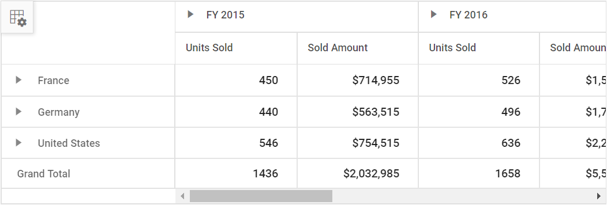

<!-- markdownlint-disable MD012 -->
<!-- markdownlint-disable MD009 -->

# Switching to older themes style in Blazor Pivot Table Component

From Volume 1, 2020 onwards Syncfusion has revised the theming and layout of the Pivot Table. So, to inherit the older theme style and layout please do the necessary changes in CSS and pivot table height.

## CSS Selectors

In current theme, the cells can be differentiated by their background colors. To avoid it, you need to override its background colors via simple CSS coding within your application. The below CSS selectors allow to achieve the same for material, fabric, bootstrap and bootstrap v4 themes.

```html      
    <!-- Codes here... -->
    <style>
        .e-pivotview .e-rowsheader, 
        .e-pivotview .e-columnsheader,
        .e-pivotview .e-gtot,
        .e-pivotview .e-content,
        .e-pivotview .e-gridheader,
        .e-pivotview .e-headercell {
            background-color:#fff !important;
        }
    </style>

```

Meanwhile for high contrast theme, we need to set the following CSS.

```html      
    <!-- Codes here... -->
    <style>
        .e-pivotview .e-rowsheader, 
        .e-pivotview .e-columnsheader,
        .e-pivotview .e-gtot,
        .e-pivotview .e-content,
        .e-pivotview .e-gridheader,
        .e-pivotview .e-headercell {
            background-color:#000 !important;
        }
    </style>

```

## Adjusting Row Height

In current theme, to make the component compact we have reduced the height of each pivot table rows. But user can reset the height of the pivot table using the [`RowHeight`](https://help.syncfusion.com/cr/blazor/Syncfusion.Blazor.PivotView.PivotViewGridSettings.html#Syncfusion_Blazor_PivotView_PivotViewGridSettings_RowHeight) property in [`PivotViewGridSettings`](https://help.syncfusion.com/cr/blazor/Syncfusion.Blazor.PivotView.PivotViewGridSettings.html). In older theme, the property was set to 36 pixels for desktop layout and 48 pixels for mobile layout. So reset the [`RowHeight`](https://help.syncfusion.com/cr/blazor/Syncfusion.Blazor.PivotView.PivotViewGridSettings.html#Syncfusion_Blazor_PivotView_PivotViewGridSettings_RowHeight) accordingly to visualize the older theme style.

In the below code sample, we replicate the older theme style.

```csharp
    @using Syncfusion.Blazor.PivotView

    <SfPivotView TValue="ProductDetails">
        <PivotViewDataSourceSettings DataSource="@data">
            <PivotViewColumns>
                <PivotViewColumn Name="Year"></PivotViewColumn>
                <PivotViewColumn Name="Quarter"></PivotViewColumn>
            </PivotViewColumns>
            <PivotViewRows>
                <PivotViewRow Name="Country"></PivotViewRow>
                <PivotViewRow Name="Products"></PivotViewRow>
            </PivotViewRows>
            <PivotViewValues>
                <PivotViewValue Name="Sold" Caption="Units Sold"></PivotViewValue>
                <PivotViewValue Name="Amount" Caption="Sold Amount"></PivotViewValue>
            </PivotViewValues>
            <PivotViewFormatSettings>
                <PivotViewFormatSetting Name="Amount" Format="C"></PivotViewFormatSetting>
            </PivotViewFormatSettings>
        </PivotViewDataSourceSettings>
        <PivotViewGridSettings RowHeight=36></PivotViewGridSettings>
    </SfPivotView>

    @code{
        public List<ProductDetails> data { get; set; }
        protected override void OnInitialized()
        {
            this.data = ProductDetails.GetProductData().ToList();
           //Bind the data source collection here. Refer "Assigning sample data to the pivot table" section in getting started for more details.
        }
    }

    <style>
        .e-pivotview .e-rowsheader, 
        .e-pivotview .e-columnsheader,
        .e-pivotview .e-gtot,
        .e-pivotview .e-content,
        .e-pivotview .e-gridheader,
        .e-pivotview .e-headercell {
            background-color:#fff !important;
        }
    </style>

```



> You can refer to our [Blazor Pivot Table](https://www.syncfusion.com/blazor-components/blazor-pivot-table) feature tour page for its groundbreaking feature representations. You can also explore our [Blazor Pivot Table example](https://blazor.syncfusion.com/demos/pivot-table/default-functionalities?theme=bootstrap4) to knows how to render and configure the pivot table.