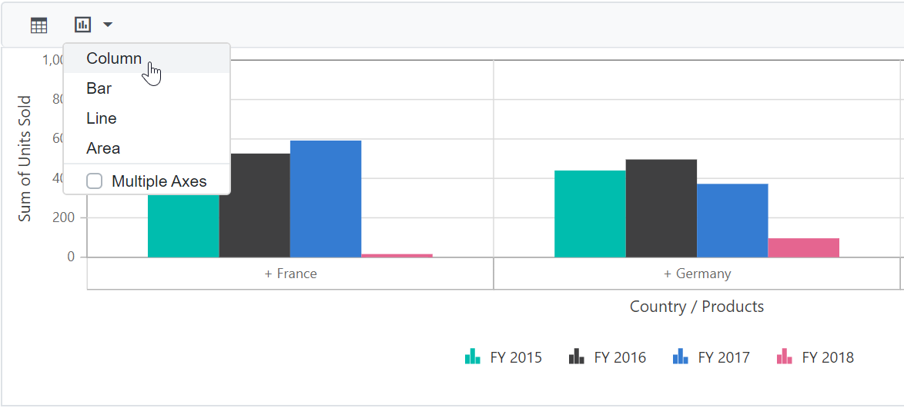
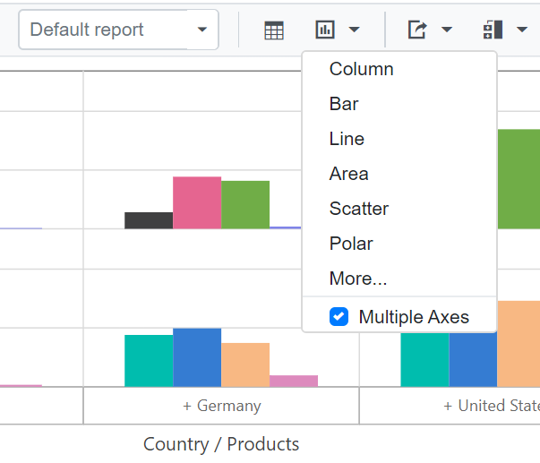
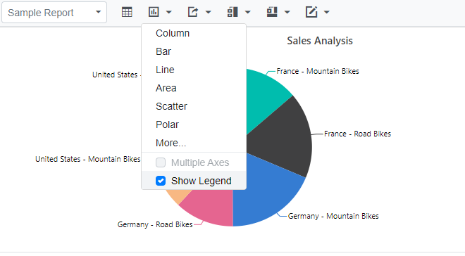

# Toolbar in Blazor Pivot Table Component

Toolbar option allows to access the frequently used features like switching between pivot table and pivot chart, changing chart types, conditional formatting, exporting, etc. with ease at runtime. This option can be enabled by setting the [ShowToolbar](https://help.syncfusion.com/cr/blazor/Syncfusion.Blazor.PivotView.SfPivotView-1.html#Syncfusion_Blazor_PivotView_SfPivotView_1_ShowToolbar) property in [SfPivotView](https://help.syncfusion.com/cr/blazor/Syncfusion.Blazor.PivotView.SfPivotView-1.html) class to **true**. The [Toolbar](https://help.syncfusion.com/cr/blazor/Syncfusion.Blazor.PivotView.SfPivotView-1.html#Syncfusion_Blazor_PivotView_SfPivotView_1_Toolbar) property in [SfPivotView](https://help.syncfusion.com/cr/blazor/Syncfusion.Blazor.PivotView.SfPivotView-1.html) class accepts the collection of built-in toolbar options.

## Built-in Toolbar Options

The following table shows built-in toolbar options and its actions.

| Built-in Toolbar Options | Actions |
|------------------------|---------|
| New | Creates a new report |
| Save | Saves the current report |
| Save As | Save as current report |
| Rename | Renames the current report |
| Delete | Deletes the current report |
| Load | Loads any report from the report list |
| Grid | Shows pivot table |
| Chart | Shows a chart in any type from the built-in list and option to enable/disable multiple axes |
| Exporting | Exports the pivot table as PDF/Excel/CSV and the pivot chart as PDF and image |
| Sub-total | Shows or hides sub totals |
| Grand Total | Shows or hides grand totals |
| Conditional Formatting | Shows the conditional formatting pop-up to apply formatting |
| Number Formatting | Shows the number formatting pop-up to apply number formatting |
| Field List | Shows the fieldlist pop-up |
| MDX | Shows the MDX query that was run to retrieve data from the OLAP data source. **NOTE: This applies only to the OLAP data source.** |

> The order of toolbar options can be changed by simply moving the position of items in the [ToolbarItems](https://help.syncfusion.com/cr/blazor/Syncfusion.Blazor.PivotView.ToolbarItems.html) collection. Also if end user wants to remove any toolbar option from getting displayed, it can be simply ignored from adding into the [ToolbarItems](https://help.syncfusion.com/cr/blazor/Syncfusion.Blazor.PivotView.ToolbarItems.html) collection.

```cshtml
@using Syncfusion.Blazor.PivotView

<SfPivotView TValue="ProductDetails" @ref="pivot" ShowFieldList="true" ShowToolbar="true" Toolbar="@toolbar" AllowConditionalFormatting="true" AllowPdfExport="true" AllowExcelExport="true">
    <PivotViewDisplayOption Primary=Primary.Table View=View.Both></PivotViewDisplayOption>
        <PivotViewDataSourceSettings DataSource="@data" ShowGrandTotals="true" ShowSubTotals="true">
            <PivotViewColumns>
                <PivotViewColumn Name="Year"></PivotViewColumn>
                <PivotViewColumn Name="Quarter"></PivotViewColumn>
            </PivotViewColumns>
            <PivotViewRows>
                <PivotViewRow Name="Country"></PivotViewRow>
                <PivotViewRow Name="Products"></PivotViewRow>
            </PivotViewRows>
            <PivotViewValues>
                <PivotViewValue Name="Sold" Caption="Units Sold"></PivotViewValue>
                <PivotViewValue Name="Amount" Caption="Sold Amount"></PivotViewValue>
            </PivotViewValues>
            <PivotViewFormatSettings>
                <PivotViewFormatSetting Name="Amount" Format="C"></PivotViewFormatSetting>
            </PivotViewFormatSettings>
        </PivotViewDataSourceSettings>
        <PivotViewEvents TValue="ProductDetails" RenameReport="renamereport" RemoveReport="removereport" SaveReport="savereport" LoadReport="loadreport" FetchReport="fetchreport" ></PivotViewEvents>
        <PivotViewGridSettings ColumnWidth="140"></PivotViewGridSettings>
</SfPivotView>

@code{
    SfPivotView<ProductDetails> pivot;
    public List<ToolbarItems> toolbar = new List<ToolbarItems> {
        ToolbarItems.New,
        ToolbarItems.Load,
        ToolbarItems.Remove,
        ToolbarItems.Rename,
        ToolbarItems.SaveAs,
        ToolbarItems.Save,
        ToolbarItems.Grid,
        ToolbarItems.Chart,
        ToolbarItems.Export,
        ToolbarItems.SubTotal,
        ToolbarItems.GrandTotal,
        ToolbarItems.ConditionalFormatting,
        ToolbarItems.FieldList
    };
    public List<ProductDetails> data { get; set; }
    protected override void OnInitialized()
    {
        this.data = ProductDetails.GetProductData().ToList();
        //Bind the data source collection here. Refer "Assigning sample data to the pivot table" section in getting started for more details.
    }
    public List<string> report = new List<string>();
    public List<string> reportName = new List<string>();
    //to save report
    public void savereport(SaveReportArgs args)
    {
        var i = 0;
        bool isSaved = false;
        for (i = 0; i < this.reportName.Count; i++)
        {
            if (this.reportName[i] == args.ReportName)
            {
                this.report[i] = args.Report;
                isSaved = true;
            }
        }
        if (args.Report != null && !(isSaved))
        {
            this.report.Add(args.Report);
            this.reportName.Add(args.ReportName);
        }

    }
    //fetch reports
    public void fetchreport(FetchReportArgs args)
    {
        args.ReportName = this.reportName.ToArray();

    }
    //to load the selected report
    public void loadreport(LoadReportArgs args)
    {
        var i = 0;
        var j = 0;
        for (i = 0; i < this.reportName.Count; i++)
        {
            if (this.reportName[i] == args.ReportName)
            {
                j = i;
            }
        }
        this.pivot.LoadPersistDataAsync(this.report[j]);
    }
    //to delete a report
    public void removereport(RemoveReportArgs args)
    {
        var i = 0;
        for( i=0;i<this.reportName.Count; i++)
        {
            if(this.reportName[i] == args.ReportName)
            {
                this.reportName.RemoveAt(i);
                this.report.RemoveAt(i);
            }
        }
    }
    // to rename a report
    public void renamereport(RenameReportArgs args)
    {
        var i = 0;
        for( i=0;i<=(this.reportName.Count - 1); i++)
        {
            if(this.reportName[i] == args.ReportName)
            {
                this.reportName.RemoveAt(i);
                this.reportName.Add(args.Rename);
            }
        }
    }
}

```


## Show desired chart types in the dropdown menu

By default, all the chart types are displayed in the dropdown menu included in the toolbar. However, based on the request for an application, it is required to show selective chart types on own. This can be achieved using the [ChartTypes](https://help.syncfusion.com/cr/blazor/Syncfusion.Blazor.PivotView.SfPivotView-1.html#Syncfusion_Blazor_PivotView_SfPivotView_1_ChartTypes) property. To know more about supporting chart types, [click here](https://blazor.syncfusion.com/documentation/pivot-table/pivot-chart/#chart-types).

```cshtml
@using Syncfusion.Blazor.PivotView

<SfPivotView TValue="ProductDetails" ShowToolbar="true" Toolbar="@toolbar" ChartTypes="@chartTypes">
    <PivotViewDisplayOption Primary=Primary.Table View=View.Both></PivotViewDisplayOption>
        <PivotViewDataSourceSettings DataSource="@data">
            <PivotViewColumns>
                <PivotViewColumn Name="Year"></PivotViewColumn>
                <PivotViewColumn Name="Quarter"></PivotViewColumn>
            </PivotViewColumns>
            <PivotViewRows>
                <PivotViewRow Name="Country"></PivotViewRow>
                <PivotViewRow Name="Products"></PivotViewRow>
            </PivotViewRows>
            <PivotViewValues>
                <PivotViewValue Name="Sold" Caption="Units Sold"></PivotViewValue>
                <PivotViewValue Name="Amount" Caption="Sold Amount"></PivotViewValue>
            </PivotViewValues>
            <PivotViewFormatSettings>
                <PivotViewFormatSetting Name="Amount" Format="C"></PivotViewFormatSetting>
            </PivotViewFormatSettings>
        </PivotViewDataSourceSettings>
        <PivotViewGridSettings ColumnWidth="140"></PivotViewGridSettings>
</SfPivotView>

@code{
    public List<ToolbarItems> toolbar = new List<ToolbarItems> {
        ToolbarItems.Grid,
        ToolbarItems.Chart,
    };
    public List<ChartSeriesType> chartTypes = new List <ChartSeriesType> {
        ChartSeriesType.Column,
        ChartSeriesType.Bar,
        ChartSeriesType.Line,
        ChartSeriesType.Area,
    };
    public List<ProductDetails> data { get; set; }
    protected override void OnInitialized()
    {
        this.data = ProductDetails.GetProductData().ToList();
        //Bind the data source collection here. Refer "Assigning sample data to the pivot table" section in getting started for more details.
    }
}

```



## Switch the chart to multiple axes

In the chart, the user can switch from single axis to multiple axes with the help of the built-in checkbox available inside the chart type dropdown menu in the toolbar. For more information [refer here](https://blazor.syncfusion.com/documentation/pivot-table/pivot-chart/#multi-axis).



## Show or hide legend

In the chart, legend can be shown or hidden dynamically with the help of the built-in option available in the chart type drop-down menu.
> By default, the legend will not be visible for the accumulation chart types like pie, doughnut, pyramid, and funnel. Users can enable or disable using the built-in checkbox option.



## Events

### FetchReport

The event [FetchReport](https://help.syncfusion.com/cr/blazor/Syncfusion.Blazor.PivotView.PivotViewEvents-1.html#Syncfusion_Blazor_PivotView_PivotViewEvents_1_FetchReport) is triggered when dropdown list is clicked in the toolbar in-order to retrieve and populate saved reports. It has following parameter - [ReportName](https://help.syncfusion.com/cr/blazor/Syncfusion.Blazor.PivotView.FetchReportArgs.html#Syncfusion_Blazor_PivotView_FetchReportArgs_ReportName). This event allows the user to fetch the report names from the local storage and populate the dropdown list.

### LoadReport

The event [LoadReport](https://help.syncfusion.com/cr/blazor/Syncfusion.Blazor.PivotView.PivotViewEvents-1.html#Syncfusion_Blazor_PivotView_PivotViewEvents_1_FetchReport) is triggered when a report is selected from the dropdown list in the toolbar. It has the following parameters - [Report](https://help.syncfusion.com/cr/blazor/Syncfusion.Blazor.PivotView.LoadReportArgs.html#Syncfusion_Blazor_PivotView_LoadReportArgs_Report) and [ReportName](https://help.syncfusion.com/cr/blazor/Syncfusion.Blazor.PivotView.LoadReportArgs.html#Syncfusion_Blazor_PivotView_LoadReportArgs_ReportName). This event allows the user to load the selected report to the pivot table.

### NewReport

The event [NewReport](https://help.syncfusion.com/cr/blazor/Syncfusion.Blazor.PivotView.PivotViewEvents-1.html#Syncfusion_Blazor_PivotView_PivotViewEvents_1_NewReport) is triggered when the new report icon is clicked in the toolbar. It has following parameter - [Report](https://help.syncfusion.com/cr/blazor/Syncfusion.Blazor.PivotView.NewReportArgs.html#Syncfusion_Blazor_PivotView_NewReportArgs_Report). This event allows user to create new report and add to the report list.

### RenameReport

The event [RenameReport](https://help.syncfusion.com/cr/blazor/Syncfusion.Blazor.PivotView.PivotViewEvents-1.html#Syncfusion_Blazor_PivotView_PivotViewEvents_1_RenameReport) is triggered when rename report icon is clicked in the toolbar. It has following parameters  - [Rename](https://help.syncfusion.com/cr/blazor/Syncfusion.Blazor.PivotView.RenameReportArgs.html#Syncfusion_Blazor_PivotView_RenameReportArgs_Rename), [Report](https://help.syncfusion.com/cr/blazor/Syncfusion.Blazor.PivotView.RenameReportArgs.html#Syncfusion_Blazor_PivotView_RenameReportArgs_Report) and [ReportName](https://help.syncfusion.com/cr/blazor/Syncfusion.Blazor.PivotView.RenameReportArgs.html#Syncfusion_Blazor_PivotView_RenameReportArgs_ReportName). This event allows user to rename the selected report from the report list.

### RemoveReport

The event [RemoveReport](https://help.syncfusion.com/cr/blazor/Syncfusion.Blazor.PivotView.PivotViewEvents-1.html#Syncfusion_Blazor_PivotView_PivotViewEvents_1_RemoveReport) is triggered when remove report icon is clicked in the toolbar. It has following parameters  - [Report](https://help.syncfusion.com/cr/blazor/Syncfusion.Blazor.PivotView.RemoveReportArgs.html#Syncfusion_Blazor_PivotView_RemoveReportArgs_Report) and [ReportName](https://help.syncfusion.com/cr/blazor/Syncfusion.Blazor.PivotView.RemoveReportArgs.html#Syncfusion_Blazor_PivotView_RemoveReportArgs_ReportName). This event allows user to remove the selected report from the report list.

### SaveReport

The event [SaveReport](https://help.syncfusion.com/cr/blazor/Syncfusion.Blazor.PivotView.PivotViewEvents-1.html#Syncfusion_Blazor_PivotView_PivotViewEvents_1_SaveReport) is triggered when save report icon is clicked in the toolbar. It has the following parameters - [Report](https://help.syncfusion.com/cr/blazor/Syncfusion.Blazor.PivotView.SaveReportArgs.html#Syncfusion_Blazor_PivotView_SaveReportArgs_Report) and [ReportName](https://help.syncfusion.com/cr/blazor/Syncfusion.Blazor.PivotView.SaveReportArgs.html#Syncfusion_Blazor_PivotView_SaveReportArgs_ReportName). This event allows user to save the altered report to the report list.

<!-- markdownlint-disable MD028 -->

### BeforeExport

The pivot table (or) pivot chart can be exported as a pdf, excel, csv etc.,  document using the toolbar options. And, you can customize the export settings for exporting document by using the `BeforeExport` event in the toolbar.

For example, you can add the header and footer for the pdf document by setting the `header` and `footer` properties for the `PdfExportProperties` in the `BeforeExport` event.

```cshtml
@using Syncfusion.Blazor.PivotView
@using Syncfusion.Blazor.Grids

<SfPivotView @ref="pivot" TValue="ProductDetails" EnableVirtualization="true" ShowFieldList="true" ShowToolbar="true" Toolbar="@toolbar" AllowNumberFormatting="true" AllowConditionalFormatting="true" AllowPdfExport="true" AllowExcelExport="true" Height="300" Width="800">
    <PivotViewDisplayOption Primary=Primary.Table View=View.Both></PivotViewDisplayOption>
        <PivotViewDataSourceSettings DataSource="@data" ShowGrandTotals="true" ShowSubTotals="true">
            <PivotViewColumns>
                <PivotViewColumn Name="Year"></PivotViewColumn>
                <PivotViewColumn Name="Quarter"></PivotViewColumn>
            </PivotViewColumns>
            <PivotViewRows>
                <PivotViewRow Name="Country"></PivotViewRow>
                <PivotViewRow Name="Products"></PivotViewRow>
            </PivotViewRows>
            <PivotViewValues>
                <PivotViewValue Name="Sold" Caption="Units Sold"></PivotViewValue>
                <PivotViewValue Name="Amount" Caption="Sold Amount"></PivotViewValue>
            </PivotViewValues>
            <PivotViewFormatSettings>
                <PivotViewFormatSetting Name="Amount" Format="C"></PivotViewFormatSetting>
            </PivotViewFormatSettings>
        </PivotViewDataSourceSettings>
        <PivotViewEvents TValue="ProductDetails" BeforeExport="beforeExport" RenameReport="renamereport" RemoveReport="removereport" SaveReport="savereport" LoadReport="loadreport" FetchReport="fetchreport" ></PivotViewEvents>
        <PivotViewGridSettings ColumnWidth="140"></PivotViewGridSettings>
</SfPivotView>

@code{
    SfPivotView<ProductDetails> pivot;

    public List<ToolbarItems> toolbar = new List<ToolbarItems> {
        ToolbarItems.New,
        ToolbarItems.Load,
        ToolbarItems.Remove,
        ToolbarItems.Rename,
        ToolbarItems.SaveAs,
        ToolbarItems.Save,
        ToolbarItems.Grid,
        ToolbarItems.Chart,
        ToolbarItems.Export,
        ToolbarItems.SubTotal,
        ToolbarItems.GrandTotal,
        ToolbarItems.ConditionalFormatting,
        ToolbarItems.NumberFormatting,
        ToolbarItems.FieldList
    };
    public List<ProductDetails> data { get; set; }
    protected override void OnInitialized()
    {
        this.data = ProductDetails.GetProductData().ToList();
        //Bind the data source collection here. Refer "Assigning sample data to the pivot table" section in getting started for more details.
    }
    public List<PdfHeaderFooterContent> HeaderContent = new List<PdfHeaderFooterContent>
    {
        new PdfHeaderFooterContent() { Type = ContentType.Line, Points = new PdfPoints() { X1 = 0, Y1 = 4, X2 = 685, Y2 = 4 }, Style = new PdfContentStyle() { PenColor = "#000080", DashStyle = PdfDashStyle.Solid }}
    };
    public void beforeExport(BeforeExportEventArgs args) {
        PdfExportProperties ExportProperties = new PdfExportProperties();
        PdfHeader Header = new PdfHeader()
        {
            FromTop = 0,
            Height = 130,
            Contents = HeaderContent
        };
        ExportProperties.Header = Header;
        args.PdfExportProperties = ExportProperties;

            ExcelExportProperties ExcelProperties = new ExcelExportProperties();
        ExcelTheme Theme = new ExcelTheme();

        ExcelStyle ThemeStyle = new ExcelStyle()
        {
            FontName = "Segoe UI",
            FontColor = "#666666",
            FontSize = 20
        };

        Theme.Header = ThemeStyle;
        Theme.Record = ThemeStyle;
        Theme.Caption = ThemeStyle;
        ExcelProperties.Theme = Theme;
        args.ExcelExportProperties = ExcelProperties;
    }
    public List<string> report = new List<string>();
    public List<string> reportName = new List<string>();
    //to save report
    public void savereport(SaveReportArgs args)
    {
        var i = 0;
        bool isSaved = false;
        for (i = 0; i < this.reportName.Count; i++)
        {
            if (this.reportName[i] == args.ReportName)
            {
                this.report[i] = args.Report;
                isSaved = true;
            }
        }
        if (args.Report != null && !(isSaved))
        {
            this.report.Add(args.Report);
            this.reportName.Add(args.ReportName);
        }

    }
    //fetch reports
    public void fetchreport(FetchReportArgs args)
    {
        args.ReportName = this.reportName.ToArray();

    }
    //to load the selected report
    public void loadreport(LoadReportArgs args)
    {
        var i = 0;
        var j = 0;
        for (i = 0; i < this.reportName.Count; i++)
        {
            if (this.reportName[i] == args.ReportName)
            {
                j = i;
            }
        }
        this.pivot.LoadPersistDataAsync(this.report[j]);
    }
    //to delete a report
    public void removereport(RemoveReportArgs args)
    {
        var i = 0;
        for( i=0;i<this.reportName.Count; i++)
        {
            if(this.reportName[i] == args.ReportName)
            {
                this.reportName.RemoveAt(i);
                this.report.RemoveAt(i);
            }
        }
    }
    // to rename a report
    public void renamereport(RenameReportArgs args)
    {
        var i = 0;
        for( i=0;i<=(this.reportName.Count - 1); i++)
        {
            if(this.reportName[i] == args.ReportName)
            {
                this.reportName.RemoveAt(i);
                this.reportName.Add(args.Rename);
            }
        }
    }
}

```

### OnActionBegin

The event [OnActionBegin](https://help.syncfusion.com/cr/blazor/Syncfusion.Blazor.PivotView.PivotViewEvents-1.html#Syncfusion_Blazor_PivotView_PivotViewEvents_1_OnActionBegin) triggers when the UI actions such as switching between pivot table and pivot chart, changing chart types, conditional formatting, exporting, etc. that are present in toolbar UI begin. This allows user to identify the current action being performed at runtime. It has the following parameters:

* [DataSourceSettings](https://help.syncfusion.com/cr/blazor/Syncfusion.Blazor.PivotView.PivotActionBeginEventArgs.html#Syncfusion_Blazor_PivotView_PivotActionBeginEventArgs_DataSourceSettings) : It holds the current data source settings such as input data source, rows, columns, values, filters, format settings and so on.
* [ActionName](https://help.syncfusion.com/cr/blazor/Syncfusion.Blazor.PivotView.PivotActionBeginEventArgs.html#Syncfusion_Blazor_PivotView_PivotActionBeginEventArgs_ActionName) : It holds the name of the current action began. The following are the UI actions and their names:

|Action |	Action Name|
| ------ | --------- |
|New report	| Add new report |
|Save report | 	Save current report |
|Save as report	| Save as current report |
|Rename report | Rename current report |
|Remove report | Remove current report |
|Report change | Report change |
|Conditional Formatting | Open conditional formatting dialog |
|Number Formatting|	Open number formatting dialog|
|Export menu | PDF export, Excel export, CSV export, JPG export, PNG export |
|Show field list | Open field list |
|Show Table | Show table view |
|Chart menu | Show chart view |
|MDX query | Open MDX query dialog |
|Sub-totals menu |	Hide sub-totals, Show row sub-totals, Show column sub-totals, Show sub-totals |
|Grand totals menu | Hide grand totals, Show row grand totals, Show column grand totals, Show grand totals |


* [Cancel](https://help.syncfusion.com/cr/blazor/Syncfusion.Blazor.PivotView.PivotActionBeginEventArgs.html#Syncfusion_Blazor_PivotView_PivotActionBeginEventArgs_Cancel) : It allows user to restrict the current action.

In the below sample, toolbar UI actions such as add new report and save current report can be restricted by setting the **args.Cancel** option to **true** in the `OnActionBegin` event.

```cshtml
@using Syncfusion.Blazor.PivotView;

<div class="Pivot">
<SfPivotView TValue="ProductDetails" ID="PivotView" AllowExcelExport="true" AllowPdfExport="true" @ref="pivot" Width="100%"  ShowToolbar="true" ShowTooltip="false" Toolbar="@toolbar" ShowGroupingBar="true" AllowCalculatedField="true"  AllowDrillThrough="true" AllowConditionalFormatting="true" AllowNumberFormatting="true" EnableVirtualization="true" ShowFieldList="true" Height="400">
    <PivotViewDisplayOption Primary="Primary.Table" View="View.Both"></PivotViewDisplayOption>
    <PivotViewDataSourceSettings DataSource="@Data" ExpandAll="true" EmptyCellsTextContent="nil" EnableSorting=true>
        <PivotViewColumns>
            <PivotViewColumn Name="Year"></PivotViewColumn>
            <PivotViewColumn Name="Quarter"></PivotViewColumn>
        </PivotViewColumns>
        <PivotViewRows>
            <PivotViewRow Name="Country"></PivotViewRow>
            <PivotViewRow Name="Products"></PivotViewRow>
        </PivotViewRows>
        <PivotViewValues>
            <PivotViewValue Name="Sold" Caption="Unit Sold" ></PivotViewValue>
            <PivotViewValue Name="Amount" Caption="Sold Amount" ></PivotViewValue>
        </PivotViewValues>
        <PivotViewFormatSettings>
            <PivotViewFormatSetting Name="Amount" Format="N" UseGrouping=true></PivotViewFormatSetting>
        </PivotViewFormatSettings>
    </PivotViewDataSourceSettings>
    <PivotViewCellEditSettings AllowAdding="true" AllowDeleting="true" AllowEditing="true" Mode=EditMode.Normal></PivotViewCellEditSettings>
    <PivotChartSettings Title="Sales Analysis" >       
        <PivotChartPrimaryYAxis>
            <PivotChartPrimaryYAxisBorder Width="0"></PivotChartPrimaryYAxisBorder>
        </PivotChartPrimaryYAxis>
    </PivotChartSettings>
    <PivotViewEvents TValue="PivotProductDetails" OnActionBegin="actionBegin"></PivotViewEvents>
</SfPivotView>

@code{

    private SfPivotFieldList<PivotProductDetails> fieldList;
    private SfPivotView<PivotProductDetails> pivot;
    private List<Syncfusion.Blazor.PivotView.ToolbarItems> toolbar = new List<Syncfusion.Blazor.PivotView.ToolbarItems> {
        ToolbarItems.New,
        ToolbarItems.Save,
        ToolbarItems.Grid,
        ToolbarItems.Chart,
        ToolbarItems.Export,
        ToolbarItems.SubTotal,
        ToolbarItems.GrandTotal,
        ToolbarItems.ConditionalFormatting,
        ToolbarItems.NumberFormatting,
        ToolbarItems.FieldList            
    };
    public List<PivotProductDetails> Data { get; set; }
   
    protected override void OnInitialized()
    {
        this.Data = ProductDetails.GetProductData();
        // Bind the data source collection here. Refer "Assigning sample data to the pivot table" section in getting started for more details.
        
    }
    
    // Triggers when the UI action begins.
    public void actionBegin(PivotActionBeginEventArgs args)
    {
        if(args.ActionName == "Add new report" && args.ActionName == "Save current report")
        {
          args.Cancel=true;
        }       
    }

```

### OnActionComplete

The event [OnActionComplete](https://help.syncfusion.com/cr/blazor/Syncfusion.Blazor.PivotView.PivotViewEvents-1.html#Syncfusion_Blazor_PivotView_PivotViewEvents_1_OnActionComplete) triggers when the UI actions such as as switching between pivot table and pivot chart, changing chart types, conditional formatting, exporting, etc. that are present in toolbar UI, is completed. This allows user to identify the current UI actions being completed at runtime. It has the following parameters:

* [DataSourceSettings](https://help.syncfusion.com/cr/blazor/Syncfusion.Blazor.PivotView.PivotActionCompleteEventArgs.html#Syncfusion_Blazor_PivotView_PivotActionCompleteEventArgs_DataSourceSettings) : It holds the current data source settings such as input data source, rows, columns, values, filters, format settings and so on.
* [ActionName](https://help.syncfusion.com/cr/blazor/Syncfusion.Blazor.PivotView.PivotActionCompleteEventArgs.html#Syncfusion_Blazor_PivotView_PivotActionCompleteEventArgs_ActionName) : It holds the name of the current action completed. The following are the UI actions and their names:

|Action |	Action Name|
| ------ | --------- |
|New report	| New report added |
|Save report | 	Report saved |
|Save as report	| Report re-saved |
|Rename report | Report renamed |
|Remove report | Report removed |
|Report change | Report changed |
|Conditional Formatting | Conditionally formatted |
|Number Formatting|	Number formatted|
|Export menu | PDF exported, Excel exported, CSV exported, JPG exported, PNG exported |
|Show field list | Field list closed |
|Show Table | Table view shown |
|Chart menu | Chart view shown |
|MDX query | MDX query copied |
|Sub-totals menu |	Sub-totals hidden, Row sub-totals shown, Column sub-totals shown, Sub-totals shown |
|Grand-totals menu | Grand totals hidden, Row grand totals shown, Column grand totals shown, Grand totals shown |

* [ActionInfo](https://help.syncfusion.com/cr/blazor/Syncfusion.Blazor.PivotView.PivotActionCompleteEventArgs.html#Syncfusion_Blazor_PivotView_PivotActionCompleteEventArgs_ActionInfo) : It holds the unique information about the current UI action. For example, while adding new report, the event argument contains information such as report name and the action name.

```cshtml
@using Syncfusion.Blazor.PivotView;

<div class="Pivot">
<SfPivotView TValue="ProductDetails" ID="PivotView" AllowExcelExport="true" AllowPdfExport="true" @ref="pivot" Width="100%"  ShowToolbar="true" ShowTooltip="false" Toolbar="@toolbar" ShowGroupingBar="true" AllowCalculatedField="true"  AllowDrillThrough="true" AllowConditionalFormatting="true" AllowNumberFormatting="true" EnableVirtualization="true" ShowFieldList="true" Height="400">
    <PivotViewDisplayOption Primary="Primary.Table" View="View.Both"></PivotViewDisplayOption>
    <PivotViewDataSourceSettings DataSource="@Data" ExpandAll="true" EmptyCellsTextContent="nil" EnableSorting=true>
        <PivotViewColumns>
            <PivotViewColumn Name="Year"></PivotViewColumn>
            <PivotViewColumn Name="Quarter"></PivotViewColumn>
        </PivotViewColumns>
        <PivotViewRows>
            <PivotViewRow Name="Country"></PivotViewRow>
            <PivotViewRow Name="Products"></PivotViewRow>
        </PivotViewRows>
        <PivotViewValues>
            <PivotViewValue Name="Sold" Caption="Unit Sold" ></PivotViewValue>
            <PivotViewValue Name="Amount" Caption="Sold Amount" ></PivotViewValue>
        </PivotViewValues>
        <PivotViewFormatSettings>
            <PivotViewFormatSetting Name="Amount" Format="N" UseGrouping=true></PivotViewFormatSetting>
        </PivotViewFormatSettings>
    </PivotViewDataSourceSettings>
    <PivotViewCellEditSettings AllowAdding="true" AllowDeleting="true" AllowEditing="true" Mode=EditMode.Normal></PivotViewCellEditSettings>
    <PivotChartSettings Title="Sales Analysis" >       
        <PivotChartPrimaryYAxis>
            <PivotChartPrimaryYAxisBorder Width="0"></PivotChartPrimaryYAxisBorder>
        </PivotChartPrimaryYAxis>
    </PivotChartSettings>
    <PivotViewEvents TValue="PivotProductDetails" OnActionComplete="actionComplete"></PivotViewEvents>
</SfPivotView>

@code{

    private SfPivotFieldList<PivotProductDetails> fieldList;
    private SfPivotView<PivotProductDetails> pivot;
    private List<Syncfusion.Blazor.PivotView.ToolbarItems> toolbar = new List<Syncfusion.Blazor.PivotView.ToolbarItems> {
        ToolbarItems.New,
        ToolbarItems.Save,
        ToolbarItems.Grid,
        ToolbarItems.Chart,
        ToolbarItems.Export,
        ToolbarItems.SubTotal,
        ToolbarItems.GrandTotal,
        ToolbarItems.ConditionalFormatting,
        ToolbarItems.NumberFormatting,
        ToolbarItems.FieldList            
    };
    public List<PivotProductDetails> Data { get; set; }
   
    protected override void OnInitialized()
    {
        this.Data = ProductDetails.GetProductData();
        // Bind the data source collection here. Refer "Assigning sample data to the pivot table" section in getting started for more details.

    }
    
    // Triggers when the UI action is completed.
    public void actionComplete(PivotActionCompleteEventArgs args)
    {
        if(args.ActionName == "New report added" && args.ActionName == "Report saved")
        {
            /// Your code here.
        }
    }

```

### OnActionFailure

The event [OnActionFailure](https://help.syncfusion.com/cr/blazor/Syncfusion.Blazor.PivotView.PivotViewEvents-1.html#Syncfusion_Blazor_PivotView_PivotViewEvents_1_OnActionFailure) triggers when the current UI action fails to achieve the desired result. It has the following parameters:

* [ActionName](https://help.syncfusion.com/cr/blazor/Syncfusion.Blazor.PivotView.PivotActionFailureEventArgs.html#Syncfusion_Blazor_PivotView_PivotActionFailureEventArgs_ActionName) : It holds the name of the current action failed. The following are the UI actions and their names:

|Action |	Action Name|
| ------ | --------- |
|New report	| Add new report |
|Save report | 	Save current report |
|Save as report	| Save as current report |
|Rename report | Rename current report |
|Remove report | Remove current report |
|Report change | Report change |
|Conditional Formatting | Open conditional formatting dialog |
|Number Formatting|	Open number formatting dialog|
|Export menu | PDF export, Excel export, CSV export, JPG export, PNG export |
|Show field list | Open field list |
|Show Table | Show table view |
|Chart menu | Show chart view |
|MDX query | Open MDX query dialog |
|Sub-totals menu |	Hide sub-totals, Show row sub-totals, Show column sub-totals, Show sub-totals |
|Grand totals menu | Hide grand totals, Show row grand totals, Show column grand totals, Show grand totals|

* [ErrorInfo](https://help.syncfusion.com/cr/blazor/Syncfusion.Blazor.PivotView.PivotActionFailureEventArgs.html#Syncfusion_Blazor_PivotView_PivotActionFailureEventArgs_ErrorInfo) : It holds the error information of the current UI action.

 
```cshtml
@using Syncfusion.Blazor.PivotView;

<div class="Pivot">
<SfPivotView TValue="ProductDetails" ID="PivotView" AllowExcelExport="true" AllowPdfExport="true" @ref="pivot" Width="100%"  ShowToolbar="true" ShowTooltip="false" Toolbar="@toolbar" ShowGroupingBar="true" AllowCalculatedField="true"  AllowDrillThrough="true" AllowConditionalFormatting="true" AllowNumberFormatting="true" EnableVirtualization="true" ShowFieldList="true" Height="400">
    <PivotViewDisplayOption Primary="Primary.Table" View="View.Both"></PivotViewDisplayOption>
    <PivotViewDataSourceSettings DataSource="@Data" ExpandAll="true" EmptyCellsTextContent="nil" EnableSorting=true>
        <PivotViewColumns>
            <PivotViewColumn Name="Year"></PivotViewColumn>
            <PivotViewColumn Name="Quarter"></PivotViewColumn>
        </PivotViewColumns>
        <PivotViewRows>
            <PivotViewRow Name="Country"></PivotViewRow>
            <PivotViewRow Name="Products"></PivotViewRow>
        </PivotViewRows>
        <PivotViewValues>
            <PivotViewValue Name="Sold" Caption="Unit Sold" ></PivotViewValue>
            <PivotViewValue Name="Amount" Caption="Sold Amount" ></PivotViewValue>
        </PivotViewValues>
        <PivotViewFormatSettings>
            <PivotViewFormatSetting Name="Amount" Format="N" UseGrouping=true></PivotViewFormatSetting>
        </PivotViewFormatSettings>
    </PivotViewDataSourceSettings>
    <PivotViewCellEditSettings AllowAdding="true" AllowDeleting="true" AllowEditing="true" Mode=EditMode.Normal></PivotViewCellEditSettings>
    <PivotChartSettings Title="Sales Analysis" >       
        <PivotChartPrimaryYAxis>
            <PivotChartPrimaryYAxisBorder Width="0"></PivotChartPrimaryYAxisBorder>
        </PivotChartPrimaryYAxis>
    </PivotChartSettings>
    <PivotViewEvents TValue="PivotProductDetails" OnActionFailure="actionFailure"></PivotViewEvents>
</SfPivotView>

@code{

    private SfPivotFieldList<PivotProductDetails> fieldList;
    private SfPivotView<PivotProductDetails> Pivot;
    public List<Syncfusion.Blazor.PivotView.ToolbarItems> toolbar = new List<Syncfusion.Blazor.PivotView.ToolbarItems> {
        ToolbarItems.New,
        ToolbarItems.Save,
        ToolbarItems.Grid,
        ToolbarItems.Chart,
        ToolbarItems.Export,
        ToolbarItems.SubTotal,
        ToolbarItems.GrandTotal,
        ToolbarItems.ConditionalFormatting,
        ToolbarItems.NumberFormatting,
        ToolbarItems.FieldList            
    };
    public List<PivotProductDetails> Data { get; set; }
   
    protected override void OnInitialized()
    {
        this.Data = ProductDetails.GetProductData();
        // Bind the data source collection here. Refer "Assigning sample data to the pivot table" section in getting started for more details.
        
    }

    // Triggers when the UI action fails to achieve the desired result.
    public void actionFailure(PivotActionFailureEventArgs args)
    {
        if(args.ActionName=="Add new report")
        {
            /// Your code here.
        }       
    }

> You can refer to the [Blazor Pivot Table](https://www.syncfusion.com/blazor-components/blazor-pivot-table) feature tour page for its groundbreaking feature representations. You can also explore the [Blazor Pivot Table example](https://blazor.syncfusion.com/demos/pivot-table/default-functionalities?theme=bootstrap4) to know how to render and configure the pivot table.