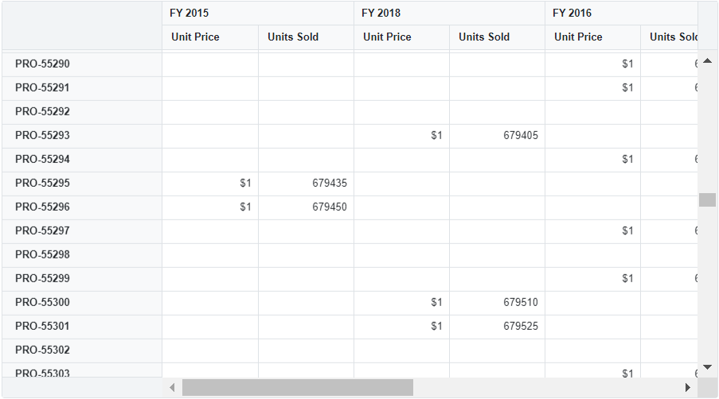

<!-- markdownlint-disable MD036 -->

# Virtual Scrolling in Blazor Pivot Table Component

Allows to load the large amounts of data without any performance degradation by rendering rows and columns only in the current content viewport. Rest of the aggregated data will be brought into viewport dynamically based on vertical or horizontal scroll position. This feature can be enabled by setting the [`EnableVirtualization`](https://help.syncfusion.com/cr/blazor/Syncfusion.Blazor.PivotView.SfPivotView-1.html#Syncfusion_Blazor_PivotView_SfPivotView_1_EnableVirtualization) property in [`SfPivotView`](https://help.syncfusion.com/cr/blazor/Syncfusion.Blazor.PivotView.SfPivotView-1.html) class to **true**.

```csharp
    @using Syncfusion.Blazor.PivotView

    <SfPivotView TValue="PivotVirtualData" Width="100%" Height="500" EnableVirtualization="true" EnableValueSorting="true" ShowTooltip="false">
    <PivotViewDataSourceSettings DataSource="@data" EnableSorting="false" AlwaysShowValueHeader="true">
        <PivotViewColumns>
            <PivotViewColumn Name="Year"></PivotViewColumn>
        </PivotViewColumns>
        <PivotViewRows>
            <PivotViewRow Name="ProductID"></PivotViewRow>
        </PivotViewRows>
        <PivotViewValues>
            <PivotViewValue Name="Price" Caption="Unit Price"></PivotViewValue>
            <PivotViewValue Name="Sold" Caption="Units Sold"></PivotViewValue>
        </PivotViewValues>
        <PivotViewFormatSettings>
            <PivotViewFormatSetting Name="Price" Format="C0"></PivotViewFormatSetting>
        </PivotViewFormatSettings>
    </PivotViewDataSourceSettings>
    <PivotViewGridSettings ColumnWidth="120"></PivotViewGridSettings>
</SfPivotView>
<style>
    .e-pivotview {
        min-height: 200px;
        width:900px;
    }
</style>
@code{
      public List<PivotVirtualData> data { get; set; }
        protected override void OnInitialized()
        {
            this.data =PivotVirtualData.GetVirtualData().ToList();
        }
    public class PivotVirtualData
    {
        public string ProductID { get; set; }
        public string Year { get; set; }
        public string Country { get; set; }
        public string City { get; set; }
        public double Price { get; set; }
        public DateTime Date { get; set; }
        public double Sold { get; set; }

        public static List<PivotVirtualData> GetVirtualData()
        {
            List<PivotVirtualData> VirtualData = new List<PivotVirtualData>();

            for (int i = 1; i <= 100000; i++)
            {
                PivotVirtualData p = new PivotVirtualData
                {
                    ProductID = "PRO-" + (10000 + i),
                    Year = (new string[] { "FY 2015", "FY 2016", "FY 2017", "FY 2018", "FY 2019" })[new Random().Next(5)],
                    Country = "USA",
                    City = "New York",
                    Price = (3.4 * i) + 500,
                    Sold = (i * 15) + 10
                    //date = Convert.ToDateTime("2013/01/06")
                };
                VirtualData.Add(p);
            }
            return VirtualData;
        }
    }
}

```



**Limitations for virtual scrolling**

* In virtual scrolling, the [`ColumnWidth`](https://help.syncfusion.com/cr/blazor/Syncfusion.Blazor.PivotView.PivotViewGridSettings.html#Syncfusion_Blazor_PivotView_PivotViewGridSettings_ColumnWidth) property in [`GridSettings`](https://help.syncfusion.com/cr/blazor/Syncfusion.Blazor.PivotView.PivotViewGridSettings.html) should be in pixel and percentage values are not accepted.
* Resizing columns, setting width to individual columns which affects the calculation used to pick the correct page on scrolling.
* Grouping, which takes additional time to splitting the raw items into the provided format.
* Date Formatting, which takes additional time to convert date format.
* Date Formatting with sorting, here additionally full date time format should be framed to perform sorting along with the provided date format which lags the performance.

## Data Compression

> This property is applicable only for relational data source.

When we bind one million raw data, the pivot table will process all raw data to generate aggregated data during initial rendering and report manipulation. But in data compression, the data will be compressed based on the uniqueness of the raw data, and unique records will be provided as input for the Pivot Table. The compressed data will be used for further operations at all times, reducing the looping complexity and improving the performance of the pivot table. For example, if the pivot table  is connected to one million raw data aggregated to 1,000 unique data means, it will be rendered within 3 seconds rather than 10 seconds. You can enable this option by using the [`AllowDataCompression`](https://help.syncfusion.com/cr/blazor/Syncfusion.Blazor.PivotView.SfPivotView-1.html#Syncfusion_Blazor_PivotView_SfPivotView_1_AllowDataCompression) property along with [`EnableVirtualization`](https://help.syncfusion.com/cr/blazor/Syncfusion.Blazor.PivotView.SfPivotView-1.html#Syncfusion_Blazor_PivotView_SfPivotView_1_EnableVirtualization) property.

> This options will only function when the virtual scrolling is enabled.

```csharp
    @using Syncfusion.Blazor.PivotView

    <SfPivotView TValue="ProductDetails" Width="800" Height="300" EnableVirtualization="true" AllowDataCompression="true">
        <PivotViewDataSourceSettings DataSource="@data">
            <PivotViewColumns>
                <PivotViewColumn Name="Year"></PivotViewColumn>
                <PivotViewColumn Name="Quarter"></PivotViewColumn>
            </PivotViewColumns>
            <PivotViewRows>
                <PivotViewRow Name="Country"></PivotViewRow>
                <PivotViewRow Name="Products"></PivotViewRow>
            </PivotViewRows>
            <PivotViewValues>
                <PivotViewValue Name="Sold" Caption="Unit Sold"></PivotViewValue>
                <PivotViewValue Name="Amount" Caption="Sold Amount"></PivotViewValue>
            </PivotViewValues>
            <PivotViewFormatSettings>
                <PivotViewFormatSetting Name="Amount" Format="C"></PivotViewFormatSetting>
            </PivotViewFormatSettings>
        </PivotViewDataSourceSettings>
    </SfPivotView>

    @code{
        public List<ProductDetails> data { get; set; }
        protected override void OnInitialized()
        {
            this.data = ProductDetails.GetProductData().ToList();
           //Bind the data source collection here. Refer "Assigning sample data to the pivot table" section in getting started for more details.
        }
    }

```

**Limitations during data compression**

* The following aggregation types will not be supported.
    * Average
    * Populationstdev
    * Samplestdev
    * Populationvar
    * Samplevar
* If you use any of the aggregations above, it will result in an aggregation type **"Sum"**.
* Distinctcount will act as **"Count"** aggregation type.
* In the calculated field, an existing field can be inserted without altering its default aggregation type Even if we change it, it would use the default aggregation type back for calculation.

> You can refer to our [Blazor Pivot Table](https://www.syncfusion.com/blazor-components/blazor-pivot-table) feature tour page for its groundbreaking feature representations. You can also explore our [Blazor Pivot Table example](https://blazor.syncfusion.com/demos/pivot-table/default-functionalities?theme=bootstrap4) to knows how to render and configure the pivot table.