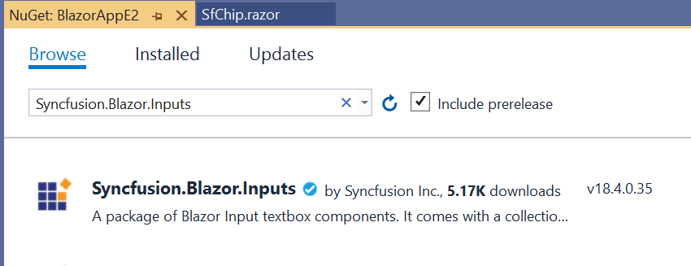

<!-- markdownlint-disable MD024 -->

# Getting Started

This section briefly explains how to include a simple `Range Slider` in your Blazor Server-Side application. Refer to the [Getting Started with Syncfusion Blazor for Server-Side in Visual Studio 2019 page](https://blazor.syncfusion.com/documentation/getting-started/blazor-server-side-visual-studio-2019/) for the introduction and configuring the common specifications.

## Importing Syncfusion Blazor component in the application

### Using Syncfusion.Blazor NuGet Package [New standard]

1. Install **Syncfusion.Blazor.Inputs** NuGet package to the application by using the `NuGet Package Manager`. Refer to the Individual NuGet Packages section for the available NuGet packages.

2. Search Syncfusion.Blazor.Inputs keyword in the Browse tab and install Syncfusion.Blazor.Inputs NuGet package in the application.

3. Once the installation process is completed, the Syncfusion Blazor Inputs package will be installed in the project.

* You can add the client-side style resources using NuGet package to the `<head>` element of the `~/wwwroot/index.html` page in Blazor WebAssembly app or `~/Pages/_Host.cshtml` page in Blazor Server app.
>Note: You can also add the client-side style resources through CDN.

```html
    <head>
        ....
        ....
        <link href="_content/Syncfusion.Blazor/styles/bootstrap4.css" rel="stylesheet" />
    </head>
```

```html
    <head>
        <link href="https://cdn.syncfusion.com/blazor/{:version:}/styles/bootstrap4.css" rel="stylesheet" />
    </head>
```

* For `Internet Explorer 11` kindly refer the polyfills. Refer the [documentation](https://blazor.syncfusion.com/documentation/common/how-to/render-blazor-server-app-in-ie/) for more information.

```csharp
<head>
    <link href="_content/Syncfusion.Blazor/styles/bootstrap4.css" rel="stylesheet" />
    <script src="https://github.com/Daddoon/Blazor.Polyfill/releases/download/3.0.1/blazor.polyfill.min.js"></script>
</head>
```

### Using Syncfusion.Blazor NuGet Package [Old standard]

1. Install **Syncfusion.Blazor** NuGet package to the application by using the `NuGet Package Manager`. Right-click the project and then select Manage NuGet Packages.

2. Search Syncfusion.Blazor keyword in the Browse tab and install Syncfusion.Blazor NuGet package in the application.

3. Once the installation process is completed, the Syncfusion Blazor package will be installed in the project.
W> `Syncfusion.Blazor` package should not be installed along with [individual NuGet packages](https://blazor.syncfusion.com/documentation/nuget-packages/). Hence, you have to add the below `Syncfusion.Blazor.Themes` static web assets (styles) in the application.

* You can add the client-side style resources using NuGet package to the `<head>` element of the `~/wwwroot/index.html` page in Blazor WebAssembly app or `~/Pages/_Host.cshtml` page in Blazor Server app.

```html
    <head>
        ....
        ....
       <link href="_content/Syncfusion.Blazor.Themes/bootstrap4.css" rel="stylesheet" />
    </head>
```

W> If you prefer the above new standard (individual NuGet packages), then skip this section. Using both old and new standards in the same application will throw ambiguous compilation errors.

## Add Syncfusion Blazor service in Startup.cs (Server-side application)

Open the **Startup.cs** file and add services required by Syncfusion components using `services.AddSyncfusionBlazor()` method. Add this method in the `ConfigureServices` function as follows.

```csharp
using Syncfusion.Blazor;

namespace BlazorApplication
{
    public class Startup
    {
        ....
        ....
        public void ConfigureServices(IServiceCollection services)
        {
            ....
            ....
            services.AddSyncfusionBlazor();
        }
    }
}
```

## Add Syncfusion Blazor service in Program.cs (Client-side application)

Open the **Program.cs** file and add services required by Syncfusion components using `builder.services.AddSyncfusionBlazor()` method. Add this method in the `Main` function as follows.

```csharp
using Syncfusion.Blazor;

namespace BlazorApplication
{
    public class Program
    {
        public static async Task Main(string[] args)
        {
            ....
            ....
            builder.Services.AddSyncfusionBlazor();
        }
    }
}
```

>Note: To enable custom client side resource loading from CRG or CDN. You need to disable resource loading by  **AddSyncfusionBlazor(true)** and load the scripts to the `<head>` element of the **~/wwwroot/index.html** page in Blazor WebAssembly app or **~/Pages/_Host.cshtml** page in Blazor Server app.  

```csharp
    <head>
        <script src="https://cdn.syncfusion.com/blazor/{:version:}/syncfusion-blazor.min.js"></script>
    </head>
```

## Adding component package to the application

Open `~/_Imports.razor` file and import the `Syncfusion.Blazor.Inputs` package.

```cshtml
@using Syncfusion.Blazor
@using Syncfusion.Blazor.Inputs
```

## Adding Slider component to the application

Now, add the Syncfusion Blazor Slider component in any web page `razor` in the `Pages` folder. For example, the Slider component is added in the `~/Pages/Index.razor` page.

```cshtml
@using Syncfusion.Blazor.Inputs

<SfSlider Value="30"></SfSlider>
```

## Run the application

 After successful compilation of your application, simply press `F5` to run the application.

Output be like the below.


## See Also

[Slider Types](./types)

[Slider Formatting](./format)

[Orientation Slider](./orientation)

[Ticks in Slider](./ticks)

[Tooltip in Slider](./tooltip)

[Getting Started with Syncfusion Blazor for Client-Side in .NET Core CLI](https://blazor.syncfusion.com/documentation/getting-started/blazor-webassembly-dotnet-cli/)

[Getting Started with Syncfusion Blazor for Client-Side in Visual Studio 2019](https://blazor.syncfusion.com/documentation/getting-started/blazor-webassembly-visual-studio-2019/)

[Getting Started with Syncfusion Blazor for Server-Side in .NET Core CLI](https://blazor.syncfusion.com/documentation/getting-started/blazor-server-side-dotnet-cli/)