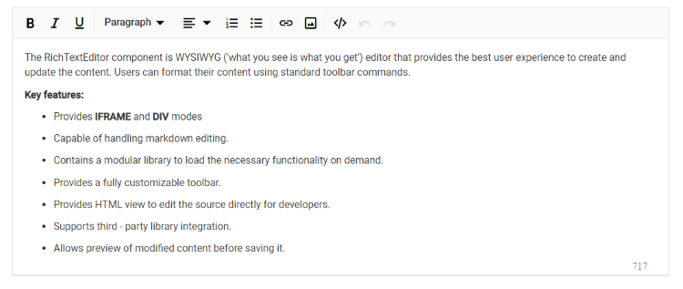

# Accessibility in Blazor RichTextEditor

The Rich Text Editor component has been designed with the `WAI-ARIA` specifications in mind, and applies the WAI-ARIA roles, states, and properties along with `keyboard support`. This component is characterized by keyboard interaction support and ARIA accessibility support that makes it easy for people who use assistive technologies (AT) or those who completely rely on keyboard navigation.

## ARIA attributes

The toolbar of the Rich Text Editor has been assigned the role of toolbar and has the following list of ARIA attributes:

| **Roles and Attributes** | **Functionalities** |
| --- | --- |
| role="toolbar" | This attribute added to the toolbar element describes the actual role of the element. |
| aria-orientation | Indicates the toolbar orientation. The default value is horizontal. |
| aria-haspopup | Indicates the popup mode of the toolbar. The default value is false. When popup mode is enabled, the attribute value has to be changed to true. |
| aria-disabled | Indicates the disabled state of the toolbar. |

For further details of toolbar ARIA attributes, refer to the accessibility of [Toolbar](../toolbar/accessibility) documentation.

The Rich Text Editor element is assigned the role of application.

| **Roles and Attributes** | **Functionalities** |
| --- | --- |
| role="application" | This attribute added to the editor element describes the actual role of the element. |
| aria-disabled | Indicates the disabled state of the editor. |









## Keyboard support

The editor has complete keyboard access, including shortcuts to open and other actions with toolbar items, drop-down lists, and dialogs. 

### HTML editor shortcuts

You can use the following key shortcuts when the Rich Text Editor renders with `HTML` editMode.

| Actions | Keyboard shortcuts |
|----------------|---------|
| Toolbar focus | <kbd>ALT</kbd> + <kbd>F10</kbd> |
| Insert link | <kbd>CTRL</kbd> + <kbd>K</kbd> |
| Insert image | <kbd>CTRL</kbd> + <kbd>SHIFT</kbd> + <kbd>I</kbd> |
| Insert table | <kbd>CTRL</kbd> + <kbd>SHIFT</kbd> + <kbd>E</kbd> |
| Undo | <kbd>CTRL</kbd> + <kbd>Z</kbd> |
| Redo | <kbd>CTRL</kbd> + <kbd>Y</kbd> |
| Copy | <kbd>CTRL</kbd> + <kbd>C</kbd> |
| Cut | <kbd>CTRL</kbd> + <kbd>X</kbd> |
| Paste| <kbd>CTRL</kbd> + <kbd>V</kbd> |
| Bold| <kbd>CTRL</kbd> + <kbd>B</kbd> |
| Italic| <kbd>CTRL</kbd> + <kbd>I</kbd> |
| Underline| <kbd>CTRL</kbd> + <kbd>U</kbd> |
| Strikethrough| <kbd>CTRL</kbd> + <kbd>SHIFT</kbd> + <kbd>S</kbd> |
| Uppercase| <kbd>CTRL</kbd> + <kbd>SHIFT</kbd> + <kbd>U</kbd> |
| Lowercase| <kbd>CTRL</kbd> + <kbd>SHIFT</kbd> + <kbd>L</kbd> |
| Superscript| <kbd>CTRL</kbd> + <kbd>SHIFT</kbd> + <kbd>=</kbd> |
| Subscript| <kbd>CTRL</kbd> + <kbd>=</kbd> |
| Indents| <kbd>CTRL</kbd> + <kbd>]</kbd> |
| Outdents| <kbd>CTRL</kbd> + <kbd>[</kbd> |
| HTML source | <kbd>CTRL</kbd> + <kbd>SHIFT</kbd> + <kbd>H</kbd> |
| Full screen| <kbd>CTRL</kbd> + <kbd>SHIFT</kbd> + <kbd>F</kbd> |
| Exit Full screen| <kbd>Esc</kbd> |
| Justify center| <kbd>CTRL</kbd> + <kbd>E</kbd> |
| Justify full | <kbd>CTRL</kbd> + <kbd>`J</kbd> |
| Justify left | <kbd>CTRL</kbd> + <kbd>L</kbd> |
| Justify right | <kbd>CTRL</kbd> + <kbd>R</kbd> |
| Clear format | <kbd>CTRL</kbd> + <kbd>SHIFT</kbd> + <kbd>R</kbd> |
| Ordered list | <kbd>CTRL</kbd> + <kbd>SHIFT</kbd> + <kbd>O</kbd> |
| Unordered list | <kbd>CTRL</kbd> + <kbd>ALT</kbd> + <kbd>O</kbd> |

### Markdown editor shortcuts

You can use the following key shortcuts when the Rich Text Editor renders with `Markdown` editMode.

| Actions | Keyboard shortcuts |
|----------------|---------|
| Toolbar focus| <kbd>ALT</kbd> + <kbd>F10</kbd> |
| Insert link| <kbd>CTRL</kbd> + <kbd>K</kbd> |
| Insert image| <kbd>CTRL</kbd> + <kbd>SHIFT</kbd> + <kbd>I</kbd> |
| Insert table| <kbd>CTRL</kbd> + <kbd>SHIFT</kbd> + <kbd>E</kbd> |
| Undo| <kbd>CTRL</kbd> + <kbd>Z</kbd> |
| Redo| <kbd>CTRL</kbd> + <kbd>Y</kbd> |
| Copy| <kbd>CTRL</kbd> + <kbd>C</kbd> |
| Cut| <kbd>CTRL</kbd> + <kbd>X</kbd> |
| Paste| <kbd>CTRL</kbd> + <kbd>V</kbd> |
| Bold| <kbd>CTRL</kbd> + <kbd>B</kbd> |
| Italic| <kbd>CTRL</kbd> + <kbd>i</kbd> |
| Strikethrough| <kbd>CTRL</kbd> + <kbd>SHIFT</kbd> + <kbd>S</kbd> |
| Uppercase| <kbd>CTRL</kbd> + <kbd>SHIFT</kbd> + <kbd>U</kbd> |
| Lowercase| <kbd>CTRL</kbd> + <kbd>SHIFT</kbd> + <kbd>L</kbd> |
| Superscript| <kbd>CTRL</kbd> + <kbd>SHIFT</kbd> + <kbd>=</kbd> |
| Subscript| <kbd>CTRL</kbd> + <kbd>=</kbd> |
| Full screen| <kbd>CTRL</kbd> + <kbd>SHIFT</kbd> + <kbd>F</kbd> |
| Exit Full screen| <kbd>Esc</kbd> |
| Ordered list| <kbd>CTRL</kbd> + <kbd>SHIFT</kbd> + <kbd>O</kbd> |
| Unordered list| <kbd>CTRL</kbd> + <kbd>ALT</kbd> + <kbd>O</kbd> |









### Custom key configuration

Customize the key configuration for the keyboard interaction of Rich Text Editor using the [KeyConfigure] (https://help.syncfusion.com/cr/blazor/Syncfusion.Blazor.RichTextEditor.SfRichTextEditor.html#Syncfusion_Blazor_RichTextEditor_SfRichTextEditor_KeyConfigure) property.

In the following code block, customize the bold and italic, toolbar actions with **ctrl+1**, **ctrl+2** respectively.









> You can refer to our [Blazor Rich Text Editor](https://www.syncfusion.com/blazor-components/blazor-wysiwyg-rich-text-editor) feature tour page for its groundbreaking feature representations. You can also explore our [Blazor Rich Text Editor](https://blazor.syncfusion.com/demos/rich-text-editor/overview?theme=bootstrap4) example to knows how to render and configure the rich text editor tools.

## See also

* [Globalization](./globalization/)
* [Accessibility](./accessibility/)