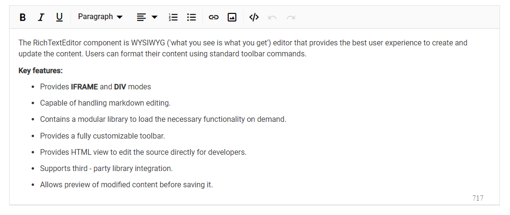

# Accessibility in Blazor RichTextEditor Component

The Rich Text Editor component has been designed, keeping in mind the WAI-ARIA specifications, and applies the WAI-ARIA roles, states, and properties. This component is characterized by complete ARIA accessibility support that makes it easy for people who use assistive technologies (AT) or those who completely rely on keyboard navigation.

## ARIA attributes

The toolbar of Rich Text Editor, assigned the role of Toolbar and has the following list of ARIA attributes:

| **Roles and Attributes** | **Functionalities** |
| --- | --- |
| role="toolbar" | This attribute added to the toolbar element describes the actual role of the element. |
| aria-orientation | Indicates the toolbar orientation. Default value is horizontal. |
| aria-haspopup | Indicates the popup mode of the toolbar. The default value is false. When popup mode is enabled, attribute value has to be changed to true. |
| aria-disabled | Indicates the disabled state of the toolbar. |

For further details of toolbar ARIA attributes, refer to the accessibility of [Toolbar](../toolbar/accessibility) documentation.

The Rich Text Editor element is assigned the role of application.

| **Roles and Attributes** | **Functionalities** |
| --- | --- |
| role="application" | This attribute added to the Rich Text Editor element describes the actual role of the element. |
| aria-disabled | Indicates the disabled state of the Rich Text Editor. |

```csharp

@using Syncfusion.Blazor.RichTextEditor

<SfRichTextEditor ShowCharCount="true">
    <p>The Rich Text Editor component is WYSIWYG ('what you see is what you get') editor that provides the best user experience to create and update the content. Users can format their content using standard toolbar commands.</p>
    <p><b> Key features:</b></p>
    <ul>
    <li><p> Provides <b>IFRAME</b> and <b>DIV</b> modes </p></li>
    <li><p> Capable of handling markdown editing.</p></li>
    <li><p> Contains a modular library to load the necessary functionality on demand.</p></li>
    <li><p> Provides a fully customizable toolbar.</p></li>
    <li><p> Provides HTML view to edit the source directly for developers.</p></li>
    <li><p> Supports third - party library integration.</p></li>
    <li><p> Allows preview of modified content before saving it.</p></li>
    </ul>
</SfRichTextEditor>

```

The output will be as follows.



> You can refer to our [Blazor Rich Text Editor](https://www.syncfusion.com/blazor-components/blazor-wysiwyg-rich-text-editor) feature tour page for its groundbreaking feature representations. You can also explore our [Blazor Rich Text Editor](https://blazor.syncfusion.com/demos/rich-text-editor/overview?theme=bootstrap4) example to knows how to render and configure the rich text editor tools.