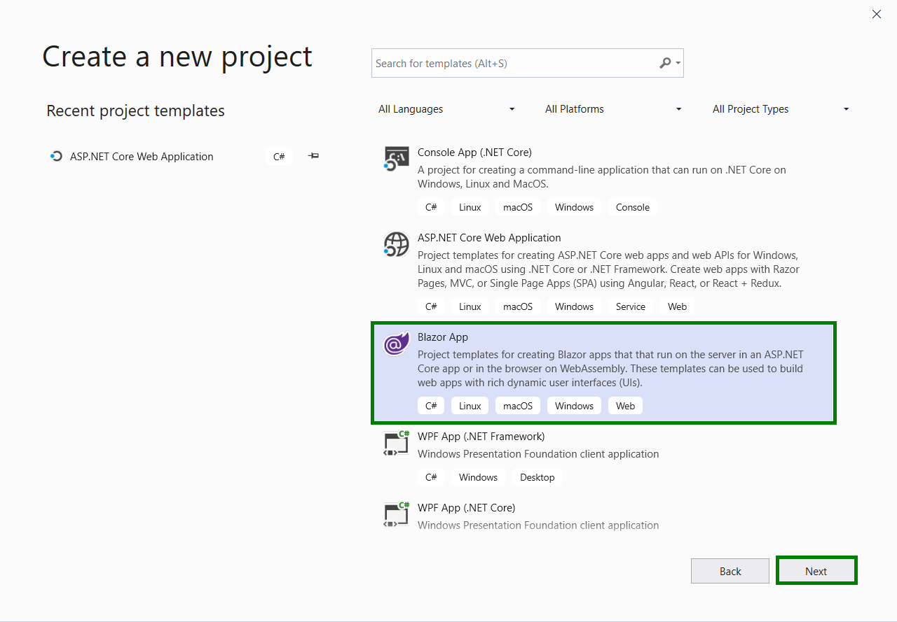

<!-- markdownlint-disable MD024 -->

# Blazor RichTextEditor Component in Client Side App using Visual Studio

This article provides a step-by-step instructions to configure Syncfusion [Blazor Rich Text Editor](https://blazor.syncfusion.com/demos/rich-text-editor/overview?theme=bootstrap4) in a simple Blazor WebAssembly application using [Visual Studio 2019](https://visualstudio.microsoft.com/vs/).

> Starting with version 17.4.0.39 (2019 Volume 4), you need to include a valid license key (either paid or trial key) within your applications. Please refer to this help topic for more information.

## Prerequisites

* Visual Studio 2019
* .NET Core SDK 3.1.3

> .NET Core SDK 3.1.3 requires Visual Studio 2019 16.6 or later.

Syncfusion Blazor components are compatible with .NET Core 5.0 Preview 6 and it requires Visual Studio 16.7 Preview 1 or later.

## Create a Blazor WebAssembly project in Visual Studio 2019

1. Install the essential project templates in the Visual Studio 2019 by running the below command line in the command prompt.

> dotnet new -i Microsoft.AspNetCore.Components.WebAssembly.Templates::3.2.0-rc1.20223.4

1. Choose **Create a new project** from the Visual Studio dashboard.


1. Select **Blazor App** from the template and click **Next** button.



1. Now, the project configuration window will popup. Click **Create** button to create a new project with the default project configuration.


1. Choose **Blazor WebAssembly App** from the dashboard and click **Create** button to create a new Blazor WebAssembly application. Make sure **.NET Core and ASP.NET Core 3.1** is selected at the top.

 

> ASP.NET Core 3.1 available in Visual Studio 2019 version.

## Importing Syncfusion Blazor component in the application

You can use any one of the below standard to install the Syncfusion Blazor library in your application.

### Importing Syncfusion Blazor component in the application

1. Install `Syncfusion.Blazor.RichTextEditor` NuGet package to the application by using the `NuGet Package Manager`.

> Please ensure to check the Include prerelease option for our Beta release.

1. You can add the client-side resources through CDN or from NuGet package in the `<head>` element of the ~/Pages/_Host.cshtml page.

    ```html
    <head>
    <link href="_content/Syncfusion.Blazor.Themes/bootstrap4.css" rel="stylesheet" />
    </head>
    ```
> For Internet Explorer 11 kindly refer the polyfills. Refer the [documentation](https://blazor.syncfusion.com/documentation/common/how-to/render-blazor-server-app-in-ie/) for more information.

```html
<head>
<link href="_content/Syncfusion.Blazor.Themes/bootstrap4.css" rel="stylesheet" />>
<script src="https://github.com/Daddoon/Blazor.Polyfill/releases/download/3.0.1/blazor.polyfill.min.js"></script>
</head>
```

### Adding component package to the application

Open **~/_Imports.razor** file and import the `Syncfusion.Blazor.RichTextEditor` package.

    ```html
    @using Syncfusion.Blazor.RichTextEditor
    ```

### Add SyncfusionBlazor service in Startup.cs

Open the **Startup.cs** file and add services required by Syncfusion components using `services.AddSyncfusionBlazor()` method. Add this method in the ConfigureServices function as follows.

    ```html
    using Syncfusion.Blazor;

    namespace BlazorApplication
    {
    public class Startup
        {
            ....
            ....
            public void ConfigureServices(IServiceCollection services)
            {
                ....
                ....
                services.AddSyncfusionBlazor();
            }
        }
    }
    ```

### Add Rich Text Editor component

To initialize the Rich Text Editor component, add the below code to your **Index.razor** view page which is present under **~/Pages** folder.

The following code explains how to initialize a simple Rich Text Editor in Razor page.

    ```html
    @using Syncfusion.Blazor.RichTextEditor

    <SfRichTextEditor>
    <p>Rich Text Editor allows to insert images from online source as well as local computer where you want to insert the image in your content.</p>
    <p><b>Get started Quick Toolbar to click on the image</b></p>
    <p>It is possible to add custom style on the selected image inside the Rich Text Editor through quick toolbar.</p>
    </SfRichTextEditor>
    ```

### Run the application

After successful compilation of your application, run the application.

The output will be as follows.

