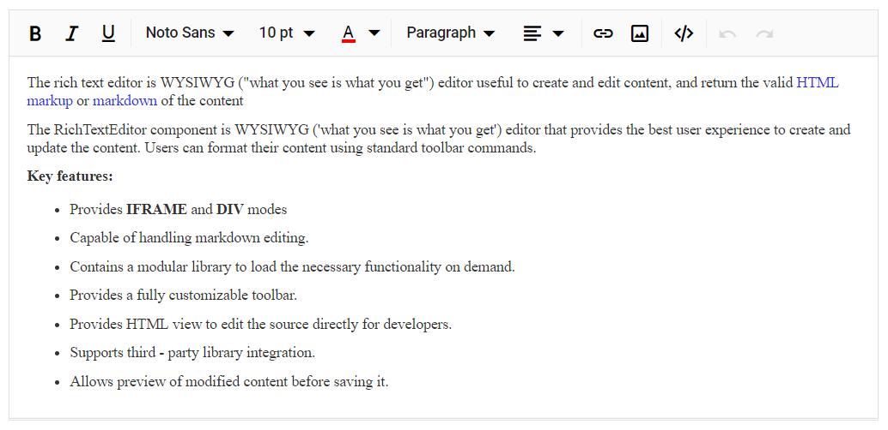

# Change default font-family in Blazor RichTextEditor Component

By using `Default` property, you can change the default font-family of the Rich Text Editor. To change the font-family of the Rich Text Editor content while loading, we need to give the `RichTextEditorFontFamily` in the style section with the help of `CssClass` property.

```csharp

@using Syncfusion.Blazor.RichTextEditor

<SfRichTextEditor CssClass="customClass">
    <RichTextEditorToolbarSettings Items="@Tools" />
    <RichTextEditorFontFamily Default="Georgia" Items="@FontFamilyItems" />
    <p>The Rich Text Editor component is WYSIWYG ('what you see is what you get') editor that provides the best user experience to create and update the content. Users can format their content using standard toolbar commands.</p>
    <p><b> Key features:</b></p>
    <ul>
        <li><p> Provides <b>IFRAME</b> and <b>DIV</b> modes </p></li>
        <li><p> Capable of handling markdown editing.</p></li>
        <li><p> Contains a modular library to load the necessary functionality on demand.</p></li>
        <li><p> Provides a fully customizable toolbar.</p></li>
        <li><p> Provides HTML view to edit the source directly for developers.</p></li>
        <li><p> Supports third - party library integration.</p></li>
        <li><p> Allows preview of modified content before saving it.</p></li>
    </ul>
</SfRichTextEditor>

<style>
    .customClass .e-rte-content .e-content {
        /* to get the desired font on intially*/
        font-family: "Georgia,serif";
    }
</style>

@code{
    private List<DropDownItemModel> FontFamilyItems = new List<DropDownItemModel>()
    {
        new DropDownItemModel() { CssClass = "e-segoe-ui", Command = "Font", SubCommand = "FontName", Text = "Segoe UI", Value = "Arial,Helvetica,sans-serif" },
        new DropDownItemModel() { CssClass = "e-arial", Command = "Font", SubCommand = "FontName", Text = "Arial", Value = "Roboto" },
        new DropDownItemModel() { CssClass = "e-georgia", Command = "Font", SubCommand = "FontName", Text = "Georgia", Value = "Georgia,serif" },
        new DropDownItemModel() { CssClass = "e-impact", Command = "Font", SubCommand = "FontName", Text = "Impact", Value = "Impact,Charcoal,sans-serif" },
        new DropDownItemModel() { CssClass = "e-tahoma", Command = "Font", SubCommand = "FontName", Text = "Tahoma", Value = "Tahoma,Geneva,sans-serif" }
    };

    private List<ToolbarItemModel> Tools = new List<ToolbarItemModel>()
    {
        new ToolbarItemModel() { Command = ToolbarCommand.Bold },
        new ToolbarItemModel() { Command = ToolbarCommand.Italic },
        new ToolbarItemModel() { Command = ToolbarCommand.Underline },
        new ToolbarItemModel() { Command = ToolbarCommand.Separator },
        new ToolbarItemModel() { Command = ToolbarCommand.FontName },
        new ToolbarItemModel() { Command = ToolbarCommand.FontSize },
        new ToolbarItemModel() { Command = ToolbarCommand.FontColor },
        new ToolbarItemModel() { Command = ToolbarCommand.BackgroundColor },
        new ToolbarItemModel() { Command = ToolbarCommand.Separator },
        new ToolbarItemModel() { Command = ToolbarCommand.Formats },
        new ToolbarItemModel() { Command = ToolbarCommand.Alignments },
        new ToolbarItemModel() { Command = ToolbarCommand.Separator },
        new ToolbarItemModel() { Command = ToolbarCommand.CreateLink },
        new ToolbarItemModel() { Command = ToolbarCommand.Image },
        new ToolbarItemModel() { Command = ToolbarCommand.Separator },
        new ToolbarItemModel() { Command = ToolbarCommand.SourceCode },
        new ToolbarItemModel() { Command = ToolbarCommand.Separator },
        new ToolbarItemModel() { Command = ToolbarCommand.Undo },
        new ToolbarItemModel() { Command = ToolbarCommand.Redo }
    };
}

```

The output will be as follows.

