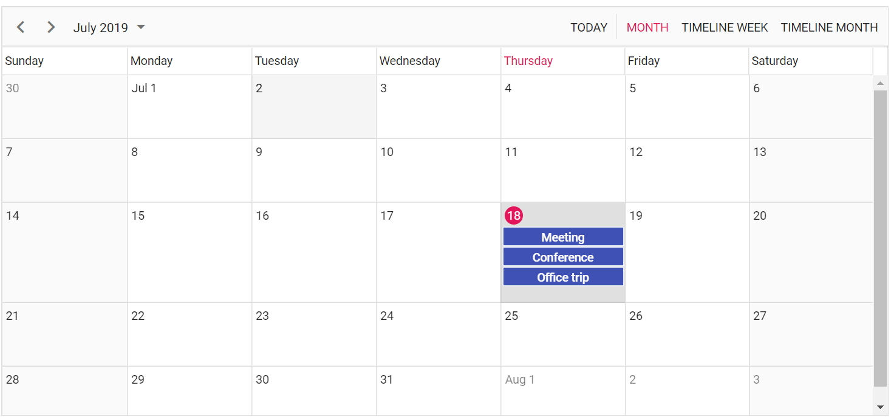
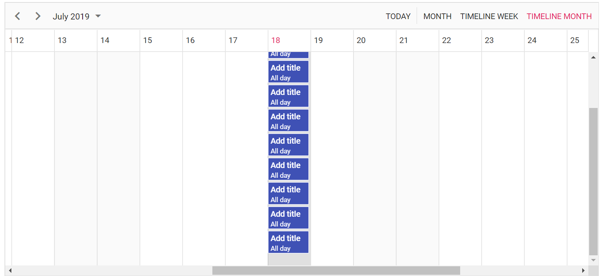
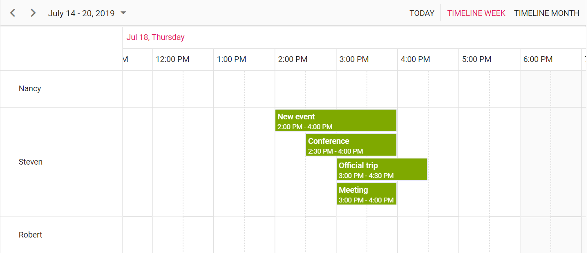
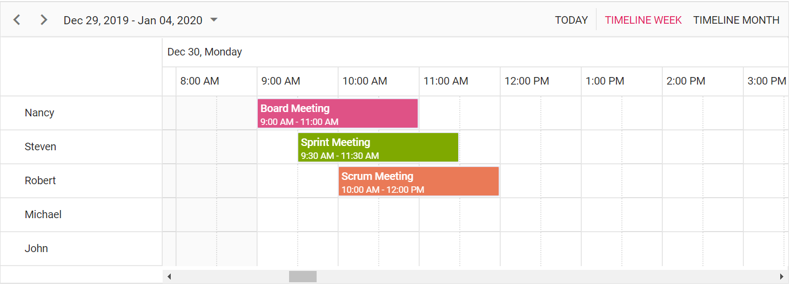

# Row Auto Height

By default, the height of the Scheduler rows in Timeline views are static and therefore, when the same time range holds multiple overlapping appointments, a `+n more` text indicator will be displayed. With this feature enabled, you can now view all the overlapping appointments present in those specific time range by auto-adjusting the row height based on the presence of the appointments count, instead of displaying the `+n more` text indicators.

To enable auto row height adjustments on Scheduler Timeline views and Month view, set `true` to the `EnableAutoRowHeight` property whose default value is `false`.

> This auto row height adjustment is applicable only on all the Timeline views as well as on the calendar Month view.

Now, let's see how it works on those applicable views with examples.

When the feature `EnableAutoRowHeight` is enabled, the row height gets auto-adjusted based on the number of overlapping events occupied on the same time range, which is demonstrated in the following example.

```csharp
@using Syncfusion.Blazor.Schedule

<SfSchedule TValue="AppointmentData" Height="650px" EnableAutoRowHeight="true">
    <ScheduleViews>
        <ScheduleView Option="View.Month"></ScheduleView>
        <ScheduleView Option="View.TimelineWeek"></ScheduleView>
        <ScheduleView Option="View.TimelineMonth"></ScheduleView>
    </ScheduleViews>
</SfSchedule>
@code{
    public class AppointmentData
    {
        public int Id { get; set; }
        public string Subject { get; set; }
        public string Location { get; set; }
        public DateTime StartTime { get; set; }
        public DateTime EndTime { get; set; }
        public string Description { get; set; }
        public bool IsAllDay { get; set; }
        public string RecurrenceRule { get; set; }
        public string RecurrenceException { get; set; }
        public Nullable<int> RecurrenceID { get; set; }
    }
}
```

The following images depict how the row height gets auto-adjusted for Month and timeline month view of the above code example.





## Timeline views with multiple resources

The following example shows how the auto row adjustment feature works on timeline views with multiple resources.

```csharp
@using Syncfusion.Blazor.Schedule

<SfSchedule TValue="AppointmentData" Height="650px" EnableAutoRowHeight="true">
    <ScheduleGroup Resources="@Resources"></ScheduleGroup>
    <ScheduleResources>
        <ScheduleResource TItem="ResourceData" TValue="int" DataSource="@OwnerData" Field="OwnerId" Title="Owner" Name="Owner" TextField="Text" IdField="Id" ColorField="Color"></ScheduleResource>
    </ScheduleResources>
    <ScheduleViews>
        <ScheduleView Option="View.TimelineWeek"></ScheduleView>
        <ScheduleView Option="View.TimelineMonth"></ScheduleView>
    </ScheduleViews>
</SfSchedule>

@code{
    public string[] Resources { get; set; } = { "Owner" };
    private List<ResourceData> OwnerData { get; set; } = new List<ResourceData> {
        new ResourceData { Text = "Nancy", Id= 1, Color = "#df5286" },
        new ResourceData { Text = "Steven", Id= 2, Color = "#7fa900" },
        new ResourceData { Text = "Robert", Id= 3, Color = "#ea7a57" }
    };
    public class ResourceData
    {
        public int Id { get; set; }
        public string Text { get; set; }
        public string Color { get; set; }
    }
    public class AppointmentData
    {
        public int Id { get; set; }
        public string Subject { get; set; }
        public string Location { get; set; }
        public DateTime StartTime { get; set; }
        public DateTime EndTime { get; set; }
        public string Description { get; set; }
        public bool IsAllDay { get; set; }
        public string RecurrenceRule { get; set; }
        public string RecurrenceException { get; set; }
        public Nullable<int> RecurrenceID { get; set; }
        public int OwnerId { get; set; }
    }
}
```

The following screenshot shows the auto-adjustment of row in timeline week view with resources.



## Appointments occupying entire cell

By default, with the feature `EnableAutoRowHeight`, there will be a space in the bottom of the cell when appointment is rendered. To avoid this space, we can set true to the property `IgnoreWhitespace` with `ScheduleEventSettings` taghelper whereas its default property value is false. In the following code example, the whitespace below the appointments has been ignored.

```csharp

@using Syncfusion.Blazor.Schedule

<SfSchedule TValue="AppointmentData" Height="350px" EnableAutoRowHeight="true" @bind-SelectedDate="@CurrentDate">
    <ScheduleGroup Resources="@Resources"></ScheduleGroup>
    <ScheduleResources>
        <ScheduleResource TItem="ResourceData" TValue="int" DataSource="@OwnerData" Field="OwnerId" Title="Owner" Name="Owner" TextField="Text" IdField="Id" ColorField="Color"></ScheduleResource>
    </ScheduleResources>
    <ScheduleEventSettings DataSource="@DataSource" IgnoreWhitespace="true"></ScheduleEventSettings>
    <ScheduleViews>
        <ScheduleView Option="View.TimelineWeek"></ScheduleView>
        <ScheduleView Option="View.TimelineMonth"></ScheduleView>
    </ScheduleViews>
</SfSchedule>

@code{
    DateTime CurrentDate = new DateTime(2020, 12, 30);
    public string[] Resources { get; set; } = { "Owner" };
    private List<ResourceData> OwnerData { get; set; } = new List<ResourceData>
{
        new ResourceData { Text = "Nancy", Id= 1, Color = "#df5286" },
        new ResourceData { Text = "Steven", Id= 2, Color = "#7fa900" },
        new ResourceData { Text = "Robert", Id= 3, Color = "#ea7a57" },
        new ResourceData { Text = "Michael", Id= 4, Color = "#df5286" },
        new ResourceData { Text = "John", Id= 5, Color = "#7fa900" }
    };
    private List<AppointmentData> DataSource = new List<AppointmentData>
{
        new AppointmentData {  Id = 1, Subject = "Board Meeting", StartTime = new DateTime(2020, 12, 30, 9, 0, 0), EndTime = new DateTime(2020, 12, 30, 11, 0, 0), OwnerId = 1},
        new AppointmentData {  Id = 2, Subject = "Sprint Meeting", StartTime = new DateTime(2020, 12, 30, 9, 30, 0), EndTime = new DateTime(2020, 12, 30, 11, 30, 0), OwnerId = 2},
        new AppointmentData {  Id = 3, Subject = "Scrum Meeting", StartTime = new DateTime(2020, 12, 30, 10, 0, 0), EndTime = new DateTime(2020, 12, 30, 12, 0, 0), OwnerId = 3}
    };
    public class ResourceData
    {
        public int Id { get; set; }
        public string Text { get; set; }
        public string Color { get; set; }
    }
    public class AppointmentData
    {
        public int Id { get; set; }
        public string Subject { get; set; }
        public string Location { get; set; }
        public DateTime StartTime { get; set; }
        public DateTime EndTime { get; set; }
        public string Description { get; set; }
        public bool IsAllDay { get; set; }
        public string RecurrenceRule { get; set; }
        public string RecurrenceException { get; set; }
        public Nullable<int> RecurrenceID { get; set; }
        public int OwnerId { get; set; }
    }
}
```

In following image the whitespace below the appointment has been ignored.



> The property `IgnoreWhitspace` will be applicable only when `EnableAutoRowHeight` feature is enabled in the Scheduler.
