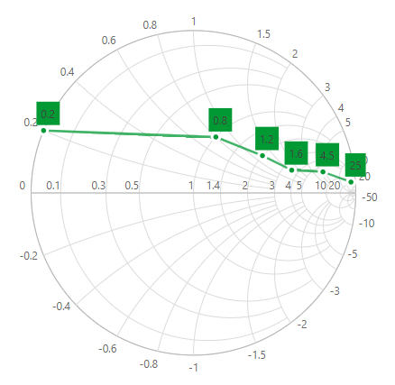

# Series customization in Blazor Smith Chart

The [`SmithChartSeries`](https://help.syncfusion.com/cr/blazor/Syncfusion.Blazor.Charts.SmithChartSeries.html#properties) is the visual representation of the data.
Using the following options in the [`SmithChartSeries`](https://help.syncfusion.com/cr/blazor/Syncfusion.Blazor.Charts.SmithChartSeries.html#properties), each series can be customized in the Smith Chart.

* [`Fill`](https://help.syncfusion.com/cr/blazor/Syncfusion.Blazor.Charts.SmithChartSeries.html#Syncfusion_Blazor_Charts_SmithChartSeries_Fill) - Used to customize the fill color for the series.
* [`Visible`](https://help.syncfusion.com/cr/blazor/Syncfusion.Blazor.Charts.SmithChartSeries.html#Syncfusion_Blazor_Charts_SmithChartSeries_Visible) - Used to handle the visibility of the series.
* [`Opacity`](https://help.syncfusion.com/cr/blazor/Syncfusion.Blazor.Charts.SmithChartSeries.html#Syncfusion_Blazor_Charts_SmithChartSeries_Opacity) - Used to control the opacity of the series line.
* [`Width`](https://help.syncfusion.com/cr/blazor/Syncfusion.Blazor.Charts.SmithChartSeries.html#Syncfusion_Blazor_Charts_SmithChartSeries_Width) - Used to customize the width of the series line.

```csharp
@using Syncfusion.Blazor.Charts

<SfSmithChart>
    <SmithChartSeriesCollection>
        <SmithChartSeries Name="Transmission" DataSource='TransmissionData'
                          Reactance="Reactance" Resistance="Resistance" Fill="#009933"
                          Visible="true"
                          Opacity="0.75"
                          Width="2.5">
            <SmithChartSeriesMarker Visible='true'>
                <SmithChartSeriesDatalabel Visible='true'></SmithChartSeriesDatalabel>
            </SmithChartSeriesMarker>
        </SmithChartSeries>
    </SmithChartSeriesCollection>
</SfSmithChart>

@code {
    public class SmithChartData
    {
        public double? Resistance { get; set; }
        public double? Reactance { get; set; }
    };
    public List<SmithChartData> TransmissionData = new List<SmithChartData> {
        new SmithChartData { Resistance= 10, Reactance= 25 },
        new SmithChartData { Resistance= 6, Reactance= 4.5 },
        new SmithChartData { Resistance= 3.5, Reactance= 1.6 },
        new SmithChartData { Resistance= 2, Reactance= 1.2 },
        new SmithChartData { Resistance= 1, Reactance= 0.8 },
        new SmithChartData { Resistance= 0, Reactance= 0.2 }
    };
}
```



## Animation

Animation for the Smith Chart series can be enabled by using the [`EnableAnimation`](https://help.syncfusion.com/cr/blazor/Syncfusion.Blazor.Charts.SmithChartSeries.html#Syncfusion_Blazor_Charts_SmithChartSeries_EnableAnimation) property in the [`SmithChartSeries`](https://help.syncfusion.com/cr/blazor/Syncfusion.Blazor.Charts.SmithChartSeries.html#properties). By default, the value is **false**. The speed of the animation can be controlled using the [`AnimationDuration`](https://help.syncfusion.com/cr/blazor/Syncfusion.Blazor.Charts.SmithChartSeries.html#Syncfusion_Blazor_Charts_SmithChartSeries_AnimationDuration) property. By default, the value of the [`AnimationDuration`](https://help.syncfusion.com/cr/blazor/Syncfusion.Blazor.Charts.SmithChartSeries.html#Syncfusion_Blazor_Charts_SmithChartSeries_AnimationDuration) property is **2000** milliseconds.

```csharp
@using Syncfusion.Blazor.Charts

<SfSmithChart>
    <SmithChartSeriesCollection>
        <SmithChartSeries Name="Transmission" DataSource='TransmissionData'
                          Reactance="Reactance" Resistance="Resistance" EnableAnimation="true" AnimationDuration="1500">
            <SmithChartSeriesMarker Visible='true'>
                <SmithChartSeriesDatalabel Visible='true'></SmithChartSeriesDatalabel>
            </SmithChartSeriesMarker>
        </SmithChartSeries>
    </SmithChartSeriesCollection>
</SfSmithChart>

@code {
    public class SmithChartData
    {
        public double? Resistance { get; set; }
        public double? Reactance { get; set; }
    };
    public List<SmithChartData> TransmissionData = new List<SmithChartData> {
        new SmithChartData { Resistance= 10, Reactance= 25 },
        new SmithChartData { Resistance= 6, Reactance= 4.5 },
        new SmithChartData { Resistance= 3.5, Reactance= 1.6 },
        new SmithChartData { Resistance= 2, Reactance= 1.2 },
        new SmithChartData { Resistance= 1, Reactance= 0.8 },
        new SmithChartData { Resistance= 0, Reactance= 0.2 }
    };
}
```