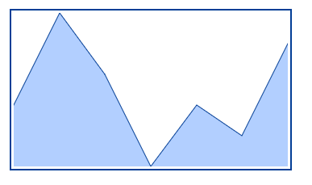
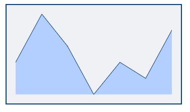

# Appearance in the Blazor Sparkline (SfSparkline)

The rendering direction, padding, border, and the background appearance of the Sparkline can all be customized.

## Right-to-left (RTL)

The Sparkline supports the right-to-left (RTL) rendering that can be enabled by setting the [`EnableRtl`](https://help.syncfusion.com/cr/blazor/Syncfusion.Blazor.Charts.SfSparkline-1.html#Syncfusion_Blazor_Charts_SfSparkline_1_EnableRtl) property to **true**.

```csharp
@using Syncfusion.Blazor.Charts

<SfSparkline DataSource="new double[]{ 300.00, 600.00, 400.21, 100.20, 300.70, 200.04, 500.00 }" Height="200px" Width="350px" Format="c2" EnableRtl="true">
    <SparklineDataLabelSettings Visible="new List<VisibleType> { VisibleType.All }" EdgeLabelMode="EdgeLabelMode.Shift"></SparklineDataLabelSettings>
    <SparklinePadding Top="25"></SparklinePadding>
</SfSparkline>
```


## Border

The border can be enabled and customized by specifying the [`Color`](https://help.syncfusion.com/cr/blazor/Syncfusion.Blazor.Charts.BorderSettings.html#Syncfusion_Blazor_Charts_BorderSettings_Color)
 and the [`Width`](https://help.syncfusion.com/cr/blazor/Syncfusion.Blazor.Charts.BorderSettings.html#Syncfusion_Blazor_Charts_BorderSettings_Width) properties of the [`SparklineContainerAreaBorder`](https://help.syncfusion.com/cr/blazor/Syncfusion.Blazor~Syncfusion.Blazor.Charts.SparklineContainerAreaBorder.html).

```csharp
@using Syncfusion.Blazor.Charts

<SfSparkline DataSource="new int[]{ 3, 6, 4, 1, 3, 2, 5 }" Type="SparklineType.Area" Height="200px" Width="350px" Fill="#b2cfff" LineWidth="1">
    <SparklineContainerArea>
        <SparklineContainerAreaBorder Color="#033e96" Width="1"></SparklineContainerAreaBorder>
    </SparklineContainerArea>
</SfSparkline>
```



## Padding

The Sparkline supports padding between the container and the component using the [`SparklinePadding`](https://help.syncfusion.com/cr/blazor/Syncfusion.Blazor.Charts.SparklinePadding.html). The code example in the following shows the Sparkline Chart with overall padding set to 20.

```csharp
@using Syncfusion.Blazor.Charts

<SfSparkline DataSource="new int[]{ 3, 6, 4, 1, 3, 2, 5 }" Type="SparklineType.Area" Height="200px" Width="350px" Fill="#b2cfff" LineWidth="1">
    <SparklineContainerArea>
        <SparklineContainerAreaBorder Color="#033e96" Width="2"></SparklineContainerAreaBorder>
    </SparklineContainerArea>
    <SparklineBorder Color="#033e96" Width="1"></SparklineBorder>
    <SparklinePadding Left="20" Right="20" Bottom="20" Top="20"></SparklinePadding>
</SfSparkline>
```


## Background

The background color of the Sparkline area can be changed using the [`Background`](https://help.syncfusion.com/cr/blazor/Syncfusion.Blazor.Charts.SparklineContainerArea.html#Syncfusion_Blazor_Charts_SparklineContainerArea_Background) property of the [`SparklineContainerArea`](https://help.syncfusion.com/cr/blazor/Syncfusion.Blazor.Charts.SparklineContainerArea.html). By default, the Sparkline background color is **Transparent**.

```csharp
@using Syncfusion.Blazor.Charts

<SfSparkline DataSource="new int[]{ 3, 6, 4, 1, 3, 2, 5 }" Type="SparklineType.Area" Height="200px" Width="350px" Fill="#b2cfff" LineWidth="1">
    <SparklineContainerArea Background="#eff1f4">
        <SparklineContainerAreaBorder Color="#033e96" Width="2">
        </SparklineContainerAreaBorder>
    </SparklineContainerArea>
    <SparklineBorder Color="#033e96" Width="1"></SparklineBorder>
    <SparklinePadding Left="20" Right="20" Bottom="20" Top="20"></SparklinePadding>
</SfSparkline>
```


