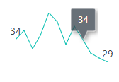

# Getting Started with Blazor Sparkline Component

This section briefly explains how to include a Sparkline component in the Blazor server-side application. Refer to [Getting Started with Syncfusion Blazor for server-side in Visual Studio 2019](https://blazor.syncfusion.com/documentation/getting-started/blazor-server-side-visual-studio-2019/) page for introduction and configuring common specifications.

## Importing Syncfusion Blazor Sparkline component in the application

1. Install **Syncfusion.Blazor** NuGet package to the application by using the **NuGet Package Manager**.

2. Add the client-side resources through CDN or from NuGet package in the **HEAD** element of the **~/Pages/_Host.cshtml** page.

    ```html
    <head>
        <link href="_content/Syncfusion.Blazor.Themes/bootstrap4.css" rel="stylesheet" />
        <!---CDN--->
        @*<link href="https://cdn.syncfusion.com/blazor/{:version:}/styles/bootstrap4.css" rel="stylesheet" />*@
    </head>
    ```

    > For the Internet Explorer 11, kindly refer to the polyfills. For more information, refer to the [documentation](https://blazor.syncfusion.com/documentation/common/how-to/render-blazor-server-app-in-ie/)
    
    ```html
    <head>
        <link href="https://cdn.syncfusion.com/blazor/{:version:}/styles/bootstrap4.css" rel="stylesheet" />
        <script src="https://github.com/Daddoon/Blazor.Polyfill/releases/download/3.0.1/blazor.polyfill.min.js"></script>
    </head>
    ```

## Adding component package to the application

Open the **~/_Imports.razor** file and include the **Syncfusion.Blazor.Charts** namespace.

```cshtml
@using Syncfusion.Blazor.Charts
```

## Adding SyncfusionBlazor service in Startup.cs

Open the **Startup.cs** file and add services required by the Syncfusion components using **services.AddSyncfusionBlazor()** method. Add this method in the **ConfigureServices** function as follows.

```csharp
using Syncfusion.Blazor;

namespace BlazorApplication
{
    public class Startup
    {
        ....
        ....
        public void ConfigureServices(IServiceCollection services)
        {
            ....
            ....
            services.AddSyncfusionBlazor();
        }
    }
}
```

> To enable the custom client-side source loading from CRG or CDN, please refer to the section about the [custom resources in Blazor application](https://blazor.syncfusion.com/documentation/common/custom-resource-generator/#how-to-use-custom-resources-in-the-blazor-application).

## Adding Sparkline Component

To initialize the Sparkline component, add the below code to the **Index.razor** view page under **~/Pages** folder. In a new application, if **Index.razor** page has any default content template, then those content can be completely removed and the following code can be added.

```cshtml
@page "/"

<SfSparkline>

</SfSparkline>
```

## Populate Sparkline with Data

To bind data for the Sparkline component, assign a `IEnumerable` object to the [DataSource](https://help.syncfusion.com/cr/blazor/Syncfusion.Blazor.Charts.SfSparkline-1.html#Syncfusion_Blazor_Charts_SfSparkline_1_DataSource) property. It can also be provided as an instance of the [DataManager](https://help.syncfusion.com/cr/blazor/Syncfusion.Blazor.DataManager.html).

```cshtml
@code {
    public class WeatherReport
    {
        public string Month { get; set; }
        public double Celsius { get; set; }
    };
    public List<WeatherReport> ClimateData = new List<WeatherReport> {
        new  WeatherReport { Month= "Jan", Celsius= 34 },
        new  WeatherReport { Month= "Feb", Celsius= 36 },
        new  WeatherReport { Month= "Mar", Celsius= 32 },
        new  WeatherReport { Month= "Apr", Celsius= 35 },
        new  WeatherReport { Month= "May", Celsius= 40 },
        new  WeatherReport { Month= "Jun", Celsius= 38 },
        new  WeatherReport { Month= "Jul", Celsius= 33 },
        new  WeatherReport { Month= "Aug", Celsius= 37 },
        new  WeatherReport { Month= "Sep", Celsius= 34 },
        new  WeatherReport { Month= "Oct", Celsius= 31 },
        new  WeatherReport { Month= "Nov", Celsius= 30 },
        new  WeatherReport { Month= "Dec", Celsius= 29}
    };
}
```

Now map the `Month` and the `Celsius` fields from the datasource to [XName](https://help.syncfusion.com/cr/blazor/Syncfusion.Blazor.Charts.SfSparkline-1.html#Syncfusion_Blazor_Charts_SfSparkline_1_XName) and [YName](https://help.syncfusion.com/cr/blazor/Syncfusion.Blazor.Charts.SfSparkline-1.html#Syncfusion_Blazor_Charts_SfSparkline_1_YName) properties for x-axis and y-axis in the Sparkline and then set the `ClimateData` to [DataSource](https://help.syncfusion.com/cr/blazor/Syncfusion.Blazor.Charts.SfSparkline-1.html#Syncfusion_Blazor_Charts_SfSparkline_1_DataSource) property. Because the `Month` field is a value-based category, the [ValueType](https://help.syncfusion.com/cr/blazor/Syncfusion.Blazor.Charts.SfSparkline-1.html#Syncfusion_Blazor_Charts_SfSparkline_1_ValueType) property is used to specify it.

```cshtml
<SfSparkline XName="Month"
             YName="Celsius"
             ValueType="SparklineValueType.Category"
             TValue="WeatherReport"
             DataSource="ClimateData"
             Height="80px"
             Width="150px">
</SfSparkline>
```

On successful compilation of the application, the Syncfusion Blazor Sparkline component will render in the web browser as following.


## Change the type of Sparkline

Change the Sparkline type using the [Type](https://help.syncfusion.com/cr/blazor/Syncfusion.Blazor.Charts.SfSparkline-1.html#Syncfusion_Blazor_Charts_SfSparkline_1_Type) property set to **Line**, **Column**, **WinLoss**, **Pie** or **Area**. Here, the Sparkline type is set to **Area**.

```cshtml
<SfSparkline XName="Month"
             YName="Celsius"
             ValueType="SparklineValueType.Category"
             Type="SparklineType.Area"
             TValue="WeatherReport"
             DataSource="ClimateData"
             Height="80px"
             Width="150px">
</SfSparkline>
```


> Refer to [code block](#populate-sparkline-with-data) to know about the property value of **ClimateData**.

## Adding Data Label

Add the Data Labels to improve the readability of the Sparkline component. This can be achieved by setting the [Visible](https://help.syncfusion.com/cr/blazor/Syncfusion.Blazor.Charts.SparklineDataLabelSettings.html#Syncfusion_Blazor_Charts_SparklineDataLabelSettings_Visible) property to **true** in the [SparklineDataLabelSettings](https://help.syncfusion.com/cr/blazor/Syncfusion.Blazor.Charts.SparklineDataLabelSettings.html).

Available types are:

* Start
* End
* All
* High
* Low
* Negative

```cshtml
<SfSparkline DataSource="ClimateData"
              TValue="WeatherReport"
              XName="Month"
              YName="Celsius"
              ValueType="SparklineValueType.Category"
              Height="80px"
              Width="150px">
    <SparklineDataLabelSettings Visible="new List<VisibleType> { VisibleType.Start, VisibleType.End }"></SparklineDataLabelSettings>
    <SparklinePadding Left="10" Right="10"></SparklinePadding>
</SfSparkline>
```

> Refer to the [code block](#populate-sparkline-with-data) to know about the property value of **ClimateData**.


## Enable tooltip

When space constraints prevent from displaying information using Data Labels, the tooltip comes in handy. The tooltip can be enabled by setting the [Visible](https://help.syncfusion.com/cr/blazor/Syncfusion.Blazor.Charts.SparklineTooltipSettings-1.html#Syncfusion_Blazor_Charts_SparklineTooltipSettings_1_Visible) property to **true** in the [SparklineTooltipSettings](https://help.syncfusion.com/cr/blazor/Syncfusion.Blazor.Charts.SparklineTooltipSettings-1.html).

```cshtml
<SfSparkline DataSource="ClimateData"
             TValue="WeatherReport"
             XName="Month"
             YName="Celsius"
             ValueType="SparklineValueType.Category"
             Height="80px"
             Width="150px">
    <SparklineDataLabelSettings Visible="new List<VisibleType> { VisibleType.Start, VisibleType.End }"></SparklineDataLabelSettings>
    <SparklinePadding Left="10" Right="10"></SparklinePadding>
    <SparklineTooltipSettings TValue="WeatherReport" Visible="true"></SparklineTooltipSettings>
</SfSparkline>
```

> Refer to the [code block](#populate-sparkline-with-data) to know about the property value of the **ClimateData**.



## See also

* [Getting Started with Syncfusion Blazor for Client-Side in .NET Core CLI](https://blazor.syncfusion.com/documentation/getting-started/dotnet-cli-blazor/)

* [Getting Started with Syncfusion Blazor for Server-Side in Visual Studio 2019](https://blazor.syncfusion.com/documentation/getting-started/blazor-server-side-visual-studio-2019/)

* [Getting Started with Syncfusion Blazor for Server-Side in .NET Core CLI](https://blazor.syncfusion.com/documentation/getting-started/dotnet-cli-blazor-server/)