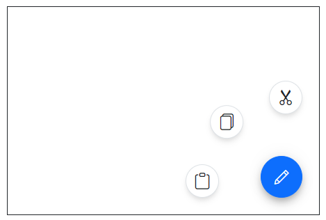

# Radial Menu in Blazor Speed Dial

The action items in Blazor Speed Dial can be displayed in a circular patter like a radial menu by setting [Mode](https://help.syncfusion.com/cr/blazor/Syncfusion.Blazor.Buttons.SfSpeedDial.html#Syncfusion_Blazor_Buttons_SfSpeedDial_Mode) property. You can customize the `Direction`, `StartAngle`, `EndAngle` and `Offset` by setting [SpeedDialRadialSettings](https://help.syncfusion.com/cr/blazor/Syncfusion.Blazor.Buttons.SpeedDialRadialSettings.html) tag directive.

## Radial Menu Direction

You can open the action items in either clockwise or anticlockwise by setting [Direction](https://help.syncfusion.com/cr/blazor/Syncfusion.Blazor.Buttons.SpeedDialRadialSettings.html#Syncfusion_Blazor_Buttons_SpeedDialRadialSettings_Direction) property. The default value is `Auto` where the action items are displayed based on the `Position` property of the Speed Dial.

```cshtml

@using Syncfusion.Blazor.Buttons

<SfSpeedDial Mode="SpeedDialMode.Radial" OpenIconCss="e-icons e-edit">
    <SpeedDialRadialSettings Direction="RadialDirection.AntiClockwise"/>
    <SpeedDialItems>
        <SpeedDialItem IconCss="e-icons e-cut"/>
        <SpeedDialItem IconCss="e-icons e-copy"/>
        <SpeedDialItem IconCss="e-icons e-paste"/>
    </SpeedDialItems>
</SfSpeedDial>

```



## Start and End Angle

You can modify the start and end angle of action items by setting [StartAngle](https://help.syncfusion.com/cr/blazor/Syncfusion.Blazor.Buttons.SpeedDialRadialSettings.html#Syncfusion_Blazor_Buttons_SpeedDialRadialSettings_StartAngle) and [EndAngle](https://help.syncfusion.com/cr/blazor/Syncfusion.Blazor.Buttons.SpeedDialRadialSettings.html#Syncfusion_Blazor_Buttons_SpeedDialRadialSettings_EndAngle) properties. If the angle is not defined, the action items are displayed based on the `Position` property of the Speed Dial.

```cshtml

@using Syncfusion.Blazor.Buttons

<SfSpeedDial Position="FabPosition.MiddleCenter" Mode="SpeedDialMode.Radial" OpenIconCss="e-icons e-edit">
    <SpeedDialRadialSettings Direction="RadialDirection.AntiClockwise" StartAngle="180" EndAngle="360"/>
    <SpeedDialItems>
        <SpeedDialItem IconCss="e-icons e-cut"/>
        <SpeedDialItem IconCss="e-icons e-copy"/>
        <SpeedDialItem IconCss="e-icons e-paste"/>
    </SpeedDialItems>
</SfSpeedDial>

```


## Offset

You can modify the offset distance between action items and Speed Dial button using [Offset](https://help.syncfusion.com/cr/blazor/Syncfusion.Blazor.Buttons.SpeedDialRadialSettings.html#Syncfusion_Blazor_Buttons_SpeedDialRadialSettings_OffSet) property.

```cshtml

@using Syncfusion.Blazor.Buttons

<SfSpeedDial Mode="SpeedDialMode.Radial" OpenIconCss="e-icons e-edit">
    <SpeedDialRadialSettings OffSet="80px"/>
    <SpeedDialItems>
        <SpeedDialItem IconCss="e-icons e-cut"/>
        <SpeedDialItem IconCss="e-icons e-copy"/>
        <SpeedDialItem IconCss="e-icons e-paste"/>
    </SpeedDialItems>
</SfSpeedDial>

```

