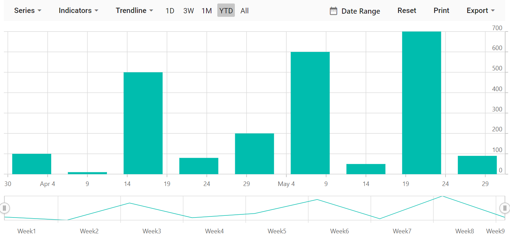
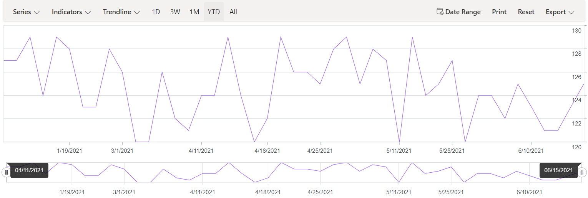

<!-- markdownlint-disable MD036 -->

# Axis Types in Blazor Stock Chart Component

## DateTime Axis

Date time axis uses date time scale and displays the date time values as axis labels in the specified format and set the [ValueType](https://help.syncfusion.com/cr/blazor/Syncfusion.Blazor.Charts.StockChartAxis.html#Syncfusion_Blazor_Charts_StockChartAxis_ValueType) of axis to DateTime.

```cshtml
@using Syncfusion.Blazor.Charts

<SfStockChart>
    <StockChartPrimaryXAxis ValueType="@Syncfusion.Blazor.Charts.ValueType.DateTime">
    </StockChartPrimaryXAxis>

    <StockChartSeriesCollection>
        <StockChartSeries DataSource="@StockDetails" Type="ChartSeriesType.Column" XName="Date" YName="Y">
        </StockChartSeries>
    </StockChartSeriesCollection>
</SfStockChart>

@code{
    public class ChartData
    {
        public DateTime Date { get; set; }
        public Double Y { get; set; }
    }
    public List<ChartData> StockDetails = new List<ChartData>
{
        new ChartData { Date = new DateTime(2012, 04, 02), Y= 100},
        new ChartData { Date = new DateTime(2012, 04, 09), Y= 10},
        new ChartData { Date = new DateTime(2012, 04, 16), Y= 500},
        new ChartData { Date = new DateTime(2012, 04, 23), Y= 80},
        new ChartData { Date = new DateTime(2012, 04, 30), Y= 200},
        new ChartData { Date = new DateTime(2012, 05, 07), Y= 600},
        new ChartData { Date = new DateTime(2012, 05, 14), Y= 50},
        new ChartData { Date = new DateTime(2012, 05, 21), Y= 700},
        new ChartData { Date = new DateTime(2012, 05, 28), Y= 90}
   };
}
```



## DateTimeCategory Axis

DateTime category axis in stock chart is used to display only the business day. To use the date time category axis set the [ValueType](https://help.syncfusion.com/cr/blazor/Syncfusion.Blazor.Charts.ValueType.html) as [DateTimeCategory](https://help.syncfusion.com/cr/blazor/Syncfusion.Blazor.Charts.ValueType.html#Syncfusion_Blazor_Charts_ValueType_DateTimeCategory) 

```cshtml
@using Syncfusion.Blazor.Charts
@using System.Dynamic

<SfStockChart Title="AAPL Stock Price">
    <StockChartEvents SharedTooltipRendering="@TooltipText"></StockChartEvents>
    <StockChartPrimaryXAxis ValueType="@Syncfusion.Blazor.Charts.ValueType.DateTimeCategory">
        <StockChartAxisMajorGridLines Width="0"></StockChartAxisMajorGridLines>
        <StockChartAxisCrosshairTooltip Enable="true"></StockChartAxisCrosshairTooltip>
    </StockChartPrimaryXAxis>
    <StockChartTooltipSettings Enable="true" Header="AAPL Stock Price"></StockChartTooltipSettings>
    <StockChartCrosshairSettings Enable="true"></StockChartCrosshairSettings>
    <StockChartSeriesCollection>
        <StockChartSeries DataSource="@StockInfo" Type="ChartSeriesType.Line" XName="X"  YName="Y"></StockChartSeries>
    </StockChartSeriesCollection>
</SfStockChart>

@code {
    private List<DateTime> Dates = new List<DateTime> 
    {   new DateTime(2021, 01, 11),new DateTime(2021, 01, 12),new DateTime(2021, 01, 13),new DateTime(2021, 01, 14),new DateTime(2021, 01, 15), 
        new DateTime(2021, 01, 19),new DateTime(2021, 01, 20),new DateTime(2021, 01, 21),new DateTime(2021, 01, 22),new DateTime(2021, 03, 01),
        new DateTime(2021, 03, 02),new DateTime(2021, 04, 01),new DateTime(2021, 04, 05),new DateTime(2021, 04, 06),new DateTime(2021, 04, 07),
        new DateTime(2021, 04, 11),new DateTime(2021, 04, 13),new DateTime(2021, 04, 15),new DateTime(2021, 04, 16),new DateTime(2021, 04, 17),
        new DateTime(2021, 04, 18),new DateTime(2021, 04, 20),new DateTime(2021, 04, 21),new DateTime(2021, 04, 23),new DateTime(2021, 04, 25),
        new DateTime(2021, 05, 01),new DateTime(2021, 05, 02),new DateTime(2021, 05, 06),new DateTime(2021, 05, 07),new DateTime(2021, 05, 08),
        new DateTime(2021, 05, 11),new DateTime(2021, 05, 15),new DateTime(2021, 05, 18),new DateTime(2021, 05, 20),new DateTime(2021, 05, 25),
        new DateTime(2021, 06, 01),new DateTime(2021, 06, 02),new DateTime(2021, 06, 03),new DateTime(2021, 06, 04),new DateTime(2021, 06, 05),
        new DateTime(2021, 06, 10),new DateTime(2021, 06, 11),new DateTime(2021, 06, 12),new DateTime(2021, 06, 13),new DateTime(2021, 06, 15),
        new DateTime(2021, 06, 16),new DateTime(2021, 06, 17),new DateTime(2021, 06, 18),new DateTime(2021, 06, 19),new DateTime(2021, 06, 20)
    };
    public DateTime[] Value = new DateTime[] { new DateTime(2021, 01, 01), new DateTime(2022, 01, 01) };
    public List<ExpandoObject> StockInfo { get; set; } = new List<ExpandoObject>();
    private Random randomNum = new Random();
    protected override void OnInitialized()
    {
        StockInfo = Enumerable.Range(0, 45).Select((x) =>
        {
            dynamic d = new ExpandoObject();
            d.X = Dates[x];
            d.Open = randomNum.Next(75, 85);
            d.High = randomNum.Next(88, 92);
            d.Low = randomNum.Next(76, 86);
            d.Close = randomNum.Next(85, 90);
            d.Volume = randomNum.Next(660187068, 965935749);
            d.Y = randomNum.Next(120, 130);
            return d;
        }).Cast<ExpandoObject>().ToList<ExpandoObject>();
    }


    public void TooltipText(SharedTooltipRenderEventArgs args)
    {
        if (args.Text[0] != null)
        {
            args.Text[0] = args.Text[0].Replace("00:00:00 AM", " ", StringComparison.InvariantCulture);
        }
    }

}
```



## Logarithmic Axis

<!-- markdownlint-disable MD033 -->

Logarithmic axis uses logarithmic scale and it is very useful in visualizing data, when it has numerical values in both lower order of magnitude (eg: 10<sup>-6</sup>) and higher order of magnitude (eg: 10<sup>6</sup>) and set the [ValueType](https://help.syncfusion.com/cr/blazor/Syncfusion.Blazor.Charts.StockChartAxis.html#Syncfusion_Blazor_Charts_StockChartAxis_ValueType) of axis to `Logarithmic`.

```cshtml
@using Syncfusion.Blazor.Charts

<SfStockChart>
    <StockChartPrimaryXAxis ValueType="@Syncfusion.Blazor.Charts.ValueType.DateTime">
    </StockChartPrimaryXAxis>
    <StockChartPrimaryYAxis ValueType="@Syncfusion.Blazor.Charts.ValueType.Logarithmic">
    </StockChartPrimaryYAxis>
    <StockChartSeriesCollection>
        <StockChartSeries DataSource="@StockDetails" Type="ChartSeriesType.Area" XName="Date" YName="Y">
        </StockChartSeries>
    </StockChartSeriesCollection>
</SfStockChart>

@code{
    public class ChartData
    {
        public DateTime Date { get; set; }
        public Double Y { get; set; }
    }
    public List<ChartData> StockDetails = new List<ChartData>
{
        new ChartData { Date = new DateTime(2012, 04, 02), Y= 100},
        new ChartData { Date = new DateTime(2012, 04, 09), Y= 10},
        new ChartData { Date = new DateTime(2012, 04, 16), Y= 500},
        new ChartData { Date = new DateTime(2012, 04, 23), Y= 80},
        new ChartData { Date = new DateTime(2012, 04, 30), Y= 200},
        new ChartData { Date = new DateTime(2012, 05, 07), Y= 600},
        new ChartData { Date = new DateTime(2012, 05, 14), Y= 50},
        new ChartData { Date = new DateTime(2012, 05, 21), Y= 700},
        new ChartData { Date = new DateTime(2012, 05, 28), Y= 90}
   };
}
```


## See Also

* [Axis Customization](./axis-customization/)