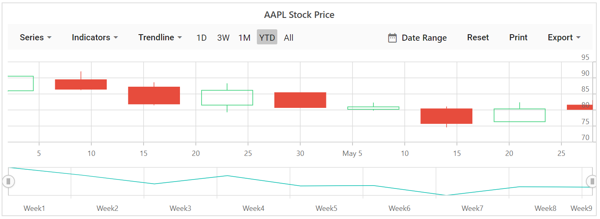

# Stock Chart Dimensions

## Size for Container

Stock Chart can render to its container size. You can set the size via inline or CSS as demonstrated below.





## Size for Stock Chart

You can also set size for stock chart directly through [`Width`](https://help.syncfusion.com/cr/blazor/Syncfusion.Blazor.Charts.StockChartModel.html#Syncfusion_Blazor_Charts_StockChartModel_Width) and
[`Height`](https://help.syncfusion.com/cr/blazor/Syncfusion.Blazor.Charts.StockChartModel.html#Syncfusion_Blazor_Charts_StockChartModel_Height) properties.

<!-- markdownlint-disable MD036 -->
**In Pixel**
<!-- markdownlint-disable MD036 -->

You can set the size of chart in pixel as demonstrated below.





**In Percentage**

By setting value in percentage, stock chart gets its dimension with respect to its container. For example,
when the height is ‘50%’, chart renders to half of the container height.





> Note:  When you do not specify the size, it takes `450px` as the height and window size as its width.