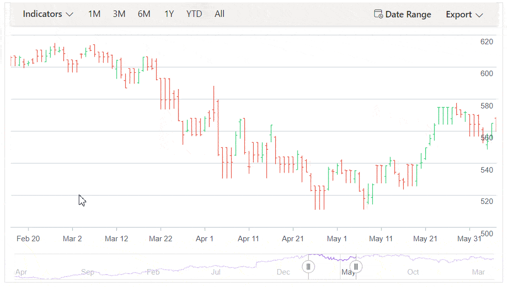

# Panning in Blazor Stock Chart Component 

By default, panning is enabled in the Stock Chart, ensuring that users can immediately start interacting with the chart upon rendering. This default behavior is controlled by the [EnablePan](https://help.syncfusion.com/cr/blazor/Syncfusion.Blazor.Charts.StockChartZoomSettings.html#Syncfusion_Blazor_Charts_StockChartZoomSettings_EnablePan) API, which is set to true by default in the [StockChartZoomSettings](https://help.syncfusion.com/cr/blazor/Syncfusion.Blazor.Charts.StockChartZoomSettings.html).

```cshtml 
@using Syncfusion.Blazor
@using Syncfusion.Blazor.Charts
@inject NavigationManager NavigationManager
@using System.Net.Http.Json
@inject HttpClient Http

@if (dataSource == null)
{
    <div>Loading...</div>
}
else
{
    <SfStockChart>
        <StockChartPrimaryXAxis>
            <StockChartAxisMajorGridLines Width="0"></StockChartAxisMajorGridLines>
        </StockChartPrimaryXAxis>
        <StockChartPrimaryYAxis>
            <StockChartAxisLineStyle Width="0"></StockChartAxisLineStyle>
            <StockChartAxisMajorTickLines Width="0"></StockChartAxisMajorTickLines>
        </StockChartPrimaryYAxis>
        <StockChartZoomSettings EnablePan=true></StockChartZoomSettings>
        <StockChartSeriesCollection>
            <StockChartSeries DataSource="@dataSource" Type="ChartSeriesType.HiloOpenClose" XName="x"></StockChartSeries>
        </StockChartSeriesCollection>
        <StockChartChartArea>
            <StockChartChartAreaBorder Width="0"></StockChartChartAreaBorder>
        </StockChartChartArea>
    </SfStockChart>

}
@code {
    private ChartData[] dataSource;

    protected override async Task OnInitializedAsync()
    {
        dataSource = await Http.GetFromJsonAsync<ChartData[]>(NavigationManager.BaseUri + "./googl.json");
    }

    public class ChartData
    {
        public DateTime x { get; set; }
        public double open { get; set; }
        public double low { get; set; }
        public double close { get; set; }
        public double high { get; set; }
        public double volume { get; set; }
    }
}

```



N> Refer to our [Blazor Stock Charts](https://www.syncfusion.com/blazor-components/blazor-stock-chart) feature tour page for its groundbreaking feature representations and also explore our [Blazor Stock Chart Example](https://blazor.syncfusion.com/demos/stock-chart/stock-chart?theme=bootstrap4) to know various stock chart types and how to represent time-dependent data, showing trends at equal intervals.