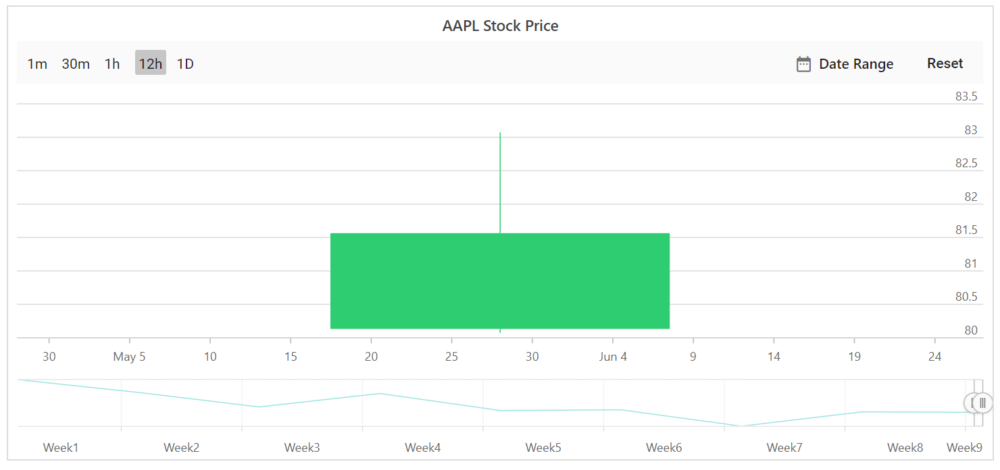
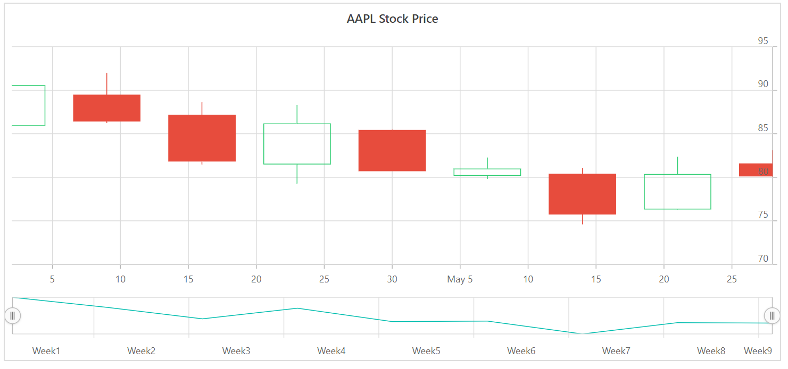

<!-- markdownlint-disable MD036 -->

# Period Selector in Blazor Stock Chart Component

The period selector allows to select a range with specified periods. By default the period selector is enabled in stock chart.

## Periods

<!-- markdownlint-disable MD034 -->

Periods is an array of objects that allows users to specify the range of [Periods](https://help.syncfusion.com/cr/blazor/Syncfusion.Blazor.Charts.StockChartModel.html#Syncfusion_Blazor_Charts_StockChartModel_Periods). The `Interval` property specifies the count value of the button, and the `Text` property specifies the text to be displayed on button. The `IntervalType` property allows users to customize the intervals of the buttons. The `IntervalType` property supports the following interval types:

* Auto
* Years
* Quarter
* Months
* Weeks
* Days
* Hours
* Minutes
* Seconds

```cshtml

@using Syncfusion.Blazor.Charts

<SfStockChart Title="AAPL Stock Price" IndicatorType="@IndicatorType" TrendlineType="@TrendlineType" SeriesType="@SeriesType" ExportType="@ExportType">
    <StockChartPeriods>
        <StockChartPeriod IntervalType=RangeIntervalType.Minutes Interval="1" Text='1m'></StockChartPeriod>
        <StockChartPeriod IntervalType=RangeIntervalType.Minutes Interval="30" Text='30m'></StockChartPeriod>
        <StockChartPeriod IntervalType=RangeIntervalType.Hours Interval="1" Text='1h'></StockChartPeriod>
        <StockChartPeriod IntervalType=RangeIntervalType.Hours Interval="12" Text='12h' Selected="true"></StockChartPeriod>
        <StockChartPeriod Text="1D"></StockChartPeriod>
    </StockChartPeriods>
    <StockChartCrosshairSettings Enable="true"></StockChartCrosshairSettings>
    <StockChartPrimaryXAxis>
        <StockChartAxisMajorGridLines Color="Transparent"></StockChartAxisMajorGridLines>
    </StockChartPrimaryXAxis>
    <StockChartPrimaryYAxis>
        <StockChartAxisLineStyle Color="Transparent"></StockChartAxisLineStyle>
        <StockChartAxisMajorTickLines Color="Transparent" Width="0"></StockChartAxisMajorTickLines>
    </StockChartPrimaryYAxis>
    <StockChartSeriesCollection>
        <StockChartSeries DataSource="@StockDetails" Type="ChartSeriesType.Candle" XName="Date" Name="google"></StockChartSeries>
    </StockChartSeriesCollection>
</SfStockChart>

@code {

    public List<TechnicalIndicators> IndicatorType = new List<TechnicalIndicators>() { };
    public List<TrendlineTypes> TrendlineType = new List<TrendlineTypes>() { };
    public List<ExportType> ExportType = new List<ExportType>() { };
    public List<ChartSeriesType> SeriesType = new List<ChartSeriesType>() { };

    public class ChartData
    {
        public DateTime Date;
        public Double Open;
        public Double Low;
        public Double Close;
        public Double High;
        public Double Volume;
    }

    public List<ChartData> StockDetails = new List<ChartData>
    {
        new ChartData { Date = new DateTime(2012, 04, 02), Open= 85.9757, High = 90.6657,Low = 85.7685, Close = 90.5257,Volume = 660187068},
        new ChartData { Date = new DateTime(2012, 04, 09), Open= 89.4471, High = 92,Low = 86.2157, Close = 86.4614,Volume = 912634864},
        new ChartData { Date = new DateTime(2012, 04, 16), Open= 87.1514, High = 88.6071,Low = 81.4885, Close = 81.8543,Volume = 1221746066},
        new ChartData { Date = new DateTime(2012, 04, 23), Open= 81.5157, High = 88.2857,Low = 79.2857, Close = 86.1428,Volume = 965935749},
        new ChartData { Date = new DateTime(2012, 04, 30), Open= 85.4, High =  85.4857,Low = 80.7385, Close = 80.75,Volume = 615249365},
        new ChartData { Date = new DateTime(2012, 05, 07), Open= 80.2143, High = 82.2685,Low = 79.8185, Close = 80.9585,Volume = 541742692},
        new ChartData { Date = new DateTime(2012, 05, 14), Open= 80.3671, High = 81.0728,Low = 74.5971, Close = 75.7685,Volume = 708126233},
        new ChartData { Date = new DateTime(2012, 05, 21), Open= 76.3571, High = 82.3571,Low = 76.2928, Close = 80.3271,Volume = 682076215},
        new ChartData { Date = new DateTime(2012, 05, 28), Open= 81.5571, High = 83.0714,Low = 80.0743, Close = 80.1414,Volume = 480059584}
   };
}


```



## Visibility of period selector

The [EnablePeriodSelector](https://help.syncfusion.com/cr/blazor/Syncfusion.Blazor.Charts.StockChartModel.html#Syncfusion_Blazor_Charts_StockChartModel_EnablePeriodSelector) property allows users to toggle the visibility of period selector.

```cshtml

@using Syncfusion.Blazor.Charts

<SfStockChart Title="AAPL Stock Price" EnablePeriodSelector="false">
    <StockChartSeriesCollection>
        <StockChartSeries DataSource="@StockDetails" Type="ChartSeriesType.Candle" XName="Date" High="High" Low="Low" Open="Open" Close="Close" Volume="Volume" Name="google"></StockChartSeries>
    </StockChartSeriesCollection>
</SfStockChart>

@code {

    public class ChartData
    {
        public DateTime Date;
        public Double Open;
        public Double Low;
        public Double Close;
        public Double High;
        public Double Volume;
    }

    public List<ChartData> StockDetails = new List<ChartData>
    {
        new ChartData { Date = new DateTime(2012, 04, 02), Open= 85.9757, High = 90.6657,Low = 85.7685, Close = 90.5257,Volume = 660187068},
        new ChartData { Date = new DateTime(2012, 04, 09), Open= 89.4471, High = 92,Low = 86.2157, Close = 86.4614,Volume = 912634864},
        new ChartData { Date = new DateTime(2012, 04, 16), Open= 87.1514, High = 88.6071,Low = 81.4885, Close = 81.8543,Volume = 1221746066},
        new ChartData { Date = new DateTime(2012, 04, 23), Open= 81.5157, High = 88.2857,Low = 79.2857, Close = 86.1428,Volume = 965935749},
        new ChartData { Date = new DateTime(2012, 04, 30), Open= 85.4, High =  85.4857,Low = 80.7385, Close = 80.75,Volume = 615249365},
        new ChartData { Date = new DateTime(2012, 05, 07), Open= 80.2143, High = 82.2685,Low = 79.8185, Close = 80.9585,Volume = 541742692},
        new ChartData { Date = new DateTime(2012, 05, 14), Open= 80.3671, High = 81.0728,Low = 74.5971, Close = 75.7685,Volume = 708126233},
        new ChartData { Date = new DateTime(2012, 05, 21), Open= 76.3571, High = 82.3571,Low = 76.2928, Close = 80.3271,Volume = 682076215},
        new ChartData { Date = new DateTime(2012, 05, 28), Open= 81.5571, High = 83.0714,Low = 80.0743, Close = 80.1414,Volume = 480059584}
    };
}

```

