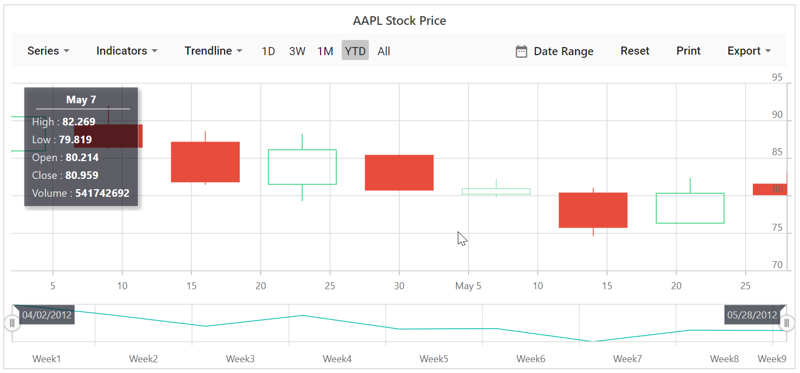
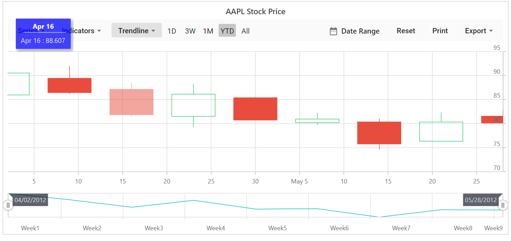

# Tooltip in Blazor Stock Chart Component

<!-- markdownlint-disable MD036 -->

Stock Chart will display details about the points through tooltip, when the mouse is moved over the point.

## Default Tooltip

By default, tooltip is not visible. Enable the tooltip by setting [Enable](https://help.syncfusion.com/cr/blazor/Syncfusion.Blazor.Charts.StockChartTooltipSettings.html#Syncfusion_Blazor_Charts_StockChartTooltipSettings_Enable) property to true .

```cshtml

@using Syncfusion.Blazor.Charts

<SfStockChart Title="AAPL Stock Price">
    <StockChartTooltipSettings Enable="true">
    </StockChartTooltipSettings>

    <StockChartSeriesCollection>
        <StockChartSeries DataSource="@StockDetails" Type="ChartSeriesType.Candle" XName="Date" High="High" Low="Low" Open="Open" Close="Close" Volume="Volume" Name="Google"></StockChartSeries>
    </StockChartSeriesCollection>
</SfStockChart>

@code {

    public class ChartData
    {
        public DateTime Date { get; set; }
        public Double Open { get; set; }
        public Double Low { get; set; }
        public Double Close { get; set; }
        public Double High { get; set; }
        public Double Volume { get; set; }
    }

    public List<ChartData> StockDetails = new List<ChartData>
    {
         new ChartData { Date = new DateTime(2012, 04, 02), Open= 85.9757, High = 90.6657,Low = 85.7685, Close = 90.5257,Volume = 660187068},
         new ChartData { Date = new DateTime(2012, 04, 09), Open= 89.4471, High = 92,Low = 86.2157, Close = 86.4614,Volume = 912634864},
         new ChartData { Date = new DateTime(2012, 04, 16), Open= 87.1514, High = 88.6071,Low = 81.4885, Close = 81.8543,Volume = 1221746066},
         new ChartData { Date = new DateTime(2012, 04, 23), Open= 81.5157, High = 88.2857,Low = 79.2857, Close = 86.1428,Volume = 965935749},
         new ChartData { Date = new DateTime(2012, 04, 30), Open= 85.4, High =  85.4857,Low = 80.7385, Close = 80.75,Volume = 615249365},
         new ChartData { Date = new DateTime(2012, 05, 07), Open= 80.2143, High = 82.2685,Low = 79.8185, Close = 80.9585,Volume = 541742692},
         new ChartData { Date = new DateTime(2012, 05, 14), Open= 80.3671, High = 81.0728,Low = 74.5971, Close = 75.7685,Volume = 708126233},
         new ChartData { Date = new DateTime(2012, 05, 21), Open= 76.3571, High = 82.3571,Low = 76.2928, Close = 80.3271,Volume = 682076215},
         new ChartData { Date = new DateTime(2012, 05, 28), Open= 81.5571, High = 83.0714,Low = 80.0743, Close = 80.1414,Volume = 480059584}
   };
}


```



<!-- markdownlint-disable MD013 -->

## Format the Tooltip

<!-- markdownlint-disable MD013 -->

By default, tooltip shows information of x and y value in points. In addition to that, more information can be shown in tooltip. For example the format `${point.x} : ${point.high}` shows point x and high value.

```cshtml

@using Syncfusion.Blazor.Charts

<SfStockChart Title="AAPL Stock Price">
    <StockChartTooltipSettings Enable="true" Format="<b>${point.x} : ${point.high}</b>">
    </StockChartTooltipSettings>

    <StockChartSeriesCollection>
        <StockChartSeries DataSource="@StockDetails" Type="ChartSeriesType.Candle" XName="Date" High="High" Low="Low" Open="Open" Close="Close" Volume="Volume" Name="google"></StockChartSeries>
    </StockChartSeriesCollection>
</SfStockChart>

@code {

    public class ChartData
    {
        public DateTime Date { get; set; }
        public Double Open { get; set; }
        public Double Low { get; set; }
        public Double Close { get; set; }
        public Double High { get; set; }
        public Double Volume { get; set; }
    }

    public List<ChartData> StockDetails = new List<ChartData>
    {
         new ChartData { Date = new DateTime(2012, 04, 02), Open= 85.9757, High = 90.6657,Low = 85.7685, Close = 90.5257,Volume = 660187068},
         new ChartData { Date = new DateTime(2012, 04, 09), Open= 89.4471, High = 92,Low = 86.2157, Close = 86.4614,Volume = 912634864},
         new ChartData { Date = new DateTime(2012, 04, 16), Open= 87.1514, High = 88.6071,Low = 81.4885, Close = 81.8543,Volume = 1221746066},
         new ChartData { Date = new DateTime(2012, 04, 23), Open= 81.5157, High = 88.2857,Low = 79.2857, Close = 86.1428,Volume = 965935749},
         new ChartData { Date = new DateTime(2012, 04, 30), Open= 85.4, High =  85.4857,Low = 80.7385, Close = 80.75,Volume = 615249365},
         new ChartData { Date = new DateTime(2012, 05, 07), Open= 80.2143, High = 82.2685,Low = 79.8185, Close = 80.9585,Volume = 541742692},
         new ChartData { Date = new DateTime(2012, 05, 14), Open= 80.3671, High = 81.0728,Low = 74.5971, Close = 75.7685,Volume = 708126233},
         new ChartData { Date = new DateTime(2012, 05, 21), Open= 76.3571, High = 82.3571,Low = 76.2928, Close = 80.3271,Volume = 682076215},
         new ChartData { Date = new DateTime(2012, 05, 28), Open= 81.5571, High = 83.0714,Low = 80.0743, Close = 80.1414,Volume = 480059584}
   };
}


```

## Customize the Appearance of Tooltip

The [Fill](https://help.syncfusion.com/cr/blazor/Syncfusion.Blazor.Charts.StockChartTooltipSettings.html#Syncfusion_Blazor_Charts_StockChartTooltipSettings_Fill) and [Border](https://help.syncfusion.com/cr/blazor/Syncfusion.Blazor.Charts.StockChartTooltipSettings.html#Syncfusion_Blazor_Charts_StockChartTooltipSettings_Border) properties are used to customize the background color and border of the tooltip respectively. The [TextStyle](https://help.syncfusion.com/cr/blazor/Syncfusion.Blazor.Charts.StockChartTooltipSettings.html#Syncfusion_Blazor_Charts_StockChartTooltipSettings_TextStyle) property in the tooltip is used to customize the font of the tooltip text.

```cshtml

@using Syncfusion.Blazor.Charts

<SfStockChart Title="AAPL Stock Price">
    <StockChartTooltipSettings Enable="true" Format="${point.x} : ${point.high}" Fill="#7bb4eb">
    </StockChartTooltipSettings>

    <StockChartSeriesCollection>
        <StockChartSeries DataSource="@StockDetails" Type="ChartSeriesType.Candle" XName="Date" High="High" Low="Low" Open="Open" Close="Close" Volume="Volume" Name="Google"></StockChartSeries>
    </StockChartSeriesCollection>
</SfStockChart>

@code {

    public class ChartData
    {
        public DateTime Date { get; set; }
        public Double Open { get; set; }
        public Double Low { get; set; }
        public Double Close { get; set; }
        public Double High { get; set; }
        public Double Volume { get; set; }
    }

    public List<ChartData> StockDetails = new List<ChartData>
    {
         new ChartData { Date = new DateTime(2012, 04, 02), Open= 85.9757, High = 90.6657,Low = 85.7685, Close = 90.5257,Volume = 660187068},
         new ChartData { Date = new DateTime(2012, 04, 09), Open= 89.4471, High = 92,Low = 86.2157, Close = 86.4614,Volume = 912634864},
         new ChartData { Date = new DateTime(2012, 04, 16), Open= 87.1514, High = 88.6071,Low = 81.4885, Close = 81.8543,Volume = 1221746066},
         new ChartData { Date = new DateTime(2012, 04, 23), Open= 81.5157, High = 88.2857,Low = 79.2857, Close = 86.1428,Volume = 965935749},
         new ChartData { Date = new DateTime(2012, 04, 30), Open= 85.4, High =  85.4857,Low = 80.7385, Close = 80.75,Volume = 615249365},
         new ChartData { Date = new DateTime(2012, 05, 07), Open= 80.2143, High = 82.2685,Low = 79.8185, Close = 80.9585,Volume = 541742692},
         new ChartData { Date = new DateTime(2012, 05, 14), Open= 80.3671, High = 81.0728,Low = 74.5971, Close = 75.7685,Volume = 708126233},
         new ChartData { Date = new DateTime(2012, 05, 21), Open= 76.3571, High = 82.3571,Low = 76.2928, Close = 80.3271,Volume = 682076215},
         new ChartData { Date = new DateTime(2012, 05, 28), Open= 81.5571, High = 83.0714,Low = 80.0743, Close = 80.1414,Volume = 480059584}
   };
}


```



## Tooltip Position

Enabling moving tooltips empowers users to effortlessly explore the data points on the Stock Chart. As they move the mouse pointer across the chart, the tooltip dynamically updates its position, staying in sync with the cursor. This real-time interaction ensures that users can seamlessly access information about different data points without the need to constantly reposition the cursor or interact with the chart excessively.

By default tooltip is positioned at the leftside of the stock chart. You can move the tooltip along with the mouse by setting `Nearest` to the `TooltipPosition` property in the [StockChartTooltipSetting](https://help.syncfusion.com/cr/blazor/Syncfusion.Blazor.Charts.StockChartTooltipSettings.html#Syncfusion_Blazor_Charts_StockChartTooltipSettings__ctor), to move tooltip along with the mouse pointer when we move the cursor across data points.

```cshtml
@using Syncfusion.Blazor
@using Syncfusion.Blazor.Charts
@inject NavigationManager NavigationManager
@using System.Net.Http.Json
@inject HttpClient Http

@if (dataSource == null)
{
    <div>Loading...
    </div>
}
else
{ 
    <SfStockChart>         
        <StockChartPrimaryXAxis>
            <StockChartAxisMajorGridLines Width="0"></StockChartAxisMajorGridLines>
            <StockChartAxisCrosshairTooltip Enable="true"></StockChartAxisCrosshairTooltip>
        </StockChartPrimaryXAxis>
        <StockChartPrimaryYAxis LabelFormat="n0">
            <StockChartAxisLineStyle Width="0"></StockChartAxisLineStyle>
            <StockChartAxisMajorTickLines Width="0"></StockChartAxisMajorTickLines>
        </StockChartPrimaryYAxis>
        <StockChartTooltipSettings Enable="true" TooltipPosition="TooltipPosition.Nearest"></StockChartTooltipSettings>
        <StockChartCrosshairSettings Enable="true"></StockChartCrosshairSettings>
        <StockChartSeriesCollection>
            <StockChartSeries DataSource="@dataSource" Type="ChartSeriesType.HiloOpenClose" XName="x"></StockChartSeries>
        </StockChartSeriesCollection>
        <StockChartChartArea>
            <StockChartChartAreaBorder Width="0"></StockChartChartAreaBorder>
        </StockChartChartArea>
    </SfStockChart>    
}
@code{
    private ChartData[] dataSource;

    protected override async Task OnInitializedAsync()
    {      
        dataSource = await Http.GetFromJsonAsync<ChartData[]>(NavigationManager.BaseUri + "./googl.json");
    }

    public class ChartData
    {
        public DateTime x { get; set; }
        public double open { get; set; }
        public double low { get; set; }
        public double close { get; set; }
        public double high { get; set; }
        public double volume { get; set; }
    }
}

```


N> Refer to our [Blazor Stock Charts](https://www.syncfusion.com/blazor-components/blazor-stock-chart) feature tour page for its groundbreaking feature representations and also explore our [Blazor Stock Chart Example](https://blazor.syncfusion.com/demos/stock-chart/stock-chart?theme=bootstrap4) to know various stock chart types and how to represent time-dependent data, showing trends at equal intervals.
