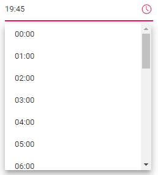

# Getting Started with Blazor TimePicker Component

This section briefly explains about how to include a [Blazor TimePicker](https://www.syncfusion.com/blazor-components/blazor-timepicker) Component in your Blazor Server-Side and Client-Side application. You can refer to our Getting Started with [Blazor Server-Side TimePicker](../getting-started/blazor-server-side-visual-studio-2019/) and [Blazor WebAssembly TimePicker](../getting-started/blazor-webassembly-visual-studio-2019/) documentation pages for configuration specifications.

To get start quickly with Blazor TimePicker component, you can check on this video.



## Importing Syncfusion Blazor component in the application

* Install `Syncfusion.Blazor.Calendars` NuGet package to the application by using the `NuGet Package Manager`.

    > Please ensure to check the `Include prerelease` option for our Beta release.

* You can add the client-side resources using [NuGet](https://blazor.syncfusion.com/documentation/appearance/themes#static-web-assets) package in the  **HEAD** element of the **~/wwwroot/index.html** page.

    ```html
    <head>
            <link href="_content/Syncfusion.Blazor.Themes/bootstrap4.css" rel="stylesheet" />
            <!-- <link href="https://cdn.syncfusion.com/blazor/{{version}}/styles/{{theme}}.css" rel="stylesheet" /> -->
    </head>
    ```

    > For Internet Explorer 11 kindly refer the polyfills. Refer the [documentation](https://ej2.syncfusion.com/blazor/documentation/common/how-to/render-blazor-server-app-in-ie/) for more information.

    ```html
    <head>
        <link href="_content/Syncfusion.Blazor.Themes/bootstrap4.css" rel="stylesheet" />
        <script src="https://github.com/Daddoon/Blazor.Polyfill/releases/download/3.0.1/blazor.polyfill.min.js"></script>
    </head>
    ```

## Adding component package to the application

Open `~/_Imports.razor` file and import the `Syncfusion.Blazor.Calendars` package.

```cshtml
@using Syncfusion.Blazor.Calendars
```

## Add SyncfusionBlazor service in Program.cs

Open the **Program.cs** file and add services required by Syncfusion components using  **builder.Services.AddSyncfusionBlazor()** method.

```csharp
using Syncfusion.Blazor;

namespace BlazorApplication
{
    public class Program
    {
        public static async Task Main(string[] args)
        {
            ....
            ....
            builder.Services.AddSyncfusionBlazor();
            await builder.Build().RunAsync();
        }
    }
}
```

> To enable custom client side resource loading from CRG or CDN. You need to disable resource loading by `AddSyncfusionBlazor(true)` and load the scripts in the **HEAD** element of the **~/wwwroot/index.html** page.

 ```html
<head>
    <script src="https://cdn.syncfusion.com/blazor/{{ site.blazorversion }}/syncfusion-blazor.min.js"></script>
</head>
```

## Adding TimePicker component to the application

To initialize the TimePicker component add the below code to your `Index.razor` view page which is present under `~/Pages` folder.

The following code shows a basic TimePicker component.

```cshtml
<SfTimePicker TValue="DateTime?" PlaceHolder="Select a time"></SfTimePicker>
```

## Run the application

After successful compilation of your application, press `F5` to run the application.

The output will be as follows.


## Setting the time format

Time format is a way of representing the time value in different string format in textbox and popup list. By default, the TimePicker’s Format is based on the culture.
But you can customize the Format of the TimePicker using the [Format](https://help.syncfusion.com/cr/blazor/Syncfusion.Blazor.Calendars.SfTimePicker-1.html#Syncfusion_Blazor_Calendars_SfTimePicker_1_Format) property.

The below code demonstrates how to render TimePicker component in 24 hours Format with 60 minutes interval. The time interval is set to 60 minutes by using the [Step](https://help.syncfusion.com/cr/blazor/Syncfusion.Blazor.Calendars.SfTimePicker-1.html#Syncfusion_Blazor_Calendars_SfTimePicker_1_Step) property.

```cshtml
<SfTimePicker TValue="DateTime?" Value="@TimeValue" Step=60 Format="HH:mm"></SfTimePicker>

@code {
    public DateTime TimeValue { get; set; } = DateTime.Now;
}
```

The output will be as follows.



## See Also

* [Getting Started with Syncfusion Blazor for Client-Side in .NET Core CLI](../getting-started/blazor-webassembly-dotnet-cli/)
* [Getting Started with Syncfusion Blazor for Server-side in Visual Studio 2019](../getting-started/blazor-server-side-visual-studio-2019/)
* [Getting Started with Syncfusion Blazor for Server-Side in .NET Core CLI](../getting-started/blazor-server-side-dotnet-cli/)