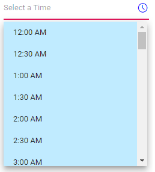

# CSS Customization in Blazor TimePicker Component

TimePicker allows you to customize the text box and popup list appearance to suit your
application by using the
[CssClass](https://help.syncfusion.com/cr/blazor/Syncfusion.Blazor~Syncfusion.Blazor.Calendars.SfTimePicker%601~CssClass.html) property.

The following code demonstrates customization of text appearance in a text box, popup button, and popup list along with hover and active
state by using the `e-custom-style` class. Following is the list of available classes used to customize the entire TimePicker component:

| **Class Name** | **Description** |
| --- | --- |
| e-time-wrapper | Applied to TimePicker wrapper element. |
| e-timepicker |  Applied to input element and TimePicker popup element. |
| e-time-wrapper.e-timepicker | Applied to input element only. |
| e-input-group-icon.e-time-icon | Applied to popup button. |
| e-float-text | Applied to floating label text element. |
| e-popup | Applied to popup element. |
| e-timepicker.e-popup | Applied to TimePicker popup element only. |
| e-list-parent | Applied to popup UL element. |
| e-timepicker.e-list-parent | Applied to TimePicker popup UL element only. |
| e-list-item | Applied to LI elements. |
| e-hover | Applied to LI element hovering time. |
| e-active | Applied to active LI element. |

```cshtml
@using Syncfusion.Blazor.Calendars

<SfTimePicker TValue="DateTime?" CssClass="e-custom-style" Placeholder="Select a Time"></SfTimePicker>

<style>
     /*customize the input element text color*/
    .e-time-wrapper.e-custom-style #element {
        display: block;
        color: blue;
    }

    /*customize the floating label and popup button text color*/
    .e-time-wrapper.e-custom-style .e-float-text.e-label-bottom,
    .e-time-wrapper.e-custom-style .e-input-group-icon.e-time-icon.e-icons {
        color: blue;
    }

    /*customize the input element text selection*/
    .e-time-wrapper.e-custom-style.e-input-group::before,
    .e-time-wrapper.e-custom-style.e-input-group::after,
    .e-time-wrapper.e-custom-style.e-input-group .e-timepicker::selection {
        background: blue;
    }


    .e-timepicker.e-popup.e-custom-style .e-list-parent.e-ul,
    .e-timepicker.e-popup.e-custom-style .e-list-parent.e-ul .e-list-item {
        background-color: #c0ebff;
    }

        /*customize the list item hover color*/
    .e-timepicker.e-popup.e-custom-style .e-list-parent.e-ul .e-list-item.e-hover,
    .e-timepicker.e-popup.e-custom-style .e-list-parent.e-ul .e-list-item.e-active.e-hover {
        background-color: blue;
        color: #fff;
    }

        /*customize the active element text color*/
    .e-timepicker.e-popup.e-custom-style .e-list-parent.e-ul .e-list-item.e-active {
        color: #333;
        background-color: #fff;
    }
</style>
```

The output will be as follows.

