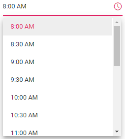
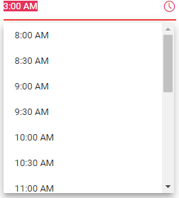

# Strict Mode in Blazor TimePicker Component

The [StrictMode](https://help.syncfusion.com/cr/blazor/Syncfusion.Blazor~Syncfusion.Blazor.Calendars.SfTimePicker%601~StrictMode.html)
is an act that allows you to enter only valid time value within the specified Min/Max
range in the textbox. If the value is invalid, the component Value sets to the previous value.
If the value is
out of range, the component sets the time value to Min/Max value.

The following example demonstrates the TimePicker in `StrictMode` with `Min/Max` range of `10:00 AM` to
`4:00 PM` . It allows you to enter
only valid time within the specified range.

If you enter the out-of-range value like
`8:00 PM`,
the value sets to the Max time `4:00 PM` as the value `8:00 PM` is greater than Max value
of `4:00 PM`.

If you enter invalid time value like `9:00 tt`, the value sets to the previous value.

```cshtml
@using Syncfusion.Blazor.Calendars

<SfTimePicker TValue="DateTime?" Value='@TimeValue' StrictMode=true Min='@MinVal' Max='@MaxVal'></SfTimePicker>

@code {
    public DateTime MinVal { get; set; } = new DateTime(DateTime.Now.Year, DateTime.Now.Month, 15, 08, 00, 00);
    public DateTime MaxVal { get; set; } = new DateTime(DateTime.Now.Year, DateTime.Now.Month, 15, 16, 00, 00);
    public DateTime? TimeValue { get; set; } = new DateTime(DateTime.Now.Year, DateTime.Now.Month, 15, 3, 00, 00);
}
```

The output will be as follows.



By default, the TimePicker act in `StrictMode` as `false` state, that allows you to enter the invalid or out-of-range time in textbox.

If the time is out-of-range or invalid, then the model value will be set to `out of range` time
value or `null` respectively with highlighted `error` class to indicates the time is out of range or invalid.

The following example demonstrates the `StrictMode` as `false`. Here, it allows you to enter the
valid or invalid value in text box.

If you are entering the out-of-range or invalid time value, then the model value will be set to
`out of range` time Value or `null` respectively with highlighted `error` class to indicates the time is out of range or invalid.

```cshtml
@using Syncfusion.Blazor.Calendars

<SfTimePicker TValue="DateTime?" Value='@TimeValue' StrictMode=false Min='@MinVal' Max='@MaxVal'></SfTimePicker>

@code {
    public DateTime MinVal { get; set; } = new DateTime(DateTime.Now.Year, DateTime.Now.Month, 15, 08, 00, 00);
    public DateTime MaxVal { get; set; } = new DateTime(DateTime.Now.Year, DateTime.Now.Month, 15, 16, 00, 00);
    public DateTime? TimeValue { get; set; } = new DateTime(DateTime.Now.Year, DateTime.Now.Month, 15, 3, 00, 00);
}
```

The output will be as follows.



> If the value of `Min` or `Max` property is changed through code behind, update the `Value` property to set within the range.